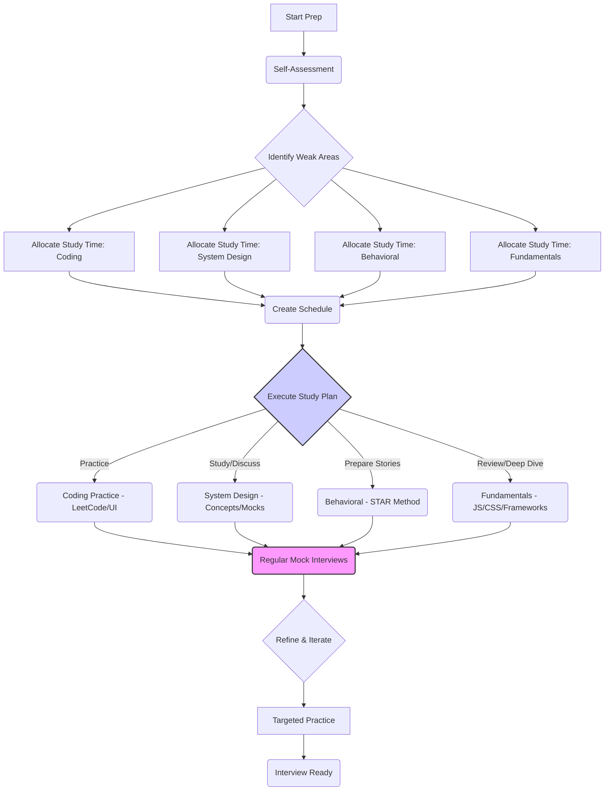

# **Chapter 1: Deconstructing the Senior Frontend Interview**

Welcome to the start of your journey toward mastering the senior frontend engineering interview. Landing a senior role isn't just about having more years of experience; it's about demonstrating a fundamentally different level of technical depth, ownership, influence, and strategic thinking compared to mid-level positions. The interview process itself reflects this shift, demanding more than just correct answers to coding problems. It probes your architectural reasoning, your ability to lead and mentor, your communication clarity, and your capacity to drive significant impact.

This chapter lays the groundwork. We'll dissect what "senior" truly means in the context of frontend engineering interviews, explore the common formats you'll encounter, uncover the underlying objectives of your interviewers, and outline a strategic approach to preparation. Understanding this landscape is the crucial first step towards presenting yourself effectively and securing the senior role you deserve.

#### **A. Understanding the Landscape: Beyond Mid-Level Expectations**

The transition from mid-level to senior interviews often catches candidates off guard. While core technical skills remain essential, the emphasis shifts dramatically. Mid-level interviews often focus on _whether_ you can perform specific tasks (e.g., implement a feature, solve a well-defined algorithm). Senior interviews focus on _how_ you approach complex problems, the _trade-offs_ you consider, the _impact_ of your decisions, and your ability to operate with _autonomy and influence_.

##### **1. Defining "Senior": Technical Depth, Ownership, Impact, and Influence**

What truly distinguishes a senior frontend engineer in the eyes of an interviewer? It boils down to four key pillars:

- **Technical Depth:** This goes far beyond knowing framework syntax. It means understanding the _why_ behind the _what_.

  - **Deep Fundamentals:** Mastery of JavaScript (closures, prototypes, async patterns, event loop), CSS (specificity, layout models, performance), HTML (semantics, accessibility), and browser internals (rendering pipeline, networking).
  - **Architectural Understanding:** Ability to design scalable, maintainable, and performant component architectures, state management strategies, and data fetching patterns. Understanding trade-offs between different approaches (e.g., SSR vs. CSR vs. SSG, REST vs. GraphQL, different state management libraries).
  - **Cross-Cutting Concerns:** Proficiency in areas like performance optimization (critical rendering path, code splitting, caching), security (XSS, CSRF), testing strategies (unit, integration, e2e), and tooling (bundlers, linters, CI/CD).
  - **Example:** A mid-level engineer might implement a feature using Redux. A senior engineer can articulate _why_ Redux was chosen over Context API or Zustand for a specific application, discuss potential performance bottlenecks with large stores, explain middleware usage for side effects, and design selectors for optimal performance.

- **Ownership:** Senior engineers don't just complete assigned tasks; they own problems and outcomes end-to-end.

  - **Proactive Problem Solving:** Identifying potential issues (performance bottlenecks, usability flaws, technical debt) before they become critical.
  - **Accountability:** Taking responsibility for the quality, reliability, and maintainability of the codebase and features they deliver.
  - **Driving Initiatives:** Championing improvements, advocating for best practices, and seeing technical initiatives through from conception to deployment and monitoring.
  - **Example:** Instead of just fixing a reported bug, a senior engineer investigates the root cause, assesses if similar bugs might exist elsewhere, implements a robust fix, adds relevant tests, and potentially proposes refactoring or process changes to prevent recurrence.

- **Impact:** Senior engineers demonstrably improve the product, the codebase, or the team's effectiveness.

  - **Measurable Results:** Connecting technical work to business outcomes (e.g., "Reduced page load time by 30%, leading to a 5% increase in conversion rate," or "Refactored the checkout flow, decreasing bug reports by 40%").
  - **Technical Strategy:** Influencing technical direction, contributing to architectural decisions, and improving overall system health.
  - **Efficiency Gains:** Improving developer experience, streamlining workflows, or introducing tooling that boosts team productivity.
  - **Example:** A senior engineer might lead the migration of a critical application feature to a new framework, not just executing the migration but also defining the strategy, mitigating risks, ensuring performance parity or improvement, and documenting the process for the team.

- **Influence:** This involves leveraging expertise and communication skills to guide and uplift others.
  - **Mentorship:** Actively mentoring junior and mid-level engineers, providing constructive feedback, and fostering their growth.
  - **Technical Leadership:** Guiding technical discussions, facilitating consensus, and setting technical standards within the team or domain.
  - **Cross-Functional Collaboration:** Effectively communicating technical concepts and trade-offs to non-technical stakeholders (Product Managers, Designers, etc.).
  - **Advocacy:** Championing best practices, new technologies, or process improvements across teams.
  - **Example:** A senior engineer might identify inconsistent coding patterns across multiple teams and lead an effort to define, document, and enforce shared linting rules and component guidelines, presenting the rationale and benefits to gain buy-in.

##### **2. Common Interview Formats at Top-Tier Companies (FAANG, Startups, Scale-ups)**

While the exact process varies, most senior frontend interviews at leading tech companies follow a pattern involving several distinct stages. Understanding these formats helps you prepare targeted responses and anticipate expectations.

```mermaid
graph TD
    A[Application / Referral] --> B{Recruiter Screen};
    B --> C{Technical Phone Screen(s)};
    C --> D(On-Site / Virtual Loop);
    D --> E[Coding Round 1: Algo/DS];
    D --> F[Coding Round 2: Domain/UI];
    D --> G[System Design: Frontend Focus];
    D --> H[Behavioral Interview];
    D --> I[Domain Deep Dive / Cross-Functional];
    E & F & G & H & I --> J{Hiring Manager Interview};
    J --> K{Hiring Committee / Debrief};
    K --> L[Offer Decision];

    style D fill:#f9f,stroke:#333,stroke-width:2px
```

- **Diagram Explanation:** This flowchart illustrates a typical, comprehensive senior frontend interview process, starting from the initial application and progressing through various screening and in-depth interview rounds before a final decision. Note that the order and specific combination of rounds within the main loop (D) can vary significantly between companies.

###### **a. Phone Screens (Technical & Recruiter)**

- **Recruiter Screen:** Initial conversation focusing on your background, motivations, salary expectations, and high-level fit for the role and company culture. Be prepared to give a concise overview of your experience and why you're interested.
- **Technical Phone Screen:** Typically 45-60 minutes with an engineer. Often involves:
  - Discussion of your resume and past projects (focus on senior-level contributions).
  - Core JavaScript questions (closures, `this`, promises, event loop).
  - A small coding problem (DOM manipulation, simple algorithm, utility function).
  - Basic framework/CSS questions.
  - **Senior Focus:** Expect questions probing _why_ you made certain technical decisions in your past roles. Your ability to articulate trade-offs is key.

###### **b. Coding Rounds (Algorithms, Data Structures, Domain-Specific)**

- **Algorithms/Data Structures:** Similar to general software engineering interviews, but often with a frontend flavor (e.g., problems involving string manipulation, tree traversal for DOM-like structures, basic graph problems). LeetCode-style questions (Easy/Medium, occasionally Hard) are common. Focus is on problem-solving approach, code clarity, efficiency analysis (Big O), and testing.
- **Domain-Specific/UI Coding:** More practical frontend tasks. Examples include:
  - Building a UI component (e.g., autocomplete, modal, simple data grid) from scratch or using a specified framework.
  - Implementing complex asynchronous logic (e.g., debouncing/throttling, handling multiple API calls).
  - Debugging or refactoring existing frontend code.
  - DOM manipulation exercises.
  - **Senior Focus:** Assessment includes code structure, component design, handling edge cases, accessibility considerations, and potentially performance optimizations. You're expected to write clean, maintainable, production-ready code and articulate your design choices.

###### **c. System Design Rounds (Frontend Focus)**

- This is a cornerstone of senior interviews. You'll be asked to design a complex frontend application or feature (e.g., a news feed, a photo gallery, a collaborative editor, a metrics dashboard).
- **Focus Areas:**
  - Requirements gathering and clarification.
  - API design/contract definition (how the frontend interacts with the backend).
  - Component architecture and breakdown.
  - State management strategy.
  - Data fetching and caching mechanisms.
  - Performance considerations (loading, rendering, interaction).
  - Scalability and maintainability.
  - Testing strategy.
  - Accessibility.
  - **Senior Focus:** The emphasis is heavily on your ability to navigate ambiguity, discuss trade-offs between different architectural choices, justify your decisions, and consider the long-term implications of your design. Collaboration and communication with the interviewer are critical. (See Chapter 7 for an in-depth guide).

###### **d. Behavioral Interviews (Leadership, Conflict Resolution, Collaboration)**

- These interviews assess your alignment with company values and your "soft skills," which are critical for senior roles. Questions often follow the STAR format (Situation, Task, Action, Result).
- **Common Themes:**
  - Handling disagreements/conflict.
  - Mentoring others.
  - Dealing with ambiguity or changing requirements.
  - Taking ownership and initiative.
  - Learning from failures.
  - Collaboration with cross-functional teams (Product, Design, Backend, QA).
  - Influencing others without direct authority.
  - **Senior Focus:** Expect questions requiring examples of leadership, significant impact, complex problem-solving, and navigating challenging interpersonal dynamics. Generic answers are insufficient; provide specific, detailed examples demonstrating senior-level maturity and influence. (See Chapter 13 for details).

###### **e. Domain Expertise Deep Dives (React, Vue, Angular, Performance, etc.)**

- Depending on the role and your background, you might have a round focusing specifically on a core technology (e.g., React internals, advanced CSS techniques, web performance optimization strategies, accessibility best practices).
- **Format:** Can range from conceptual questions ("Explain the React reconciliation algorithm") to practical problem-solving ("How would you optimize the performance of this component?") or code review exercises.
- **Senior Focus:** Demonstrating deep, nuanced understanding beyond basic usage. Ability to discuss internals, trade-offs, common pitfalls, and advanced patterns is expected.

###### **f. Hiring Manager / Cross-Functional Interviews**

- **Hiring Manager:** Focuses on team fit, your career aspirations, alignment with the team's specific needs and challenges, and your potential contribution to the team's goals. Often includes behavioral elements and high-level technical discussion.
- **Cross-Functional:** Interviews with Product Managers, Designers, or engineers from other disciplines (e.g., Backend, SRE). Assesses your ability to collaborate effectively, understand different perspectives, and communicate technical ideas clearly to diverse audiences.

##### **3. Identifying Interviewer Objectives: What Are They _Really_ Assessing?**

Interviewers aren't just ticking boxes; they are evaluating specific competencies crucial for a senior role. Understanding these underlying objectives helps you frame your answers more effectively.

###### **a. Problem-Solving & Critical Thinking**

- **Assessment:** Can you break down complex, ambiguous problems into smaller, manageable parts? Can you analyze requirements, identify constraints, and explore different solutions systematically?
- **How:** Observed in coding rounds (approach, edge cases), system design (requirements clarification, solution exploration), and behavioral questions (handling challenges).
- **Senior Lens:** Ability to handle ambiguity, anticipate future problems, and think strategically beyond the immediate task.

###### **b. Technical Proficiency & Best Practices**

- **Assessment:** Do you possess deep knowledge of core frontend technologies? Do you write clean, efficient, maintainable, and testable code? Do you adhere to established best practices (accessibility, security, performance)?
- **How:** Assessed directly in coding rounds, system design (technology choices, patterns), and domain deep dives. Code quality, testing habits, and knowledge of standards are scrutinized.
- **Senior Lens:** Not just knowing _what_ best practices are, but _why_ they matter and how to apply them pragmatically in different contexts. Understanding the trade-offs when deviating from a best practice.

###### **c. Architectural Acumen & Scalability**

- **Assessment:** Can you design robust, scalable, and maintainable frontend systems? Do you understand architectural patterns, state management strategies, and API interactions? Can you anticipate future needs and design for extensibility?
- **How:** Primarily assessed in the Frontend System Design round. Also touched upon in discussions about past projects and domain deep dives.
- **Senior Lens:** Focus on long-term maintainability, performance at scale, decoupling, and making informed decisions about complex architectural trade-offs.

###### **d. Communication & Collaboration Skills**

- **Assessment:** Can you articulate your thought process clearly and concisely? Can you explain complex technical concepts to different audiences? Can you collaborate effectively with interviewers (especially in system design and pair programming)? Can you listen actively and incorporate feedback?
- **How:** Assessed throughout _all_ interview stages. How you explain your code, discuss design choices, answer behavioral questions, and interact with interviewers is constantly evaluated.
- **Senior Lens:** Clarity, conciseness, ability to influence, active listening, and tailoring communication to the audience are paramount.

###### **e. Leadership Potential & Mentorship**

- **Assessment:** Do you demonstrate initiative and ownership? Can you guide and mentor others? Can you influence technical direction and drive positive change?
- **How:** Primarily assessed in behavioral interviews through specific examples. Also inferred from discussions about past projects (your role, responsibilities, impact) and system design (driving the discussion, justifying decisions).
- **Senior Lens:** Looking for concrete examples of mentorship, technical leadership, driving initiatives, and positively impacting team dynamics or technical strategy.

###### **f. Pragmatism & Trade-off Analysis**

- **Assessment:** Do you understand that engineering involves trade-offs (e.g., performance vs. development speed, complexity vs. features)? Can you evaluate different approaches, weigh pros and cons, and make reasoned decisions based on context and constraints? Do you avoid dogmatism?
- **How:** Crucial in system design ("Why choose this state management library over that one?"), coding rounds (choice of algorithms/data structures), and behavioral questions ("Describe a time you had to make a difficult technical trade-off").
- **Senior Lens:** Ability to articulate the _reasoning_ behind trade-offs, considering business needs, technical constraints, and long-term consequences. Demonstrating a practical, results-oriented mindset.

##### **4. The "8 Years Experience" Factor: Demonstrating Growth and Maturity**

Job descriptions often list "X years of experience," but this is merely a proxy for the _capabilities_ expected at that level. Simply having worked for many years isn't enough; you must demonstrate the _growth, maturity, and impact_ associated with that experience. Interviewers are looking for evidence that you've evolved beyond executing tasks and have become a strategic contributor.

###### **a. Articulating Complex Project Experience**

- Go beyond simply describing _what_ you built. Focus on:
  - **Scope & Complexity:** Clearly define the scale and technical challenges of the project. Was it a large-scale refactor, a greenfield application with millions of users, a complex integration?
  - **Your Specific Role & Contributions:** What parts did _you_ own? What key technical decisions did _you_ make? What was your level of autonomy?
  - **Technical Details & Trade-offs:** Discuss the architecture, key technologies used, and _why_ they were chosen. Highlight significant technical hurdles and how you overcame them, including the trade-offs involved.
  - **Impact & Outcomes:** Quantify the results whenever possible (performance improvements, reduction in errors, user engagement metrics, development efficiency gains).

> **Example Contrast:**
>
> - **Mid-Level:** "I worked on the checkout page. I used React and Redux to manage the state and built the UI components according to the design specs."
> - **Senior:** "I led the frontend development for a complete overhaul of our multi-step checkout funnel, used by over 1 million monthly active users. I designed the component architecture using React, opting for atomic design principles to improve reusability across other parts of the application. We faced significant challenges integrating with legacy payment providers, which required careful API contract negotiation and robust error handling. I proposed using XState for managing the complex state transitions within the funnel, which reduced state management bugs by 30% compared to the previous Redux implementation. The new funnel improved conversion rates by 8% and reduced average checkout time by 15 seconds."

###### **b. Discussing Technical Leadership and Mentorship Roles**

- Be ready with specific examples where you:
  - Mentored junior engineers (code reviews, pair programming, guidance on specific tasks or career growth).
  - Led a technical initiative (e.g., introduced a new testing framework, improved CI/CD pipeline, led a framework upgrade).
  - Facilitated technical decision-making within the team.
  - Defined or improved team standards or processes.
  - Onboarded new team members effectively.
  - Presented technical topics to your team or wider group.

###### **c. Highlighting Contributions to Scalability, Performance, and Maintainability**

- These are core concerns for senior engineers. Prepare examples where your work directly improved:
  - **Scalability:** Designing systems or components that could handle increased load or complexity. Implementing patterns that allowed for easier future expansion.
  - **Performance:** Identifying and resolving performance bottlenecks (e.g., optimizing bundle size, improving rendering performance, reducing API latency impact). Using performance monitoring tools. Implementing caching strategies.
  - **Maintainability:** Refactoring complex code, improving code structure, enhancing test coverage, improving documentation, introducing design patterns that reduced complexity.

###### **d. [Production Note: Emphasizing lessons learned from past failures/challenges]**

- Seniority isn't about never failing; it's about learning from failures and challenges. Interviewers value self-awareness and resilience.
- Prepare examples of projects that didn't go as planned, technical decisions that had unforeseen negative consequences, or times you faced significant technical roadblocks.
- **Focus on:**
  - Clearly explaining the situation and the challenge/failure.
  - Taking responsibility for your part.
  - Detailing what you _learned_ from the experience.
  - Explaining how you applied those lessons _later_ to achieve better outcomes.
  - This demonstrates maturity, humility, and a growth mindset.

> **Example:** "Early in a project, I strongly advocated for using a new, relatively untested library for our core data visualization needs because it promised better performance. While the initial results were good, we later discovered significant limitations in its customization options and several critical bugs under specific edge cases, forcing a costly mid-project migration. The key lesson was the importance of more thorough vetting and de-risking for critical path technologies, even when they seem promising. On subsequent projects, I implemented a stricter evaluation process involving PoCs, load testing, and checking community support before committing to core dependencies."

#### **B. Strategic Preparation: Planning for Success**

Knowing what to expect is only half the battle. Success in senior frontend interviews requires deliberate, strategic preparation. This involves honest self-assessment, crafting a compelling narrative, managing your time effectively, and researching your target companies.

##### **1. Self-Assessment: Identifying Strengths, Weaknesses, and Target Areas**

Before diving into studying, take stock of your current skills and experience relative to the senior expectations outlined above. Be brutally honest with yourself.

###### **a. Technical Skills Audit (Core JS, Frameworks, CSS, Architecture, etc.)**

- **Core JavaScript:** How strong are you with ES6+ features, asynchronous patterns (Promises, async/await), the event loop, `this` keyword nuances, closures, prototypes, modules?
- **HTML/CSS:** Beyond basic layout, how comfortable are you with semantic HTML, ARIA attributes for accessibility, advanced CSS selectors, specificity, layout models (Flexbox, Grid), responsive design, CSS preprocessors/CSS-in-JS, and CSS performance optimization?
- **Frameworks/Libraries (React, Vue, Angular, etc.):** How deep is your knowledge of your primary framework(s)? Do you understand its core concepts, lifecycle, state management patterns (built-in and libraries like Redux, Zustand, Pinia), performance optimization techniques, and common pitfalls?
- **Architecture:** Can you design component hierarchies? Do you understand different state management strategies and their trade-offs? Have you worked with micro-frontends or monorepos? Can you design frontend systems considering scalability and maintainability?
- **Testing:** Are you proficient with unit testing (Jest, Vitest, React Testing Library), integration testing, and end-to-end testing (Cypress, Playwright)? Do you understand testing principles (pyramid, coverage)?
- **Performance:** Do you know how to measure web performance (Lighthouse, WebPageTest, browser DevTools)? Are you familiar with optimization techniques (code splitting, lazy loading, tree shaking, image optimization, caching, critical rendering path)?
- **Tooling:** How familiar are you with build tools (Webpack, Vite, esbuild), package managers (npm, yarn, pnpm), linters/formatters (ESLint, Prettier), and version control (Git)?
- **Browser APIs & Web Platform:** Do you understand browser rendering, networking (HTTP/S, CORS), storage (localStorage, sessionStorage, IndexedDB), Web Workers, Service Workers?
- **Accessibility (A11y):** Do you understand WCAG guidelines? Can you implement accessible components using semantic HTML and ARIA? Do you know how to test for accessibility?

_Action:_ Create a list or spreadsheet. Rate your confidence level (e.g., 1-5) in each area. Identify your weakest areas – these will require focused study.

###### **b. Project Portfolio Review (Selecting impactful stories)**

- Review your resume and past projects. Which ones best demonstrate the senior qualities: technical depth, ownership, impact, and influence?
- Select 3-5 key projects or initiatives. For each, be prepared to discuss:
  - The problem/goal.
  - The technical challenges involved.
  - Your specific role and contributions.
  - The architecture and technical decisions made (and _why_).
  - The trade-offs considered.
  - The outcome and impact (quantify if possible).
  - Lessons learned.

###### **c. Behavioral Competency Mapping**

- Think about the common behavioral themes (leadership, conflict, failure, collaboration, ambiguity, initiative).
- For each theme, brainstorm specific examples from your career that demonstrate the desired competency at a senior level.
- Use the STAR method (Situation, Task, Action, Result) to structure these examples mentally or in writing. Ensure the "Result" highlights significant impact or learning.

##### **2. Crafting Your Narrative: The Senior Engineer's Story**

Your application materials and interview responses should consistently tell the story of a capable, impactful senior engineer.

###### **a. Resume Optimization for Senior Roles**

- **Focus on Impact:** Use action verbs and quantify achievements whenever possible. Instead of "Wrote code for feature X," try "Led the development of feature X, resulting in a 15% increase in user engagement."
- **Highlight Senior Responsibilities:** Emphasize leadership, mentorship, architectural design, cross-functional collaboration, and ownership.
- **Keywords:** Tailor your resume to include keywords relevant to senior roles and the specific job description (e.g., "architecture," "scalability," "performance," "mentorship," "technical leadership," specific frameworks/tools).
- **Conciseness:** Even with extensive experience, keep it concise (ideally 1-2 pages). Focus on the most relevant and impactful roles and projects.
- **Structure:** Use a clear, readable format. A reverse-chronological format is standard. Consider a brief summary/profile section at the top highlighting key skills and senior-level experience.

> **Production-Level Example: Resume Bullet Point**
>
> - **Okay:** Worked on improving website performance.
> - **Good:** Optimized frontend assets and implemented code splitting.
> - **Senior:** _Spearheaded_ a frontend performance initiative, _reducing_ Largest Contentful Paint (LCP) by 40% and _improving_ Lighthouse performance score from 65 to 92 by _implementing_ critical CSS optimization, aggressive code splitting, and image optimization strategies, _contributing_ to a 5% uplift in conversion rates.

###### **b. Building a Compelling LinkedIn Profile / Online Presence**

- **Consistency:** Ensure your LinkedIn profile aligns with your resume but potentially offers more detail or context.
- **Headline & Summary:** Craft a headline and summary that clearly state your seniority and key areas of expertise.
- **Experience Details:** Use the same impact-oriented language as your resume.
- **Recommendations & Endorsements:** Seek recommendations from colleagues or managers that speak to your senior capabilities.
- **Activity:** Sharing relevant articles or insights can demonstrate engagement and thought leadership (optional but can help).
- **GitHub/Portfolio (Optional but Recommended):** If you have personal projects, open-source contributions, or a portfolio site, ensure they are polished and showcase your skills effectively. A well-maintained GitHub profile can be a positive signal.

###### **c. Preparing Your Project "Elevator Pitches"**

- For your key projects (identified in the self-assessment), prepare a concise (30-60 second) summary you can deliver smoothly when asked, "Tell me about a challenging project."
- **Structure:**
  1.  **Context:** Briefly set the scene (project goal, team size).
  2.  **Problem:** State the core challenge(s).
  3.  **Your Role/Action:** Highlight your key contribution or leadership.
  4.  **Outcome/Impact:** Briefly mention the positive result.
- Practice delivering these pitches clearly and confidently.

###### **d. [Practical Example: Structuring a STAR method answer for a complex technical challenge]**

**Interviewer Question:** "Tell me about a time you faced a major technical challenge or disagreement regarding architecture."

**STAR Method Breakdown:**

- **(S) Situation:** "In my previous role at Company X, we were building a new real-time analytics dashboard. The initial proposal from another senior engineer involved using Server-Sent Events (SSE) for pushing data updates from the backend to the frontend."
- **(T) Task:** "My task, as the lead frontend engineer for this project, was to evaluate the proposed architecture and ensure it met our requirements for scalability, real-time updates, and developer experience. I had concerns about SSE's limitations for our specific use case, particularly around bidirectional communication which might be needed for future features like user-triggered data refreshes or filtering."
- **(A) Action:**
  1.  **Research & Analysis:** "I thoroughly researched alternatives, focusing on WebSockets. I created a small proof-of-concept (PoC) for both SSE and WebSockets, simulating expected data load and feature complexity."
  2.  **Data Gathering:** "I benchmarked the performance and resource usage of both PoCs. I also documented the pros and cons of each approach specifically for our project's current _and anticipated future_ requirements, including scalability implications and the complexity of implementing features like reliable message delivery and reconnection logic."
  3.  **Communication & Collaboration:** "I scheduled a meeting with the other engineer and the tech lead. I presented my findings objectively, using data from the PoCs and clear comparisons based on our specific needs. I acknowledged the simplicity benefits of SSE for the _initial_ requirement but highlighted the potential long-term costs and refactoring effort if we needed bidirectional communication later."
  4.  **Proposal & Justification:** "I proposed using WebSockets, justifying it based on better long-term flexibility, existing robust libraries for handling connections and scaling (like Socket.IO), and alignment with potential future interactive features discussed with the product team. I also addressed potential complexities by suggesting specific libraries and patterns to manage the WebSocket connection lifecycle."
- **(R) Result:** "After reviewing the data and discussion, the team agreed that WebSockets were a better long-term strategic choice, despite the slightly higher initial implementation complexity. We adopted the WebSocket approach. The dashboard was successfully launched and scaled effectively as new features requiring bidirectional communication were added later, validating the initial architectural decision. This avoided a potentially costly refactor down the line and fostered a collaborative environment where technical decisions were made based on data and open discussion."

**Key Senior Elements in this Example:** Proactive analysis beyond the initial proposal, considering future requirements (strategic thinking), data-driven decision making (PoCs, benchmarking), clear communication of trade-offs, collaborative problem-solving (working _with_ the other engineer, not just overriding), and focusing on long-term impact.

##### **3. Time Management and Study Plan Creation**

Senior interview preparation is a marathon, not a sprint. A structured approach is essential.

###### **a. Allocating Time Across Domains (Coding, System Design, Behavioral)**

- **Assess Your Needs:** Based on your self-assessment, allocate more time to your weaker areas.
- **Balanced Approach:** Don't neglect any area. Even if you feel strong in coding, practice is crucial. System design and behavioral prep often require significant time for senior roles.
- **Sample Allocation (Adjust based on needs):**
  - Coding (Algorithms, UI): 35-40%
  - System Design (Frontend Focus): 30-35%
  - Behavioral Prep (STAR examples): 15-20%
  - Domain Deep Dives / Fundamentals Review: 10-15%
- **Consistency:** Aim for regular, focused study sessions rather than cramming. Even 30-60 minutes daily is more effective than one long weekend session.



- **Diagram Explanation:** This flowchart outlines a structured approach to interview preparation. It starts with self-assessment, leads to allocating time based on identified weaknesses, creating a schedule, executing the plan across different domains (coding, system design, behavioral, fundamentals), incorporating regular mock interviews for feedback, and iterating on the plan based on that feedback.

###### **b. Utilizing Mock Interviews Effectively**

- **Crucial for Practice:** Mock interviews are invaluable for simulating the pressure and format of real interviews.
- **Sources:**
  - **Peers:** Practice with other engineers (ideally senior) who can provide technical feedback.
  - **Online Platforms:** Services like Pramp (free peer-to-peer) or interviewing.io (paid, connects with experienced interviewers) offer structured practice.
  - **Professional Coaches:** Can provide expert feedback tailored to senior roles (can be costly).
- **Focus Areas:**
  - **Communication:** Practice articulating your thought process out loud.
  - **Timing:** Get a feel for pacing within the allotted time.
  - **Feedback:** Actively solicit and incorporate feedback on your problem-solving approach, communication clarity, code quality, and design rationale.
  - **Record Yourself (Optional):** Reviewing recordings can reveal communication habits you weren't aware of.

###### **c. Staying Updated: Continuous Learning Strategies**

- The frontend landscape evolves rapidly. Showcasing awareness of modern trends and practices is beneficial.
- **Strategies:**
  - **Follow Key Blogs/Newsletters:** Smashing Magazine, CSS-Tricks, JavaScript Weekly, Frontend Focus, browser vendor blogs (Chrome Developers, WebKit).
  - **Engage with Communities:** Twitter, Reddit (r/javascript, r/reactjs, etc.), Discord servers.
  - **Read Documentation:** Deep dive into the docs of frameworks and libraries you use.
  - **Explore Source Code:** Understand how popular libraries work internally.
  - **Side Projects:** Experiment with new technologies or patterns.
  - **Attend Conferences/Meetups (Online/In-person):** Learn about emerging trends and best practices.

##### **4. Researching Target Companies and Roles**

Generic preparation isn't enough. Tailoring your approach to specific companies significantly increases your chances.

###### **a. Understanding Company Culture, Values, and Engineering Practices**

- **Why it Matters:** Helps you align your behavioral answers, ask relevant questions, and assess if the company is a good fit for _you_.
- **How to Research:**
  - **Company Website:** Mission, values, "About Us" sections.
  - **Engineering Blog:** Often details technical challenges, architecture, tools, and culture.
  - **Conference Talks/Tech Talks:** Search for talks by engineers from the company.
  - **Employee Reviews:** Glassdoor, Levels.fyi (take reviews with a grain of salt, but look for patterns).
  - **Product:** Use the company's product to understand their user experience and potential technical challenges.

###### **b. Analyzing Job Descriptions for Key Requirements**

- **Beyond Keywords:** Look for emphasis on specific skills or responsibilities (e.g., "experience with large-scale data visualization," "proven ability to mentor junior engineers," "deep knowledge of performance optimization").
- **Implicit Expectations:** Read between the lines. A focus on "fast-paced environment" might mean prioritizing pragmatism and speed, while "high-quality code" might signal emphasis on testing and best practices.
- **Tailor Your Narrative:** Prepare examples and talking points that directly address the key requirements mentioned in the JD.

###### **c. Identifying Potential Interviewers and Their Backgrounds**

- **LinkedIn:** Once you know who might interview you (often provided by the recruiter), look them up on LinkedIn.
- **Understand Their Focus:** Are they specialists in a particular area (performance, React Native, accessibility)? Are they managers focused on team building?
- **Prepare Relevant Questions:** Knowing their background can help you ask more insightful questions at the end of the interview, showing genuine interest. (e.g., "I saw on your profile you've worked a lot on performance; what are the biggest performance challenges your team is currently facing?").

---

By thoroughly understanding the expectations for senior roles, the interview formats, the interviewer's objectives, and by implementing a strategic preparation plan, you significantly improve your ability to navigate the senior frontend interview process successfully. The following chapters will dive deeper into specific areas like communication, JavaScript mastery, system design, and more, building upon this foundational understanding.
