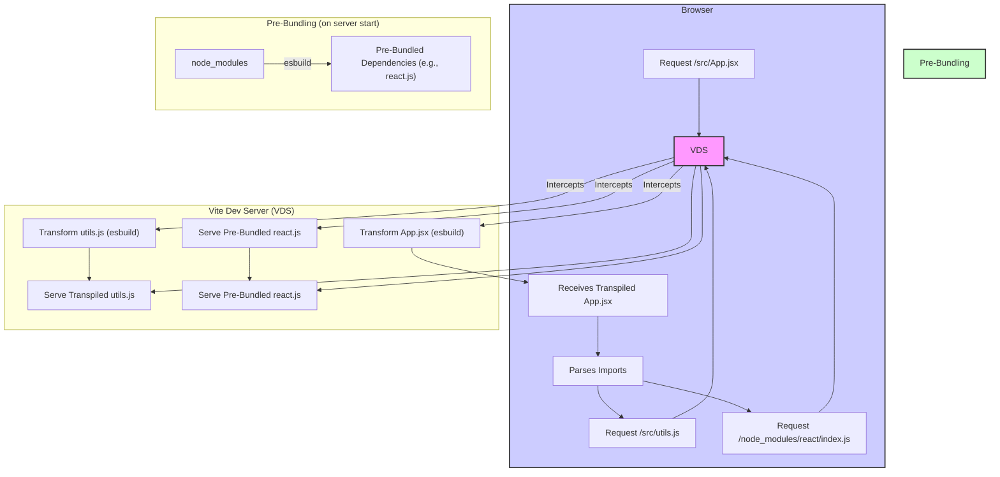
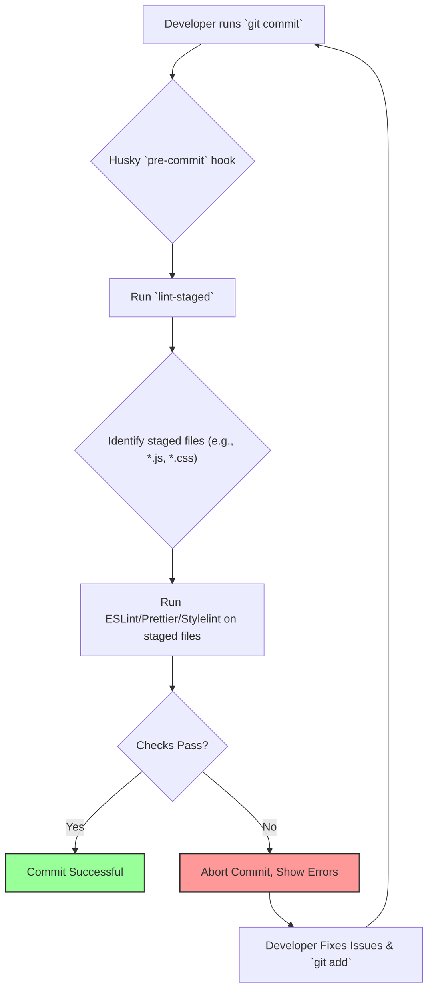

# **Chapter 10: Modern Frontend Tooling and Development Workflow**

Welcome to the engine room of modern frontend development. While mastery of JavaScript, CSS, and component architecture is crucial, a senior frontend engineer must also possess a deep understanding of the tools and workflows that enable efficient, scalable, and maintainable application development. Interviews for senior roles often probe your knowledge of the _how_ – how you build, lint, test, version control, and optimize the development process itself.

This chapter delves into the essential tooling and workflow patterns expected of senior candidates. We'll explore build systems, code quality enforcement, version control strategies, package management nuances, and techniques for enhancing developer experience (DX). Understanding these tools isn't just about knowing commands; it's about understanding their underlying principles, trade-offs, and how to configure them effectively for different project needs and team sizes. Proficiency here demonstrates maturity, efficiency, and the ability to establish robust development practices.

---

#### A. Build Tools and Bundlers

At the heart of modern frontend development lies the build process. Raw source code (JavaScript, TypeScript, CSS, images, etc.) needs to be transformed, optimized, and bundled into assets that browsers can efficiently consume. Build tools automate this complex process.

##### 1. Webpack Deep Dive

Webpack has long been the dominant module bundler in the JavaScript ecosystem. While newer tools are gaining traction, a deep understanding of Webpack remains highly valuable, as many large-scale projects still rely on it, and its core concepts influence other tools.

###### a. Core Concepts (Entry, Output, Loaders, Plugins, Mode, Target)

Understanding Webpack begins with its fundamental concepts:

- **Entry:** The starting point(s) of your application's dependency graph. Webpack begins bundling from these files. You can have single or multiple entries (e.g., for different pages in a multi-page application or separate vendor/app bundles).
  ```javascript
  // webpack.config.js
  module.exports = {
    entry: "./src/index.js", // Single entry
    // or
    entry: {
      main: "./src/main.js",
      admin: "./src/admin.js",
    }, // Multiple entries
  };
  ```
- **Output:** Specifies where Webpack should emit the bundled files and how to name them. Key properties include `path` (the absolute directory) and `filename` (the name template for output files, often using placeholders like `[name]` or `[contenthash]`).

  ```javascript
  // webpack.config.js
  const path = require("path");

  module.exports = {
    // ... entry ...
    output: {
      path: path.resolve(__dirname, "dist"),
      filename: "[name].[contenthash].bundle.js", // Use content hash for caching
      clean: true, // Clean the output directory before each build
    },
  };
  ```

- **Loaders:** Webpack only understands JavaScript and JSON files natively. Loaders allow Webpack to process _other_ types of files (e.g., CSS, images, TypeScript, Babel) and convert them into valid modules that can be added to the dependency graph. Loaders are specified in the `module.rules` array and are applied per file type.
  ```javascript
  // webpack.config.js
  module.exports = {
    // ... entry, output ...
    module: {
      rules: [
        {
          test: /\.css$/i, // Apply loaders to .css files
          use: ["style-loader", "css-loader"], // Order matters: css-loader processes CSS, style-loader injects into DOM
        },
        {
          test: /\.(png|svg|jpg|jpeg|gif)$/i,
          type: "asset/resource", // Built-in asset module type
        },
        {
          test: /\.js$/,
          exclude: /node_modules/,
          use: {
            loader: "babel-loader", // Transpile modern JS using Babel
            options: {
              presets: ["@babel/preset-env", "@babel/preset-react"],
            },
          },
        },
      ],
    },
  };
  ```
- **Plugins:** While loaders operate on individual files during the bundling process, plugins hook into the Webpack build lifecycle to perform broader actions. Examples include bundle optimization, asset management, environment variable injection, and generating HTML files. Plugins are instantiated in the `plugins` array.

  ```javascript
  // webpack.config.js
  const HtmlWebpackPlugin = require("html-webpack-plugin");

  module.exports = {
    // ... entry, output, module ...
    plugins: [
      new HtmlWebpackPlugin({
        // Generates an HTML file and injects bundles
        template: "./src/index.html",
      }),
      // Other plugins like MiniCssExtractPlugin, DefinePlugin, etc.
    ],
  };
  ```

- **Mode:** Sets the build mode to either `'development'` or `'production'`. This enables corresponding built-in optimizations for each environment. Production mode enables minification, tree-shaking, scope hoisting, and other performance enhancements by default.
  ```javascript
  // webpack.config.js
  module.exports = {
    mode: "production", // Or 'development'
    // ... rest of config ...
  };
  ```
- **Target:** Specifies the deployment target environment (e.g., `'web'`, `'node'`, `'electron-main'`). This influences how Webpack bundles code, handling environment-specific features like chunk loading or Node.js built-ins. The default is `'web'`.

###### b. Advanced Configuration (Code Splitting, Optimization, Caching, Module Federation)

Senior engineers are expected to go beyond basic configuration and leverage advanced features for performance and scalability:

- **Code Splitting:** Instead of bundling all code into one massive file, code splitting divides it into smaller chunks that can be loaded on demand or in parallel. This improves initial load time. Common strategies include:

  - **Entry Points:** Manually splitting code using multiple `entry` points (less common for single-page apps).
  - **`optimization.splitChunks`:** Automatically splitting chunks based on shared modules (e.g., vendor code) or dynamic imports.
  - **Dynamic Imports:** Using the `import()` syntax within your application code to load modules lazily (e.g., for route-based splitting).

  ```javascript
  // webpack.config.js (SplitChunks example)
  module.exports = {
    // ...
    optimization: {
      splitChunks: {
        chunks: "all", // Apply splitting to all types of chunks (initial, async)
      },
    },
  };

  // In your application code (Dynamic Import example)
  button.addEventListener("click", () => {
    import(/* webpackChunkName: "heavy-module" */ "./heavy-module.js")
      .then((module) => {
        module.doSomething();
      })
      .catch((err) => console.error("Chunk loading failed"));
  });
  ```

- **Optimization:** Webpack offers fine-grained control over optimization:
  - **`optimization.minimize`:** Enables/disables minimization (defaults based on `mode`).
  - **`optimization.minimizer`:** Allows configuring specific minimizers (e.g., `TerserPlugin` for JS, `CssMinimizerPlugin` for CSS).
  - **Tree Shaking:** Automatic removal of unused code (dead code elimination). Relies on ES Modules (`import`/`export`) and is enabled by default in production mode. Ensure your code and libraries use ESM for maximum effect. Mark packages as side-effect-free in `package.json` if applicable (`"sideEffects": false`).
- **Caching:** Leveraging browser caching is critical. Webpack facilitates this by generating filenames with hashes (`[contenthash]`) that change only when the file content changes.
  ```javascript
  // webpack.config.js
  module.exports = {
    // ...
    output: {
      filename: "[name].[contenthash].js", // JS file hash
      chunkFilename: "[name].[contenthash].chunk.js", // Chunks from code splitting
      assetModuleFilename: "assets/[hash][ext][query]", // Asset file hash
    },
    optimization: {
      moduleIds: "deterministic", // Consistent module IDs across builds
      runtimeChunk: "single", // Extract runtime code into a single chunk
      splitChunks: {
        // Ensure vendor chunks get stable hashes
        cacheGroups: {
          vendor: {
            test: /[\\/]node_modules[\\/]/,
            name: "vendors",
            chunks: "all",
          },
        },
      },
    },
  };
  ```
- **Module Federation:** A powerful feature (introduced in Webpack 5) allowing separately built and deployed applications (micro-frontends) to share code dynamically at runtime. One application ("host") can load code exposed by another application ("remote").

  ```javascript
  // webpack.config.js (Remote App - exposing a component)
  const { ModuleFederationPlugin } = require("webpack").container;

  module.exports = {
    // ...
    plugins: [
      new ModuleFederationPlugin({
        name: "remoteApp",
        filename: "remoteEntry.js", // Manifest file
        exposes: {
          "./Button": "./src/Button", // Expose Button component
        },
        shared: {
          react: { singleton: true },
          "react-dom": { singleton: true },
        }, // Share dependencies
      }),
      // ... other plugins
    ],
  };

  // webpack.config.js (Host App - consuming the component)
  const { ModuleFederationPlugin } = require("webpack").container;

  module.exports = {
    // ...
    plugins: [
      new ModuleFederationPlugin({
        name: "hostApp",
        remotes: {
          remoteApp: "remoteApp@http://localhost:3001/remoteEntry.js", // URL of remote's manifest
        },
        shared: {
          react: { singleton: true },
          "react-dom": { singleton: true },
        },
      }),
      // ... other plugins
    ],
  };
  ```

###### c. Loader and Plugin Ecosystem (Common Use Cases)

The power of Webpack lies in its rich ecosystem:

- **Common Loaders:**
  - `babel-loader`: Transpiles modern JavaScript (ES6+) to compatible versions using Babel.
  - `ts-loader` / `@babel/preset-typescript`: Transpiles TypeScript.
  - `css-loader`: Processes `@import` and `url()` in CSS.
  - `style-loader`: Injects CSS into the DOM via `<style>` tags (dev).
  - `sass-loader` / `less-loader` / `stylus-loader`: Compiles CSS preprocessors.
  - `postcss-loader`: Processes CSS with PostCSS plugins (e.g., Autoprefixer).
  - `file-loader` / `url-loader` (Legacy) / Asset Modules (Webpack 5+): Handle file assets (images, fonts).
  - `raw-loader`: Loads file content as a string.
  - `vue-loader` / `@svgr/webpack`: Handle framework-specific files or SVG transformations.
- **Common Plugins:**
  - `HtmlWebpackPlugin`: Generates HTML files and injects bundles.
  - `MiniCssExtractPlugin`: Extracts CSS into separate files (prod) instead of using `style-loader`.
  - `DefinePlugin`: Creates global constants at compile time (e.g., environment variables).
  - `CopyWebpackPlugin`: Copies individual files or directories to the build output.
  - `CleanWebpackPlugin` (or `output.clean: true`): Cleans the output directory before builds.
  - `WebpackBundleAnalyzer`: Visualizes the size of output files and module composition.
  - `TerserWebpackPlugin`: Minimizes JavaScript (default in prod mode).
  - `CssMinimizerWebpackPlugin`: Minimizes CSS.
  - `WorkboxWebpackPlugin`: Integrates service workers for Progressive Web Apps (PWAs).

###### d. [Configuration Guide: Optimizing a Webpack build for production performance]

Let's create a `webpack.prod.js` configuration focusing on optimization:

```javascript
// webpack.prod.js
const { merge } = require("webpack-merge"); // To merge with a common config
const common = require("./webpack.common.js"); // Assume a common config file
const MiniCssExtractPlugin = require("mini-css-extract-plugin");
const CssMinimizerPlugin = require("css-minimizer-webpack-plugin");
const TerserPlugin = require("terser-webpack-plugin");
const { WebpackBundleAnalyzer } = require("webpack-bundle-analyzer"); // Optional: for analysis

module.exports = merge(common, {
  mode: "production",
  devtool: "source-map", // Use 'source-map' for prod debugging, 'hidden-source-map' if you don't want browser access
  output: {
    filename: "[name].[contenthash].bundle.js",
    chunkFilename: "[name].[contenthash].chunk.js",
    assetModuleFilename: "assets/[contenthash][ext][query]",
    clean: true,
  },
  module: {
    rules: [
      // Use MiniCssExtractPlugin loader instead of style-loader for CSS
      {
        test: /\.css$/i,
        use: [MiniCssExtractPlugin.loader, "css-loader", "postcss-loader"],
      },
      {
        test: /\.s[ac]ss$/i,
        use: [
          MiniCssExtractPlugin.loader,
          "css-loader",
          "postcss-loader",
          "sass-loader",
        ],
      },
    ],
  },
  plugins: [
    new MiniCssExtractPlugin({
      filename: "css/[name].[contenthash].css",
      chunkFilename: "css/[id].[contenthash].css",
    }),
    // Optional: Analyze bundle sizes
    // new WebpackBundleAnalyzer({ analyzerMode: 'static', openAnalyzer: false })
  ],
  optimization: {
    minimize: true, // Enable minimization
    minimizer: [
      new TerserPlugin({
        // JS minimizer
        terserOptions: {
          compress: {
            drop_console: true, // Remove console logs
          },
        },
        extractComments: false, // Don't extract comments to separate file
      }),
      new CssMinimizerPlugin(), // CSS minimizer
    ],
    splitChunks: {
      chunks: "all", // Apply splitting to all chunks
      maxInitialRequests: Infinity, // Allow more parallel requests for initial chunks
      minSize: 20000, // Minimum size in bytes for a chunk to be created
      cacheGroups: {
        // Define rules for creating chunks
        vendor: {
          test: /[\\/]node_modules[\\/]/,
          name(module) {
            // Get package name
            const packageName = module.context.match(
              /[\\/]node_modules[\\/](.*?)([\\/]|$)/
            )[1];
            // Group common large libraries separately if needed
            // if (['react', 'react-dom', 'lodash'].includes(packageName)) {
            //   return `vendor-${packageName.replace('@', '')}`;
            // }
            return "vendors"; // Default vendor chunk
          },
          priority: -10, // Higher priority for vendor chunks
          reuseExistingChunk: true,
        },
        // Example: Separate chunk for large CSS libraries
        // styles: {
        //   name: 'styles',
        //   test: /\.css$/,
        //   chunks: 'all',
        //   enforce: true,
        // },
      },
    },
    runtimeChunk: "single", // Extract webpack runtime into a single chunk
    moduleIds: "deterministic", // Consistent module IDs for better long-term caching
  },
  performance: {
    hints: "warning", // Show warnings for large assets
    maxAssetSize: 512 * 1024, // 512 KiB
    maxEntrypointSize: 512 * 1024, // 512 KiB
  },
});
```

**Key Optimizations Applied:**

1.  **Mode:** Set to `production`.
2.  **Content Hashing:** Used for long-term caching (`[contenthash]`).
3.  **CSS Extraction:** `MiniCssExtractPlugin` extracts CSS into separate files, allowing parallel loading and caching.
4.  **Minimization:** `TerserPlugin` (JS) and `CssMinimizerPlugin` (CSS) reduce file sizes. Console logs are dropped.
5.  **Code Splitting:** `optimization.splitChunks` automatically splits vendor code and potentially other shared modules.
6.  **Runtime Chunk:** Extracts Webpack's runtime code to prevent it from changing vendor chunk hashes unnecessarily.
7.  **Deterministic Module IDs:** Ensures module IDs remain consistent between builds if content hasn't changed.
8.  **Performance Hints:** Configured to warn about large bundle sizes.

###### e. [Troubleshooting Section: Debugging complex Webpack issues]

Debugging Webpack can be challenging. Here are common issues and strategies:

- **Slow Build Times:**
  - **Analysis:** Use `webpack-bundle-analyzer` to identify large modules or dependencies contributing to size. Use `speed-measure-webpack-plugin` to pinpoint slow loaders or plugins.
  - **Caching:** Ensure build caching is working (`cache: { type: 'filesystem' }` in Webpack 5). Use `babel-loader` caching (`cacheDirectory: true`).
  - **Parallelism:** Use `thread-loader` for expensive loaders (e.g., Babel, TypeScript), but be mindful of overhead.
  - **Upgrade:** Consider migrating parts or all of the build to faster tools like esbuild or swc (via `esbuild-loader` or `babel-loader` with swc core).
  - **Reduce Work:** Ensure `exclude: /node_modules/` is correctly applied for loaders like Babel. Check if source maps are generated unnecessarily or using slow types in development.
- **Incorrect Output / Runtime Errors:**
  - **Source Maps:** Ensure appropriate `devtool` settings are used for debugging.
  - **Loader Order:** Remember loaders execute bottom-to-top or right-to-left in the `use` array. Incorrect order is a common mistake (e.g., `css-loader` must run before `style-loader` or `MiniCssExtractPlugin.loader`).
  - **Configuration Mismatch:** Double-check `mode`, `target`, plugin options, and environment variables (`DefinePlugin`).
  - **Polyfills:** Ensure necessary polyfills are included (e.g., via `@babel/preset-env`'s `useBuiltIns` and `corejs` options) if targeting older browsers.
  - **Module Resolution:** Check `resolve.alias` or `resolve.modules` if imports aren't working as expected.
- **CSS Issues:**
  - **Missing Styles:** Check if `MiniCssExtractPlugin` is configured correctly in production. Ensure CSS files are imported in your JavaScript entry points.
  - **Incorrect Order:** CSS import order can matter for specificity. `MiniCssExtractPlugin` generally preserves order based on JS import order, but complex dependencies can cause issues.
  - **PostCSS/Autoprefixer:** Verify `postcss.config.js` and `browserslist` configuration.
- **Module Federation Issues:**
  - **Runtime Errors:** Check shared dependency versions match between host and remotes (`singleton: true` helps but isn't foolproof). Ensure remotes are running and accessible at the specified URL.
  - **Version Mismatches:** Carefully manage shared library versions.
  - **Debugging:** Use browser network tools to check if `remoteEntry.js` and exposed modules are loading correctly.
- **General Debugging Tools:**
  - **`webpack --profile --json > stats.json`:** Generate detailed build statistics. Analyze this file with tools like `webpack-bundle-analyzer` or online visualizers (e.g., `statoscope.tech`).
  - **`node --inspect-brk node_modules/.bin/webpack`:** Debug the Webpack build process itself using Node.js debugging tools.
  - **Verbose Output:** Use `stats: 'verbose'` in Webpack config or `--display verbose` CLI flag for more detailed logs.
  - **Simplify:** Temporarily remove plugins or loaders one by one to isolate the problematic part of the configuration.

##### 2. Next-Generation Build Tools (Vite, esbuild, Parcel, Rspack)

While Webpack is powerful, its build times, especially for large projects in development, can be slow due to its bundling-first approach. Newer tools leverage modern browser features and faster languages (Go, Rust) to offer significant performance improvements.

###### a. Native ESM Development Server (Vite) - How it Works

Vite (French for "fast") takes a radically different approach for development:

1.  **No Bundling (Initially):** Instead of bundling your entire application before serving, Vite serves your source code directly over native ES Modules (ESM) imports, which are now supported in modern browsers.
2.  **On-Demand Compilation:** When the browser requests a module (e.g., `/src/main.js`), Vite intercepts the request.
3.  **Transform & Serve:** It transforms the requested file _just-in-time_ (e.g., compiling JSX, TypeScript, CSS) using ultra-fast tools like esbuild and serves it.
4.  **Dependency Pre-Bundling:** Dependencies in `node_modules` (which are often numerous CommonJS modules not suitable for native ESM) are pre-bundled into single ESM files using esbuild _once_ when the dev server starts. This avoids excessive browser requests for individual dependency files and converts CJS to ESM.

This "serve-then-compile" approach means the dev server starts almost instantly, and Hot Module Replacement (HMR) updates are consistently fast, regardless of application size, because only the edited module needs to be processed.



_Diagram Explanation:_ This flowchart illustrates Vite's development server process. The browser requests source files directly. Vite intercepts these requests, transforms files like `.jsx` on demand using esbuild, and serves pre-bundled vendor dependencies, resulting in a much faster startup and update cycle compared to traditional bundlers.

###### b. Performance Benefits (Go/Rust-based tooling)

- **esbuild (Go):** Tools like Vite and Parcel leverage esbuild internally. Written in Go, esbuild performs transpilation, bundling, and minification 10-100x faster than JavaScript-based tools like Babel or Terser due to parallelism and compiled language efficiency.
- **SWC (Rust):** Another extremely fast Rust-based platform for compilation and bundling, often used as an alternative to Babel (e.g., via `babel-loader` configured to use SWC core, or directly in Next.js).
- **Rspack (Rust):** Developed by ByteDance, Rspack aims to be a high-performance, Webpack-compatible bundler written in Rust. It offers significant speed improvements while maintaining compatibility with much of the Webpack ecosystem (loaders, plugins), potentially easing migration.

The primary benefit is dramatically reduced build times (both for development startup/HMR and production builds) and often simpler configuration.

###### c. Configuration Differences and Ecosystem Maturity

- **Vite:**
  - **Configuration:** Generally much simpler (`vite.config.js`). Sensible defaults cover most common use cases (TypeScript, JSX, CSS, PostCSS, JSON imports, WASM). Configuration often involves specifying plugins (using a Rollup-compatible plugin interface).
  - **Ecosystem:** Growing rapidly. Many popular tools have Vite plugins. Uses Rollup for production builds, inheriting its mature optimization capabilities. Less configurable at the deepest levels compared to Webpack.
- **Parcel:**
  - **Configuration:** Famous for its zero-configuration approach for many standard project types. It automatically detects and installs necessary transformers. Configuration is possible (`.parcelrc`) but often not needed for basic setups.
  - **Ecosystem:** Has its own plugin system. Less extensive than Webpack's but covers common needs. Uses its own Rust-based bundler/minifier.
- **esbuild:**
  - **Configuration:** Can be used via a JavaScript or Go API, or CLI. Configuration is minimal and focused purely on speed.
  - **Ecosystem:** Primarily a raw bundler/transformer/minifier. Often used _within_ other tools (like Vite) or for specific tasks (like library bundling) rather than as a full application build tool on its own, as it lacks some advanced features like complex code splitting or a rich plugin API compared to Webpack/Rollup.
- **Rspack:**
  - **Configuration:** Aims for high compatibility with `webpack.config.js`. Many existing Webpack loaders and plugins work or have Rspack-native equivalents. The goal is faster builds with minimal config changes for Webpack users.
  - **Ecosystem:** Leverages the Webpack ecosystem where possible. Still newer, so full compatibility or native plugin parity might lag behind Webpack in some areas.

**Trade-offs:** While faster, these newer tools might have:

- Slightly different behaviours or edge cases compared to Webpack.
- Less mature ecosystems for highly specific or complex plugins/loaders (though rapidly improving).
- Less battle-tested history in extremely large or complex legacy enterprise environments compared to Webpack.

###### d. [Practical Example: Migrating a small project from Webpack to Vite]

Let's assume a simple React project using Webpack with Babel and CSS Modules.

**1. Project Structure (Before):**

```
my-react-app/
├── dist/
├── public/
│   └── index.html
├── src/
│   ├── App.css
│   ├── App.jsx
│   └── index.js
├── .babelrc
├── package.json
└── webpack.config.js
```

**2. Install Vite Dependencies:**

```bash
npm uninstall webpack webpack-cli webpack-dev-server babel-loader @babel/core @babel/preset-env @babel/preset-react css-loader style-loader html-webpack-plugin
npm install --save-dev vite @vitejs/plugin-react
# Or using yarn:
yarn remove webpack webpack-cli webpack-dev-server babel-loader @babel/core @babel/preset-env @babel/preset-react css-loader style-loader html-webpack-plugin
yarn add --dev vite @vitejs/plugin-react
```

**3. Configure Vite (`vite.config.js`):**

Create `vite.config.js` in the project root:

```javascript
// vite.config.js
import { defineConfig } from "vite";
import react from "@vitejs/plugin-react";

// https://vitejs.dev/config/
export default defineConfig({
  plugins: [react()], // Handles React Fast Refresh (HMR) and JSX/TS compilation
  // Optional: Configure CSS Modules if needed (Vite supports them out-of-the-box)
  css: {
    modules: {
      // Optional: customize generated class names
      // generateScopedName: "[name]__[local]___[hash:base64:5]",
    },
  },
  // Optional: Server configuration (port, proxy, etc.)
  // server: {
  //   port: 3000,
  //   open: true, // Automatically open browser
  // }
});
```

**4. Update `index.html`:**

- Move `public/index.html` to the project root (`my-react-app/index.html`).
- Remove Webpack bundle script tags (`<script src="..."></script>`).
- Add a script tag pointing to your main entry file:
  ```html
  <!DOCTYPE html>
  <html lang="en">
    <head>
      <meta charset="UTF-8" />
      <link rel="icon" type="image/svg+xml" href="/vite.svg" />
      <!-- Example icon -->
      <meta name="viewport" content="width=device-width, initial-scale=1.0" />
      <title>Vite React App</title>
    </head>
    <body>
      <div id="root"></div>
      <!-- Add this script tag -->
      <script type="module" src="/src/index.js"></script>
    </body>
  </html>
  ```
  _Note:_ Vite treats `index.html` as the entry point and detects the `<script type="module">` tag.

**5. Update `package.json` Scripts:**

```json
{
  "name": "my-react-app",
  "version": "1.0.0",
  "scripts": {
    "dev": "vite", // Start dev server
    "build": "vite build", // Create production build
    "preview": "vite preview" // Locally preview production build
  }
  // ... dependencies ...
}
```

**6. Remove Old Config Files:**

Delete `webpack.config.js` and `.babelrc` (Vite handles transpilation via esbuild and the React plugin).

**7. Run:**

```bash
npm run dev
# or
yarn dev
```

Your app should now be running with Vite's fast dev server! Production builds are created with `npm run build`.

**Considerations during Migration:**

- **Environment Variables:** Webpack's `DefinePlugin` or `EnvironmentPlugin` need replacement. Vite exposes env variables via `import.meta.env` (e.g., `import.meta.env.VITE_API_KEY`). Variables must be prefixed with `VITE_`.
- **Asset Handling:** Public assets are served from the `public` directory (configure via `publicDir`). Imports from JS/CSS are handled automatically. Check paths if issues arise.
- **Node.js Polyfills:** Vite does _not_ polyfill Node.js built-ins for browser code by default. If your code relies on them, you may need specific plugins or refactoring.
- **Webpack-Specific APIs:** Code relying on Webpack's specific features (like `require.context`) will need alternatives (e.g., `import.meta.glob` in Vite).
- **CSS:** Vite handles CSS imports, PostCSS, CSS Modules, and preprocessors out-of-the-box or with minimal config. Ensure any custom PostCSS plugins are configured in `postcss.config.js` or `vite.config.js`.

---

#### B. Linters and Formatters

Maintaining code quality, consistency, and preventing common errors is crucial, especially in team environments. Linters analyze code for potential errors and stylistic issues, while formatters automatically enforce code style.

##### 1. ESLint: Configuration (`.eslintrc`), Rules, Plugins, Sharable Configs, Flat Config

- **Purpose:** ESLint is a highly pluggable JavaScript (and JSX/TypeScript) linter. It statically analyzes your code to find problems based on configured rules.
- **Configuration:**

  - **Legacy (`.eslintrc.*`):** Traditionally configured using files like `.eslintrc.js`, `.eslintrc.yml`, or `.eslintrc.json`. Key properties include:
    - `extends`: Inherit rules from base configurations (e.g., `eslint:recommended`, `plugin:react/recommended`, `airbnb`).
    - `plugins`: Add plugins that provide custom rules (e.g., `eslint-plugin-react`, `eslint-plugin-jsx-a11y`, `@typescript-eslint/eslint-plugin`).
    - `rules`: Customize or override specific rules (e.g., `"semi": ["error", "always"]`, `"no-unused-vars": "warn"`). Values are typically `"off"` (0), `"warn"` (1), or `"error"` (2).
    - `parser`: Specify the parser (e.g., `@typescript-eslint/parser` for TypeScript).
    - `parserOptions`: Configure parser settings (e.g., `ecmaVersion`, `sourceType: 'module'`, `ecmaFeatures: { jsx: true }`).
    - `env`: Define global variables available in specific environments (e.g., `browser: true`, `node: true`, `es2021: true`).
    - `overrides`: Apply different configurations to specific file patterns (e.g., different rules for test files).
  - **Flat Config (`eslint.config.js`):** The newer configuration system (default in ESLint v9+). Uses a JavaScript file exporting an array of configuration objects. Aims to be simpler and more explicit.

    ```javascript
    // eslint.config.js (Flat Config Example)
    import js from "@eslint/js";
    import globals from "globals";
    import tseslint from "typescript-eslint";
    import reactPlugin from "eslint-plugin-react";
    // import stylistic from '@stylistic/eslint-plugin' // Example for stylistic rules

    export default tseslint.config(
      js.configs.recommended, // Base recommended rules
      ...tseslint.configs.recommended, // TypeScript recommended rules
      // reactPlugin.configs.flat.recommended, // React recommended (check plugin docs for flat config)
      {
        // Custom configuration object
        files: ["**/*.{js,jsx,mjs,cjs,ts,tsx}"], // Apply to these files
        // languageOptions: { // Replaces parserOptions, env, globals
        //   globals: {
        //     ...globals.browser,
        //     ...globals.node,
        //     myCustomGlobal: "readonly",
        //   },
        //   parserOptions: { // Specific parser options if needed beyond defaults
        //     ecmaFeatures: { jsx: true },
        //   }
        // },
        // plugins: { // Replaces plugins array
        //   react: reactPlugin,
        //   '@stylistic': stylistic
        // },
        rules: {
          // Customize rules
          "no-unused-vars": "warn",
          semi: ["error", "always"],
          // "@stylistic/indent": ["error", 2], // Example stylistic rule
          // ... other rules
        },
        // settings: { // For plugin settings like react version
        //   react: { version: "detect" }
        // }
      },
      {
        // Configuration object specifically for test files
        files: ["**/*.test.{js,ts,jsx,tsx}"],
        rules: {
          // Relax or change rules for tests
          "no-undef": "off",
        },
      },
      {
        // Ignore files/directories
        ignores: ["dist/", "node_modules/", "*.config.js"],
      }
    );
    ```

- **Sharable Configs:** Packages (e.g., `eslint-config-airbnb`, `eslint-config-standard`, `eslint-config-prettier`) that bundle specific sets of rules and plugin configurations, promoting consistency.
- **Plugins:** Extend ESLint's capabilities with rules specific to frameworks (React, Vue), accessibility (`jsx-a11y`), imports (`eslint-plugin-import`), TypeScript (`@typescript-eslint`), etc.

##### 2. Prettier: Integration with Linters, Editor Setup, Overrides

- **Purpose:** Prettier is an opinionated code _formatter_. It enforces a consistent style by parsing your code and re-printing it according to its rules, largely ignoring original styling. It supports many languages beyond JavaScript.
- **Integration with ESLint:** Linters (like ESLint) can have rules that conflict with Prettier's formatting (e.g., ESLint's indentation rules vs. Prettier's). The standard practice is:
  1.  Use ESLint for code _quality_ rules (potential errors, best practices).
  2.  Use Prettier for code _formatting_ rules (indentation, spacing, quotes, semicolons).
  3.  Use `eslint-config-prettier` to disable any ESLint rules that conflict with Prettier.
  4.  Optionally use `eslint-plugin-prettier` to run Prettier as an ESLint rule and report formatting differences as ESLint issues (though running Prettier separately is often preferred).
- **Editor Setup:** Most code editors have extensions for Prettier that can format code on save (`"editor.formatOnSave": true` in VS Code settings). This provides immediate feedback and ensures consistency.
- **Configuration:** Configured via `.prettierrc.json`, `.prettierrc.js`, or `prettier` key in `package.json`. Options are limited by design (opinionated), covering things like `tabWidth`, `semi`, `singleQuote`, `trailingComma`, `printWidth`.
- **Overrides:** Allows applying different formatting options to specific file types or directories.

##### 3. Stylelint for CSS/SCSS/CSS-in-JS

- **Purpose:** Stylelint is the equivalent of ESLint for CSS, SCSS, Less, and even CSS-in-JS objects/template literals.
- **Features:** Catches errors (invalid properties, typos), enforces stylistic conventions (property order, selector patterns, naming conventions), and prevents accessibility issues.
- **Configuration:** Uses `stylelint.config.js` or `.stylelintrc.json`. Similar structure to ESLint: `extends` (e.g., `stylelint-config-standard`, `stylelint-config-recommended-scss`), `plugins` (e.g., `stylelint-order`, `stylelint-scss`), `rules`.
- **Integration:** Can be run alongside ESLint/Prettier. `stylelint-config-prettier` disables conflicting Stylelint rules if using Prettier for CSS formatting.

##### 4. Enforcing Code Style Across a Team (Husky, lint-staged)

Manually running linters/formatters is unreliable. Automation is key:

- **Husky:** A tool that makes Git hooks easy to manage. It allows you to run scripts automatically at certain points in the Git lifecycle (e.g., before committing, before pushing).
- **lint-staged:** A tool that runs linters/formatters _only_ on the files staged for commit in Git (`git add ...`). This prevents checking unchanged files, making the pre-commit process much faster.

**Typical Workflow:**

1.  A developer runs `git commit`.
2.  Husky triggers the `pre-commit` hook.
3.  The hook runs `lint-staged`.
4.  `lint-staged` identifies staged files matching configured patterns (e.g., `*.{js,jsx,ts,tsx}`).
5.  It runs specified commands (e.g., `eslint --fix`, `prettier --write`, `stylelint --fix`) on _only those staged files_.
6.  If linters find errors that cannot be auto-fixed, or if formatters make changes, the commit is aborted. The developer fixes the issues, `git add`s the changes again, and re-commits.
7.  If all checks pass, the commit proceeds.



_Diagram Explanation:_ This flowchart shows the automated code quality workflow using Husky and lint-staged. Before a commit is finalized, staged files are automatically linted and formatted, ensuring code quality and consistency are enforced across the team without manual intervention.

##### 5. [Configuration Guide: Setting up ESLint and Prettier with Husky pre-commit hooks]

**1. Install Dependencies:**

```bash
# ESLint, Prettier, and necessary configs/plugins (adjust based on your project: TS, React, etc.)
npm install --save-dev eslint prettier eslint-config-prettier eslint-plugin-react @typescript-eslint/parser @typescript-eslint/eslint-plugin stylelint stylelint-config-standard stylelint-config-prettier

# Husky and lint-staged
npm install --save-dev husky lint-staged

# Or using yarn
yarn add --dev eslint prettier eslint-config-prettier eslint-plugin-react @typescript-eslint/parser @typescript-eslint/eslint-plugin stylelint stylelint-config-standard stylelint-config-prettier husky lint-staged
```

**2. Configure ESLint (`.eslintrc.js` or `eslint.config.js`):**

_Example using legacy `.eslintrc.js` (adapt for Flat Config if needed):_

```javascript
// .eslintrc.js
module.exports = {
  parser: "@typescript-eslint/parser", // If using TypeScript
  extends: [
    "eslint:recommended",
    "plugin:react/recommended", // If using React
    "plugin:@typescript-eslint/recommended", // If using TypeScript
    "plugin:jsx-a11y/recommended", // If using JSX for accessibility
    "prettier", // IMPORTANT: Disables ESLint rules that conflict with Prettier. Must be LAST.
  ],
  plugins: [
    "react", // If using React
    "@typescript-eslint", // If using TypeScript
    "jsx-a11y", // If using JSX for accessibility
    // 'import', // Optional: for import sorting/rules
  ],
  rules: {
    // Your custom rules overrides here
    "react/prop-types": "off", // Often off in TS projects
    "react/react-in-jsx-scope": "off", // Not needed with new JSX transform
    "@typescript-eslint/no-unused-vars": "warn",
    "no-console": "warn",
    // ... other rules
  },
  settings: {
    react: {
      version: "detect", // Automatically detect React version
    },
  },
  env: {
    browser: true,
    node: true,
    es2021: true,
  },
  ignorePatterns: ["node_modules/", "dist/", "build/", "*.config.js"],
};
```

**3. Configure Prettier (`.prettierrc.json`):**

```json
// .prettierrc.json
{
  "semi": true,
  "singleQuote": true,
  "jsxSingleQuote": false,
  "trailingComma": "es5",
  "tabWidth": 2,
  "printWidth": 80,
  "arrowParens": "always"
}
```

**4. Configure Stylelint (`stylelint.config.js`):**

```javascript
// stylelint.config.js
module.exports = {
  extends: [
    "stylelint-config-standard", // Base standard rules
    // 'stylelint-config-standard-scss', // If using SCSS
    "stylelint-config-prettier", // Disables rules conflicting with Prettier. Must be LAST.
  ],
  plugins: [
    // 'stylelint-order', // Optional: for property order rules
  ],
  rules: {
    // Your custom rule overrides
    "selector-class-pattern": null, // Example: disable pattern enforcement
    "at-rule-no-unknown": [true, { ignoreAtRules: ["tailwind", "apply"] }], // If using Tailwind
    // 'order/properties-alphabetical-order': true, // Example order rule
  },
  ignoreFiles: ["node_modules/**", "dist/**", "build/**"],
};
```

**5. Configure lint-staged (in `package.json`):**

```json
// package.json
{
  // ... other package.json content ...
  "lint-staged": {
    "*.{js,jsx,ts,tsx}": ["eslint --fix", "prettier --write"],
    "*.{css,scss,less}": ["stylelint --fix", "prettier --write"],
    "*.{json,md,yaml,yml}": [
      // Format other common file types
      "prettier --write"
    ]
  }
}
```

_Explanation:_ This config tells `lint-staged` to run `eslint --fix` and `prettier --write` on staged JS/TS/JSX files, `stylelint --fix` and `prettier --write` on staged CSS/SCSS files, and `prettier --write` on other common types like JSON or Markdown. The `--fix` and `--write` flags attempt to automatically fix issues.

**6. Setup Husky:**

Run the Husky setup command (it modifies `package.json` and creates hook files):

```bash
npx husky init
# or if you installed husky v4 or earlier, use `husky install` and configure hooks manually.
# For modern husky (v5+), `husky init` is preferred.

# Now, create the pre-commit hook file:
npx husky add .husky/pre-commit "npx lint-staged"
# or using yarn:
yarn husky add .husky/pre-commit "yarn lint-staged"
```

This creates a `.husky/pre-commit` file containing the `npx lint-staged` command.

**7. Test:**

Stage some files with potential linting/formatting errors (`git add .`) and try to commit (`git commit -m "Test pre-commit hook"`). Husky should trigger `lint-staged`, run the linters/formatters, fix what it can, and abort the commit if errors remain or files were modified by formatting. Fix any reported issues, `git add` the changes, and commit again.

---

#### C. Version Control with Git (Advanced Topics)

Git is the ubiquitous version control system. Senior engineers need proficiency beyond basic `add`, `commit`, `push`, and `pull`. Understanding branching strategies, history manipulation, and conflict resolution is essential for collaborative and maintainable projects.

##### 1. Branching Strategies (Gitflow, GitHub Flow, Trunk-Based Development) - Pros and Cons

Choosing the right branching strategy impacts team workflow, release cadence, and code stability.

- **Gitflow:**
  - **Concept:** A complex model with dedicated branches for features (`feature/`), releases (`release/`), hotfixes (`hotfix/`), a main development branch (`develop`), and the production-ready branch (`main` or `master`).
  - **Pros:** Very structured, enforces separation of concerns, good for scheduled releases with multiple versions in production/maintenance. Clear process for hotfixes.
  - **Cons:** Complex, many branches to manage, can slow down integration (features merged back to `develop` late), overhead might be excessive for web apps with continuous deployment.
- **GitHub Flow:**
  - **Concept:** Simpler model. `main` is always deployable. New work starts on a descriptive branch created from `main`. Work is done, pushed, reviewed via Pull Request (PR), and merged back into `main` upon approval. `main` is then deployed. Hotfixes follow the same process.
  - **Pros:** Simple, clean history on `main`, promotes frequent integration and PRs/reviews, well-suited for Continuous Integration/Continuous Deployment (CI/CD).
  - **Cons:** Requires robust testing and CI/CD to ensure `main` is always stable. Managing multiple releases or long-running features can be less straightforward than Gitflow.
- **Trunk-Based Development (TBD):**
  - **Concept:** All developers work on a single branch (`main` or `trunk`). Work is integrated frequently (often multiple times a day). Feature flags are used to hide incomplete features in production. Short-lived feature branches (lasting hours or a day or two at most) _can_ be used but are merged quickly. Some teams commit directly to `trunk` (with rigorous automated checks). Releases are often tagged commits on `trunk`.
  - **Pros:** Maximum simplicity, avoids merge conflicts ("merge hell"), promotes continuous integration and rapid feedback, aligns well with high-velocity CI/CD.
  - **Cons:** Requires extremely strong automated testing, feature flagging discipline, and mature CI/CD. Can be chaotic without proper tooling and team discipline. Direct commits to `trunk` reduce the opportunity for pre-merge code review via PRs (though post-commit review is possible).

```mermaid
graph TD
    subgraph Gitflow
        M1[main: v1.0] --> M2[main: v1.0.1];
        M1 --> D1[develop];
        D1 --> F1[feature/A];
        D1 --> F2[feature/B];
        F1 --> D2[develop];
        F2 --> D2;
        D2 --> R1[release/v1.1];
        R1 --> D3[develop];
        R1 --> M3[main: v1.1];
        M1 --> H1[hotfix/v1.0.1];
        H1 --> M2;
        H1 --> D3;
    end

    subgraph GitHub Flow
        GHM1[main] --> FB1[feature/login];
        FB1 --> PR1[Pull Request];
        PR1 -- Merge --> GHM2[main];
        GHM2 --> Deploy1[Deploy];
        GHM2 --> FB2[feature/profile];
        FB2 --> PR2[Pull Request];
        PR2 -- Merge --> GHM3[main];
        GHM3 --> Deploy2[Deploy];
    end

    subgraph Trunk-Based Development
        TBDM1[main] --> C1["Commit 1 (Feat X - Flag Off)"];
        C1 --> C2["Commit 2 (Fix Y)"];
        C2 --> C3["Commit 3 (Feat Z - Flag Off)"];
        C3 --> DeployTBD["Deploy (Flags Off)"];
        C3 --> C4["Commit 4 (Enable Feat X Flag)"];
        C4 --> DeployTBD2["Deploy (Feat X On)"];
    end

    style Gitflow fill:#ece,stroke:#333,stroke-width:1px
    style GitHub Flow fill:#cee,stroke:#333,stroke-width:1px
    style Trunk-Based Development fill:#eec,stroke:#333,stroke-width:1px
```



_Diagram Explanation:_ This diagram visually contrasts three common Git branching strategies: Gitflow (highly structured with multiple long-lived branches), GitHub Flow (simple, feature branches off `main`, merge via PR, deploy `main`), and Trunk-Based Development (most work directly on or quickly merged to `main`, relies heavily on feature flags and CI/CD).

**Which to Choose?** Depends on team size, release frequency, CI/CD maturity, and project type. GitHub Flow is a popular, balanced choice for many web development teams. TBD suits mature teams with strong automation. Gitflow might be better for projects with strict, scheduled release cycles (e.g., installed software).

##### 2. Rebasing vs. Merging: Workflows and Best Practices

When integrating changes from one branch into another (e.g., updating a feature branch with the latest `main`), you have two main options: `git merge` and `git rebase`.

- **`git merge <source_branch>` (on target branch):**
  - **Mechanism:** Creates a new "merge commit" on the target branch, tying the histories of the two branches together. It preserves the exact history of both branches.
  - **Pros:** Non-destructive (doesn't rewrite history), preserves the context of where branches diverged and merged, easier to understand for beginners.
  - **Cons:** Creates "merge commits" that can clutter history, making `git log` harder to read if done frequently. Can lead to complex graph histories ("railroad tracks").
- **`git rebase <base_branch>` (on feature branch):**
  - **Mechanism:** Takes all commits on the current branch (since it diverged from `<base_branch>`) and reapplies them, one by one, _on top_ of the latest commit of `<base_branch>`. It effectively rewrites the feature branch's history, making it appear as if it started from the latest point of the base branch.
  - **Pros:** Creates a linear, cleaner history (no merge commits cluttering the log). Easier to follow the sequence of changes for a specific feature.
  - **Cons:** Rewrites history. **CRITICAL:** Never rebase a branch that has already been pushed and is being used by others, as it forces them into complex recovery procedures. Can make it harder to see _when_ upstream changes were integrated relative to feature development. Conflicts must be resolved per-commit during the rebase process, which can be tedious if there are many commits and conflicts.

**Common Workflows & Best Practices:**

1.  **Feature Branch Updates:** When updating your local feature branch (`my-feature`) with the latest changes from `main`:
    - **Rebase (Recommended for local/unshared branches):** `git checkout my-feature`, `git fetch origin`, `git rebase origin/main`. Resolve conflicts as they arise. This keeps your feature branch history clean before creating a PR.
    - **Merge:** `git checkout my-feature`, `git fetch origin`, `git merge origin/main`. Creates a merge commit on your feature branch. Less clean but avoids rewriting history.
2.  **Integrating Feature Branch into `main` (via PR):**
    - **Merge (Default on GitHub/GitLab):** The platform creates a merge commit when the PR is merged. Preserves feature branch history. Often combined with a `--squash` option.
    - **Rebase and Merge:** The platform _first_ rebases the feature branch onto the latest `main` and _then_ performs a fast-forward merge (no merge commit needed if possible). Results in a linear history on `main`.
    - **Squash and Merge:** Combines all commits from the feature branch into a _single_ new commit on `main`. Loses granular history of the feature branch but keeps `main` history very clean and atomic per feature/PR.

**General Rule:** Use `rebase` for cleaning up your _local_, _unshared_ history before pushing or creating a PR. Use `merge` (or platform options like Squash/Rebase and Merge) for integrating completed features into shared branches like `main` or `develop`. **Never rebase pushed/shared branches.**

##### 3. Interactive Rebase (`git rebase -i`) for History Management (Squashing, Rewording, Reordering)

Interactive rebase (`git rebase -i <base>`) is a powerful tool for cleaning up your commit history _before_ sharing it (e.g., before creating a PR). It opens an editor listing the commits between `<base>` (e.g., `origin/main`) and your current `HEAD`. You can then manipulate these commits:

- **`pick` (p):** Use the commit as is (default).
- **`reword` (r):** Keep the commit's changes but edit the commit message.
- **`edit` (e):** Keep the commit's changes but pause the rebase to amend the commit (e.g., add forgotten changes, split the commit).
- **`squash` (s):** Combine this commit's changes with the _previous_ commit's changes, prompting you to merge the commit messages.
- **`fixup` (f):** Like `squash`, but discard this commit's message entirely, using only the previous commit's message. Useful for small fix commits ("fix typo", "address review comment").
- **`drop` (d):** Discard the commit entirely.
- **Reordering:** Simply change the order of the lines in the editor to reorder the commits (be cautious, this can cause conflicts).

**Example Scenario:** Cleaning up a feature branch before a PR.

1.  `git log --oneline origin/main..HEAD` (See your commits)
    ```
    f3a4b5 (HEAD -> feature/login) Fix login button style
    a2c3d4 Add password validation
    e5f6g7 WIP login form structure // Bad message, maybe combine
    b1a2c3 Add initial login component // Good starting point
    ```
2.  `git rebase -i origin/main` (Opens editor)

    ```
    pick b1a2c3 Add initial login component
    pick e5f6g7 WIP login form structure
    pick a2c3d4 Add password validation
    pick f3a4b5 Fix login button style

    # Rebase ... onto ...
    # Commands:
    # p, pick = use commit
    # r, reword = use commit, but edit the commit message
    # e, edit = use commit, but stop for amending
    # s, squash = use commit, but meld into previous commit
    # f, fixup = like "squash", but discard this commit's log message
    # d, drop = remove commit
    # ...
    ```

3.  **Edit the file:** Let's reword the first, fixup the WIP commit into the first, and squash the style fix into the validation commit.
    ```
    reword b1a2c3 Add initial login component  // Change to 'feat: Add initial login form structure'
    fixup e5f6g7 WIP login form structure     // Combine into previous, discard this message
    pick a2c3d4 Add password validation
    squash f3a4b5 Fix login button style      // Combine into previous, merge messages
    ```
4.  **Save and Close:** Git will:
    - Pause and ask you to reword the first commit message.
    - Apply the second commit's changes (`e5f6g7`) onto the first without asking for a message (`fixup`).
    - Apply the third commit (`a2c3d4`).
    - Apply the fourth commit's changes (`f3a4b5`) and pause, asking you to combine the messages from `a2c3d4` and `f3a4b5` into one new message (e.g., "feat: Add password validation and styling").
5.  **Result:** `git log --oneline origin/main..HEAD` might now show:
    ```
    c9d8e7 (HEAD -> feature/login) feat: Add password validation and styling
    a8b7c6 feat: Add initial login form structure
    ```
    The history is now cleaner, more logical, and ready for a PR.

**Caution:** Interactive rebase rewrites history. Only use it on branches you haven't shared or pushed yet (or if you coordinate carefully with collaborators).

##### 4. `git reflog`, `git bisect` for Debugging and Recovery

These are powerful tools for troubleshooting and recovering from mistakes:

- **`git reflog` (Reference Log):**
  - **Purpose:** Records updates to the tip of branches and other references in your _local_ repository (it's like Git's local undo history). Even if you "lose" commits through a bad rebase, reset, or accidental branch deletion, `reflog` often still knows where they were.
  - **Usage:** Run `git reflog`. It shows a list of recent `HEAD` movements (commits checked out, branches switched, resets, rebases, merges). Each entry has an index like `HEAD@{2}`.
  - **Recovery:** If you accidentally reset too far (`git reset --hard <bad_commit>`), find the commit you _wanted_ to be at in `git reflog` (e.g., `HEAD@{1}` was the state before the bad reset). You can then restore it: `git reset --hard HEAD@{1}`. Or, if you deleted a branch (`my-feature`) accidentally, find the last commit on that branch in the reflog (e.g., `f3a4b5 HEAD@{5}: commit: Fix login button style`) and recreate the branch: `git checkout -b my-feature f3a4b5`.
  - **Note:** Reflog entries expire over time (default 90 days for reachable commits, 30 days for unreachable). It's local, not pushed to the remote.
- **`git bisect` (Binary Search Commits):**
  - **Purpose:** Helps find the _exact_ commit that introduced a bug when you know a point in history where the bug didn't exist (`good` commit) and a point where it does (`bad` commit, often `HEAD`).
  - **Usage:**
    1.  `git bisect start`
    2.  `git bisect bad HEAD` (Mark the current commit as having the bug)
    3.  `git bisect good <commit_hash_or_tag_without_bug>` (Mark an older commit as not having the bug)
    4.  Git checks out a commit roughly halfway between `good` and `bad`.
    5.  Test your code at this commit.
    6.  Tell Git the result: `git bisect good` (if the bug is _not_ present) or `git bisect bad` (if the bug _is_ present).
    7.  Git narrows down the range and checks out another commit. Repeat steps 5 & 6.
    8.  Git eventually pinpoints the first commit where the bug appeared.
    9.  `git bisect reset` (Return to the original `HEAD`)
  - **Benefit:** Much faster than manually checking out and testing commits one by one, especially with long histories. Can automate the testing step with `git bisect run <script>`.

##### 5. Handling Merge Conflicts Effectively (Strategies and Tools)

Merge conflicts occur when Git cannot automatically merge changes from different branches because they affect the same lines in the same file(s). Resolving them is a common task.

**Strategies:**

1.  **Understand the Conflict:** When Git reports a conflict (e.g., during `git merge` or `git rebase`), run `git status`. It will list the "unmerged paths". Open the conflicted file(s) in your editor. Git marks conflicts like this:
    ```
    <<<<<<< HEAD
    // Code from your current branch (e.g., the target of the merge/rebase)
    =======
    // Code from the branch being merged/rebased in
    >>>>>>> <branch_name_or_commit_hash>
    ```
2.  **Decide on the Resolution:** For each conflict block, decide:
    - Do you want the code from `HEAD`?
    - Do you want the code from the incoming branch?
    - Do you need a combination of both?
    - Do you need to write entirely new code that replaces both sections?
3.  **Edit the File:** Manually edit the file to remove the conflict markers (`<<<<<<<`, `=======`, `>>>>>>>`) and leave _only_ the correct, desired code.
4.  **Stage the Resolved File:** Once you've fixed the file, tell Git you've resolved the conflict for that file: `git add <resolved_file_path>`.
5.  **Continue the Operation:**
    - If merging (`git merge`): After staging all resolved files, commit the merge: `git commit` (Git usually provides a default merge commit message).
    - If rebasing (`git rebase`): After staging all resolved files for the current commit being applied, continue the rebase: `git rebase --continue`. You might face conflicts on subsequent commits during the rebase; repeat the process. Use `git rebase --skip` to ignore a problematic commit entirely (use with caution) or `git rebase --abort` to cancel the whole rebase.
6.  **Communicate:** If the conflict is complex or involves significant changes, discuss the resolution with the authors of the conflicting code.

**Tools:**

- **Built-in Git:** `git status`, `git diff`.
- **Text Editors:** Most modern editors (VS Code, WebStorm, Sublime) have built-in merge conflict resolution UIs that show changes side-by-side and offer buttons to accept "current", "incoming", or "both" changes. This is often much easier than manual editing.
- **Dedicated Merge Tools:** Tools like KDiff3, Meld, Beyond Compare, P4Merge can be configured with Git (`git mergetool`) to provide more advanced three-way merge views (your version, their version, the common ancestor).

**Prevention:**

- Pull/rebase frequently from the main branch to integrate changes early and often, reducing the size and complexity of potential conflicts.
- Keep branches short-lived.
- Structure code modularly to minimize developers working on the exact same lines simultaneously.
- Communicate within the team about ongoing work on related areas.

##### 6. [Production Note: Git best practices for large teams and monorepos]

Working effectively with Git in large teams or within monorepos requires additional discipline:

- **Consistent Branching Strategy:** Agree on and document a clear branching strategy (e.g., GitHub Flow, TBD variant) and enforce it.
- **Clear Commit Messages:** Adopt a convention (e.g., Conventional Commits: `<type>[optional scope]: <description>`). This aids automated changelog generation, semantic versioning, and understanding history.
  - Example: `feat(auth): implement password reset flow`
  - Example: `fix(ui): correct button alignment on mobile`
  - Example: `chore(deps): update eslint configuration`
- **Meaningful Pull Requests (PRs):**
  - Keep PRs focused and reasonably sized. Avoid "mega PRs" that change hundreds of files across different features.
  - Write clear PR descriptions explaining the _what_ and _why_ of the change, linking to relevant issues/tickets.
  - Include testing instructions and screenshots/GIFs where applicable.
  - Require code reviews from peers. Use CODEOWNERS files to automatically request reviews from relevant teams/individuals (especially in monorepos).
- **Automated Checks:** Integrate CI checks (linting, formatting, testing, type checking, build validation) that must pass before a PR can be merged.
- **Monorepo Considerations:**
  - **Tooling:** Use tools designed for monorepos (Nx, Turborepo, Lerna, Yarn/NPM/PNPM Workspaces) to manage dependencies and run commands efficiently across packages.
  - **Ownership:** Clearly define code ownership (e.g., using CODEOWNERS) to route PRs and issues correctly.
  - **CI Optimization:** Configure CI to only build/test affected parts of the monorepo based on changed files (using tools like Nx Affected, Turborepo).
  - **Branching:** TBD or simplified GitHub Flow often works well, combined with robust CI and feature flags. Avoid complex branching across many interdependent packages if possible.
- **History Management:** Decide on a merge strategy for PRs (merge commit, squash, rebase). Squashing is popular for keeping the main branch history clean and atomic per PR, though it loses the detailed history of the feature branch itself.
- **Tagging:** Use Git tags (e.g., `git tag -a v1.2.3 -m "Version 1.2.3 Release"`) to mark release points clearly. Use semantic versioning.

---

#### D. Package Management (npm, yarn, pnpm)

Managing external dependencies (libraries, frameworks, tools) is fundamental. Node Package Manager (npm), Yarn, and pnpm are the primary tools for this in the JavaScript ecosystem. Understanding their nuances is key for stable builds and efficient development.

##### 1. Lock Files (`package-lock.json`, `yarn.lock`, `pnpm-lock.yaml`) - Importance and Resolution

- **Purpose:** Lock files record the _exact_ versions of every dependency (and sub-dependency) that were installed for a project at a specific point in time. They ensure deterministic installs – meaning every developer on the team, and the CI/CD environment, gets the _exact same_ versions of all packages, regardless of when `npm install` / `yarn install` / `pnpm install` is run.
- **Importance:**
  - **Reproducibility:** Guarantees consistent builds across different environments and times. Prevents "works on my machine" issues caused by subtle dependency version differences.
  - **Preventing Unintended Updates:** `package.json` often uses version ranges (e.g., `^1.2.3`, `~4.5.6`). Without a lock file, running `npm install` could pull in newer minor or patch versions allowed by the range, potentially introducing breaking changes or bugs unexpectedly. The lock file "locks" the versions specified within it.
  - **Collaboration:** Ensures all team members are developing and testing against the same dependency tree.
- **How they Work:** When you install dependencies, the package manager resolves the versions based on `package.json` constraints and existing lock file entries (if present), downloads the packages, and updates the lock file with the precise versions and dependency tree structure installed. Subsequent installs primarily use the lock file to fetch the exact versions.
- **Commit to Version Control:** Lock files **must** be committed to your Git repository alongside `package.json`.
- **Conflict Resolution:** Conflicts in lock files can occur when merging branches where different dependencies were added or updated.
  - **Strategy 1 (Recommended):** Abort the merge/rebase. Check out your branch. Run `npm install` / `yarn install` / `pnpm install` to update your lock file based on your `package.json`. Commit the updated lock file. Then, re-attempt the merge/rebase. Git can often handle merging the updated lock files automatically now.
  - **Strategy 2 (Manual):** If conflicts persist, Git will mark the lock file with conflict markers. Manually resolving these is extremely difficult and error-prone. It's almost always better to regenerate the lock file. Accept _one_ version of the `package.json` (e.g., `git checkout --theirs package.json` or `git checkout --ours package.json`), delete the conflicted lock file, run `npm/yarn/pnpm install` to generate a fresh lock file based on the chosen `package.json`, and commit the result.
  - **Strategy 3 (pnpm):** `pnpm install` often handles lock file merge conflicts more gracefully than npm or Yarn Classic due to its content-addressable store and deterministic resolution.

##### 2. Dependency Resolution Strategies (Semantic Versioning - SemVer)

Package managers use Semantic Versioning (SemVer) rules defined in `package.json` to determine which package versions are acceptable.

- **SemVer (`MAJOR.MINOR.PATCH`):**
  - `MAJOR`: Incremented for incompatible API changes (breaking changes).
  - `MINOR`: Incremented for adding functionality in a backward-compatible manner.
  - `PATCH`: Incremented for backward-compatible bug fixes.
- **Version Ranges in `package.json`:**
  - `^1.2.3` (Caret): Allows updates to the latest **minor** or **patch** version within the same major version (e.g., allows `1.3.0`, `1.2.4` but not `2.0.0`). This is the default for `npm install <pkg> --save-dev/--save`. _Most common._
  - `~1.2.3` (Tilde): Allows updates to the latest **patch** version within the same minor version (e.g., allows `1.2.4` but not `1.3.0` or `2.0.0`). Stricter than caret.
  - `1.2.3` (Exact): Only allows version `1.2.3`. Maximum stability, but requires manual updates.
  - `*` or `latest`: Allows any version (generally discouraged due to high risk of breaking changes).
  - `>1.2.3`, `<2.0.0`, `1.2.3 - 1.4.5`: Range specifiers.
- **Resolution Process:** The package manager builds a dependency graph. For each package, it finds the highest version that satisfies the SemVer range specified by _all_ packages that depend on it, while respecting the lock file if present. This can sometimes lead to multiple versions of the same package being installed if different parts of the dependency tree require incompatible versions (though npm/Yarn try to deduplicate where possible). pnpm handles this differently (see section D.6).

##### 3. `npm scripts` / `yarn scripts` / `pnpm scripts` for Task Automation

The `scripts` section in `package.json` is a powerful way to define and run common project tasks.

- **Defining Scripts:**
  ```json
  // package.json
  {
    "name": "my-app",
    "version": "1.0.0",
    "scripts": {
      "start": "vite", // Runs the 'vite' command (assumes vite is installed)
      "dev": "vite",
      "build": "vite build",
      "preview": "vite preview",
      "lint": "eslint . --ext .js,.jsx,.ts,.tsx --fix",
      "format": "prettier --write .",
      "test": "vitest run", // Example using Vitest test runner
      "test:watch": "vitest",
      "validate": "npm run lint && npm run test" // Chain commands
      "prebuild": "echo 'Starting build...' && npm run format", // Pre/Post hooks
      "postbuild": "echo 'Build finished!'"
    }
    // ... dependencies ...
  }
  ```
- **Running Scripts:**
  - `npm run <script_name>` (e.g., `npm run lint`)
  - `yarn <script_name>` or `yarn run <script_name>` (e.g., `yarn lint`)
  - `pnpm <script_name>` or `pnpm run <script_name>` (e.g., `pnpm lint`)
  - Special scripts (`start`, `test`, `stop`, `restart`) can often be run without `run` (e.g., `npm start`, `yarn test`).
- **Features:**
  - **Access to `node_modules/.bin`:** Commands automatically resolve executables installed in `node_modules/.bin` (like `vite`, `eslint`, `prettier`, `tsc`).
  - **Chaining:** Use `&&` (run next only if previous succeeds) or `&` (run in parallel - less common, use tools like `npm-run-all` for better control).
  - **Pre/Post Hooks:** Scripts named `pre<script>` run _before_ `<script>`, and `post<script>` run _after_ `<script>` (e.g., `prebuild` runs before `build`).
  - **Environment Variables:** Access environment variables within scripts.
- **Benefits:** Centralizes common commands, ensures consistency in how tasks are run, simplifies CI/CD configuration.

##### 4. Security Auditing (`npm audit`, `yarn audit`, `pnpm audit`) and Resolutions

Dependencies can have known security vulnerabilities. Package managers provide tools to check for these.

- **How it Works:** The `audit` command checks your installed dependencies (using the lock file) against a database of known vulnerabilities (e.g., the npm Advisory Database, GitHub Advisory Database).
- **Running Audits:**
  - `npm audit`
  - `yarn audit`
  - `pnpm audit`
- **Output:** Reports vulnerabilities found, categorized by severity (low, moderate, high, critical). It shows the vulnerable package, the dependency path (how it got into your project), and often suggests remediation steps.
- **Resolutions:**
  - **`npm audit fix` / `pnpm audit --fix`:** Attempts to automatically update vulnerable packages to a secure version, respecting SemVer constraints in `package.json`. May update the lock file. Sometimes requires `--force` if it involves breaking changes (use with caution). Yarn v1 doesn't have an equivalent auto-fix; Yarn v2+ (Berry) handles this differently via `yarn npm audit`.
  - **Manual Update:** If auto-fix doesn't work or isn't possible (e.g., no secure version exists within the allowed SemVer range), you may need to:
    - Manually update the top-level dependency that relies on the vulnerable package (`npm update <package_name>` or edit `package.json` and reinstall).
    - Find an alternative package.
    - Use `overrides` (npm/yarn) or `pnpm.overrides` (pnpm) in `package.json` to force a specific (secure) version of a nested dependency. This is powerful but should be used carefully as it can break things if the forced version is incompatible.
    ```json
    // package.json (npm/yarn override example)
    {
      "name": "my-app",
      // ...
      "dependencies": {
        "some-package": "^1.0.0" // Depends on vulnerable 'nested-lib@1.1.0'
      },
      "overrides": {
        "nested-lib": "^1.2.0" // Force 'nested-lib' to version 1.2.0+
      }
    }
    ```
    ```json
    // package.json (pnpm override example)
    {
      "name": "my-app",
      // ...
      "dependencies": {
        "some-package": "^1.0.0"
      },
      "pnpm": {
        "overrides": {
          "nested-lib": "^1.2.0"
        }
      }
    }
    ```
  - **Risk Assessment:** If no fix is available, assess the actual risk. Is the vulnerability exploitable in your specific use case? Document the decision if you choose to accept the risk temporarily.
- **CI Integration:** Run `audit` commands in your CI pipeline to catch vulnerabilities before deployment. Use flags to fail the build on vulnerabilities above a certain severity level (e.g., `npm audit --audit-level=high`).

##### 5. Workspaces Feature (npm, yarn, pnpm) for Monorepos

Workspaces are a feature provided by all major package managers to natively support monorepo structures (managing multiple related packages within a single repository).

- **Concept:** Allows you to define multiple distinct packages within subdirectories of your main repository. The package manager can then install dependencies for _all_ packages with a single command from the root, hoist common dependencies to the root `node_modules` folder (reducing duplication), and link local packages together (if `package-a` depends on `package-b` within the same monorepo, the package manager can symlink them).
- **Configuration:**
  - **`package.json` (Root):** Define the workspace configuration.
    ```json
    // ./package.json (Monorepo Root)
    {
      "name": "my-monorepo",
      "private": true, // Important: Prevents accidental publishing of the root
      "workspaces": [
        "packages/*", // Glob pattern matching workspace directories
        "apps/*"
      ],
      "scripts": {
        // Scripts here can manage all workspaces
        "build": "pnpm --filter \"./packages/*\" run build", // Example: Build all packages in 'packages' dir (pnpm syntax)
        "lint": "pnpm run --recursive lint" // Example: Run lint script in all workspaces (pnpm syntax)
        // npm/yarn have similar flags like --workspaces, --if-present
      }
    }
    ```
  - **Individual Packages:** Each directory matched by the glob pattern (e.g., `packages/ui-library`, `apps/web-app`) must contain its own `package.json` file defining its specific dependencies and scripts.
- **Benefits:**
  - **Single Install:** Run `npm/yarn/pnpm install` once at the root to install everything.
  - **Dependency Hoisting:** Reduces disk space usage and potential version conflicts by installing common dependencies only once at the root `node_modules`.
  - **Local Linking:** Simplifies development by automatically linking local inter-package dependencies (e.g., `apps/web-app` can depend on `packages/ui-library` using a `file:` or `workspace:` protocol, and the package manager links them directly).
  - **Coordinated Commands:** Run scripts across multiple packages easily from the root (using flags like `--workspaces` (npm/yarn) or `--filter`/`--recursive` (pnpm)).
- **Integration with Monorepo Tools:** Often used in conjunction with tools like Nx or Turborepo for more advanced task scheduling, caching, and dependency graph analysis.

##### 6. [Deep Dive: Understanding pnpm's content-addressable store and non-flat node_modules]

pnpm (performant npm) takes a significantly different approach to `node_modules` compared to npm and Yarn Classic (v1), offering substantial benefits in speed and disk space efficiency.

- **Problem with Traditional `node_modules`:** npm (v3+) and Yarn Classic use a _flat_ `node_modules` structure. While this helps deduplicate packages, it means packages can access dependencies they don't explicitly declare in their `package.json` ("phantom dependencies"), leading to potential issues if those implicit dependencies change or are removed. Installation can also be I/O intensive.
- **pnpm's Approach:**
  1.  **Content-Addressable Store:** When pnpm downloads a package version, it stores it _once_ in a global, content-addressable store (usually `~/.pnpm-store`). The location is based on the package content's hash. If another project needs the exact same version, pnpm doesn't re-download it.
  2.  **Hard Links / Copy-on-Write:** Inside your project's `node_modules`, pnpm creates _hard links_ (or uses copy-on-write file system features if available) pointing back to the files in the global store. This means the files physically exist only once on your disk, saving significant space.
  3.  **Non-Flat `node_modules` (Symlinked Structure):** This is the key difference. Your project's root `node_modules` only contains symlinks to the _direct_ dependencies listed in your `package.json`.
      - Inside `node_modules/.pnpm/`, a nested structure is created. For example, if you depend on `express@4.17.1`, you might see:
        - `node_modules/express` -> `.pnpm/express@4.17.1/node_modules/express` (Symlink)
        - `node_modules/.pnpm/express@4.17.1/node_modules/express/` (Hard links to store)
        - `node_modules/.pnpm/express@4.17.1/node_modules/accepts/` (Hard links for express's dependency)
        - `node_modules/.pnpm/accepts@1.3.7/node_modules/accepts/` (Hard links for accepts itself)
        - ... and so on.
      - Each package within `.pnpm` only has access to _its own_ dependencies via this symlinked structure, mirroring Node.js's resolution algorithm correctly.

```mermaid
graph TD
    subgraph Global Store (~/.pnpm-store)
        StoreExpress[express@4.17.1 files]
        StoreAccepts[accepts@1.3.7 files]
        StoreOther[other-dep@1.0.0 files]
    end

    subgraph Project A node_modules
        A_NM --> A_ExpressLink{express};
        A_ExpressLink -- Symlink --> A_PnpmExpress{{.pnpm/express@4.17.1/node_modules/express}};
        A_PnpmExpress -- Hard Links --> StoreExpress;
        A_PnpmExpress --> A_PnpmAcceptsLink{accepts};
        A_PnpmAcceptsLink -- Symlink --> A_PnpmAccepts{{.pnpm/accepts@1.3.7/node_modules/accepts}};
        A_PnpmAccepts -- Hard Links --> StoreAccepts;
    end

    subgraph Project B node_modules
        B_NM --> B_ExpressLink{express};
        B_ExpressLink -- Symlink --> B_PnpmExpress{{.pnpm/express@4.17.1/node_modules/express}};
        B_PnpmExpress -- Hard Links --> StoreExpress; % Reuses store files
        B_PnpmExpress --> B_PnpmAcceptsLink{accepts};
        B_PnpmAcceptsLink -- Symlink --> B_PnpmAccepts{{.pnpm/accepts@1.3.7/node_modules/accepts}};
        B_PnpmAccepts -- Hard Links --> StoreAccepts; % Reuses store files
        B_NM --> B_OtherLink{other-dep};
        B_OtherLink -- Symlink --> B_PnpmOther{{.pnpm/other-dep@1.0.0/node_modules/other-dep}};
        B_PnpmOther -- Hard Links --> StoreOther;
    end

    style Global Store fill:#DCDCDC,stroke:#333,stroke-width:2px
```

_Diagram Explanation:_ This diagram illustrates pnpm's structure. Both Project A and Project B depend on `express` and its dependency `accepts`. Instead of copying files, their `node_modules` contain symlinks pointing into a `.pnpm` directory, which in turn contains hard links to the single copies of package files stored in the global content-addressable store (`~/.pnpm-store`). This saves disk space and ensures packages can only access their declared dependencies.

- **Benefits:**
  - **Disk Space Efficiency:** Dramatically reduces disk space usage across multiple projects.
  - **Faster Installs:** Installation is faster due to less copying and efficient use of the global store. Updates are often significantly quicker.
  - **Stricter:** Prevents phantom dependency issues by design, making dependencies more explicit and reliable.
  - **Deterministic:** The symlinked structure ensures Node's resolution algorithm works consistently.
- **Potential Issues (Rare):** Some poorly written tools might have issues with symlinked structures, but this is increasingly uncommon. pnpm provides workarounds (`shamefully-hoist=true` flag or `.npmrc` setting) if absolutely necessary, but this negates some of the benefits.

---

#### E. Developer Experience (DX) Enhancements

A smooth, fast, and informative development workflow significantly boosts productivity and reduces frustration. Senior engineers should be adept at leveraging tools and techniques that enhance DX.

##### 1. Hot Module Replacement (HMR) - How it Works, Limitations

- **Concept:** HMR allows updating modules in a running application _without_ requiring a full page reload. When you edit a file (e.g., a CSS file or a React component), the build tool (Webpack, Vite, Parcel) detects the change, rebuilds only the affected module(s), and sends the updated code to the browser. Special client-side code then swaps the old module with the new one in place.
- **How it Works (Simplified):**
  1.  **Build Tool:** Watches files for changes.
  2.  **Change Detected:** Rebuilds only the changed module and its direct dependents.
  3.  **Server Push:** Sends a signal (often via WebSockets) and the updated module code to the client-side HMR runtime injected into the page.
  4.  **Client Runtime:** Receives the update.
  5.  **Module Acceptance:** Checks if the updated module, or any of its parent modules, knows how to handle the update (using `module.hot.accept` API in Webpack, or framework-specific integrations like React Fast Refresh or Vue HMR API).
  6.  **Module Swap:** If accepted, the runtime swaps the old module's code/references with the new one. For UI components, this often involves re-rendering the component.
  7.  **No Reload:** If the update is handled successfully, the application state (e.g., form inputs, component state) is often preserved, and no full reload occurs. If the update cannot be handled (e.g., changes in a module that doesn't accept hot updates), the HMR runtime might trigger a full page reload as a fallback.
- **Benefits:**
  - **Faster Updates:** See changes reflected almost instantly.
  - **Preserves State:** Avoids losing application state (like component state or scroll position) during updates, speeding up iterative development and debugging.
- **Limitations:**
  - **State Loss:** While component state is often preserved by framework integrations (like React Fast Refresh), global state or state outside the updated component tree might still be lost or become inconsistent unless specifically handled.
  - **Side Effects:** Code with significant side effects executed at the module level might not re-run correctly or might run multiple times during HMR, leading to unexpected behaviour.
  - **Complexity:** Setting up and debugging HMR can sometimes be complex, especially with intricate dependencies or non-standard module structures. Tools like Vite significantly simplify this compared to manual Webpack HMR configuration.
  - **Not Always Possible:** Deep changes (e.g., modifying core application setup, significant dependency graph changes) might still require a full reload.

##### 2. Source Maps for Debugging (Different types, Production usage)

- **Purpose:** Modern build processes transpile, minify, and bundle code, making the code executed by the browser vastly different from the original source code. Source maps are files (`.map`) that create a mapping between the generated code and the original source files. This allows browsers' developer tools to display and debug using the original, readable code.
- **How they Work:** The generated JavaScript file includes a special comment at the end pointing to its corresponding source map file:
  ```javascript
  //# sourceMappingURL=main.
  [contenthash].bundle.js.map;
  ```
  The browser (if DevTools is open and source maps are enabled) fetches this `.map` file, which contains JSON data mapping line/column numbers in the generated file back to line/column numbers in the original source file(s).
- **Common `devtool` Options (Webpack/Vite/Rollup):** The quality and speed of source map generation vary:
  - **`eval`:** Fastest. Executes code via `eval()`, includes source map data inline as DataURLs. Original code structure is approximated. Good for initial dev speed, but line numbers can be less accurate.
  - **`eval-source-map`:** Slower than `eval`. Also uses `eval()`, but generates a higher-quality, per-module source map. More accurate line numbers than `eval`. Good balance for development.
  - **`source-map`:** Slowest, highest quality. Generates a separate `.map` file. Provides the most accurate mapping back to the original code. **Recommended for production.**
  - **`inline-source-map`:** Like `source-map`, but embeds the entire map file as a DataURL directly into the generated JS file. Creates huge JS files, generally not suitable for production.
  - **`hidden-source-map`:** Same as `source-map` (generates a separate `.map` file), but _omits_ the `//# sourceMappingURL` comment in the bundled JS. The browser won't automatically load it, but you can manually upload it to error tracking services (like Sentry, Datadog) for processing stack traces. Useful if you don't want end-users easily accessing your source maps/code.
  - **`nosources-source-map`:** Creates a source map _without_ the original source code content embedded. Useful for production if you want stack trace mapping but don't want to expose full source code via the map file. Error tracking services can often use this map if they also have access to the original source code during their build analysis.
  - **(Vite Default - Dev):** Uses mappings that work well with native ESM serving, often similar in quality to `eval-source-map`.
  - **(Vite Default - Prod):** `source-map`.
- **Production Usage:**
  - **Why?** Essential for debugging errors that occur _only_ in the production environment. Error tracking services rely heavily on source maps to symbolicate (translate) minified stack traces back into readable source code locations.
  - **Which Type?** `source-map` is generally the best choice.
  - **Security/Access:** Should you deploy `.map` files publicly?
    - **Pros:** Allows anyone (including your team) to easily debug production issues using browser DevTools.
    - **Cons:** Exposes your original source code (though often minified/transpiled, it's more readable than the final bundle).
    - **Alternatives:**
      - Use `hidden-source-map`: Generate the maps but don't link them in the JS. Upload the `.map` files _only_ to your error tracking service. Stack traces get symbolicated there, but browser DevTools won't automatically use them.
      - Use `nosources-source-map`: Deploy the map file, but it won't contain the source code content.
      - Server-side restrictions: Host `.map` files but restrict access (e.g., via IP allowlist, VPN, authentication).
  - **Recommendation:** For most web apps, deploying `source-map` and uploading them to your error tracker is a good balance. If source code exposure is a major concern, use `hidden-source-map` or `nosources-source-map` and rely on your error tracking service.

##### 3. Storybook / Component Explorers for UI Development and Testing

- **Concept:** Tools like Storybook, Ladle, Histoire, or Backlight provide an isolated development environment for building, viewing, and testing UI components outside of your main application context.
- **How they Work:** You write "stories" – small files that import your component and render it with specific props, states, or contexts. The tool then provides a UI (usually a separate web app running locally) where you can browse these stories, interact with the components, and test different variations.
- **Benefits:**
  - **Isolation:** Develop components without needing to navigate through your application or mock complex application state/APIs. Focus purely on the component's appearance and behaviour.
  - **Rapid Iteration:** Quickly see how components look and behave with different props and data.
  - **Documentation:** Stories act as living documentation, showing developers how to use components and what variations exist.
  - **Visual Testing:** Can be integrated with visual regression testing tools (e.g., Chromatic, Percy, Playwright) to automatically detect unintended visual changes in components.
  - **Collaboration:** Provides a shared platform for designers and developers to review UI components.
  - **Testing Use Cases:** Easily test edge cases, different states (loading, error, empty), and responsiveness without application setup.
- **Example Story (Storybook CSF - Component Story Format):**

  ```javascript
  // src/components/Button.stories.jsx
  import React from "react";
  import { Button } from "./Button"; // Import the component

  // Default export: Metadata about the component
  export default {
    title: "Components/Button", // How it appears in the Storybook sidebar
    component: Button, // The component itself
    argTypes: {
      // Define controls for props in Storybook UI
      backgroundColor: { control: "color" },
      size: {
        control: { type: "select", options: ["small", "medium", "large"] },
      },
      onClick: { action: "clicked" }, // Log actions in Storybook UI
    },
  };

  // Template function to render the component with args
  const Template = (args) => <Button {...args} />;

  // Named exports: Individual stories (variations)
  export const Primary = Template.bind({});
  Primary.args = {
    // Props for this specific story
    primary: true,
    label: "Primary Button",
  };

  export const Secondary = Template.bind({});
  Secondary.args = {
    primary: false,
    label: "Secondary Button",
  };

  export const Large = Template.bind({});
  Large.args = {
    size: "large",
    label: "Large Button",
  };

  export const Small = Template.bind({});
  Small.args = {
    size: "small",
    label: "Small Button",
  };
  ```

- **Considerations:** Requires setup and maintenance of stories alongside components. Can add slightly to build/dev server overhead.

##### 4. Effective Debugging Techniques (Browser DevTools Advanced Features, IDE Debuggers, Logging Strategies)

Debugging is more than `console.log`. Senior engineers employ a range of techniques:

- **Browser DevTools Mastery:**
  - **Console:** Beyond `log`: `console.warn`, `console.error`, `console.table` (for arrays/objects), `console.group`/`groupEnd` (for organizing logs), `console.trace` (for stack traces), string substitutions (`%s`, `%d`, `%o`, `%c` for styling). Using conditional logging in loops.
  - **Debugger Statement:** Place `debugger;` in your code to force a breakpoint when DevTools is open.
  - **Breakpoints:** Set breakpoints directly in the Sources panel.
    - **Conditional Breakpoints:** Right-click -> "Add conditional breakpoint..." (e.g., `count > 10`). Only pauses if the condition is true.
    - **Logpoints:** Right-click -> "Add logpoint..." (e.g., `User data: {user.id}, {user.name}`). Logs a message to the console _without_ pausing execution. Excellent alternative to temporary `console.log` statements.
    - **DOM Change Breakpoints:** In Elements panel, right-click a node -> "Break on..." -> subtree modifications, attribute modifications, or node removal. Pauses when the selected DOM element changes.
    - **Event Listener Breakpoints:** In Sources panel, expand "Event Listener Breakpoints" to pause on specific events (e.g., any `click` event, specific keyboard events).
    - **XHR/Fetch Breakpoints:** Pause when a specific network request URL is matched.
  - **Call Stack:** Examine the function call sequence leading to the current breakpoint.
  - **Scope Pane:** Inspect local, closure, and global variables at the current breakpoint. Modify variables on-the-fly to test scenarios.
  - **Watch Expressions:** Add expressions to monitor their values as you step through code.
  - **Network Panel:** Inspect request/response headers, payloads, timings. Filter requests, throttle network speed, block requests. Replay XHR requests.
  - **Performance Panel:** Record and analyze runtime performance (JavaScript execution, rendering, painting). Identify bottlenecks, long tasks, layout thrashing.
  - **Memory Panel:** Take heap snapshots, analyze memory allocation, detect memory leaks.
  - **Application Panel:** Inspect storage (Local/Session Storage, Cookies, IndexedDB), service workers, manifests.
- **IDE Debuggers (e.g., VS Code):**
  - **Setup:** Configure `launch.json` to attach the debugger to your browser (e.g., using "Debugger for Chrome/Edge/Firefox" extensions) or Node.js process.
  - **Features:** Set breakpoints directly in your source code within the IDE, step through code (step over, step into, step out), inspect variables, watch expressions, view call stack, use debug console – all integrated within your editor environment. Often provides a more seamless experience than switching between editor and browser DevTools constantly.
- **Effective Logging:**
  - **Be Intentional:** Don't just log everything. Log key events, state changes, function entry/exit points (especially for complex logic), error conditions, and data transformations.
  - **Provide Context:** Log relevant variables or state along with messages (e.g., `console.log('Processing user ID:', userId, 'with data:', userData)`).
  - **Use Levels:** Employ `console.log`, `console.info`, `console.warn`, `console.error` appropriately to differentiate message severity.
  - **Structured Logging:** For complex applications or server-side logging, consider logging JSON objects instead of plain strings. This makes logs easier to parse, filter, and analyze by log aggregation tools (e.g., Datadog, Splunk).
    ```javascript
    console.log(
      JSON.stringify({
        timestamp: new Date().toISOString(),
        level: "INFO",
        message: "User logged in successfully",
        userId: user.id,
        sessionId: session.id,
        source: "AuthService",
      })
    );
    ```
  - **Client-Side Logging Services:** For production, use services like Sentry, LogRocket, Datadog RUM to capture logs and errors from user browsers centrally.
  - **Clean Up:** Remove or disable excessive debug logs before committing or deploying to production (or use conditional logging based on environment).

##### 5. [Production Note: Balancing DX with build performance and complexity]

While enhancing Developer Experience (DX) is crucial for productivity, it often involves trade-offs, especially concerning build times, bundle sizes, and overall complexity.

- **Fast Dev Server vs. Optimized Prod Build:** Tools like Vite excel at DX with near-instant dev server startup and HMR. However, their production build process (using Rollup) still needs careful configuration for optimal code splitting, minification, and caching, similar to Webpack. The tools used for speed in development (esbuild, native ESM) are different from the tools often used for the most optimized production output (Rollup, Terser).
- **HMR Complexity:** While frameworks abstract much of HMR, complex state management or non-standard module interactions can make HMR unreliable, sometimes forcing full reloads anyway or requiring intricate manual HMR handling (`module.hot.accept`).
- **Source Maps:** High-quality source maps (`source-map`) add significantly to build time and produce large `.map` files. Faster dev options (`eval-source-map`) trade some accuracy for speed. Choosing the right `devtool` setting for development vs. production is important.
- **Tooling Overhead:** Adding more tools (Storybook, complex linters, advanced build plugins) increases configuration complexity, potential compatibility issues, and overall build/install times. Each tool should provide clear value justifying its inclusion.
- **Abstraction vs. Control:** Highly abstracted tools (like Create React App, Next.js, Parcel zero-config) offer great initial DX but can be harder to customize or debug when you hit the limits of their abstractions. Tools like Webpack offer maximum control at the cost of higher configuration complexity. Vite strikes a good balance for many.
- **The "Right" Balance:** Senior engineers need to evaluate these trade-offs based on project requirements, team size, and long-term maintainability.
  - Is near-instant HMR more critical than shaving milliseconds off the production build? (Often yes, during active development).
  - Is the complexity of adding Storybook justified by the gains in component isolation and documentation? (Often yes, for component libraries or design systems).
  - Is the strictest linting configuration helping or hindering velocity? (Requires team consensus).
  - When does the complexity of a Webpack config outweigh its flexibility, potentially warranting a migration to Vite or Rspack?

Continuously evaluate the toolchain. Are builds getting too slow? Is debugging painful? Is the configuration brittle? Don't be afraid to refactor the development workflow itself, just like you refactor application code.
