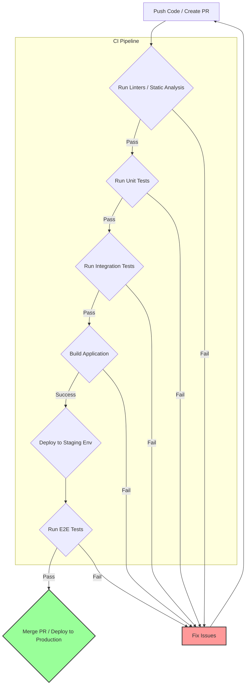

# Chapter 11: Comprehensive Frontend Testing Strategies

Robust testing is not merely a quality assurance activity; it's a fundamental pillar of sustainable frontend development, crucial for maintaining application stability, enabling confident refactoring, and ensuring a positive user experience. For senior frontend engineers, demonstrating a deep understanding of testing methodologies, tools, and strategies is non-negotiable during interviews. It signals maturity, a commitment to quality, and the ability to build and maintain complex, reliable systems.

This chapter delves into the multifaceted world of frontend testing, moving beyond basic unit tests to explore a comprehensive strategy encompassing various test types, libraries, and cultural practices. We'll examine how to choose the right tools for the job, write effective and maintainable tests, integrate testing into the development workflow, and foster a team culture where quality is paramount.

## A. The Testing Pyramid/Trophy Revisited for Modern Frontend

The concepts of the "Testing Pyramid" and the "Testing Trophy" provide valuable mental models for structuring a testing strategy.

- **The Traditional Testing Pyramid:** Proposed by Mike Cohn, it emphasizes a large base of fast, inexpensive unit tests, a smaller layer of integration tests, and a very small top layer of slow, expensive end-to-end (E2E) tests. The goal is to catch bugs as early and cheaply as possible.
- **The Testing Trophy:** Popularized by Kent C. Dodds, this model adapts the pyramid specifically for frontend development, placing greater emphasis on integration tests. It suggests a foundation of static analysis (linters, type checkers), a significant portion of integration tests that verify user interactions and component collaborations, a smaller base of unit tests for complex logic or utilities, and a cap of E2E tests for critical user flows.

```mermaid
graph TD
    subgraph Testing Pyramid (Traditional)
        E2E(End-to-End Tests)
        Integration(Integration Tests)
        Unit(Unit Tests)
    end

    subgraph Testing Trophy (Modern Frontend)
        E2E_Trophy(End-to-End Tests)
        Integration_Trophy(Integration Tests)
        Unit_Trophy(Unit Tests)
        Static(Static Analysis)
    end

    Unit --> Integration --> E2E
    Static --> Unit_Trophy --> Integration_Trophy --> E2E_Trophy

    style E2E fill:#f9f,stroke:#333,stroke-width:2px
    style Integration fill:#ccf,stroke:#333,stroke-width:2px
    style Unit fill:#9cf,stroke:#333,stroke-width:2px

    style E2E_Trophy fill:#f9f,stroke:#333,stroke-width:2px
    style Integration_Trophy fill:#ccf,stroke:#333,stroke-width:2px,stroke-dasharray: 5 5
    style Unit_Trophy fill:#9cf,stroke:#333,stroke-width:2px
    style Static fill:#cfc,stroke:#333,stroke-width:2px

```

_Diagram Explanation:_ This diagram visually contrasts the traditional Testing Pyramid with the modern Testing Trophy. The Trophy emphasizes Integration Tests more heavily and adds Static Analysis as a foundational layer, reflecting modern frontend practices where component interactions are crucial and static checks catch many errors early.

For senior candidates, the key isn't rigidly adhering to one model but understanding the _trade-offs_ associated with each test type (speed, cost, confidence, scope) and articulating a balanced strategy tailored to the specific application and team context. Modern frontend applications often benefit significantly from the Trophy's emphasis on integration tests, as much complexity lies in how components interact and respond to user events.

### 1. Unit Tests: Scope, Tools (Jest, Vitest, Mocha), Best Practices

Unit tests focus on isolating and verifying the smallest testable parts of an application (units) in isolation from their dependencies.

- **Scope:** Individual functions, methods, classes, or components tested independently. Dependencies are typically mocked or stubbed.
- **Goal:** Verify that a specific unit of code works correctly according to its contract or specification. They are fast, provide precise feedback, and encourage modular design.
- **Tools:**
  - **Jest:** A popular, "batteries-included" testing framework developed by Facebook. Features include a built-in test runner, assertion library, mocking support, snapshot testing, and code coverage reports. Widely used in the React ecosystem but framework-agnostic.
  - **Vitest:** A newer testing framework built on Vite. Offers a Jest-compatible API but leverages Vite's speed for near-instant test runs, especially in projects already using Vite. Excellent developer experience.
  - **Mocha:** A flexible, mature testing framework that provides the basic structure for running tests. Often paired with assertion libraries (like Chai) and mocking libraries (like Sinon.JS). Less opinionated than Jest/Vitest.

#### a. Testing Pure Functions, Utility Functions

This is the simplest form of unit testing. Pure functions always return the same output for the same input and have no side effects, making them easy to test.

```javascript
// utils/formatCurrency.js
export function formatCurrency(amount, currency = "USD") {
  if (typeof amount !== "number") {
    throw new Error("Amount must be a number.");
  }
  return new Intl.NumberFormat("en-US", { style: "currency", currency }).format(
    amount
  );
}

// utils/formatCurrency.test.js
import { formatCurrency } from "./formatCurrency";

describe("formatCurrency", () => {
  it("should format a number as USD currency by default", () => {
    expect(formatCurrency(1234.56)).toBe("$1,234.56");
  });

  it("should format a number with a specified currency (EUR)", () => {
    // Note: Formatting might differ slightly based on Node/ICU version,
    // consider locale 'de-DE' for more predictable EUR formatting if needed.
    expect(formatCurrency(500, "EUR")).toBe("€500.00");
  });

  it("should handle zero correctly", () => {
    expect(formatCurrency(0)).toBe("$0.00");
  });

  it("should throw an error if amount is not a number", () => {
    expect(() => formatCurrency("not a number")).toThrow(
      "Amount must be a number."
    );
  });
});
```

#### b. Testing UI Components (Rendering, Props, Basic Interaction) - Shallow vs. Full Render Tradeoffs

Testing UI components involves verifying they render correctly based on props and state, and respond appropriately to basic user interactions (often simulated).

- **Shallow Rendering:** Renders only the component itself, without rendering its child components deeply. Useful for isolating the component under test and avoiding dependencies on child component implementation. Tools like Enzyme (React, less common now) offered this. Modern approaches often favor full rendering with mocking.
  - _Pros:_ Faster, more isolated.
  - _Cons:_ Doesn't test integration with children, can lead to tests passing even if the component breaks when used with real children. Less representative of actual usage.
- **Full Rendering (Mounting):** Renders the component and its entire subtree of child components in a simulated DOM environment (like JSDOM). This is the approach favored by React Testing Library and similar libraries.
  - _Pros:_ Tests component integration, closer to how users interact with the component, encourages testing behavior over implementation.
  - _Cons:_ Can be slower, might require mocking more dependencies (e.g., context providers, child components making API calls).

**Modern Recommendation:** Favor full rendering with libraries like Testing Library, combined with strategic mocking where necessary. This provides higher confidence as it tests the component closer to its actual usage.

#### c. Mocking Dependencies (Modules, APIs, Timers, Globals) - Jest/Vitest Mocking API

Unit tests require isolation. Mocking replaces real dependencies (modules, API calls, browser globals like `localStorage`, timers like `setTimeout`) with controlled fakes (mocks, stubs, spies).

- **Jest/Vitest Mocking:** Provide powerful built-in functions:
  - `jest.fn()` / `vi.fn()`: Creates a basic mock function to track calls, arguments, and return values.
  - `jest.mock('moduleName')` / `vi.mock('moduleName')`: Automatically mocks all exports of a module. You can provide a factory function for custom mock implementations.
  - `jest.spyOn(object, 'methodName')` / `vi.spyOn(object, 'methodName')`: Similar to `jest.fn()`, but wraps an existing method, allowing you to track calls while retaining the original implementation (or replacing it). Useful for testing if a specific method was called.
  - **Timers:** `jest.useFakeTimers()` / `vi.useFakeTimers()` allows controlling `setTimeout`, `setInterval`, etc., enabling tests involving time without actually waiting.
  - **Globals:** Globals like `fetch` or `localStorage` can often be mocked by assigning `jest.fn()` or using `jest.spyOn(window.localStorage, 'setItem')`.

```javascript
// api/userService.js
export const fetchUserProfile = async (userId) => {
  const response = await fetch(`/api/users/${userId}`);
  if (!response.ok) {
    throw new Error('Failed to fetch user');
  }
  return response.json();
};

// components/UserProfile.js (Simplified React Example)
import React, { useState, useEffect } from 'react';
import { fetchUserProfile } from '../api/userService';

function UserProfile({ userId }) {
  const [user, setUser] = useState(null);
  const [error, setError] = useState(null);
  const [loading, setLoading] = useState(true);

  useEffect(() => {
    setLoading(true);
    setError(null);
    fetchUserProfile(userId)
      .then(data => setUser(data))
      .catch(err => setError(err.message))
      .finally(() => setLoading(false));
  }, [userId]);

  if (loading) return <div>Loading...</div>;
  if (error) return <div role="alert">Error: {error}</div>;
  if (!user) return null;

  return (
    <div>
      <h1>{user.name}</h1>
      <p>Email: {user.email}</p>
    </div>
  );
}
export default UserProfile;

// components/UserProfile.test.js (Using Jest/Vitest & RTL)
import React from 'react';
import { render, screen, waitFor } from '@testing-library/react';
import '@testing-library/jest-dom'; // For custom matchers
import UserProfile from './UserProfile';
import { fetchUserProfile } from '../api/userService'; // Import the function to mock

// Mock the entire userService module
jest.mock('../api/userService'); // Or vi.mock(...) for Vitest

// Cast the mocked function to JestMock type for type safety (optional but good practice)
const mockFetchUserProfile = fetchUserProfile as jest.MockedFunction<typeof fetchUserProfile>;

describe('UserProfile', () => {
  beforeEach(() => {
    // Reset mocks before each test
    mockFetchUserProfile.mockClear();
  });

  it('renders loading state initially', () => {
    mockFetchUserProfile.mockResolvedValueOnce({ name: 'Test User', email: 'test@example.com' });
    render(<UserProfile userId="123" />);
    expect(screen.getByText('Loading...')).toBeInTheDocument();
  });

  it('renders user data after successful fetch', async () => {
    const mockUser = { name: 'Alice', email: 'alice@example.com' };
    mockFetchUserProfile.mockResolvedValueOnce(mockUser);

    render(<UserProfile userId="456" />);

    // Wait for the loading state to disappear and user data to appear
    await waitFor(() => expect(screen.queryByText('Loading...')).not.toBeInTheDocument());

    expect(screen.getByRole('heading', { name: 'Alice' })).toBeInTheDocument();
    expect(screen.getByText(`Email: ${mockUser.email}`)).toBeInTheDocument();
    expect(mockFetchUserProfile).toHaveBeenCalledTimes(1);
    expect(mockFetchUserProfile).toHaveBeenCalledWith('456');
  });

  it('renders error state if fetch fails', async () => {
    const errorMessage = 'Failed to fetch user';
    mockFetchUserProfile.mockRejectedValueOnce(new Error(errorMessage));

    render(<UserProfile userId="789" />);

    await waitFor(() => expect(screen.queryByText('Loading...')).not.toBeInTheDocument());

    expect(screen.getByRole('alert')).toHaveTextContent(`Error: ${errorMessage}`);
    expect(mockFetchUserProfile).toHaveBeenCalledTimes(1);
    expect(mockFetchUserProfile).toHaveBeenCalledWith('789');
  });
});

```

#### d. [Code Snippet: Writing effective unit tests for a React/Vue/Angular component]

_(See the `UserProfile.test.js` example above for a React component unit test using Jest/Vitest and React Testing Library. The principles are similar for Vue/Angular, using their respective testing libraries)._

**Key Principles for Effective Unit Tests:**

- **Test one thing:** Each test case should verify a single piece of behavior or logic.
- **Arrange, Act, Assert (AAA):** Structure tests clearly: set up preconditions, execute the code under test, and assert the expected outcome.
- **Descriptive names:** Test descriptions (`it(...)` blocks) should clearly state what is being tested.
- **Avoid testing implementation details:** Focus on the component's public API (props) and observable behavior (rendered output, function calls).
- **Keep them fast:** Unit tests should run quickly to provide rapid feedback. Mock dependencies effectively.

### 2. Integration Tests: Scope, Tools (Testing Library, Cypress Component Testing)

Integration tests verify that multiple units (components, modules) work together as expected. In frontend, this often means testing interactions within a feature or page section.

- **Scope:** Interactions between several components, user flows within a part of the application (e.g., a form submission, a modal interaction), component rendering with real (or mocked service layer) dependencies.
- **Goal:** Ensure components collaborate correctly and that data flows properly between them. Provide higher confidence than unit tests alone, as they test closer to how the application is actually used.
- **Tools:**
  - **Testing Library (React/Vue/Angular/etc.):** A family of libraries designed to test UI components in a user-centric way. They render components into a simulated DOM and provide utilities to query and interact with the DOM based on accessibility attributes and user-visible text, rather than implementation details. _Primarily runs in Node.js via JSDOM._
  - **Cypress Component Testing:** Allows mounting and testing individual components within the real browser environment powered by Cypress. This offers the benefits of Cypress's tooling (time-travel debugging, real browser APIs) specifically for component-level integration testing.
  - **Playwright Component Testing:** Similar to Cypress, Playwright also offers experimental component testing capabilities, running tests in real browser contexts.

#### a. Testing Interactions Between Multiple Components

Example: Testing a list component where clicking an item highlights it and displays its details in a separate panel. The integration test would render both components, simulate a click on a list item, and assert that the correct details are shown in the panel.

#### b. Testing User Flows Within a Feature/Page Section

Example: Testing a multi-step form within a single page. The test would simulate filling out each step, clicking "Next," and finally submitting the form, verifying intermediate states and the final submission call.

#### c. Mocking API Responses (MSW - Mock Service Worker, Cypress Intercept)

Integration tests often need to interact with APIs. Instead of hitting real backends (which makes tests slow, flaky, and dependent on external services), we mock the API layer.

- **Mock Service Worker (MSW):** Intercepts actual network requests at the network level using Service Worker APIs (or Node adapters for Node test environments). Allows you to define mock responses for specific endpoints (`GET /api/users`, `POST /api/login`). Tests using MSW make _real_ `fetch` or `axios` calls, which are then intercepted, providing a very realistic testing environment without backend dependency. Highly recommended for integration tests.
- **Cypress `cy.intercept()`:** Cypress provides powerful network interception capabilities directly within the test runner. You can stub responses, wait for requests, assert on request/response details, and even modify requests on the fly. Excellent for both component and E2E tests run within Cypress.

#### d. [Practical Example: Writing an integration test for a login form using Testing Library]

```jsx
// components/LoginForm.js (Simplified React Example)
import React, { useState } from "react";

function LoginForm({ onSubmit }) {
  const [email, setEmail] = useState("");
  const [password, setPassword] = useState("");
  const [error, setError] = useState(null);
  const [loading, setLoading] = useState(false);

  const handleSubmit = async (event) => {
    event.preventDefault();
    setError(null);
    setLoading(true);
    try {
      await onSubmit({ email, password });
      // Success handling (e.g., redirect) would typically happen in the parent
    } catch (err) {
      setError(err.message || "Login failed");
    } finally {
      setLoading(false);
    }
  };

  return (
    <form onSubmit={handleSubmit}>
      {error && (
        <div role="alert" style={{ color: "red" }}>
          {error}
        </div>
      )}
      <div>
        <label htmlFor="email">Email:</label>
        <input
          type="email"
          id="email"
          value={email}
          onChange={(e) => setEmail(e.target.value)}
          required
        />
      </div>
      <div>
        <label htmlFor="password">Password:</label>
        <input
          type="password"
          id="password"
          value={password}
          onChange={(e) => setPassword(e.target.value)}
          required
        />
      </div>
      <button type="submit" disabled={loading}>
        {loading ? "Logging in..." : "Login"}
      </button>
    </form>
  );
}
export default LoginForm;

// components/LoginForm.integration.test.js (Using RTL & Jest/Vitest)
import React from "react";
import { render, screen, waitFor } from "@testing-library/react";
import userEvent from "@testing-library/user-event"; // For realistic event simulation
import "@testing-library/jest-dom";
import LoginForm from "./LoginForm";

describe("LoginForm Integration", () => {
  let mockSubmit; // Use jest.fn() to track calls

  beforeEach(() => {
    mockSubmit = jest.fn(); // Reset mock before each test
  });

  it("allows user to enter credentials and submit the form", async () => {
    // Arrange: Mock the onSubmit prop which likely handles the API call
    mockSubmit.mockResolvedValueOnce(); // Simulate successful login
    const user = userEvent.setup(); // Setup user-event
    render(<LoginForm onSubmit={mockSubmit} />);

    // Act: Simulate user typing and clicking
    await user.type(screen.getByLabelText(/email/i), "test@example.com");
    await user.type(screen.getByLabelText(/password/i), "password123");
    await user.click(screen.getByRole("button", { name: /login/i }));

    // Assert
    // Check if the submit handler was called with the correct credentials
    expect(mockSubmit).toHaveBeenCalledTimes(1);
    expect(mockSubmit).toHaveBeenCalledWith({
      email: "test@example.com",
      password: "password123",
    });

    // Check loading state during submission (optional but good)
    expect(
      screen.getByRole("button", { name: /logging in.../i })
    ).toBeDisabled();

    // Wait for submission to resolve (loading state to disappear)
    await waitFor(() => {
      expect(screen.getByRole("button", { name: /login/i })).toBeEnabled();
    });

    // Ensure no error message is displayed on success
    expect(screen.queryByRole("alert")).not.toBeInTheDocument();
  });

  it("displays an error message if submission fails", async () => {
    // Arrange: Mock the onSubmit prop to simulate a failed login
    const errorMessage = "Invalid credentials";
    mockSubmit.mockRejectedValueOnce(new Error(errorMessage));
    const user = userEvent.setup();
    render(<LoginForm onSubmit={mockSubmit} />);

    // Act
    await user.type(screen.getByLabelText(/email/i), "wrong@example.com");
    await user.type(screen.getByLabelText(/password/i), "wrongpassword");
    await user.click(screen.getByRole("button", { name: /login/i }));

    // Assert
    // Wait for the error message to appear
    await waitFor(() => {
      expect(screen.getByRole("alert")).toBeInTheDocument();
    });
    expect(screen.getByRole("alert")).toHaveTextContent(errorMessage);

    // Ensure the button is enabled again after failure
    expect(screen.getByRole("button", { name: /login/i })).toBeEnabled();
    expect(mockSubmit).toHaveBeenCalledTimes(1);
  });

  it("disables submit button while submitting", async () => {
    // Arrange: Use a promise that doesn't resolve immediately
    let resolveSubmit;
    const submitPromise = new Promise((resolve) => {
      resolveSubmit = resolve;
    });
    mockSubmit.mockImplementationOnce(() => submitPromise);

    const user = userEvent.setup();
    render(<LoginForm onSubmit={mockSubmit} />);

    // Act
    await user.type(screen.getByLabelText(/email/i), "test@example.com");
    await user.type(screen.getByLabelText(/password/i), "password123");
    await user.click(screen.getByRole("button", { name: /login/i }));

    // Assert: Button should be disabled immediately after click and show loading text
    expect(
      screen.getByRole("button", { name: /logging in.../i })
    ).toBeDisabled();

    // Clean up: Resolve the promise to avoid issues in test runner
    await resolveSubmit();
  });
});
```

#### e. [Deep Dive: Testing Library philosophy - testing like a user]

The core philosophy of Testing Library (RTL, VTL, ATL, etc.) is:

> "The more your tests resemble the way your software is used, the more confidence they can give you." - Kent C. Dodds

This means:

1.  **Interact with the UI as a user would:** Query elements based on what users see (text content, labels, roles, placeholders) or interact with (buttons, links, form fields). Avoid querying based on implementation details like CSS classes, internal state, or component instance methods.
2.  **Focus on accessible elements:** Queries like `getByRole`, `getByLabelText`, `getByPlaceholderText` encourage building more accessible applications. If it's hard to query an element with Testing Library, it might be hard for users (especially those using assistive technologies) to interact with it.
3.  **Don't test implementation details:** Avoid asserting on component state or props directly. Instead, assert on the _result_ of state/prop changes (i.e., what the user sees in the DOM). This makes tests less brittle and allows for easier refactoring of component internals without breaking tests.
4.  **Test behavior, not structure:** Verify that clicking a button triggers the expected _outcome_ (e.g., displaying a message, calling a function), not just that the button's internal `onClick` handler was called (which is an implementation detail better suited for a unit test if that handler has complex logic).

Adopting this philosophy leads to tests that provide higher confidence in the user experience and are more resilient to code changes.

### 3. End-to-End (E2E) Tests: Scope, Tools (Cypress, Playwright, Selenium)

E2E tests simulate real user scenarios from start to finish, interacting with the application through the UI just like a user would. They typically involve both the frontend and the backend.

- **Scope:** Complete user journeys across multiple pages and features, including interactions with backend APIs (real or staged). Examples: User registration flow, adding items to a cart and checking out, searching for a product and viewing details.
- **Goal:** Verify that the entire system works together correctly from the user's perspective. Catch integration issues between frontend, backend, databases, and potentially third-party services.
- **Tools:**
  - **Cypress:** A modern, all-in-one E2E testing framework known for its excellent developer experience, fast execution (within the browser), time-travel debugging, automatic waiting, and network request control. Runs tests directly in the browser alongside the application.
  - **Playwright:** Developed by Microsoft (with key contributors from the original Puppeteer team), Playwright is another powerful E2E framework. It supports multiple browsers (Chromium, Firefox, WebKit) with a single API, offers auto-waits, network interception, and features like parallel execution and browser contexts for isolation. Runs tests externally, controlling the browser.
  - **Selenium:** The long-standing standard for browser automation. Highly flexible and supports numerous languages and browsers. Can be more complex to set up and maintain compared to Cypress/Playwright, and tests can sometimes be more flaky if not written carefully. Often used in larger organizations with existing infrastructure.

#### a. Testing Critical User Journeys Across the Application (Frontend + Backend)

Identify the most critical paths users take through your application – the "happy paths" for core features that absolutely _must_ work. These are the prime candidates for E2E tests. Examples:

- Login/Logout
- Core feature usage (e.g., creating a post, booking a flight, completing a purchase)
- Registration/Onboarding
- Password Reset

Avoid testing every single edge case or UI detail with E2E tests; reserve those for unit or integration tests. E2E tests are the most expensive to write, run, and maintain.

#### b. Strategies for Stable and Reliable E2E Tests (Waiting Strategies, Selectors Best Practices)

Flakiness is the enemy of E2E testing. Common causes include timing issues (tests running faster than the UI updates) and brittle selectors (tests breaking due to minor UI code changes).

- **Waiting Strategies:**
  - **Implicit Waits (Built-in):** Cypress and Playwright have built-in automatic waiting. They automatically wait for elements to exist, become visible, become actionable, etc., before interacting with them. Rely on this as much as possible.
  - **Explicit Waits:** Avoid fixed waits (`cy.wait(1000)`, `page.waitForTimeout(1000)`) unless absolutely necessary. They slow down tests and are inherently flaky.
  - **Waiting for Network Requests:** Use `cy.intercept()` (Cypress) or `page.waitForResponse()` / `page.waitForRequest()` (Playwright) to wait for specific API calls to complete before proceeding. This is much more reliable than waiting for arbitrary UI changes.
  - **Waiting for UI State:** Wait for specific text to appear/disappear, an element to gain/lose an attribute (like `disabled`), or a specific number of elements to be present.
- **Selectors Best Practices:**
  - **User-Facing Attributes:** Prioritize selectors that users interact with: `getByRole`, `getByText`, `getByLabelText` (similar to Testing Library, often available via plugins like `cypress-testing-library` or built-in Playwright locators).
  - **Test IDs:** Add dedicated `data-testid` (or `data-cy`, `data-test`) attributes to elements specifically for testing purposes. This decouples tests from CSS classes or text content that might change. Use them judiciously for elements that are hard to select otherwise.
    ```html
    <button data-testid="login-submit-button">Login</button>
    ```
    ```javascript
    // Cypress
    cy.get('[data-testid="login-submit-button"]').click();
    // Playwright
    await page.locator('[data-testid="login-submit-button"]').click();
    ```
  - **Avoid:** Selectors based on volatile CSS classes, complex XPath/CSS selectors tied to DOM structure, or generated class names/IDs.

#### c. Handling Authentication, Test Data Setup, and Environment Management

- **Authentication:**
  - **Programmatic Login:** The most common and efficient approach. Use API calls within your test setup (`beforeEach` hook) to log in a test user directly, bypassing the UI login form. Store the session token/cookie and set it in the browser context for subsequent tests.
  - **UI Login:** Log in via the UI once per test suite (or spec file) using `beforeEach` or `beforeAll`, potentially preserving the session across tests (Cypress `session()`, Playwright session storage). Slower but tests the login flow itself.
  - **Avoid:** Logging in via the UI before _every single test_. It's extremely slow and inefficient.
- **Test Data Setup:**
  - **API Seeding:** Use API endpoints (potentially dedicated test endpoints) to create necessary data (e.g., users, products) before a test runs and clean it up afterwards (`afterEach`).
  - **Database Manipulation:** Directly manipulate the test database (if accessible) to set up state. Requires careful management.
  - **UI Creation:** Create data via the UI as part of the test flow. Generally slowest and most brittle; use only when testing the creation flow itself.
- **Environment Management:**
  - Run E2E tests against dedicated testing or staging environments, not production.
  - Ensure the test environment has predictable data and state, possibly resetting it periodically.
  - Use environment variables (`CYPRESS_BASE_URL`, `PLAYWRIGHT_TEST_BASE_URL`) to configure the target URL and other environment-specific settings.

#### d. [Configuration Guide: Setting up a basic E2E test suite with Cypress/Playwright]

**Cypress (Basic Setup):**

1.  **Install:** `npm install cypress --save-dev` or `yarn add cypress --dev`
2.  **Open:** `npx cypress open` (or `yarn cypress open`). This launches the Cypress app, which guides you through creating configuration files (`cypress.config.js`) and example tests.
3.  **Configure `cypress.config.js`:**

    ```javascript
    const { defineConfig } = require("cypress");

    module.exports = defineConfig({
      e2e: {
        baseUrl: "http://localhost:3000", // Your app's dev server URL
        supportFile: "cypress/support/e2e.js", // For custom commands, global setup
        specPattern: "cypress/e2e/**/*.cy.{js,jsx,ts,tsx}", // Where tests live
        setupNodeEvents(on, config) {
          // implement node event listeners here
          // e.g., for tasks, plugins
        },
        // Viewport size, video recording, etc.
        viewportWidth: 1280,
        viewportHeight: 720,
        video: false, // Disable video recording for faster local runs
      },
      // Component testing config would go here if used
      // component: { ... }
    });
    ```

4.  **Write a Test (`cypress/e2e/login.cy.js`):**

    ```javascript
    describe("Login Flow", () => {
      beforeEach(() => {
        // Visit the login page before each test in this block
        cy.visit("/login"); // Assumes baseUrl is set
      });

      it("should display validation errors for empty fields", () => {
        cy.get('[data-testid="login-submit-button"]').click();
        // Assertions for validation messages would go here
        cy.contains("Email is required").should("be.visible"); // Example assertion
      });

      it("should allow login with valid credentials", () => {
        // Example using test IDs
        cy.get('[data-testid="email-input"]').type("test@example.com");
        cy.get('[data-testid="password-input"]').type("password123");
        cy.get('[data-testid="login-submit-button"]').click();

        // Assert successful login (e.g., redirect to dashboard)
        cy.url().should("include", "/dashboard");
        cy.contains("Welcome, test@example.com").should("be.visible");
      });

      it("should show error message with invalid credentials", () => {
        // Intercept the login API call to simulate failure
        cy.intercept("POST", "/api/login", {
          statusCode: 401,
          body: { message: "Invalid credentials" },
        }).as("loginRequest"); // Give the intercept an alias

        cy.get('[data-testid="email-input"]').type("invalid@example.com");
        cy.get('[data-testid="password-input"]').type("wrongpassword");
        cy.get('[data-testid="login-submit-button"]').click();

        // Wait for the intercepted request to complete
        cy.wait("@loginRequest");

        // Assert error message is shown
        cy.get('[data-testid="login-error-message"]').should(
          "contain.text",
          "Invalid credentials"
        );
        cy.url().should("not.include", "/dashboard"); // Ensure no redirect
      });
    });
    ```

5.  **Run:** Use `npx cypress open` (interactive mode) or `npx cypress run` (headless mode, for CI).

**Playwright (Basic Setup):**

1.  **Install:** `npm init playwright@latest` (or `yarn create playwright`). This interactive command installs Playwright, browser binaries, sets up a config file (`playwright.config.js`), and creates example tests.
2.  **Configure `playwright.config.js`:**

    ```javascript
    // playwright.config.js
    import { defineConfig, devices } from "@playwright/test";

    export default defineConfig({
      testDir: "./tests", // Directory where tests live
      fullyParallel: true, // Run tests in parallel
      forbidOnly: !!process.env.CI, // Fail build if test.only is committed
      retries: process.env.CI ? 2 : 0, // Retry on failure in CI
      workers: process.env.CI ? 1 : undefined, // Limit workers in CI if needed
      reporter: "html", // Generate HTML report after tests run
      use: {
        baseURL: "http://localhost:3000", // Base URL for actions like page.goto('/')
        trace: "on-first-retry", // Record trace on first retry of failed tests
      },
      projects: [
        // Configure browsers
        {
          name: "chromium",
          use: { ...devices["Desktop Chrome"] },
        },
        // {
        //   name: 'firefox',
        //   use: { ...devices['Desktop Firefox'] },
        // },
        // {
        //   name: 'webkit',
        //   use: { ...devices['Desktop Safari'] },
        // },
      ],
      // webServer: { // Optional: Command to start dev server before tests
      //   command: 'npm run start',
      //   url: 'http://localhost:3000',
      //   reuseExistingServer: !process.env.CI,
      // },
    });
    ```

3.  **Write a Test (`tests/login.spec.ts`):**

    ```typescript
    import { test, expect } from "@playwright/test";

    test.describe("Login Flow", () => {
      test.beforeEach(async ({ page }) => {
        // Visit the login page before each test
        await page.goto("/login");
      });

      test("should display validation errors for empty fields", async ({
        page,
      }) => {
        await page.locator('[data-testid="login-submit-button"]').click();
        // Assertions using Playwright's expect and locators
        await expect(page.locator("text=Email is required")).toBeVisible(); // Example
      });

      test("should allow login with valid credentials", async ({ page }) => {
        await page
          .locator('[data-testid="email-input"]')
          .fill("test@example.com");
        await page
          .locator('[data-testid="password-input"]')
          .fill("password123");
        await page.locator('[data-testid="login-submit-button"]').click();

        // Assert successful login (e.g., URL change, welcome message)
        await expect(page).toHaveURL(/.*dashboard/);
        await expect(
          page.locator("text=Welcome, test@example.com")
        ).toBeVisible();
      });

      test("should show error message with invalid credentials", async ({
        page,
      }) => {
        // Intercept the login API call
        await page.route("**/api/login", async (route) => {
          await route.fulfill({
            status: 401,
            contentType: "application/json",
            body: JSON.stringify({ message: "Invalid credentials" }),
          });
        });

        await page
          .locator('[data-testid="email-input"]')
          .fill("invalid@example.com");
        await page
          .locator('[data-testid="password-input"]')
          .fill("wrongpassword");
        await page.locator('[data-testid="login-submit-button"]').click();

        // Assert error message is shown
        await expect(
          page.locator('[data-testid="login-error-message"]')
        ).toHaveText("Invalid credentials");
        await expect(page).not.toHaveURL(/.*dashboard/); // Ensure no redirect
      });
    });
    ```

4.  **Run:** `npx playwright test` (runs all tests headlessly), `npx playwright test --ui` (opens UI mode), `npx playwright show-report` (opens the HTML report).

### 4. Visual Regression Testing (Percy, Chromatic, Playwright Visual Comparisons)

Visual Regression Testing (VRT) captures screenshots of UI components or pages and compares them against baseline images to detect unintended visual changes (styling, layout).

- **Goal:** Catch visual bugs that might not affect functionality but impact user experience or brand consistency. Useful for CSS refactoring, component library updates, or ensuring cross-browser visual consistency.
- **Tools:**
  - **Percy:** A popular commercial VRT platform. Integrates with various testing frameworks (Cypress, Playwright, Storybook, etc.). Uploads snapshots, performs smart diffing in the cloud, and provides a UI for reviewing changes.
  - **Chromatic:** Developed by the Storybook team, primarily focused on VRT for Storybook components. Offers similar features to Percy (cloud diffing, review workflow) tightly integrated with Storybook.
  - **Playwright Visual Comparisons:** Playwright has built-in visual comparison assertions (`expect(page).toHaveScreenshot()`). It manages baseline images locally and performs pixel-by-pixel diffing. Requires manual management of baseline images across different environments/OS.
  - **Applitools:** Another powerful commercial visual testing platform using AI for smarter comparisons (less sensitive to minor rendering differences).
- **Integration:** VRT is often integrated into CI pipelines. Tests fail if visual differences exceeding a certain threshold are detected, prompting manual review and approval/rejection of the changes.
- **Challenges:** Managing baselines, handling dynamic content (e.g., dates, animations), dealing with minor anti-aliasing differences across environments. Modern tools often have features to mitigate these issues (e.g., ignoring specific regions, threshold adjustments).

### 5. Accessibility Testing Integration (axe-core, Jest Axe, Cypress Axe)

Ensuring web accessibility (a11y) is crucial for inclusivity and often a legal requirement. Automated accessibility testing can catch common violations early.

- **Goal:** Identify violations of Web Content Accessibility Guidelines (WCAG) standards (e.g., missing alt text, insufficient color contrast, improper ARIA attribute usage).
- **Core Engine:** **axe-core** (by Deque Systems) is the de facto standard accessibility testing engine. It's used by browser extensions and integrated into various testing tools.
- **Integration Tools:**

  - **`jest-axe`:** Integrates axe-core into Jest/Vitest tests. Allows you to run accessibility checks on rendered components within unit/integration tests.

    ```javascript
    // In a Jest/Vitest test using Testing Library
    import { render } from "@testing-library/react";
    import { axe, toHaveNoViolations } from "jest-axe";
    import MyComponent from "./MyComponent";

    expect.extend(toHaveNoViolations); // Extend Jest matchers

    it("should have no accessibility violations", async () => {
      const { container } = render(<MyComponent />); // Render the component
      const results = await axe(container); // Run axe on the rendered DOM
      expect(results).toHaveNoViolations(); // Assert no violations found
    });
    ```

  - **`cypress-axe`:** Integrates axe-core into Cypress E2E tests. Allows checking entire pages or specific components during test runs.
    ```javascript
    // In a Cypress test
    describe("Accessibility Checks", () => {
      it("should have no detectable a11y violations on the homepage", () => {
        cy.visit("/");
        cy.injectAxe(); // Inject the axe-core runtime
        // Check the entire page, logging violations to the console
        cy.checkA11y(null, null, null, true);
        // Or check specific elements: cy.checkA11y('.main-content');
      });
    });
    ```
  - **Playwright:** Can inject and run axe-core manually or use community packages (`@axe-core/playwright`).

- **Limitations:** Automated tools can only catch a subset (~30-50%) of WCAG issues. Manual testing (including screen reader testing, keyboard navigation) is still essential for comprehensive accessibility compliance. However, automated checks are invaluable for catching low-hanging fruit and preventing regressions.

### 6. Performance Testing Integration (Lighthouse CI, Custom Performance Assertions)

While backend performance is critical, frontend performance significantly impacts user perception and Core Web Vitals (CWV). Integrating performance checks into the workflow helps prevent regressions.

- **Goal:** Monitor key performance metrics (LCP, FID/INP, CLS, TTI, bundle sizes) and assert against performance budgets to prevent regressions.
- **Tools & Techniques:**

  - **Lighthouse CI:** Automates running Google Lighthouse audits against your application during CI/CD. You can configure it to assert that scores (Performance, Accessibility, Best Practices, SEO) or specific metrics (like LCP) don't drop below defined thresholds.
    ```yaml
    # Example GitHub Action using Lighthouse CI
    name: Lighthouse CI
    on: [push]
    jobs:
      lighthouse:
        runs-on: ubuntu-latest
        steps:
          - uses: actions/checkout@v3
          - name: Use Node.js 18.x
            uses: actions/setup-node@v3
            with:
              node-version: 18.x
          - name: Install dependencies
            run: npm ci
          - name: Build production assets
            run: npm run build
          # Install Lighthouse CI CLI
          - name: Install Lighthouse CI
            run: npm install -g @lhci/cli@0.12.x
          # Start a server for the built app (adjust command as needed)
          - name: Start server
            run: npm run start:prod & # Run in background
            env:
              PORT: 8080 # Ensure LHCI knows the port
          # Run Lighthouse CI
          - name: Run Lighthouse CI
            run: lhci autorun --upload.target=temporary-public-storage --collect.staticDistDir=./dist # Or use --collect.url=http://localhost:8080
            # Add assertion config in lighthouserc.js
    ```
    ```javascript
    // lighthouserc.js (Configuration for Lighthouse CI assertions)
    module.exports = {
      ci: {
        collect: {
          // Option 1: Point to static build output
          staticDistDir: "./dist",
          // Option 2: Point to running server URLs
          // url: ['http://localhost:8080/'],
          // startServerCommand: 'npm run start:prod',
        },
        assert: {
          preset: "lighthouse:recommended", // Start with recommended defaults
          assertions: {
            // Assert specific metrics don't exceed budgets
            "largest-contentful-paint": ["warn", { maxNumericValue: 2500 }], // ms
            "cumulative-layout-shift": ["warn", { maxNumericValue: 0.1 }],
            interactive: ["warn", { maxNumericValue: 3800 }], // Time to Interactive (ms)
            // Assert overall category scores
            "categories:performance": ["error", { minScore: 0.8 }], // Fail build if perf score < 0.8
            "categories:accessibility": ["warn", { minScore: 0.9 }],
            // Disable specific audits if needed
            "uses-long-cache-ttl": "off",
          },
        },
        upload: {
          target: "temporary-public-storage", // Or configure persistent storage
        },
      },
    };
    ```
  - **Custom Performance Assertions:** Within E2E tests (Cypress/Playwright), you can use the browser's Performance API (`performance.mark`, `performance.measure`, `PerformanceObserver`) to measure specific user interactions or rendering times and assert they are within acceptable limits.

    ```javascript
    // Example in Cypress
    it("should load product details within 500ms", () => {
      cy.visit("/products/123");
      cy.window()
        .its("performance")
        .then((performance) => {
          performance.mark("details-start");
        });

      // Wait for a key element of the details to be visible
      cy.get('[data-testid="product-title"]').should("be.visible");

      cy.window()
        .its("performance")
        .then((performance) => {
          performance.mark("details-end");
          performance.measure(
            "product-details-load",
            "details-start",
            "details-end"
          );
          const measure = performance.getEntriesByName(
            "product-details-load"
          )[0];
          expect(measure.duration).to.be.lessThan(500); // Assert duration < 500ms
        });
    });
    ```

  - **Bundle Size Analysis:** Tools like `webpack-bundle-analyzer` or `source-map-explorer` help visualize bundle composition. Integrate checks into CI (e.g., using `bundlesize` or custom scripts) to fail builds if bundle sizes exceed predefined budgets.

- **Context:** Performance testing in CI provides a baseline and catches regressions. It doesn't replace Real User Monitoring (RUM) or more in-depth profiling, but it's a valuable part of a comprehensive quality strategy.

## B. Testing Libraries and Frameworks In-Depth

Choosing and mastering the right testing tools is essential for efficiency and effectiveness.

### 1. Jest/Vitest: Configuration, Matchers, Mocking API, Snapshot Testing (Use Cases and Pitfalls)

Jest and Vitest are dominant forces in JavaScript unit and integration testing, especially within Node.js environments (like JSDOM).

- **Configuration (`jest.config.js` / `vite.config.ts`):**
  - `testEnvironment`: Typically `jsdom` for frontend tests needing a simulated DOM, or `node` for backend/utility tests.
  - `setupFilesAfterEnv`: Specifies files to run after the test environment is set up (e.g., to import `jest-dom` matchers, configure Testing Library).
  - `moduleNameMapper`: Maps module paths (e.g., for CSS Modules, aliases).
  - `transform`: Configures how different file types (TS, JSX, CSS) are processed before testing. (Vitest often handles this automatically via Vite's pipeline).
  - `collectCoverage`: Enables code coverage reporting.
  - `coverageThreshold`: Sets minimum coverage percentages required for tests to pass.
- **Matchers:** Provide assertion functions (`expect(value).toBe(...)`, `.toEqual(...)`, `.toHaveBeenCalledWith(...)`, etc.). Libraries like `jest-dom` add custom matchers for DOM assertions (`.toBeInTheDocument()`, `.toHaveAttribute()`, `.toHaveClass()`).
- **Mocking API:** (Covered in A.1.c) Essential for isolating units. Key functions: `jest.fn()`/`vi.fn()`, `jest.mock()`/`vi.mock()`, `jest.spyOn()`/`vi.spyOn()`.
- **Snapshot Testing:**
  - **How it works:** Renders a component (or serializes a data structure) and stores the output in a `.snap` file (the "snapshot"). Subsequent test runs compare the new output to the stored snapshot. If they differ, the test fails, prompting the developer to either update the snapshot (if the change was intentional) or fix the code.
  - **Use Cases:**
    - Verifying the structure of complex UI components that don't change often.
    - Testing the output of serializers or data transformations.
    - Catching unexpected changes in large object structures (e.g., API responses, Redux state).
  - **Pitfalls:**
    - **Brittleness:** Snapshots can break easily due to minor, unrelated changes (e.g., adding a wrapper `div`, changing a class name).
    - **"Snapshot Approval Fatigue":** Developers may blindly approve snapshot changes without carefully reviewing them, defeating the purpose.
    - **Lack of Intent:** Snapshots verify _what_ was rendered, but not _why_ or _if it's correct_ according to requirements. They don't test behavior well.
    - **Large Snapshots:** Can become difficult to review and bloat the repository.
  - **Recommendation:** Use snapshot tests sparingly and intentionally. Prefer explicit assertions for specific attributes or text content when possible. They are best used as a safety net for large, stable structures, not as the primary way to test component logic or behavior. Consider inline snapshots (`.toMatchInlineSnapshot()`) for smaller, more focused snapshots stored directly within the test file.

### 2. React Testing Library / Vue Testing Library / Angular Testing Library

These libraries, built on top of `dom-testing-library`, provide framework-specific utilities while adhering to the user-centric testing philosophy.

#### a. Philosophy: Testing User Behavior, Not Implementation Details

(Covered in A.2.e) The core idea is to interact with components via queries and events that mirror how a user would, ensuring tests are resilient to refactoring and provide confidence in the actual user experience.

#### b. Queries (`getBy`, `findBy`, `queryBy`), User Event Simulation (`user-event`)

- **Query Types:**
  - `getBy*`: Finds a single matching element. Throws an error if no element or more than one element is found. Use when you expect the element to be present.
  - `queryBy*`: Finds a single matching element. Returns `null` if no element is found, throws if multiple are found. Use when asserting an element is _not_ present.
  - `findBy*`: Finds a single matching element. Returns a promise that resolves when the element is found or rejects after a timeout (useful for async operations). Throws if multiple are found.
  - `getAllBy*`, `queryAllBy*`, `findAllBy*`: Variants that find _multiple_ matching elements and return an array.
- **Query Variants (Examples):**
  - `ByRole`: Queries based on ARIA roles (most preferred). `getByRole('button', { name: /submit/i })`
  - `ByLabelText`: Finds form elements associated with a label. `getByLabelText('Username')`
  - `ByPlaceholderText`: Finds elements by placeholder. `getByPlaceholderText('Enter your email')`
  - `ByText`: Finds elements by their text content. `getByText('Welcome Back!')`
  - `ByDisplayValue`: Finds form elements by their current value. `getByDisplayValue('Initial Value')`
  - `ByAltText`: Finds images by alt text. `getByAltText('Company Logo')`
  - `ByTitle`: Finds elements by title attribute. `getByTitle('Close')`
  - `ByTestId`: Finds elements by `data-testid`. `getByTestId('user-profile-card')` (Use as a last resort).
- **`@testing-library/user-event`:** A companion library providing more realistic event simulation than the built-in `fireEvent`. It simulates full user interactions (including focus changes, keyboard events corresponding to clicks, typing sequences). **Always prefer `userEvent` over `fireEvent` for simulating user actions.**

  ```javascript
  import userEvent from "@testing-library/user-event";

  // Simulate typing into an input
  await userEvent.type(screen.getByLabelText("Name"), "John Doe");

  // Simulate clicking a button
  await userEvent.click(screen.getByRole("button", { name: "Save" }));

  // Simulate clearing an input
  await userEvent.clear(screen.getByLabelText("Search"));
  ```

#### c. Async Utilities (`waitFor`, `findBy*`)

Testing asynchronous behavior (like data fetching) requires waiting for the UI to update.

- `findBy*` Queries: As mentioned, these return promises and automatically use `waitFor` internally. Ideal for waiting for a specific element to appear after an async action.
  ```javascript
  // Waits for the user heading to appear after data fetch
  const heading = await screen.findByRole("heading", { name: /Alice/i });
  expect(heading).toBeInTheDocument();
  ```
- `waitFor`: A general-purpose utility to wait for expectations within its callback to pass. Useful when waiting for something other than a single element's appearance (e.g., an element to disappear, multiple elements to update, a mock function to be called).

  ```javascript
  await userEvent.click(screen.getByRole("button", { name: "Delete" }));

  // Wait for the confirmation modal to disappear
  await waitFor(() => {
    expect(screen.queryByRole("dialog")).not.toBeInTheDocument();
  });

  // Wait for the delete API mock to have been called
  await waitFor(() => {
    expect(mockDeleteApi).toHaveBeenCalledTimes(1);
  });
  ```

- **Avoid `act` directly:** Testing Library's `render`, `fireEvent`, and `userEvent` utilities generally wrap updates in `act` automatically. You usually don't need to import and use `act` from React/Vue/etc. directly unless doing something highly unusual. Rely on `findBy*` and `waitFor`.

#### d. Testing Custom Hooks / Composables

For React Hooks or Vue Composables that contain non-trivial logic, you might want to test them in isolation.

- **React:** Use the `renderHook` utility (originally from `@testing-library/react-hooks`, now built into `@testing-library/react` itself). It allows you to render a hook within a minimal test component and test its return values and updates.

  ```javascript
  // useCounter.js (React Hook)
  import { useState, useCallback } from "react";
  function useCounter(initialValue = 0) {
    const [count, setCount] = useState(initialValue);
    const increment = useCallback(() => setCount((c) => c + 1), []);
    const decrement = useCallback(() => setCount((c) => c - 1), []);
    return { count, increment, decrement };
  }

  // useCounter.test.js
  import { renderHook, act } from "@testing-library/react";
  import { useCounter } from "./useCounter";

  describe("useCounter", () => {
    it("should initialize with initialValue or 0", () => {
      const { result } = renderHook(() => useCounter(5));
      expect(result.current.count).toBe(5);

      const { result: result2 } = renderHook(() => useCounter());
      expect(result2.current.count).toBe(0);
    });

    it("should increment the count", () => {
      const { result } = renderHook(() => useCounter());
      act(() => {
        result.current.increment();
      });
      expect(result.current.count).toBe(1);
    });

    it("should decrement the count", () => {
      const { result } = renderHook(() => useCounter(3));
      act(() => {
        result.current.decrement();
      });
      expect(result.current.count).toBe(2);
    });
  });
  ```

- **Vue:** Similar approaches exist. You can often test composables by simply calling them within the `setup` function of a test component rendered using Vue Testing Library, or use utilities designed for testing composables if needed. The key is to invoke the composable and assert on its returned reactive state or methods.

**Note:** While testing hooks/composables in isolation can be useful for complex logic, remember that Testing Library encourages testing behavior. Often, it's sufficient (and provides more confidence) to test the hook's functionality indirectly through the component(s) that use it.

### 3. Cypress/Playwright: Architecture, Commands, Assertions, Plugins, Test Runner Features

These are powerful E2E (and increasingly, component) testing frameworks that run tests in real browsers.

- **Architecture:**
  - **Cypress:** Runs _within_ the same browser event loop as the application under test. This gives it direct access to the DOM, network traffic, `window` object, etc., enabling fast execution and reliable interaction. It uses a Node.js server process in the background for tasks requiring OS access (screenshots, file system).
  - **Playwright:** Runs _outside_ the browser, controlling it via the browser's debugging protocol (similar to Puppeteer). This architecture allows it to control multiple browser types (Chromium, Firefox, WebKit) consistently and enables features like multi-origin testing and parallel execution across different browser contexts more easily.
- **Commands & Assertions:**
  - **Cypress:** Uses a chained command structure (`cy.visit(...).get(...).type(...).should(...)`). Commands are asynchronous and queued. `.should(...)` is used for assertions, automatically retrying until the assertion passes or times out.
  - **Playwright:** Uses standard `async/await` syntax with methods on the `page` or `locator` objects (`await page.goto(...)`, `await page.locator(...).fill(...)`, `await expect(locator).toBeVisible()`). Assertions use the separate `expect` object, which also includes auto-retrying capabilities.
- **Plugins/Extensibility:**
  - **Cypress:** Has a rich plugin ecosystem. Plugins can modify Cypress behavior, add custom commands (`cypress-testing-library`, `cypress-axe`), integrate with reporting tools, or perform tasks in the Node.js process (`setupNodeEvents`).
  - **Playwright:** Also extensible. Configuration options allow setting up global setup/teardown, custom reporters, and using third-party libraries. Its architecture sometimes requires different approaches to plugin tasks compared to Cypress.
- **Test Runner Features:**
  - **Time Travel Debugging:** (Cypress GUI, Playwright Trace Viewer) Allows stepping back through test execution, inspecting DOM snapshots, console logs, and network requests at each step. Invaluable for debugging failed tests.
  - **Interactive Mode / UI Mode:** Both offer graphical interfaces for running tests selectively, viewing execution live, and debugging.
  - **Automatic Waiting:** Both automatically wait for elements to be ready before interacting, reducing flakiness.
  - **Network Interception:** (Covered in A.2.c & A.3.b) `cy.intercept()`, `page.route()` provide powerful control over network requests.
  - **Screenshots & Videos:** Both can automatically capture screenshots on failure and record videos of test runs.
  - **Parallelization:** Both support running tests in parallel to speed up execution, especially in CI. Playwright has particularly strong built-in support for parallel execution across workers and projects.

#### a. Time Travel Debugging and Developer Experience

This is a standout feature of modern E2E tools.

- **Cypress:** The interactive runner (`cypress open`) shows a command log. Clicking on a command reveals a DOM snapshot of the application _at that exact moment_, along with console logs and network request details.
- **Playwright:** The Trace Viewer (`npx playwright show-trace trace.zip`) provides a similar experience. It records a detailed trace (DOM snapshots, actions, network logs, console messages) which can be explored after the test run. Traces can be configured to record on failure, on first retry, or always.

This capability drastically reduces the time spent debugging E2E test failures compared to traditional methods involving adding logs or pauses.

#### b. Network Request Stubbing/Spying/Modification

Being able to control network requests is crucial for reliable and fast E2E/integration tests.

- **Stubbing:** Provide predefined responses to specific API calls (`cy.intercept('GET', '/api/users', { fixture: 'users.json' })`, `page.route('**/api/users', route => route.fulfill({ json: [...] }))`). Isolates the frontend from backend issues or variability.
- **Spying:** Assert that specific requests were made, checking their URL, method, headers, or body (`cy.wait('@alias').its('request.body').should('deep.equal', {...})`, Playwright's `waitForRequest` or inspecting intercepted `route` objects).
- **Modification:** Change requests or responses on the fly. Less common, but can be useful for testing specific edge cases or error handling.

#### c. Best Practices for Selectors (Avoiding Brittle Tests)

(Reiteration/Emphasis of A.3.b)

1.  **`data-testid` (or similar):** The most robust way to target elements specifically for testing. Decouples tests from implementation details (CSS, text).
2.  **User-Facing Attributes:** Use selectors based on roles, text, labels, placeholders when `data-testid` isn't practical or when you specifically want to test from the user's perspective (plugins like `cypress-testing-library` help here).
3.  **Stable Attributes:** If necessary, use stable, semantic attributes like `id` (if unique and unlikely to change) or `name`.
4.  **Avoid:** CSS classes meant purely for styling, complex DOM traversal (`.parent > div:nth-child(3)`), or relying on generated class names.

#### d. Component Testing Capabilities

Both Cypress and Playwright now offer component testing features, blurring the lines between traditional integration testing tools (like Testing Library running in JSDOM) and E2E tools.

- **How it works:** They mount your components (React, Vue, Angular, etc.) directly within a real browser controlled by the test runner, bypassing the need for JSDOM.
- **Benefits:**
  - Tests run in a real browser environment, eliminating inconsistencies from JSDOM limitations (layout, certain APIs).
  - Leverages the E2E tool's powerful features (time-travel debugging, network interception, visual testing) directly for component tests.
  - Can be faster to set up if you're already using the tool for E2E tests.
- **Trade-offs:**
  - Can be slightly slower than JSDOM-based tests for pure unit/integration logic due to browser overhead.
  - Might require framework-specific adapters or configurations.
- **Use Case:** Excellent for integration tests involving complex component interactions, CSS layout testing, or components relying heavily on browser APIs not perfectly simulated by JSDOM. It complements, rather than completely replaces, JSDOM-based testing with Testing Library.

## C. Test Strategy and Culture

Having the right tools is only part of the equation. A successful testing approach requires a clear strategy and a supportive team culture.

### 1. Defining Test Coverage Goals (Line, Branch, Function - and their limitations)

Test coverage metrics measure how much of your production code is executed by your tests. Tools like Jest, Vitest, and `nyc` (used with Mocha) generate coverage reports.

- **Types of Coverage:**
  - **Line Coverage:** Percentage of executable lines of code executed by tests.
  - **Branch Coverage:** Percentage of possible execution paths (e.g., `if`/`else` branches) taken. More valuable than line coverage, as 100% line coverage doesn't guarantee all branches were tested.
  - **Function Coverage:** Percentage of functions/methods called.
  - **Statement Coverage:** Similar to line coverage, but counts statements instead of lines.
- **Setting Goals:** Teams often set minimum coverage thresholds (e.g., 80% branch coverage) enforced in CI pipelines. This encourages writing tests but shouldn't be the _only_ measure of test quality.
- **Limitations:**
  - **100% coverage does not mean bug-free:** Tests might execute code but not assert the correct behavior, or miss edge cases entirely.
  - **Gaming the metric:** It's easy to write trivial tests that increase coverage numbers without adding real value.
  - **Diminishing Returns:** Achieving the last few percent of coverage can be disproportionately time-consuming and may involve testing trivial code.
  - **Doesn't measure test effectiveness:** Coverage doesn't tell you if your tests actually _verify_ the right things or if they are testing implementation details.
- **Recommendation:** Use coverage as a _guide_ to identify untested code paths, not as a strict measure of quality. Focus on testing critical functionality and complex logic thoroughly, regardless of the raw percentage. Aim for high _branch_ coverage on important modules. Combine coverage metrics with code reviews and other quality practices.

### 2. Integrating Testing into CI/CD Pipelines (Running tests efficiently)

Automated testing is most effective when integrated into the Continuous Integration/Continuous Deployment (CI/CD) pipeline.

- **Goals:**
  - Catch regressions automatically before code is merged or deployed.
  - Provide fast feedback to developers.
  - Ensure consistent quality checks.
- **Typical Stages:**
  1.  **Linting / Static Analysis:** Run first (fastest feedback).
  2.  **Unit Tests:** Run next, should be fast.
  3.  **Integration Tests:** Run after unit tests. Can sometimes be parallelized.
  4.  **Build:** Create production assets.
  5.  **(Optional) Component Tests (Cypress/Playwright):** Run against the build or dev server.
  6.  **E2E Tests:** Run last, often against a deployed staging environment. These are the slowest and typically run on merge to main/release branches, or nightly.
- **Efficiency Strategies:**
  - **Parallelization:** Run tests across multiple machines or processes (supported by most modern runners/CI platforms).
  - **Selective Test Execution:** Run only tests relevant to the changed files (e.g., using `jest --changedSince`, `nx affected:test`). Requires careful setup.
  - **Separate Test Suites:** Run faster tests (unit, integration) on every commit/PR, and slower E2E tests less frequently (e.g., nightly, pre-deployment).
  - **Optimize Test Environment:** Ensure CI environments are adequately resourced. Use caching for dependencies.
  - **Optimize Tests:** Write efficient tests, avoid unnecessary waits, mock effectively.



_Diagram Explanation:_ This flowchart illustrates a typical CI/CD pipeline incorporating different testing stages. Code changes trigger linting, followed by unit and integration tests. A successful build leads to deployment to a staging environment where E2E tests are run. Failures at any stage block the process and require fixes.

### 3. Test-Driven Development (TDD) / Behavior-Driven Development (BDD) in Frontend Workflows

- **Test-Driven Development (TDD):** A development process where you write a failing test _before_ writing the production code to make it pass. The cycle is "Red-Green-Refactor":
  1.  **Red:** Write a failing test for a small piece of functionality.
  2.  **Green:** Write the minimum amount of production code needed to make the test pass.
  3.  **Refactor:** Improve the production code and test code while keeping the test green.
  - _Benefits:_ Encourages modular design, ensures testability, provides a safety net for refactoring, leads to high test coverage naturally.
  - _Challenges:_ Can feel slower initially, requires discipline, might be harder to apply directly to complex UI interactions compared to pure logic.
- **Behavior-Driven Development (BDD):** An extension of TDD that focuses on defining application behavior from the user's perspective using a natural, domain-specific language (like Gherkin: `Given-When-Then`). Tests are written based on these behavioral specifications.
  - _Tools:_ Cucumber.js, SpecFlow (often used with Selenium/Playwright for E2E BDD).
  - _Benefits:_ Improves communication between developers, QAs, and business stakeholders; tests serve as living documentation; encourages focus on user value.
  - _Challenges:_ Can introduce extra tooling/syntax overhead; requires collaboration to define scenarios effectively.
- **Frontend Application:**
  - TDD works well for utility functions, state management logic (reducers/actions), and complex algorithms within components.
  - For UI components, a "Behavior-Driven" _approach_ (even without formal BDD tools) using Testing Library aligns well: think about the user interaction (`When` the user clicks the button), the expected outcome (`Then` the modal appears), and the necessary setup (`Given` the component is rendered with specific props). Write the test simulating this behavior first, then implement the component logic.

### 4. Fostering a Culture of Quality within the Engineering Team

Technology and process are important, but a culture that values quality is paramount. Senior engineers play a key role in fostering this.

- **Lead by Example:** Write high-quality, maintainable tests yourself. Advocate for testing best practices.
- **Code Reviews:** Include thorough review of tests alongside production code. Ask questions like: "Is this test valuable?", "Does it test behavior?", "Is it resilient to refactoring?", "Are edge cases covered?".
- **Pair Programming:** Pair on writing tests, especially for complex features.
- **Shared Ownership:** Emphasize that quality is everyone's responsibility, not just QA. Developers should own the testing of their code at multiple levels.
- **Blameless Postmortems:** When bugs slip through, focus on improving the process and test coverage, not on blaming individuals.
- **Allocate Time:** Ensure testing is considered part of the development effort during planning and estimation, not an afterthought.
- **Training & Knowledge Sharing:** Organize sessions on testing techniques, tools, and best practices. Maintain good documentation for the testing setup.
- **Celebrate Wins:** Acknowledge when the test suite catches a critical bug or enables a smooth refactor.

### 5. [Production Note: Balancing testing effort, cost, and development velocity]

There's no single "perfect" testing strategy. The goal is to achieve the optimal balance between confidence, cost (time/effort to write and maintain tests), and development speed _for your specific context_.

- **Risk Assessment:** Focus testing efforts on the most critical and complex parts of the application. A simple static marketing page needs less rigorous testing than a complex financial transaction form.
- **Return on Investment (ROI):** Invest more heavily in tests that provide the most confidence for the effort involved. Integration tests often hit a sweet spot for frontend applications.
- **Maintainability:** Write tests that are easy to understand, debug, and update. Flaky or poorly written tests can quickly become a net negative, slowing down development more than they help.
- **Iterative Improvement:** Your testing strategy should evolve. Regularly review test effectiveness, identify bottlenecks (flaky tests, slow execution), and adapt your approach based on experience and changing application needs. Don't be afraid to delete tests that are no longer valuable.
- **Pragmatism:** Don't strive for 100% coverage or dogmatically follow one testing model if it hinders productivity without providing proportional confidence. Make informed decisions based on risk and ROI.

Senior engineers should be able to articulate these trade-offs and justify the team's testing strategy based on business goals, application complexity, and team resources.

### 6. [Troubleshooting Section: Debugging flaky tests - common causes and solutions]

Flaky tests (tests that sometimes pass and sometimes fail without code changes) destroy trust in the test suite and slow down development.

- **Common Causes:**
  - **Race Conditions / Timing Issues:** Tests making assumptions about the timing of asynchronous operations (API calls, animations, `setTimeout`).
  - **DOM Interaction Issues:** Trying to interact with elements before they are fully ready (visible, enabled, not animating).
  - **Test Environment Instability:** Issues with the test runner, browser, or CI environment itself.
  - **Test Order Dependency:** One test unintentionally modifying state that affects a subsequent test.
  - **Unreliable Selectors:** Using selectors that change based on unrelated UI updates.
  - **Data Conflicts:** Tests interfering with each other's data (especially in E2E tests if not properly isolated).
  - **Resource Leaks:** Not cleaning up mocks, timers, or event listeners properly between tests.
  - **Network Variability:** Relying on real network requests in tests that should be mocked.
- **Debugging & Solutions:**
  - **Isolate the Test:** Run the flaky test in isolation multiple times (`it.only`, runner flags) to confirm flakiness.
  - **Review Async Handling:**
    - **Testing Library:** Use `findBy*` queries and `waitFor` correctly. Avoid fixed waits. Ensure promises are awaited.
    - **Cypress/Playwright:** Rely on built-in auto-waiting. Use explicit waits for network requests (`cy.intercept`/`page.waitForResponse`) instead of arbitrary time waits (`cy.wait(ms)`/`page.waitForTimeout(ms)`).
  - **Improve Selectors:** Use `data-testid` or robust, user-facing attributes.
  - **Ensure Proper Cleanup:** Use `beforeEach`/`afterEach` hooks to reset state, clear mocks (`mockClear()`), restore timers (`jest.useRealTimers()`), and clean up test data.
  - **Isolate Test Data/State:** Ensure E2E tests use unique data or clean up after themselves. Use programmatic logins/API seeding instead of relying on shared states. Run tests in parallel contexts where possible (Playwright's default).
  - **Utilize Debugging Tools:**
    - Add logging (`console.log`, `cy.log`).
    - Use `debugger` statements or test runner debug modes.
    - Leverage Cypress Time Travel Debugging or Playwright Trace Viewer to inspect DOM/network state at the point of failure.
  - **Increase Timeouts (Cautiously):** As a last resort, slightly increase default timeouts if the issue is consistently related to slow CI environments, but investigate the root cause first.
  - **Retry Mechanism (CI):** Configure CI jobs to automatically retry flaky tests once or twice, but monitor these retries closely as they can hide underlying problems.
  - **Quarantine Flaky Tests:** If a test is persistently flaky and blocking development, temporarily quarantine it (move to a separate suite, mark as skipped) while investigating the fix, rather than deleting it outright.

Debugging flaky tests requires patience and systematic investigation. Prioritizing stability is crucial for maintaining the value of your automated test suite.
