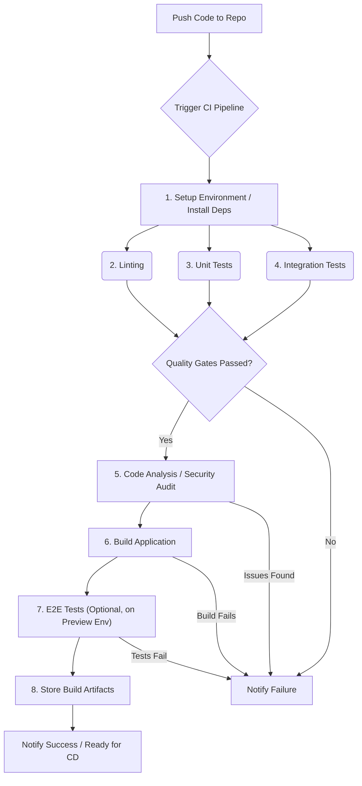

# **Chapter 12: CI/CD, Deployment, and Monitoring**

Welcome to Chapter 12. As a senior frontend engineer, your responsibilities extend far beyond writing component code. You are expected to understand, influence, and often implement the processes that take code from your local machine to production, ensuring its reliability, performance, and maintainability once deployed. This chapter delves into the critical areas of Continuous Integration (CI), Continuous Deployment/Delivery (CD), deployment strategies, and monitoring – topics frequently explored in senior frontend interviews to gauge your operational maturity and understanding of the full software development lifecycle.

Interviewers want to see that you think about the bigger picture: How does your code get built, tested, and deployed safely? How do you ensure it's working correctly in production? How do you handle rollbacks? How do you optimize the delivery pipeline itself? Mastery of these concepts demonstrates technical leadership and a commitment to quality and stability.

We will cover the essential tools, techniques, and patterns used in modern frontend development workflows, equipping you with the knowledge to discuss these topics confidently and demonstrate your senior-level expertise.

## A. Continuous Integration (CI) for Frontend

Continuous Integration is the practice of automating the integration of code changes from multiple contributors into a single software project. For frontend development, this typically involves automating the build, test, and analysis phases every time code is pushed to a shared repository. A robust CI pipeline catches errors early, ensures code quality, and provides fast feedback to developers.

### 1. CI Server Options (GitHub Actions, GitLab CI, Jenkins, CircleCI) - Feature Comparison

Several popular CI/CD platforms cater to frontend development needs. Choosing the right one often depends on factors like existing infrastructure, team preferences, required features, and budget.

| Feature              | GitHub Actions                                  | GitLab CI/CD                                        | Jenkins                                              | CircleCI                                                     |
| :------------------- | :---------------------------------------------- | :-------------------------------------------------- | :--------------------------------------------------- | :----------------------------------------------------------- |
| **Integration**      | Native to GitHub, excellent integration         | Native to GitLab, excellent integration             | Platform-agnostic, extensive plugins                 | Integrates well with GitHub, Bitbucket                       |
| **Configuration**    | YAML files (`.github/workflows`)                | YAML file (`.gitlab-ci.yml`)                        | Groovy (Pipeline as Code) or UI configuration        | YAML file (`.circleci/config.yml`)                           |
| **Hosting**          | Cloud (GitHub-hosted runners) or Self-hosted    | Cloud (GitLab SaaS runners) or Self-hosted          | Primarily Self-hosted (requires server management)   | Cloud or Self-hosted (Server/Runner)                         |
| **Ease of Use**      | Generally easy, good documentation, marketplace | Integrated, relatively easy within GitLab ecosystem | Steeper learning curve, requires more setup          | Relatively easy, good documentation, Orbs (reusable configs) |
| **Community/Market** | Large, growing Marketplace for reusable Actions | Strong community, integrated features               | Very large, mature community, vast plugin library    | Good community, growing Orb registry                         |
| **Cost (Free Tier)** | Generous free tier for public/private repos     | Generous free tier, compute quotas apply            | Open Source (Free), but requires infrastructure cost | Free tier with limited credits/concurrency                   |
| **Frontend Focus**   | Strong, many community Actions for JS tools     | Strong, well-suited for monorepos & Docker          | Flexible, requires configuration via plugins         | Strong, optimized for speed, good Docker support             |

**Key Considerations for Senior Interviews:**

- Be prepared to discuss the pros and cons of the tools you have experience with.
- Articulate _why_ a particular tool was chosen for a project (e.g., "We chose GitHub Actions because we were already on GitHub, and its native integration and marketplace simplified setup").
- Understand the concept of "Pipeline as Code" (using YAML/Groovy) and its benefits (version control, reproducibility).

### 2. Typical CI Pipeline Stages: Linting, Testing (Unit, Integration, E2E), Building, Security Auditing, Code Analysis

A typical frontend CI pipeline consists of several sequential or parallel stages designed to validate code quality and produce a deployable artifact.



_Diagram: A typical sequence of stages in a frontend CI pipeline._

- **1. Setup Environment / Install Dependencies:** Prepares the runner environment, checks out the code, and installs project dependencies (e.g., `npm install` or `yarn install`). Caching is crucial here (see Optimization section).
- **2. Linting:** Enforces code style and identifies potential syntax errors using tools like ESLint and Prettier. Ensures consistency and catches trivial errors early.
  - _Interview Insight:_ Mentioning automated formatting checks (`prettier --check`) alongside linting shows attention to detail.
- **3. Testing (Unit, Integration):** Executes automated tests.
  - **Unit Tests:** Verify individual components or functions in isolation (e.g., using Jest, Vitest, React Testing Library). They are fast and provide granular feedback.
  - **Integration Tests:** Test the interaction between multiple units or components (e.g., testing a form submission flow involving several components and potentially mock APIs).
- **4. Code Analysis / Security Auditing:**
  - **Static Analysis (SAST):** Tools like SonarQube or linters with security plugins scan code for potential vulnerabilities or anti-patterns.
  - **Dependency Auditing:** Tools like `npm audit` or Snyk check for known vulnerabilities in third-party dependencies. This is critical for supply chain security.
  - _Interview Insight:_ Highlighting security scanning demonstrates a mature understanding of frontend risks.
- **5. Building:** Compiles/transpiles the code, bundles assets, and optimizes the application for production (e.g., using Webpack, Vite, Rollup, Next.js build). This generates the deployable artifacts (e.g., static files in a `dist` or `.next` folder).
- **6. End-to-End (E2E) Tests:** (Often run after a preview deployment, but can be part of CI) Simulates real user scenarios by interacting with the application through a browser (e.g., using Cypress, Playwright). These are slower and more brittle but provide the highest confidence in user flows.
- **7. Store Build Artifacts:** Saves the output of the build stage (e.g., the `dist` folder) for later use in the deployment (CD) stage. Platforms like GitHub Actions and GitLab CI have built-in artifact storage.

### 3. Optimizing CI Build Times (Caching Dependencies, Parallelization, Build Artifacts)

Slow CI pipelines hinder developer productivity. Senior engineers should be proactive in identifying and implementing optimizations.

- **Caching Dependencies:** Downloading `node_modules` on every run is time-consuming. CI platforms provide caching mechanisms to store and retrieve dependencies between runs based on lock files (`package-lock.json`, `yarn.lock`).
  - _Example (GitHub Actions Cache):_
    ```yaml
    - name: Cache node modules
      uses: actions/cache@v3
      with:
        path: ~/.npm # or node_modules
        key: ${{ runner.os }}-node-${{ hashFiles('**/package-lock.json') }}
        restore-keys: |
          ${{ runner.os }}-node-
    ```
- **Parallelization:** Running independent jobs concurrently significantly reduces overall pipeline time.
  - **Test Parallelization:** Split the test suite (unit, integration, E2E) across multiple runners/containers. Most test runners and CI platforms support this.
  - **Stage Parallelization:** Run independent stages like Linting and Unit Tests simultaneously if they don't depend on each other.
- **Efficient Build Artifacts:**
  - **Build Caching:** Tools like Webpack (Persistent Cache) or Next.js cache build outputs to speed up subsequent builds if only parts of the code changed. Configure CI to leverage these caches.
  - **Selective Builds (Monorepos):** In monorepos (see Chapter 8), use tools like Nx, Turborepo, or Lerna with change detection (`--affected`) to only build and test projects impacted by a code change.
- **Optimized Docker Layers:** If using Docker in CI, structure Dockerfiles to leverage layer caching effectively (e.g., install dependencies before copying application code).
- **Choosing Appropriate Runners:** Using more powerful runners (if available/affordable) can directly speed up compute-intensive tasks like building and testing.

### 4. [Configuration Guide: Setting up a comprehensive frontend CI pipeline with GitHub Actions]

Let's create a practical example of a CI pipeline for a typical React application using GitHub Actions.

**File:** `.github/workflows/ci.yml`

```yaml
name: Frontend CI Pipeline

# Triggers: Run on pushes to main/master and any pull request
on:
  push:
    branches: [main, master]
  pull_request:
    branches: [main, master]

jobs:
  # Job 1: Linting and Unit/Integration Testing
  test_and_lint:
    name: Test & Lint
    runs-on: ubuntu-latest # Use a standard Linux runner

    strategy:
      matrix:
        node-version: [18.x] # Define Node.js version to use

    steps:
      - name: Checkout code
        uses: actions/checkout@v4 # Action to checkout the repository code

      - name: Set up Node.js ${{ matrix.node-version }}
        uses: actions/setup-node@v4
        with:
          node-version: ${{ matrix.node-version }}
          cache: "npm" # Automatically configure caching for npm based on package-lock.json

      - name: Install dependencies
        run: npm ci # Use 'ci' for deterministic installs based on lock file

      - name: Run Linting
        run: npm run lint # Assumes a 'lint' script in package.json (e.g., "eslint .")

      - name: Run Unit & Integration Tests
        run: npm test # Assumes a 'test' script in package.json (e.g., "jest --ci")

      - name: Run Security Audit (Dependencies)
        run: npm audit --audit-level=high # Check for high severity vulnerabilities

  # Job 2: Build the Application (runs only if test_and_lint succeeds)
  build:
    name: Build Application
    runs-on: ubuntu-latest
    needs: test_and_lint # Depends on the successful completion of the test_and_lint job

    strategy:
      matrix:
        node-version: [18.x]

    steps:
      - name: Checkout code
        uses: actions/checkout@v4

      - name: Set up Node.js ${{ matrix.node-version }}
        uses: actions/setup-node@v4
        with:
          node-version: ${{ matrix.node-version }}
          cache: "npm"

      - name: Install dependencies
        run: npm ci

      - name: Build Production Application
        run: npm run build # Assumes a 'build' script in package.json (e.g., "react-scripts build" or "vite build")
        env:
          # Example: Set build-time environment variables if needed
          REACT_APP_API_URL: ${{ secrets.PROD_API_URL }} # Use GitHub Secrets for sensitive values
          CI: true # Often used by build tools

      - name: Upload Build Artifact
        uses: actions/upload-artifact@v4
        with:
          name: build-output # Name of the artifact
          path: build # Path to the directory to upload (adjust for your build tool, e.g., dist, .next)


  # Optional Job 3: Run E2E Tests (Example using Cypress)
  # This often runs against a preview deployment, but can be integrated here
  # e2e_tests:
  #   name: E2E Tests (Cypress)
  #   runs-on: ubuntu-latest
  #   needs: build # Might need the build output or run against a deployed env
  #   container: cypress/browsers:node18.12.0-chrome107 # Use a container with browsers
  #   steps:
  #   - name: Checkout code
  #     uses: actions/checkout@v4
  #   - name: Install dependencies
  #     run: npm ci
  #   - name: Run Cypress tests
  #     uses: cypress-io/github-action@v6
  #     with:
  #       start: npm start # Command to start the dev server
  #       wait-on: 'http://localhost:3000' # Wait for server to be ready
  #       browser: chrome
```

**Explanation:**

1.  **`name`**: Defines the workflow name displayed in GitHub Actions.
2.  **`on`**: Specifies the events that trigger the workflow (pushes to `main`/`master`, pull requests targeting `main`/`master`).
3.  **`jobs`**: Defines the different tasks to be executed.
    - **`test_and_lint` job**:
      - `runs-on`: Specifies the type of runner machine.
      - `strategy.matrix`: Allows running the job with different configurations (here, just one Node.js version).
      - `steps`: A sequence of tasks within the job.
        - `actions/checkout`: Fetches the repository code.
        - `actions/setup-node`: Sets up the specified Node.js version and configures caching for `npm`. Using `npm ci` is recommended in CI for faster, reliable installs based on the lock file.
        - `npm run lint`, `npm test`, `npm audit`: Executes scripts defined in `package.json`.
    - **`build` job**:
      - `needs: test_and_lint`: Ensures this job only runs if the `test_and_lint` job completes successfully.
      - Builds the application using `npm run build`. Note the use of `env` to potentially pass build-time variables (using GitHub Secrets for sensitive data).
      - `actions/upload-artifact`: Uploads the contents of the `build` directory (adjust path as needed) as an artifact named `build-output`. This artifact can be downloaded or used by subsequent deployment jobs.
    - **`e2e_tests` job (Optional/Example)**: Shows how E2E tests might be integrated, often using specialized actions like `cypress-io/github-action`. This might run against a live preview environment in a more complex CD setup.

This example provides a solid foundation for a frontend CI pipeline. You would adapt the specific `npm` scripts (`lint`, `test`, `build`) and paths (`build` directory) based on your project's setup.

## B. Deployment Strategies and Platforms

Once CI validates the code and produces a build artifact, the next step is Continuous Deployment (CD) or Continuous Delivery. CD automates the release of validated code to a staging or production environment. Continuous Delivery usually involves a manual approval step before final production deployment, while Continuous Deployment automates the entire process.

### 1. Static Hosting Platforms (Netlify, Vercel, AWS S3/CloudFront, Azure Static Web Apps, Cloudflare Pages)

Modern frontend applications (SPAs, static sites generated by frameworks like Next.js, Gatsby, Astro) are often deployed to specialized static hosting platforms or cloud storage services fronted by a Content Delivery Network (CDN).

| Platform                  | Key Strengths                                                                                                                      | Considerations                                                                                        | Typical Use Case                                                     |
| :------------------------ | :--------------------------------------------------------------------------------------------------------------------------------- | :---------------------------------------------------------------------------------------------------- | :------------------------------------------------------------------- |
| **Netlify**               | Excellent DX, Git-based workflow, Atomic Deploys, Preview Deploys, Forms, Identity, Serverless Functions, Edge Functions           | Can get expensive at scale, vendor lock-in for some features                                          | SPAs, Jamstack sites, Marketing sites, Docs                          |
| **Vercel**                | Excellent DX (esp. for Next.js), Git-based workflow, Preview Deploys, Serverless/Edge Functions, Analytics, Image Optimization     | Optimized for Next.js (can be a pro or con), pricing scales with usage                                | Next.js apps, SPAs, Jamstack sites, High-perf sites                  |
| **AWS S3 + CloudFront**   | Highly scalable, Cost-effective (pay-as-you-go), Deep integration with AWS ecosystem, Fine-grained control                         | More complex setup/configuration, Requires managing two services (S3, CloudFront), Less integrated DX | Large-scale static sites, Cost-sensitive projects, AWS-centric infra |
| **Azure Static Web Apps** | Integrated with Azure ecosystem, Git-based workflow, Global CDN, Managed API (Azure Functions), Authentication                     | Newer compared to others, Tied to Azure ecosystem                                                     | Projects using Azure Functions, Azure-centric infra                  |
| **Cloudflare Pages**      | Global CDN (Cloudflare network), Git-based workflow, Preview Deploys, Functions (Workers), Generous free tier, Integrated security | Functions platform (Workers) has its own model, newer platform                                        | Performance-critical sites, Projects leveraging Cloudflare ecosystem |

**Senior Interview Discussion Points:**

- Discuss the trade-offs between integrated platforms (Netlify/Vercel) and cloud primitives (S3/CloudFront). Factors include ease of use, control, cost, and ecosystem integration.
- Explain concepts like Atomic Deploys (ensuring deploys are instant and consistent) and Preview Deploys (deploying each PR to a unique URL for review).
- Mention the importance of a CDN for global performance and caching.

### 2. Containerized Deployments (Dockerizing Frontend Apps)

While static hosting is common, some scenarios require containerizing frontend applications using Docker, especially for SSR applications or when standardizing deployment across backend and frontend.

- **Why Dockerize?**
  - **Consistency:** Packages the app and its environment (Node.js version, dependencies) together. Runs the same way locally, in CI, and in production.
  - **SSR Apps:** Node.js-based SSR frameworks (like Next.js in non-static export mode, Nuxt.js) run a server process, making Docker a natural fit for deployment.
  - **Infrastructure Standardization:** If the organization uses Kubernetes or other container orchestrators, deploying the frontend in a container aligns with infrastructure practices.
- **How to Dockerize (Example `Dockerfile` for an SSR App):**

  ```dockerfile
  # Stage 1: Build the application
  FROM node:18-alpine AS builder
  WORKDIR /app
  COPY package*.json ./
  RUN npm ci
  COPY . .
  # Set build-time env vars if needed (use ARG and --build-arg)
  # ARG NEXT_PUBLIC_API_URL
  # ENV NEXT_PUBLIC_API_URL=$NEXT_PUBLIC_API_URL
  RUN npm run build # Build the Next.js/Nuxt/etc. app

  # Stage 2: Production image
  FROM node:18-alpine
  WORKDIR /app
  # Copy only necessary artifacts from the builder stage
  COPY --from=builder /app/package*.json ./
  # Install production dependencies only
  RUN npm ci --only=production
  COPY --from=builder /app/.next ./.next # Adjust for your framework (e.g., .nuxt)
  COPY --from=builder /app/public ./public # Copy public assets
  # Copy entrypoint script if needed
  # COPY --from=builder /app/server.js ./

  EXPOSE 3000 # Expose the port the app runs on
  # Set runtime env vars (use ENV or inject via orchestrator)
  # ENV NODE_ENV=production
  CMD ["npm", "start"] # Command to run the production server
  ```

  - **Multi-stage Builds:** Crucial for keeping the final image small and secure by discarding build tools and source code.

- **Deployment:** Container images are pushed to a registry (Docker Hub, AWS ECR, GCP Artifact Registry) and deployed using orchestrators (Kubernetes, ECS, App Runner) or PaaS platforms that support containers.

### 3. Deployment Patterns (Blue-Green, Canary Releases, A/B Testing via Deployment Rings)

Safely deploying new versions without downtime or major disruption is paramount. Senior engineers should understand different deployment strategies.

- **Blue-Green Deployment:**

  - **Concept:** Maintain two identical production environments ("Blue" and "Green"). Only one is live (serving traffic) at any time. Deploy the new version to the inactive environment. After testing, switch the router/load balancer to direct traffic to the new environment. The old environment remains as a rapid rollback target.
  - **Pros:** Instant rollback, simple conceptually, minimal downtime.
  - **Cons:** Requires double the infrastructure resources (can be costly), potential issues with database schema changes or long-running user sessions.

  ```mermaid
  graph TD
      subgraph Environment
          LB(Load Balancer) --> App_Blue(Version 1 - LIVE);
          App_Green(Version 2 - STANDBY);
      end

      subgraph Deployment Process
          Deploy[Deploy v2 to Green] --> TestGreen[Test Green Env];
          TestGreen -- OK --> SwitchTraffic[Switch LB to Green];
          SwitchTraffic --> App_Green_Live(Version 2 - LIVE);
          App_Blue --> App_Blue_Standby(Version 1 - STANDBY);
          TestGreen -- Fail --> Rollback(Keep LB on Blue);
      end

      Deploy --> LB -- Traffic --> App_Blue;
      SwitchTraffic -. New Traffic .-> App_Green;

      style App_Blue fill:#ADD8E6,stroke:#333,stroke-width:2px
      style App_Green fill:#90EE90,stroke:#333,stroke-width:2px
      style App_Green_Live fill:#90EE90,stroke:#333,stroke-width:2px
      style App_Blue_Standby fill:#ADD8E6,stroke:#333,stroke-width:2px
  ```

  _Diagram: Blue-Green Deployment Flow._

- **Canary Releases:**
  - **Concept:** Gradually roll out the new version to a small subset of users/servers (the "canaries"). Monitor performance and errors closely. If stable, gradually increase traffic to the new version while phasing out the old one.
  - **Pros:** Limits blast radius of potential issues, allows real-world testing with minimal impact, zero downtime.
  - **Cons:** More complex to manage traffic splitting and monitoring, slower rollout process, potential for inconsistent user experience during rollout.
- **A/B Testing via Deployment Rings:**
  - **Concept:** Similar to Canary, but often used specifically for testing different features or UI variations with different user segments (rings). Traffic splitting rules can be based on user attributes, location, etc. This often overlaps with Feature Flags (see next section).
  - **Pros:** Allows targeted testing of features/variants.
  - **Cons:** Requires sophisticated traffic routing and feature flagging infrastructure.

### 4. Feature Flags for Gradual Rollouts and Testing in Production

Feature flags (or feature toggles) are powerful tools for decoupling deployment from release and enabling safer rollouts.

- **Concept:** Use conditional flags within the codebase to enable or disable features for specific users, user groups, or percentages of traffic _without_ requiring a new deployment.

  ```javascript
  // Example using a hypothetical feature flag service
  import featureFlags from "./featureFlagClient";

  function MyComponent() {
    const showNewCheckout = featureFlags.isEnabled("new-checkout-flow", {
      userId: user.id,
    });

    return <div>{showNewCheckout ? <NewCheckout /> : <OldCheckout />}</div>;
  }
  ```

- **Use Cases:**
  - **Gradual Rollouts:** Enable a new feature for internal testers, then 1% of users, then 10%, etc., monitoring stability at each step.
  - **A/B Testing:** Show different versions of a feature to different user segments.
  - **Kill Switch:** Quickly disable a problematic feature in production without rolling back the entire deployment.
  - **Trunk-Based Development:** Merge incomplete features behind flags, keeping the main branch deployable.
- **Tools:** LaunchDarkly, Optimizely, Flagsmith, Unleash (Open Source), or custom-built solutions.
- **Interview Insight:** Discussing feature flags demonstrates an understanding of risk management, progressive delivery, and testing in production.

### 5. Environment Configuration Management (`.env` files, Build-time variables, Runtime configuration)

Applications need different configurations (API endpoints, keys, feature flags) for different environments (development, staging, production). Managing this securely and effectively is crucial.

- **`.env` Files:** Common for local development. Store environment-specific variables in `.env` files (e.g., `.env.development`, `.env.production`). These are typically loaded by frameworks or libraries (like `dotenv`). **Crucially, `.env` files containing secrets should _never_ be committed to version control.** Use `.env.example` as a template.
- **Build-time Variables:** Variables injected into the application bundle during the CI/CD build process.
  - _Mechanism:_ CI/CD platforms allow setting environment variables (often sourced from secrets management systems) that build tools (Webpack DefinePlugin, Vite `envPrefix`, Next.js `NEXT_PUBLIC_`) embed directly into the JavaScript code.
  - _Use Case:_ Non-sensitive configuration needed client-side (e.g., public API keys, analytics IDs).
  - _Caution:_ These values are visible in the client-side source code. **Do not use for secrets.**
- **Runtime Configuration:** The application fetches configuration _after_ it has been deployed and started.
  - _Mechanism:_
    1.  The frontend makes an API call on startup to a dedicated configuration endpoint.
    2.  The server (or serverless function) serves configuration based on the environment/domain.
    3.  Configuration can be sourced from environment variables on the server, a database, or a dedicated config service (like AWS AppConfig, Azure App Configuration).
  - _Use Case:_ Sensitive keys (handled server-side), feature flag states, dynamic settings that need to change without a redeployment.
  - _Benefit:_ Decouples configuration changes from deployments.

**Security Best Practice:** Never embed sensitive API keys or secrets directly into frontend code (build-time or otherwise). Client-side code is inherently public. Sensitive operations should always be proxied through a backend API or BFF (Backend-For-Frontend).

### 6. Rolling Back Deployments (Strategies and Automation)

Despite testing, sometimes deployments introduce critical bugs. Having a reliable rollback strategy is essential.

- **Strategies:**
  - **Re-deploy Previous Version:** The most common approach. If build artifacts are versioned and stored, the CD pipeline can be triggered to deploy a known-good previous version. Platforms like Netlify/Vercel often have a simple UI button for this.
  - **Blue-Green Rollback:** Simply switch traffic back to the previous (Blue) environment. This is the fastest rollback method.
  - **Feature Flag Rollback:** If the issue is isolated to a feature behind a flag, disable the flag via the feature flagging service. This avoids a full deployment rollback.
- **Automation:**
  - Integrate automated health checks or monitoring alerts into the CD pipeline. If key metrics degrade significantly after a deployment, the pipeline can trigger an automatic rollback.
  - Ensure rollback procedures are documented and practiced.

### 7. [Production Note: Zero-downtime deployment techniques for SPAs and SSR apps]

Achieving true zero-downtime deployments requires careful handling of caching and application state.

- **For SPAs (Static Hosting):**
  - **Atomic Deploys:** Platforms like Netlify/Vercel ensure that a deployment is only live once _all_ files are uploaded and ready. Users won't see a mix of old and new assets.
  - **Cache Busting:** Use hashes in filenames for assets (`main.[hash].js`, `styles.[hash].css`). When content changes, the hash changes, forcing browsers to download the new version. The `index.html` file itself should have minimal caching or use ETag validation.
  - **Service Workers:** Can provide more sophisticated caching strategies, background updates, and ensure users transition smoothly to new versions, but add complexity.
- **For SSR Apps (Containerized/Server-based):**
  - **Rolling Updates:** Container orchestrators (like Kubernetes) can perform rolling updates, gradually replacing old application instances with new ones, ensuring capacity is maintained. Health checks are critical to ensure new instances are ready before terminating old ones.
  - **Connection Draining:** Load balancers should allow existing connections to old instances to complete gracefully while directing new connections to the new instances.
  - **Blue-Green Deployment:** As discussed, inherently provides zero downtime if the switchover is handled correctly at the load balancer level.

## C. Monitoring and Alerting for Frontend Applications

Deployment isn't the end of the story. Monitoring frontend applications in production is crucial for understanding real user experience, identifying errors, diagnosing performance issues, and ensuring reliability. Senior engineers are expected to understand and often implement monitoring strategies.

### 1. Error Tracking Services (Sentry, Bugsnag, Datadog Error Tracking, LogRocket)

These services automatically capture unhandled exceptions and errors occurring in users' browsers, providing invaluable insight into production issues.

| Service                    | Key Features                                                                          | Differentiation                                                            |
| :------------------------- | :------------------------------------------------------------------------------------ | :------------------------------------------------------------------------- |
| **Sentry**                 | Error Tracking, Performance Monitoring (RUM), Release Health, Session Replay (Opt-in) | Strong open-source roots, popular in JS ecosystem, good DX, integrated RUM |
| **Bugsnag**                | Error Tracking, Release Stability Scoring, A/B Test Error Monitoring                  | Focus on stability scores, good enterprise features                        |
| **Datadog Error Tracking** | Integrated with Datadog platform (Logs, APM, RUM, Infra)                              | Unified observability platform, powerful correlation across stack          |
| **LogRocket**              | Error Tracking, Session Replay (Primary Focus), Performance Monitoring                | Focus on high-fidelity session replay for debugging user-specific issues   |

#### a. Capturing Frontend Errors and Context (Stack Traces, Breadcrumbs, User Info)

Effective error tracking goes beyond just the error message.

- **Stack Traces:** Pinpoint the exact line of code where the error occurred. Requires source maps (see below).
- **Breadcrumbs:** A timeline of events (UI clicks, network requests, console logs, navigation changes) leading up to the error. Extremely helpful for reproducing bugs.
- **User Info:** Associating errors with user IDs (anonymized or internal), IP addresses (for geolocation), etc., helps understand impact and prioritize fixes.
- **Browser/OS/Device Info:** Identifies if errors are specific to certain environments.
- **Release Version:** Tagging errors with the application version helps track regressions or fixes.
- **Custom Tags/Context:** Adding application-specific data (e.g., feature flag status, experiment group, component state) provides deeper debugging context.

#### b. Source Map Integration for Readable Stack Traces

Minified and transpiled production JavaScript is unreadable. Source maps are files (`.js.map`) generated during the build process that map the compiled code back to the original source code.

- **Importance:** Without source maps, stack traces in error tracking services point to meaningless locations in the minified bundle. With source maps, you see the original file, line number, and function name.
- **Setup:**
  1.  Configure your build tool (Webpack, Vite, Next.js, etc.) to generate source maps for production builds (`devtool: 'source-map'` or `hidden-source-map` in Webpack, `sourcemap: true` in Vite). `hidden-source-map` is often preferred as it doesn't link the map file in the JS bundle comment.
  2.  Upload the generated source maps to your error tracking service (e.g., using Sentry CLI, Datadog CLI) during your CI/CD deployment process. **Do not deploy source maps publicly** if they contain sensitive information or you want to obscure your source. Error tracking services process them securely.

#### c. Setting up Alerting Rules and Integrations (Slack, PagerDuty)

Simply collecting errors isn't enough; you need to be notified of critical issues.

- **Alerting Rules:** Configure rules within the error tracking service to trigger notifications based on:
  - **New Errors:** Alert when a previously unseen error occurs.
  - **Error Frequency Spikes:** Alert if the rate of a specific error exceeds a threshold (e.g., >100 occurrences in 5 minutes).
  - **Increased Error Rate:** Alert if the overall percentage of sessions/transactions with errors increases significantly.
  - **Regressions:** Alert if an error marked as "resolved" reappears in a new release.
- **Integrations:** Send alerts to relevant channels:
  - **Slack:** For team visibility and discussion.
  - **PagerDuty / Opsgenie:** For critical, actionable alerts requiring immediate attention (potentially waking someone up).
  - **Jira / Issue Trackers:** Automatically create tickets for new, high-priority errors.

### 2. Performance Monitoring (RUM) Integration (Datadog RUM, New Relic Browser, Sentry Performance, etc.)

Real User Monitoring (RUM) collects performance data directly from users' browsers as they interact with your application. This complements synthetic testing by showing actual, real-world performance.

#### a. Tracking Core Web Vitals and Custom Metrics from Real Users

- **Core Web Vitals (CWV):** Google's key metrics for user experience:
  - **Largest Contentful Paint (LCP):** Perceived loading speed (when the main content likely loaded).
  - **First Input Delay (FID) / Interaction to Next Paint (INP):** Responsiveness (how quickly the page reacts to user input). INP is replacing FID.
  - **Cumulative Layout Shift (CLS):** Visual stability (how much content unexpectedly shifts during loading).
- **Other Key Metrics:**
  - **First Contentful Paint (FCP):** When _any_ content first renders.
  - **Time to First Byte (TTFB):** Server response time.
  - **Navigation Timings:** Detailed breakdown of page load stages (DNS lookup, TCP connection, etc.).
  - **Resource Load Times:** Performance of specific assets (images, scripts, CSS).
  - **Route Change Performance:** For SPAs, how long it takes to navigate between views/pages client-side.
- **Custom Metrics:** Track business-specific timings (e.g., time to interactive search results, checkout completion time).

#### b. Analyzing Performance Trends Across Dimensions (Browser, Country, Device)

RUM tools allow slicing and dicing performance data to identify patterns:

- **By Release Version:** Is the latest deployment faster or slower?
- **By Browser/OS/Device:** Are specific platforms experiencing poor performance?
- **By Geography:** Are users in certain regions having issues (potentially related to CDN performance)?
- **By Page/Route:** Which pages are the slowest?
- **By User Segment:** Do logged-in users experience different performance than anonymous users?

Analyzing these trends helps prioritize optimization efforts effectively.

### 3. Log Aggregation for Client-Side Events (Datadog Logs, Logtail, etc.)

While error tracking captures exceptions, log aggregation allows sending structured logs about _any_ client-side event to a central platform for analysis.

- **Use Cases:**
  - Tracking specific user interactions (button clicks, feature usage).
  - Logging API request/response details (excluding sensitive data).
  - Debugging complex user flows by reconstructing session events.
  - Monitoring specific conditions that aren't necessarily errors (e.g., high latency for a specific API call).
- **Implementation:** Use libraries provided by logging platforms or a generic logging library configured to send logs to an HTTP endpoint. Structure logs consistently (e.g., JSON format) with relevant context (user ID, session ID, version).
- **Caution:** Be mindful of the volume of logs generated and associated costs. Avoid logging sensitive information.

### 4. Health Checks and Uptime Monitoring (Synthetic Checks)

Synthetic monitoring involves simulating user interactions or hitting key endpoints from external locations at regular intervals to check basic availability and functionality.

- **Types of Checks:**
  - **Uptime/Ping Checks:** Simple checks to see if the application URL is responding with a successful status code (e.g., 200 OK).
  - **Transaction Monitoring:** More complex scripts that simulate a user journey (e.g., load homepage -> click login -> enter credentials -> verify dashboard loads). These catch functional outages beyond simple availability.
- **Tools:** UptimeRobot, Pingdom, Datadog Synthetics, New Relic Synthetics, Checkly.
- **Purpose:** Provides an early warning system for outages or major functional regressions, independent of real user traffic.

### 5. [Practical Example: Integrating Sentry for error tracking and performance monitoring in a React/Vue/Angular app]

Here's a simplified example of initializing Sentry in a React application. The process is similar for Vue or Angular, typically involving initialization near the application's entry point.

**1. Install Sentry SDK:**

```bash
npm install --save @sentry/react @sentry/tracing
# or
yarn add @sentry/react @sentry/tracing
```

**2. Initialize Sentry (e.g., in `index.js` or `App.js`):**

```javascript
import React from "react";
import ReactDOM from "react-dom/client";
import { BrowserRouter, Routes } from "react-router-dom"; // Or your router
import * as Sentry from "@sentry/react";
import { BrowserTracing } from "@sentry/tracing";

import App from "./App";

// --- Sentry Initialization ---
Sentry.init({
  dsn: "YOUR_SENTRY_DSN_HERE", // Get this from your Sentry project settings
  integrations: [
    // Enables automatic instrumentation for performance monitoring (route changes, requests)
    new BrowserTracing({
      // Set 'tracePropagationTargets' to control for which URLs distributed tracing should be enabled
      tracePropagationTargets: ["localhost", /^https:\/\/yourserver\.io\/api/],
    }),
    // Enables session replay (optional, requires additional setup/consent)
    // new Sentry.Replay()
  ],

  // Set tracesSampleRate to 1.0 to capture 100%
  // of transactions for performance monitoring.
  // Adjust sampling rate in production based on volume and cost!
  tracesSampleRate: 1.0,

  // Set replaysSampleRate to control session replay sampling (if enabled)
  // replaysSampleRate: 0.1, // 10% of sessions
  // replaysOnErrorSampleRate: 1.0, // Capture 100% of sessions with errors

  environment: process.env.NODE_ENV, // e.g., 'development', 'production'
  release: process.env.REACT_APP_RELEASE_VERSION, // Inject release version during build

  // Optional: Attach user context (ensure PII compliance)
  // initialScope: scope => {
  //   scope.setUser({ id: "user123", email: "user@example.com" }); // Example
  //   return scope;
  // }
});
// --- End Sentry Initialization ---

const root = ReactDOM.createRoot(document.getElementById("root"));
root.render(
  <React.StrictMode>
    {/* Wrap Routes with Sentry.ErrorBoundary or useProfiler for component monitoring */}
    <Sentry.ErrorBoundary fallback={<p>An error has occurred</p>}>
      <BrowserRouter>
        {/* Wrap Routes with SentryRoutes for performance monitoring */}
        <App />
      </BrowserRouter>
    </Sentry.ErrorBoundary>
  </React.StrictMode>
);

// Example: Manually capture an error or message
// Sentry.captureMessage("Something important happened");
// try {
//   // some potentially failing code
// } catch (error) {
//   Sentry.captureException(error);
// }
```

**Explanation:**

- `@sentry/react`: Provides React-specific integrations like Error Boundaries.
- `@sentry/tracing`: Enables performance monitoring capabilities.
- `Sentry.init`: Configures the SDK.
  - `dsn`: Your project-specific key for sending data to Sentry.
  - `integrations`: Enables automatic instrumentation (e.g., `BrowserTracing` captures navigation and request timings).
  - `tracesSampleRate`: Controls the percentage of transactions sent for performance monitoring (adjust for production).
  - `environment`, `release`: Important tags for filtering issues in Sentry. Inject these during your CI/CD build process.
- `Sentry.ErrorBoundary`: A React component that catches rendering errors in its children and reports them to Sentry.
- Router Integration: Sentry often integrates with routers (like `react-router-dom`) automatically via `BrowserTracing` or specific wrappers to track route changes as performance transactions.
- Manual Capture: `Sentry.captureException(error)` and `Sentry.captureMessage(message)` allow you to explicitly send errors or informational messages.

Remember to configure source map uploading in your CI/CD pipeline for this integration to be fully effective.

### 6. [Production Note: Establishing effective alerting thresholds to avoid alert fatigue]

Alerting is critical, but overly noisy alerts lead to "alert fatigue," where important notifications get ignored.

- **Start Conservatively:** Begin with alerts only for truly critical issues (e.g., significant spikes in fatal errors, major regressions, synthetic transaction failures).
- **Tune Thresholds:** Monitor alert frequency. If an alert fires too often for non-critical fluctuations, adjust the threshold (e.g., increase the error count, time window, or percentage change required to trigger).
- **Severity Levels:** Use different notification channels for different severity levels (e.g., PagerDuty for critical, Slack for warnings).
- **Focus on User Impact:** Prioritize alerts based on the number of affected users or impact on key user flows. A rare error affecting one user might be lower priority than a less severe error affecting 10% of users.
- **Regular Review:** Periodically review alert rules and thresholds to ensure they remain relevant and effective as the application evolves.

## D. Infrastructure as Code (IaC) Basics for Frontend Infrastructure

While deep infrastructure management often falls to DevOps or Platform teams, senior frontend engineers benefit from understanding Infrastructure as Code (IaC), especially for managing resources directly related to frontend deployment and delivery (CDNs, storage buckets, serverless functions). IaC involves managing and provisioning infrastructure through machine-readable definition files rather than manual configuration or interactive tools.

### 1. Concepts (Terraform, AWS CDK, Pulumi, Bicep)

- **Declarative Approach:** You define the _desired state_ of your infrastructure (e.g., "I want an S3 bucket named 'my-app-assets' with these properties"), and the IaC tool figures out how to achieve that state. This is the model used by Terraform and Bicep.
- **Imperative/Programmatic Approach:** You use familiar programming languages (TypeScript, Python, Go) to define infrastructure resources as objects and classes. The tool then synthesizes and deploys the necessary cloud resources. This is the model used by AWS CDK and Pulumi.
- **Key Tools:**
  - **Terraform (HashiCorp):** Cloud-agnostic, declarative (HCL language), large community, mature.
  - **AWS Cloud Development Kit (CDK):** AWS-specific, programmatic (TypeScript, Python, Java, etc.), higher-level abstractions.
  - **Pulumi:** Cloud-agnostic, programmatic (TypeScript, Python, Go, etc.), similar concept to CDK but multi-cloud.
  - **Azure Bicep:** Azure-specific, declarative, simpler syntax than ARM templates.

### 2. Managing Frontend Infrastructure (CDN, Buckets, DNS, Serverless Functions) via Code

IaC can be used to define and manage resources commonly used for frontend deployments:

- **Static Asset Hosting:** S3 Buckets (AWS), Azure Blob Storage, Google Cloud Storage.
- **Content Delivery Network (CDN):** CloudFront (AWS), Azure CDN, Cloudflare, Google Cloud CDN distributions and configurations (caching rules, custom domains).
- **DNS Records:** Managing CNAME/A records for custom domains pointing to CDNs or load balancers (e.g., using AWS Route 53, Azure DNS, Cloudflare DNS).
- **Serverless Functions:** Defining API endpoints or edge functions used by the frontend (e.g., AWS Lambda, Azure Functions, Cloudflare Workers, Vercel/Netlify Functions).
- **Build/Deployment Infrastructure:** Defining CI/CD pipeline resources or container service configurations if applicable.

### 3. Benefits: Reproducibility, Versioning, Automation

- **Reproducibility:** Easily spin up identical infrastructure environments (dev, staging, prod) from the same code definitions.
- **Versioning:** Infrastructure definitions are stored in version control (like Git) alongside application code. This provides history, allows rollbacks, and facilitates code reviews for infrastructure changes.
- **Automation:** Infrastructure provisioning and updates become part of the automated CI/CD process, reducing manual effort and errors.
- **Collaboration:** Provides a shared, documented source of truth for infrastructure configuration.
- **Disaster Recovery:** Quickly rebuild infrastructure in case of failure or regional outage.

### 4. [Practical Example: Defining S3/CloudFront setup using Terraform/CDK]

Here are simplified examples showing how IaC can define a basic static website hosting setup on AWS.

**Example 1: Terraform (Declarative - HCL)**

```terraform
# Configure the AWS provider
provider "aws" {
  region = "us-east-1"
}

# Create an S3 bucket for website hosting
resource "aws_s3_bucket" "website_bucket" {
  bucket = "my-unique-frontend-app-bucket-name" # Use a unique bucket name

  # Note: For real production, configure website block, ACLs/Bucket Policies carefully
  # This is a simplified example.
}

# Create a CloudFront Origin Access Identity (OAI) to restrict access to the S3 bucket
resource "aws_cloudfront_origin_access_identity" "oai" {
  comment = "OAI for my-frontend-app-bucket"
}

# Grant the OAI read access to the bucket (Bucket Policy needed - omitted for brevity)
# resource "aws_s3_bucket_policy" "bucket_policy" { ... }

# Create a CloudFront distribution
resource "aws_cloudfront_distribution" "s3_distribution" {
  origin {
    domain_name = aws_s3_bucket.website_bucket.bucket_regional_domain_name
    origin_id   = "S3-${aws_s3_bucket.website_bucket.id}"

    s3_origin_config {
      origin_access_identity = aws_cloudfront_origin_access_identity.oai.cloudfront_access_identity_path
    }
  }

  enabled             = true
  is_ipv6_enabled     = true
  comment             = "CDN for my frontend app"
  default_root_object = "index.html"

  # Default cache behavior (customize caching, allowed methods, etc.)
  default_cache_behavior {
    allowed_methods  = ["GET", "HEAD", "OPTIONS"]
    cached_methods   = ["GET", "HEAD"]
    target_origin_id = "S3-${aws_s3_bucket.website_bucket.id}"

    forwarded_values {
      query_string = false
      cookies {
        forward = "none"
      }
    }

    viewer_protocol_policy = "redirect-to-https"
    min_ttl                = 0
    default_ttl            = 3600 # 1 hour
    max_ttl                = 86400 # 1 day
  }

  # Viewer certificate for HTTPS (using default CloudFront cert here)
  viewer_certificate {
    cloudfront_default_certificate = true
  }

  restrictions {
    geo_restriction {
      restriction_type = "none"
    }
  }

  # Add custom domain names, ACM certificate ARN etc. for production
  # aliases = ["myapp.example.com"]
  # viewer_certificate {
  #   acm_certificate_arn = "arn:aws:acm:us-east-1:..."
  #   ssl_support_method  = "sni-only"
  # }
}

# Output the CloudFront domain name
output "cloudfront_domain_name" {
  value = aws_cloudfront_distribution.s3_distribution.domain_name
}
```

**Example 2: AWS CDK (Programmatic - TypeScript)**

```typescript
import * as cdk from "aws-cdk-lib";
import * as s3 from "aws-cdk-lib/aws-s3";
import * as s3deploy from "aws-cdk-lib/aws-s3-deployment";
import * as cloudfront from "aws-cdk-lib/aws-cloudfront";
import * as origins from "aws-cdk-lib/aws-cloudfront-origins";
import { Construct } from "constructs";

export class FrontendInfraStack extends cdk.Stack {
  constructor(scope: Construct, id: string, props?: cdk.StackProps) {
    super(scope, id, props);

    // Create an S3 bucket for website hosting
    const websiteBucket = new s3.Bucket(this, "WebsiteBucket", {
      // bucketName: 'my-unique-frontend-app-bucket-name', // CDK generates unique names by default
      publicReadAccess: false, // Keep bucket private
      blockPublicAccess: s3.BlockPublicAccess.BLOCK_ALL,
      removalPolicy: cdk.RemovalPolicy.DESTROY, // Or RETAIN
      autoDeleteObjects: true, // Useful for dev/test stacks
    });

    // Create an Origin Access Identity (OAI)
    const originAccessIdentity = new cloudfront.OriginAccessIdentity(
      this,
      "OAI"
    );
    websiteBucket.grantRead(originAccessIdentity); // Grant OAI read permissions

    // Create a CloudFront distribution
    const distribution = new cloudfront.Distribution(
      this,
      "WebsiteDistribution",
      {
        defaultBehavior: {
          origin: new origins.S3Origin(websiteBucket, { originAccessIdentity }),
          viewerProtocolPolicy:
            cloudfront.ViewerProtocolPolicy.REDIRECT_TO_HTTPS,
          allowedMethods: cloudfront.AllowedMethods.ALLOW_GET_HEAD_OPTIONS,
          cachedMethods: cloudfront.CachedMethods.CACHE_GET_HEAD,
          compress: true,
        },
        defaultRootObject: "index.html",
        // Add custom domain configuration for production
        // domainNames: ['myapp.example.com'],
        // certificate: acm.Certificate.fromCertificateArn(this, 'Cert', 'arn:aws:acm:us-east-1:...')
      }
    );

    // Optional: Deploy local build output to the S3 bucket
    // new s3deploy.BucketDeployment(this, 'DeployWebsite', {
    //   sources: [s3deploy.Source.asset('../path/to/your/build/output')],
    //   destinationBucket: websiteBucket,
    //   distribution: distribution, // Invalidate CloudFront cache on deployment
    //   distributionPaths: ['/*'],
    // });

    // Output the CloudFront domain name
    new cdk.CfnOutput(this, "CloudFrontURL", {
      value: `https://${distribution.domainName}`,
    });
  }
}

// Usage in your CDK app entrypoint (e.g., bin/my-app.ts)
// const app = new cdk.App();
// new FrontendInfraStack(app, 'FrontendStack', { env: { region: 'us-east-1' } });
```

**Interview Relevance:** You likely won't be asked to write complex IaC from scratch in a frontend interview. However, being able to:

- Explain _what_ IaC is and its benefits.
- Recognize common IaC tools (Terraform, CDK).
- Describe _which_ parts of the frontend infrastructure (CDN, S3, DNS) could be managed using IaC.
- Discuss how IaC integrates with CI/CD (e.g., running `terraform apply` or `cdk deploy` as a deployment step).

This demonstrates a broader understanding of the deployment ecosystem and modern DevOps practices, reinforcing your senior-level perspective.

---

This chapter covered the end-to-end process of getting frontend code into production reliably and efficiently, and ensuring it stays healthy once there. From CI pipelines that enforce quality and build artifacts, to various deployment strategies balancing speed and safety, to the critical practices of monitoring and alerting – these operational concerns are integral to the role of a senior frontend engineer. Understanding these concepts is vital not just for interviews, but for building and maintaining robust, high-quality web applications.
