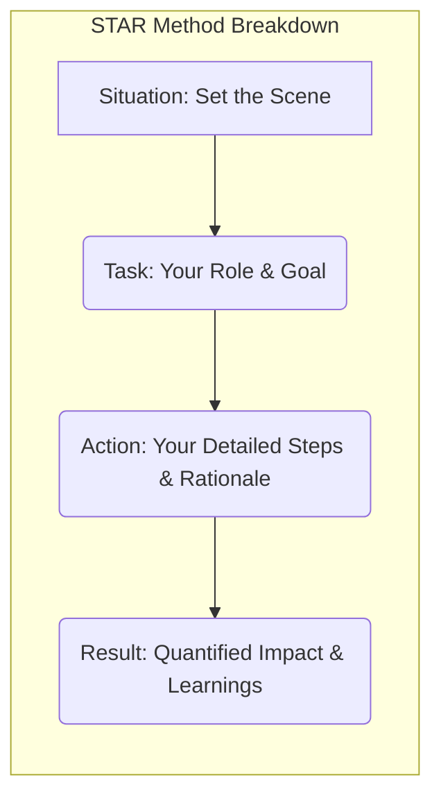

# Chapter 13: Excelling in Behavioral Interviews

Behavioral interviews are a cornerstone of the senior frontend engineer hiring process. While technical prowess is essential, companies hiring senior talent are equally, if not more, interested in your non-technical skills. They want to understand _how_ you work, collaborate, lead, handle challenges, and make decisions. These interviews assess your past behavior as the best predictor of future performance, evaluating competencies crucial for navigating the complexities of senior roles.

Unlike technical rounds that test specific knowledge or coding ability, behavioral interviews probe your experiences, judgment, and alignment with the company's values and culture. For senior candidates, the expectations are significantly higher. You'll be expected to demonstrate not just competence, but leadership, strategic thinking, resilience, and a strong sense of ownership. This chapter provides a comprehensive guide to understanding, preparing for, and excelling in these critical conversations.

### A. Common Behavioral Competencies for Senior Roles

Interviewers use behavioral questions to assess specific competencies deemed critical for success in a senior role. Understanding these competencies allows you to prepare relevant stories from your experience.

#### 1. Ownership and Accountability (Taking initiative, Seeing things through)

- **Definition:** Taking full responsibility for your work, projects, and their outcomes, from inception to completion and beyond. It involves proactively identifying problems or opportunities, taking the initiative to address them without waiting to be told, and ensuring commitments are met even when faced with obstacles.
- **Why it Matters for Seniors:** Senior engineers are expected to operate with a high degree of autonomy. They own complex features, systems, or technical domains. Companies need assurance that you won't just complete assigned tasks but will actively drive progress, troubleshoot issues independently, and feel responsible for the quality and impact of your work. Accountability means acknowledging mistakes and learning from them, not deflecting blame.
- **Example Questions:**
  - "Tell me about a time you took ownership of a project that went beyond your typical responsibilities."
  - "Describe a situation where a project you were responsible for faced significant challenges. How did you ensure it was completed successfully?"
  - "Walk me through a time you identified a critical issue that others had missed. What did you do?"
  - "Tell me about a time you had to deliver on a commitment despite facing unexpected roadblocks."
- **Preparation:** Think of projects where you went the extra mile, identified a gap and filled it, took responsibility for a challenging situation, or saw a complex task through despite difficulties. Focus on your proactive actions and commitment.

#### 2. Dealing with Ambiguity (Navigating unclear requirements, Making assumptions)

- **Definition:** The ability to effectively cope with uncertainty, make progress with incomplete information, and make reasonable decisions or assumptions when requirements are vague or evolving. It involves seeking clarification proactively but also knowing when to make educated guesses to maintain momentum.
- **Why it Matters for Seniors:** Senior roles often involve working on new initiatives, complex problems, or strategic projects where the path forward isn't clearly defined. Requirements might be high-level, change frequently, or have conflicting inputs. Seniors must be comfortable navigating this uncertainty, structuring the problem, making justifiable assumptions, and driving towards clarity without getting paralyzed.
- **Example Questions:**
  - "Describe a time you had to start a project with unclear or incomplete requirements. How did you proceed?"
  - "Tell me about a situation where you had to make a significant decision based on limited data."
  - "How do you handle situations where stakeholders have conflicting requirements?"
  - "Walk me through a time you had to adapt to a major change in project direction."
- **Preparation:** Recall situations with vague briefs, shifting priorities, or insufficient data. Highlight how you sought clarity, identified and validated assumptions, broke down the problem, and made pragmatic decisions to move forward.

#### 3. Conflict Resolution and Collaboration (Handling disagreements, Working cross-functionally)

- **Definition:** The ability to work effectively with others, including navigating disagreements constructively, building consensus, and fostering positive working relationships across different teams (e.g., backend, product, design, QA).
- **Why it Matters for Seniors:** Senior engineers frequently collaborate with diverse groups and often encounter differing opinions on technical approaches, priorities, or design choices. They need to handle these disagreements professionally, listen actively, articulate their own viewpoints clearly, find common ground, and prioritize the overall project or product goals over personal preferences. Effective cross-functional collaboration is key to delivering complex features.
- **Example Questions:**
  - "Tell me about a time you had a significant disagreement with a colleague (e.g., another engineer, designer, product manager). How did you handle it? What was the outcome?"
  - "Describe a situation where you had to work with a difficult stakeholder or team member."
  - "How do you build consensus within a team when there are strong opposing viewpoints on a technical decision?"
  - "Give an example of a successful cross-functional project you worked on. What was your role in ensuring smooth collaboration?"
- **Preparation:** Prepare examples of technical debates, disagreements over requirements, or challenging team dynamics. Focus on how you facilitated communication, understood other perspectives, presented your case logically, sought compromise, and maintained professionalism.

#### 4. Technical Leadership and Mentorship (Guiding others, Sharing knowledge)

- **Definition:** Influencing technical direction, guiding and supporting junior engineers or peers, sharing expertise, setting positive examples, and contributing to the team's overall technical growth, even without formal management authority.
- **Why it Matters for Seniors:** Senior engineers are expected to be technical multipliers. They elevate the team's capabilities by mentoring others, establishing best practices, making sound architectural decisions, and fostering a culture of learning and technical excellence. They lead by example and influence through expertise and collaboration.
- **Example Questions:**
  - "Tell me about a time you mentored a junior engineer. What was your approach, and what was the result?"
  - "Describe a situation where you influenced the technical direction of your team or project."
  - "How have you contributed to improving the technical skills or knowledge of your team?"
  - "Give an example of a technical standard or best practice you introduced."
- **Preparation:** Think about instances where you guided colleagues, led technical discussions, proposed architectural changes, improved code quality standards, onboarded new members, or shared knowledge through presentations or documentation.

#### 5. Bias for Action and Delivering Results (Pragmatism, Focus on impact)

- **Definition:** A propensity to act and drive towards outcomes rather than getting stuck in analysis paralysis. It involves making calculated risks, prioritizing effectively to deliver value quickly, and maintaining focus on achieving tangible results that align with business or user needs. It's about pragmatism and execution.
- **Why it Matters for Seniors:** Companies value engineers who can translate plans and ideas into working software efficiently. Seniors need to balance perfection with pragmatism, understand when to iterate, make timely decisions, and consistently deliver high-quality features or improvements that have a measurable impact.
- **Example Questions:**
  - "Tell me about a time you had to make a quick decision to keep a project moving."
  - "Describe a situation where you took a calculated risk to achieve a better outcome."
  - "How do you balance the need for code quality with the pressure to deliver features quickly?"
  - "Give an example of a project where you significantly improved the outcome through your proactive approach."
- **Preparation:** Focus on situations where you overcame obstacles to deliver, made pragmatic trade-offs, prioritized effectively under pressure, or took initiative to accelerate progress. Quantify the results whenever possible.

#### 6. Customer Obsession / User Focus (Understanding user needs, Advocating for users)

- **Definition:** Placing the end-user or customer at the center of your work. This involves actively seeking to understand user needs and pain points, considering the user experience in technical decisions, and advocating for solutions that genuinely benefit the user.
- **Why it Matters for Seniors:** Senior frontend engineers are custodians of the user interface. Their technical choices directly impact usability, accessibility, and performance – key aspects of the user experience. A strong user focus ensures that technical decisions serve the ultimate goal of creating valuable and delightful products. They should be able to translate user needs into technical requirements and champion the user's perspective in discussions.
- **Example Questions:**
  - "Tell me about a time you used user feedback to influence a technical decision or product feature."
  - "Describe a situation where you advocated for a user experience improvement, even if it required more technical effort."
  - "How do you ensure the features you build are meeting user needs?"
  - "Give an example of a technical trade-off you made where user experience was a primary factor."
- **Preparation:** Think about times you interacted with user research, analytics, or feedback; times you pushed back on requirements that would negatively impact users; or times you made specific technical choices (e.g., performance optimizations, accessibility improvements) explicitly for the user's benefit.

#### 7. Learning and Curiosity (Staying updated, Exploring new tech)

- **Definition:** A genuine interest in learning, staying current with technological advancements, exploring new tools and techniques, and continuously improving one's skills and knowledge.
- **Why it Matters for Seniors:** The frontend landscape evolves rapidly. Senior engineers need to be lifelong learners to remain effective, guide technology choices, and introduce innovations. Curiosity drives exploration of better ways to solve problems and keeps the team's technical practices modern and efficient.
- **Example Questions:**
  - "How do you stay up-to-date with the latest trends and technologies in frontend development?"
  - "Tell me about a new technology or tool you learned recently. How did you learn it, and how have you applied it?"
  - "Describe a time you experimented with a new approach or technology, even if it wasn't immediately required for your project."
  - "What are you most excited about in the future of frontend development?"
- **Preparation:** Be ready to discuss your learning habits (blogs, conferences, courses, side projects), specific technologies you've explored, how you evaluate new tools, and perhaps even contributions to open source or technical communities.

#### 8. Strategic Thinking and Prioritization (Seeing the bigger picture, Making trade-offs)

- **Definition:** The ability to understand how your work fits into the larger context of the team, product, and business goals. It involves thinking beyond immediate tasks, anticipating future challenges or opportunities, making informed trade-offs, and prioritizing work based on impact and strategic alignment.
- **Why it Matters for Seniors:** Senior engineers are expected to contribute to technical strategy, not just execute tasks. They need to understand the business drivers behind projects, evaluate technical options based on long-term implications (scalability, maintainability, cost), and help the team focus its efforts on the most impactful work.
- **Example Questions:**
  - "Tell me about a time you had to make a difficult technical trade-off. What factors did you consider?"
  - "Describe a situation where you had to prioritize between multiple important tasks or projects. How did you decide?"
  - "How do you ensure your technical decisions align with the long-term goals of the team or product?"
  - "Walk me through a time you identified a potential future problem and took steps to mitigate it."
- **Preparation:** Reflect on situations where you considered long-term maintainability, scalability, or cost; where you had to say "no" to something less important; or where you influenced project direction based on a broader understanding of the goals.

### B. Mastering the STAR Method for Complex Scenarios

The STAR method is a structured way to answer behavioral interview questions, ensuring you provide a complete, compelling, and easy-to-follow narrative. For senior roles, simply using STAR isn't enough; you need to apply it with depth and nuance, focusing on complexity, impact, and your specific contributions.

- **Diagram Explanation:** This diagram illustrates the linear flow of the STAR method, emphasizing the progression from setting the context (Situation) to defining your objective (Task), detailing your specific contributions (Action), and finally, outlining the outcomes and insights gained (Result).

#### 1. Situation: Setting Clear Context (Project scale, Team size, Business goals)

- **Goal:** Briefly establish the background for your story. Provide enough context for the interviewer to understand the scenario's complexity and significance.
- **Senior Level Detail:** Go beyond just naming the project. Include:
  - **Scale & Complexity:** Was it a large-scale refactor, a core feature for millions of users, a new product launch?
  - **Team Dynamics:** Mention the size and composition of the team (e.g., "a cross-functional team of 5 engineers, 1 PM, 1 designer," or "leading a frontend pod of 3").
  - **Business Context:** What was the business goal or problem being solved? (e.g., "increase user engagement," "reduce checkout abandonment," "improve application performance to reduce infrastructure costs," "migrate off a legacy system before end-of-life").
  - **Constraints:** Were there tight deadlines, limited resources, technical debt, or specific regulatory requirements?
- **Keep it Concise:** Aim for 2-3 sentences. The focus should be on the Action.

#### 2. Task: Defining Your Specific Role and Responsibilities within the situation

- **Goal:** Clearly state what _your_ specific objective or responsibility was within that situation. What were you tasked with achieving or resolving?
- **Senior Level Detail:**
  - **Specificity:** Instead of "My task was to build the feature," say "My task was to lead the frontend development for the new real-time collaboration feature, ensuring it was performant, scalable, and integrated seamlessly with the existing WebSocket infrastructure."
  - **Ownership:** Clearly define your scope of responsibility, especially if you were leading an effort or owning a specific complex component. "I was responsible for architecting the state management solution" or "My goal was to resolve the critical performance bottleneck affecting P99 latency."
- **Clarity:** Ensure the interviewer understands what success looked like for _you_ in this scenario.

#### 3. Action: Detailing _Your_ Specific Actions, Thought Process, and Decisions (The core of the answer)

- **Goal:** This is the most critical part. Describe the specific steps _you_ took to address the task. Explain _why_ you took those actions, your reasoning, and the decisions you made along the way.
- **Senior Level Detail:**
  - **Focus on "I":** Even in team projects, emphasize _your_ individual contributions, decisions, and influence. Use "I" statements (e.g., "I proposed using X library because...", "I analyzed the performance traces and identified...", "I facilitated a meeting to align stakeholders on...").
  - **Show, Don't Just Tell:** Instead of saying "I solved the problem," describe _how_ you solved it. What analysis did you perform? What technical approaches did you evaluate? What trade-offs did you consider? What code did you write? What discussions did you lead?
  - **Complexity & Nuance:** Detail the technical challenges, the ambiguity you navigated, the collaboration required, or the leadership you demonstrated. Did you write an RFC? Did you conduct performance benchmarks? Did you mentor a junior engineer through a tricky part? Did you negotiate requirements with Product?
  - **Thought Process:** Explain your reasoning. "I chose approach A over approach B because, although B was faster initially, A offered better long-term maintainability and aligned with our existing component library, reducing cognitive load for the team."
- **Structure:** Use sequential steps (First, I did X... Then, I did Y... Finally, I did Z...) to make complex actions easy to follow.

#### 4. Result: Quantifying the Impact (Metrics, Outcomes) and Highlighting Learnings/Reflections

- **Goal:** Describe the outcome of your actions. What was the impact on the project, team, users, or business? What did you learn from the experience?
- **Senior Level Detail:**
  - **Quantify Whenever Possible:** Use metrics! "Reduced page load time by 30%," "Increased conversion rate by 5%," "Resolved a bug affecting 10% of users," "Successfully onboarded 3 new engineers," "Reduced build times by 15%," "Shipped the feature on schedule, meeting the Q3 OKR."
  - **Qualitative Impact:** If metrics aren't available, describe the qualitative impact. "Improved team morale by resolving a long-standing process issue," "Received positive feedback from the design team on the collaboration," "The architecture proved scalable when we added the next phase of features."
  - **Tie Back to Task/Goal:** Explicitly connect the result to the task you defined earlier.
  - **Learnings & Reflections:** This is crucial for senior roles. What did you learn? What would you do differently next time? This demonstrates self-awareness, growth mindset, and continuous improvement. "In retrospect, involving QA earlier in the process would have caught the edge case sooner." "This experience reinforced the importance of clear documentation for complex APIs."

#### 5. [Practical Example: Applying STAR to "Tell me about a time you disagreed with your manager."]

- **(S) Situation:** "In my previous role at Company X, we were planning a major refactor of our main user dashboard. My manager, who had a backend background, proposed using server-side rendering (SSR) for the entire dashboard to improve initial load performance, based on his positive experience with it on another project."
- **(T) Task:** "My responsibility as the lead frontend engineer for the dashboard project was to evaluate the technical approach and ensure it met our specific frontend requirements, including high interactivity and complex client-side state management needs. I needed to assess if full SSR was the optimal solution and present my findings."
- **(A) Action:** "First, I acknowledged my manager's goal of improving performance, which I agreed was critical. However, I had concerns about the complexity SSR would introduce given our dashboard's heavy reliance on real-time updates and intricate client-side interactions managed via Redux Saga. I spent two days prototyping a small, critical section of the dashboard using both the proposed full SSR approach and an alternative: client-side rendering (CSR) with aggressive code-splitting and prefetching, plus server-rendering only the initial static shell. I gathered performance metrics (TTFB, TTI, bundle sizes) for both prototypes using Lighthouse and WebPageTest. I also documented the potential development complexities and maintenance overhead associated with managing state hydration and routing in a full SSR setup for our specific use case. I then scheduled a meeting with my manager, presented the data from the prototypes side-by-side, clearly outlining the trade-offs: SSR offered slightly better TTFB but significantly increased complexity and potentially slower TTI for our interactive components, while the CSR + shell approach provided excellent TTI, simpler state management, and comparable perceived performance after the initial load due to code-splitting. I focused the discussion on the specific needs of the _dashboard_ application rather than SSR in general."
- **(R) Result:** "My manager appreciated the data-driven approach and the clear articulation of trade-offs specific to our application. After reviewing the prototypes and data, he agreed that the CSR with server-rendered shell approach was more pragmatic and better suited for the dashboard's interactivity requirements. We adopted this strategy, which allowed us to deliver the refactored dashboard on time. It achieved a 40% improvement in TTI and received positive user feedback regarding responsiveness. The key learning for me was the power of prototyping and objective data in resolving technical disagreements constructively, focusing on the specific context rather than abstract preferences."

#### 6. [Practical Example: Applying STAR to "Describe a complex technical problem you solved."]

- **(S) Situation:** "On the e-commerce platform I worked on, users were reporting intermittent but frustrating freezes when interacting with the product filtering sidebar on the category pages, especially on lower-powered devices. This was impacting user experience and potentially conversion rates. The sidebar involved numerous checkboxes, sliders, and dynamic updates based on selections."
- **(T) Task:** "As the senior frontend engineer responsible for the product discovery features, my task was to diagnose the root cause of these UI freezes and implement a solution to ensure smooth and responsive filtering, even with hundreds of potential filter options."
- **(A) Action:** "I started by trying to reliably reproduce the issue, using browser performance profiling tools (Chrome DevTools Performance tab) on a throttled CPU setting. I observed long 'Scripting' tasks occurring after multiple filter interactions, often exceeding 200ms and causing the main thread to block. Digging into the flame charts, I identified the bottleneck: every time a filter changed, the entire list of available products was being re-filtered and the filter counts in the sidebar were being recalculated synchronously on the main thread. This involved iterating over potentially thousands of product objects and updating dozens of DOM elements simultaneously.
  My approach involved several steps:
  1.  **Debouncing:** I implemented debouncing on the filter input event handlers (checkbox clicks, slider changes) so that the filtering logic only triggered after a brief pause (e.g., 300ms) in user input, preventing excessive recalculations during rapid interaction.
  2.  **Memoization:** I used `React.memo` and `useMemo` extensively to prevent unnecessary re-renders of filter components and memoize the results of expensive calculations (like deriving available filter options from the product list).
  3.  **Off-Main-Thread Calculation (Attempted):** I initially explored using Web Workers to move the filtering logic off the main thread. However, the overhead of serializing/deserializing the large product data and filter state proved counter-productive for this specific interaction pattern, adding latency.
  4.  **Optimized Filtering Logic:** I refactored the core filtering algorithm itself. Instead of re-filtering the entire list from scratch each time, I implemented a more efficient approach that incrementally applied or removed filters, significantly reducing the computational load.
  5.  **Virtualization (Considered but Rejected):** I considered virtualizing the filter options list but decided against it as the number of visible options at any time wasn't the primary bottleneck; it was the computation _behind_ them."
- **(R) Result:** "After implementing debouncing, memoization, and the optimized filtering logic, the UI freezes were completely eliminated. Performance profiling showed that the longest scripting tasks after filter interactions were reduced from over 200ms to under 30ms, well below the threshold for noticeable lag. We observed a ~5% increase in users interacting with filters and a small but positive uptick in conversion rate for users who engaged with the improved filtering system. My key learning was the importance of deep performance profiling to pinpoint the _exact_ bottleneck before jumping to solutions, and that sometimes optimizing the existing main-thread logic is more effective than introducing complexity like Web Workers if data transfer is a major factor."

#### 7. [Practical Example: Applying STAR to "Tell me about a time you had to influence others."]

- **(S) Situation:** "Our frontend team was struggling with inconsistent code style and quality, leading to longer code review times and difficulty onboarding new engineers. We had linters set up, but the rules were basic, not consistently enforced, and developers often bypassed them locally. There was inertia against adopting stricter tooling due to perceived friction."
- **(T) Task:** "Recognizing the drag on productivity and quality, I took the initiative to influence the team to adopt a more robust and automated code quality workflow, specifically integrating Prettier for automated code formatting and stricter ESLint rules enforced via pre-commit hooks."
- **(A) Action:** "I knew a top-down mandate wouldn't work well. My approach was multi-faceted:
  1.  **Build a Case:** I gathered data points – examples of inconsistent code causing bugs, time spent debating style in PRs, and positive testimonials from other companies using automated formatting.
  2.  **Pilot Project:** I configured Prettier and stricter ESLint rules (based on a popular style guide like Airbnb's, with some team-discussed adjustments) on a smaller, non-critical internal tool I was working on. This served as a low-risk demonstration.
  3.  **Team Demo & Discussion:** I scheduled a team meeting where I presented the 'why' (consistency, faster reviews, easier onboarding) and demonstrated the 'how' – showing the seamless auto-formatting on save and the pre-commit hook catching potential errors _before_ code even reached review. I highlighted how it eliminates entire categories of PR comments.
  4.  **Address Concerns:** I actively solicited and addressed concerns about losing control over formatting or potential disruption. I emphasized that the goal was to automate the tedious parts, freeing us up for more substantive review feedback. We collaboratively tweaked a few ESLint rules based on team consensus.
  5.  **Phased Rollout Plan:** I proposed a phased rollout: start with new projects, then gradually introduce it to existing projects module by module during refactoring or feature work, using `git blame --ignore-revs-file` to minimize disruption to blame history. I volunteered to help set it up in the first few key repositories.
  6.  **Documentation:** I created clear documentation on how to set up the tools locally and how the pre-commit hooks worked."
- **(R) Result:** "The team agreed to adopt the new workflow. Within three months, Prettier and the stricter ESLint rules were integrated into all our active frontend repositories, enforced by Husky pre-commit hooks. Code review times decreased by an estimated 15-20% as style debates vanished. New engineers reported a smoother onboarding experience as code expectations were clearer and automatically enforced. The overall consistency and quality of our codebase noticeably improved. This experience taught me that influencing change requires understanding concerns, providing clear benefits, demonstrating value through pilots, and facilitating collaborative adoption rather than imposing solutions."

#### 8. [Production Note: Tailoring STAR examples to the specific company values and role requirements]

- **Key Advice:** Before your interview, research the company's values (often listed on their careers page or 'About Us' section) and carefully re-read the job description. Look for keywords related to their culture (e.g., "innovation," "customer obsession," "collaboration," "bias for action," "ownership"). Select STAR examples from your experience that specifically highlight these values. If the role emphasizes performance optimization, choose examples showcasing your work in that area. If it stresses mentorship, bring your mentorship stories to the forefront. Tailoring your examples makes your answers more relevant and impactful, demonstrating a genuine interest and fit for _that specific_ company and role.

### C. Handling Difficult Questions and Scenarios

Behavioral interviews often include questions designed to probe your self-awareness, resilience, and how you handle challenging situations. Don't be intimidated; view them as opportunities to demonstrate maturity and problem-solving skills.

#### 1. Questions about Failures and Mistakes ("Tell me about a time you failed.")

- **Interviewer's Goal:** Assess accountability, learning from errors, resilience, and honesty. They want to see if you can own your mistakes without blaming others and demonstrate that you've grown from the experience.
- **How to Approach:**
  1.  **Choose Wisely:** Select a _real_ failure or significant mistake with tangible consequences, but preferably not one that reveals a fundamental flaw in your core skills or judgment for the role you're applying for. Avoid trivial examples.
  2.  **Own It:** Clearly state your role and responsibility in the failure. Use "I" statements. Don't deflect blame or make excuses. ("I made an incorrect assumption about...")
  3.  **Use STAR (Briefly):**
      - **Situation/Task:** Briefly set the context and what you were trying to achieve.
      - **Action (Focus on the Mistake):** Clearly explain what went wrong and _your_ part in it. What was the error in judgment, execution, or assumption?
      - **Action (Focus on Correction):** What did you do _immediately_ to mitigate the damage or fix the problem once it was discovered?
      - **Result/Learning:** What was the ultimate outcome? Crucially, what did you _learn_ from this experience? How did it change your approach, processes, or decision-making going forward? Provide specific examples of how you've applied these learnings since.
- **Example Snippet (Learning Part):** "...The deployment caused a brief outage for users in the EU region. We rolled back immediately. The key learning for me was the critical importance of region-specific testing, even for seemingly global config changes. Since then, I've implemented mandatory pre-deployment checks specifically for regional configurations in our CI/CD pipeline, and I always explicitly ask about regional impacts during planning."

#### 2. Questions about Weaknesses ("What's your biggest weakness?")

- **Interviewer's Goal:** Assess self-awareness, honesty, and commitment to professional growth. They are less interested in the weakness itself and more in how you perceive yourself and what you're doing about it.
- **How to Approach:**
  1.  **Be Genuine:** Choose a real, relevant weakness, but one that isn't debilitating for the role. Avoid clichés ("I'm a perfectionist," "I work too hard") or disguised strengths.
  2.  **Show Self-Awareness:** Clearly state the weakness.
  3.  **Provide Context (Optional but helpful):** Briefly explain how this weakness has manifested itself in the past.
  4.  **Focus on Improvement:** This is the most important part. Describe the _specific actions_ you are actively taking to mitigate or overcome this weakness. Mention progress you've made.
- **Example:** "One area I've actively been working on is public speaking and presenting technical concepts to larger, non-technical audiences. Early in my career, I tended to get overly technical and nervous. To improve, I joined a Toastmasters group at my previous company, volunteered to present at internal tech talks on lower-stakes topics, and specifically focused on structuring my presentations with clear narratives and analogies. While I'm still refining this skill, I'm much more comfortable now and recently received positive feedback on a presentation I gave to the product leadership team about our new design system adoption."

#### 3. Questions about Challenging Team Dynamics or Conflicts

- **Interviewer's Goal:** Understand your interpersonal skills, conflict resolution style, professionalism, and ability to collaborate effectively even when there are disagreements or difficult personalities.
- **How to Approach:**
  1.  **Use STAR:** Structure your answer clearly.
  2.  **Focus on Professionalism:** Emphasize how you handled the situation constructively and professionally. Avoid gossip, negativity, or overly personal attacks on former colleagues.
  3.  **Highlight Communication & Empathy:** Describe how you tried to understand the other person's perspective, listened actively, and communicated your own viewpoint clearly and respectfully.
  4.  **Describe Actions Towards Resolution:** What steps did you take to de-escalate, find common ground, seek compromise, or involve a neutral third party (like a manager) if necessary and appropriate?
  5.  **Focus on Outcomes:** What was the result? Was the conflict resolved? Was the working relationship improved or maintained? What did you learn about managing interpersonal dynamics?
- **Key:** Demonstrate maturity and a focus on achieving the best outcome for the team or project, rather than "winning" the argument.

#### 4. Hypothetical Scenarios ("What would you do if...")

- **Interviewer's Goal:** Assess your problem-solving process, judgment, values, and how you approach unfamiliar situations. They want to understand your thought process and decision-making framework.
- **How to Approach:**
  1.  **Clarify (If Needed):** Don't be afraid to ask clarifying questions to ensure you understand the scenario and constraints. ("Are there specific performance goals for this feature?" "What's the team size and skillset?") State any assumptions you make.
  2.  **Structure Your Approach:** Think out loud. Break down the problem into smaller steps. ("First, I would gather more information about X... Then, I would analyze Y... Next, I would consider options A and B...")
  3.  **Identify Key Factors & Trade-offs:** Discuss the important considerations (e.g., user impact, technical feasibility, deadlines, maintainability, team capacity, business goals). Acknowledge the trade-offs involved in different approaches.
  4.  **Explain Your Reasoning:** Justify your proposed actions or decisions. Why would you choose a particular path?
  5.  **Consider Collaboration:** Mention who you might involve or consult (e.g., product manager, designer, tech lead, other engineers).
- **Example:** "What would you do if Product asked you to implement a complex feature with a very tight deadline that you believe compromises code quality?"
  - _Response Outline:_ "First, I'd seek to fully understand the urgency and the business drivers behind the tight deadline from the Product Manager. I'd also clearly articulate my concerns about the specific code quality risks (e.g., lack of testing, potential for bugs, future maintainability issues) and the potential long-term costs. I would then explore options: Could we scope down the MVP to meet the deadline safely? Could we allocate more resources temporarily? Could we explicitly agree on scheduling dedicated time for refactoring and adding test coverage immediately after the initial launch? I'd present these options with their trade-offs, aiming for a pragmatic solution that balances business needs with technical sustainability. If a compromise couldn't be reached and the risk was significant, I would escalate my concerns to my manager or tech lead, providing clear reasoning."

#### 5. Responding to Vague or Unclear Questions

- **Interviewer's Goal:** Sometimes questions are intentionally vague to see how you handle ambiguity (see Competency A.2). Other times, they might just be poorly phrased.
- **How to Approach:**
  1.  **Seek Polite Clarification:** It's perfectly acceptable to ask for more detail. "Could you tell me a bit more about what aspect of project management you're interested in?" or "When you say 'handle pressure,' are you thinking about deadlines, technical challenges, or something else?"
  2.  **Rephrase or Paraphrase:** Repeat the question back in your own words to confirm understanding. "So, you're asking about a time I had to manage conflicting priorities between two major projects?"
  3.  **State Assumptions:** If clarification isn't forthcoming or practical, state the assumptions you're making to answer the question. "Assuming you mean a situation with tight technical constraints, one example would be..."
  4.  **Provide a Structured Answer:** Even if the question is vague, use a clear structure (like STAR) for your response. This demonstrates organized thinking.

### D. Demonstrating Leadership and Influence without Authority

Senior engineers are expected to lead, but this often doesn't mean managing people directly. It's about technical leadership, mentorship, process improvement, and influencing peers and stakeholders through expertise and collaboration. Behavioral interviews are prime opportunities to showcase this "influence without authority."

#### 1. Examples of Mentoring Junior Engineers or Peers

- **What to Showcase:** Your ability and willingness to share knowledge, support colleagues' growth, and elevate the team's overall skill level.
- **Specific Examples:**
  - **Onboarding:** "I developed an onboarding checklist and spent the first week pair-programming with a new junior engineer to get them comfortable with our codebase and development workflow."
  - **Code Reviews:** "I make a point of providing constructive, detailed feedback in code reviews for junior team members, explaining the 'why' behind suggestions and pointing them to relevant documentation or best practices." (Maybe mention a specific instance where your feedback helped someone grasp a complex concept).
  - **Knowledge Sharing:** "I noticed several team members struggling with our state management library, so I prepared and delivered a lunch-and-learn session covering advanced patterns and common pitfalls."
  - **Pair Programming/Debugging:** "A colleague was stuck on a complex performance issue. I sat down with them, walked through debugging techniques using browser profiling tools, and we collaboratively identified and fixed the bottleneck."
  - **Informal Guidance:** "I regularly check in with more junior members, offering help, answering questions, and pointing them towards resources to learn specific technologies we use."

#### 2. Examples of Driving Technical Decisions or Architectural Improvements

- **What to Showcase:** Your ability to identify technical needs, evaluate options, build consensus, and implement improvements that have a positive impact.
- **Specific Examples:**
  - **Technology Adoption:** "I researched and advocated for adopting TypeScript in our project, presenting the benefits of static typing for catching errors early and improving refactoring safety. I created a proof-of-concept and led the initial migration effort for a key module."
  - **Architectural Patterns:** "I identified scalability concerns with our existing monolithic frontend state. I proposed and designed a modular approach using context selectors (or similar pattern), presented an RFC outlining the trade-offs, and led the implementation, resulting in better performance and easier feature development."
  - **API Design:** "Working closely with the backend team, I provided critical feedback on a new API design, suggesting changes based on frontend consumption patterns that simplified data fetching logic and improved UI performance."
  - **Refactoring Initiatives:** "I identified a legacy component causing significant tech debt and performance issues. I proposed a phased refactoring plan, secured buy-in from the team and product owner, and led the effort to replace it with a modern, reusable alternative."

#### 3. Examples of Improving Team Processes, Code Quality, or Developer Experience

- **What to Showcase:** Your initiative in making the team more efficient, improving the quality of work, and making the development process smoother and more enjoyable.
- **Specific Examples:**
  - **Tooling & Automation:** "I introduced and configured Husky pre-commit hooks to automatically run linters and formatters, significantly reducing style debates in PRs and ensuring consistent code quality before code was even pushed." (See STAR example B.7)
  - **Testing Strategy:** "I noticed our end-to-end test suite was flaky and slow. I analyzed the failures, proposed migrating to Cypress (or Playwright), and led the effort to rewrite key test flows, resulting in faster and more reliable builds."
  - **Documentation:** "Our component library documentation was outdated. I initiated an effort to improve it, establishing a standard format using Storybook and writing docs for several core components, making them much easier for the team to discover and use correctly."
  - **Code Review Process:** "I suggested implementing code review guidelines, including checklists for common issues and expected turnaround times, which helped make our review process more consistent and efficient."
  - **CI/CD Improvements:** "I optimized our CI pipeline configuration, parallelizing build steps and improving caching, which reduced average build times by 30%."

#### 4. Articulating Your Vision for Frontend Development Practices

- **What to Showcase:** Your thoughtful perspective on frontend development, your understanding of trends and best practices, and your ability to think strategically about how frontend engineering should be done.
- **How to Approach:** Be prepared to discuss topics like:
  - Your preferred approaches to state management, component architecture, or CSS strategy (and _why_).
  - Your views on testing methodologies (unit, integration, e2e) and their importance.
  - How you think about performance optimization and accessibility.
  - Your opinion on recent frontend trends (e.g., server components, micro-frontends, utility-first CSS) and their appropriate use cases.
  - How you foster collaboration between frontend, backend, design, and product.
- **Key:** Don't just state preferences; explain the reasoning, trade-offs, and context behind your views. Show that you've thought deeply about these topics.

#### 5. [Production Note: How to showcase leadership impact even without a formal 'Lead' title]

- **Key Advice:** Leadership isn't tied to a title. Focus on demonstrating _initiative_, _influence_, and _positive impact_. Use action verbs that highlight these qualities: "I _initiated_...", "I _proposed_...", "I _mentored_...", "I _persuaded_...", "I _organized_...", "I _solved_...", "I _improved_...", "I _drove_...". Frame your STAR stories to emphasize how _your_ actions, regardless of your formal role, led to better technical outcomes, improved team processes, or helped others succeed. Highlight instances where you identified a problem or opportunity and took ownership to address it, influencing others through collaboration and well-reasoned arguments rather than authority.
