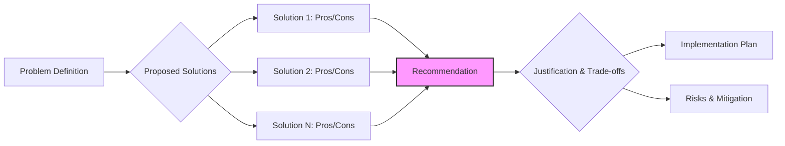
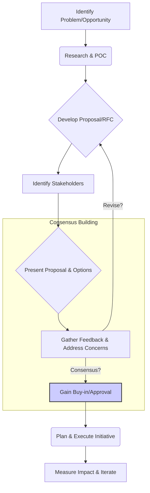

# Chapter 14: Technical Leadership and Influence in Practice

Moving beyond individual contribution, the senior frontend engineer role inherently involves technical leadership and the ability to influence decisions, processes, and people. Interviews for these roles scrutinize not just your coding prowess but your capacity to elevate the team, guide technical direction, and collaborate effectively across disciplines. This chapter delves into the practical aspects of technical leadership and influence, exploring how these qualities manifest in day-to-day work and how you can effectively demonstrate them during the interview process.

Mastering these skills is crucial because senior engineers are expected to be force multipliers. They don't just solve complex problems; they enable others to solve problems, improve the overall technical health of the system, and ensure the frontend aligns with broader business goals.

## A. Defining Technical Leadership at the Senior Level

Technical leadership at the senior level isn't necessarily about having direct reports or a formal "Lead" title. It's about demonstrating ownership, strategic thinking, and the ability to guide technical outcomes positively. Interviewers look for evidence that you operate beyond the scope of your assigned tickets.

### 1. Beyond Coding: Architecture, Strategy, Mentorship, Quality Advocacy

While strong coding skills are foundational, senior leadership requires a broader perspective:

- **Architecture:** You're expected to contribute to, understand, and sometimes define the frontend architecture. This involves making choices about frameworks, state management, component libraries, data fetching strategies, and how different parts of the application interact. It's about designing for scalability, maintainability, and performance.
  - **Interview Relevance:** Be prepared to discuss architectural decisions on past projects, justify choices, and potentially design a system or component architecture during a system design interview. Explain the _why_ behind your decisions, considering trade-offs.
- **Strategy:** This involves aligning technical decisions with business objectives and long-term product vision. It means understanding the product roadmap, anticipating future needs, and proposing technical solutions that support them. It also includes identifying technical risks and opportunities.
  - **Interview Relevance:** Behavioral questions might probe your strategic thinking. "Tell me about a time you influenced the technical direction of a project" or "How do you balance short-term deliverables with long-term technical health?"
- **Mentorship:** Actively helping junior and mid-level engineers grow their skills, navigate technical challenges, and understand best practices is a key leadership trait. This benefits the individual, the team's velocity, and the overall codebase quality.
  - **Interview Relevance:** Expect questions like "Describe your approach to mentoring junior engineers" or "Tell me about a time you helped a teammate overcome a technical challenge."
- **Quality Advocacy:** Senior engineers champion high standards for code quality, testing, performance, accessibility, and user experience. They don't just write good code; they actively promote practices and processes that ensure the entire team delivers high-quality work.
  - **Interview Relevance:** Discuss your approach to code reviews, testing strategies you've implemented or advocated for, or times you pushed for improvements in performance or accessibility, even when it wasn't explicitly requested.

> **Example: Demonstrating Strategic Thinking**
>
> **Interviewer:** "How do you approach choosing a new library or framework for a critical feature?"
>
> **Candidate (demonstrating strategy):** "My process involves several steps. First, I ensure I deeply understand the _business problem_ and the _long-term requirements_. Is this a core, long-lived feature or something more experimental? Then, I identify potential solutions, considering factors like:
>
> - **Maturity & Community Support:** Is the library well-maintained and widely adopted?
> - **Performance Impact:** What's the bundle size, runtime performance?
> - **Developer Experience:** How easy is it to learn and use? Does it fit our team's existing skillset?
> - **Alignment with Existing Stack:** Does it integrate well with our current framework (e.g., React, Vue) and tooling?
> - **Accessibility:** Does it have built-in accessibility features or hinder them?
> - **Licensing:** Are there any restrictive licenses?
>
> I'd typically create a small Proof of Concept (POC) for the top 1-2 contenders to evaluate them practically against our specific needs. Finally, I'd document my findings, including the trade-offs of each option, and present a recommendation to the team, clearly linking it back to the project goals and long-term maintainability."

### 2. Driving Technical Excellence and Best Practices within the Team

Technical excellence isn't accidental; it requires conscious effort and leadership. Senior engineers play a pivotal role in establishing and maintaining high standards.

- **Setting Standards:** Defining clear coding guidelines (e.g., linting rules, formatting conventions, naming conventions), documentation standards, and testing expectations.
- **Promoting Best Practices:** Actively advocating for and demonstrating practices like writing clean code, effective unit/integration testing, adhering to accessibility guidelines (WCAG), optimizing for performance, and using semantic HTML.
- **Code Reviews:** Using code reviews not just to catch bugs but as an opportunity to share knowledge, enforce standards, and mentor others. Providing constructive, actionable feedback.
- **Knowledge Sharing:** Organizing tech talks, writing internal documentation, creating shared component libraries, or simply pairing with colleagues to disseminate knowledge and best practices.
- **Tooling & Automation:** Identifying and implementing tools that automate checks (linters, formatters, static analysis), improve the development workflow (faster builds, better debugging), or enforce quality gates (CI checks).

> **Interview Tip:** When asked about code quality, don't just say "I write good code." Talk about _how_ you ensure quality across the _team_. Mention specific tools (ESLint, Prettier, Stylelint, TypeScript, Jest, Cypress), processes (code review checklists, PR templates), and initiatives (lunch-and-learns on testing).

### 3. Making Sound Technical Decisions and Justifying Trade-offs Clearly

Senior engineers constantly make technical decisions, big and small. The ability to make _sound_ decisions, considering various factors and clearly articulating the reasoning and trade-offs, is critical.

- **Problem Decomposition:** Breaking down complex problems into smaller, manageable parts.
- **Evaluating Options:** Identifying multiple potential solutions and systematically evaluating their pros and cons based on criteria like performance, scalability, maintainability, cost, development time, team skills, and alignment with strategic goals.
- **Understanding Trade-offs:** Recognizing that almost every technical decision involves trade-offs (e.g., performance vs. development speed, complexity vs. flexibility, consistency vs. feature velocity). Being able to articulate these trade-offs is crucial.
- **Data-Driven Decisions:** Whenever possible, using data (performance metrics, user analytics, load testing results) to inform decisions rather than relying solely on intuition.
- **Risk Assessment:** Identifying potential risks associated with a chosen approach and planning mitigation strategies.
- **Clear Justification:** Communicating the decision-making process, the chosen solution, and the rationale (including trade-offs) clearly and concisely to both technical and non-technical stakeholders.

> **Example: Justifying a Trade-off**
>
> **Scenario:** Choosing between implementing a complex feature using a mature third-party library versus building it in-house.
>
> **Justification:** "We evaluated using 'FeatureRichLib' versus building the custom filtering logic ourselves.
>
> - **FeatureRichLib:**
>   - **Pros:** Faster initial development, battle-tested, handles many edge cases.
>   - **Cons:** Large bundle size (~150kB gzipped), includes many features we don't need, potential styling conflicts, licensing requires attribution.
> - **In-House Solution:**
>   - **Pros:** Minimal bundle size impact (~10kB gzipped), tailored exactly to our needs, full control over styling and behavior.
>   - **Cons:** Longer initial development time (~3 sprints vs 1), requires thorough testing for edge cases, ongoing maintenance burden.
>
> **Decision:** We decided to build it in-house.
> **Justification:** Although the initial development time is longer (**trade-off: velocity**), the significant reduction in bundle size is critical for our performance goals (**priority: performance**). Furthermore, our filtering requirements are quite specific and unlikely to change drastically, minimizing the long-term maintenance risk compared to integrating and potentially fighting against a large, opinionated library (**priority: maintainability & control**). We've allocated specific time for thorough testing to mitigate the edge-case risk."

### 4. Effective Technical Communication (Writing RFCs/Design Docs, Presentations, Diagramming)

Ideas and decisions are useless if they cannot be communicated effectively. Senior engineers must be adept communicators across various mediums.

- **RFCs/Design Docs:** Writing clear, concise, and well-structured documents (Request for Comments or Technical Design Documents) to propose significant changes, outline architectures, or define technical approaches. These documents should:
  - Clearly state the problem and goals.
  - Propose one or more solutions.
  - Analyze trade-offs (pros/cons) of each solution.
  - Present a recommended approach with justification.
  - Consider alternatives and why they were rejected.
  - Outline potential risks and open questions.
  - Be accessible to the intended audience (which might include non-engineers).
- **Presentations:** Effectively presenting technical concepts, proposals, or findings to various audiences (engineering teams, product managers, leadership). This requires tailoring the content and level of detail to the audience.
- **Diagramming:** Using visual aids (flowcharts, sequence diagrams, architecture diagrams) to clarify complex systems, processes, or data flows. Tools like Mermaid, Excalidraw, Miro, or Lucidchart are commonly used. Diagrams make abstract concepts concrete and easier to grasp.
- **Asynchronous Communication:** Excelling in written communication via tools like Slack, email, and issue trackers – being clear, concise, and providing necessary context.
- **Verbal Communication:** Clearly articulating technical ideas in meetings, discussions, and pairing sessions. Active listening is just as important as speaking.

> **Diagram Explanation:** This flowchart illustrates the typical structure of a technical design document or RFC, starting from defining the problem, exploring solutions with their trade-offs, making a recommendation with clear justification, and outlining implementation details and risks.

### 5. Technical Debt Management: Identification, Prioritization, and Reduction Strategies

Technical debt is the implied cost of rework caused by choosing an easy (limited) solution now instead of using a better approach that would take longer. Senior engineers are expected to manage this proactively.

- **Identification:** Recognizing technical debt in the codebase. This could be outdated libraries, poorly written code, lack of tests, performance bottlenecks, overly complex logic, or architectural patterns that no longer fit the application's needs. Often identified during code reviews, refactoring efforts, or performance analysis.
- **Prioritization:** Understanding that not all technical debt is created equal. Prioritizing debt reduction based on factors like:
  - **Impact:** How much does it slow down development? Does it cause frequent bugs? Does it impact performance or user experience?
  - **Risk:** What is the risk of _not_ addressing it? (e.g., security vulnerabilities in old libraries).
  - **Effort:** How much work is required to fix it?
  - **Strategic Alignment:** Does addressing this debt enable future features or align with architectural goals?
- **Reduction Strategies:**
  - **Allocate Capacity:** Advocating for dedicated time in sprints or development cycles to address tech debt.
  - **Incremental Refactoring:** Applying the "Boy Scout Rule" (leave the code cleaner than you found it) during regular feature development.
  - **Targeted Initiatives:** Planning larger refactoring projects to address significant areas of debt (e.g., migrating state management, upgrading a framework).
  - **Automated Tooling:** Using tools to automatically identify and sometimes fix certain types of debt (e.g., linters, vulnerability scanners).
  - **Documentation:** Documenting known areas of technical debt and the plan (or rationale for not having a plan) to address them.

> **Interview Relevance:** Be ready to discuss how you've identified and managed technical debt in previous roles. "Tell me about a time you had to convince your team or manager to prioritize technical debt reduction over new features." Frame your answer using the prioritization factors mentioned above.

## B. Mentoring and Coaching Effectively

Mentoring is a core responsibility of senior engineers. It involves guiding less experienced team members, helping them develop their skills, and fostering a culture of learning and collaboration. Effective mentorship benefits the mentee, the mentor (reinforces knowledge), and the team (increases overall capability).

### 1. Techniques for Effective Mentorship (Active Listening, Socratic Questioning)

Good mentorship goes beyond simply giving answers. It's about empowering the mentee to find solutions themselves.

- **Active Listening:** Truly hearing what the mentee is saying, understanding their perspective, asking clarifying questions, and summarizing to ensure understanding before offering guidance. Avoid interrupting or jumping to conclusions.
- **Socratic Questioning:** Instead of providing direct answers, ask guiding questions that help the mentee explore the problem space, consider different approaches, and arrive at their own conclusions. Examples:
  - "What have you tried so far?"
  - "What do you think is happening here?"
  - "What are the potential trade-offs of that approach?"
  - "Are there other ways we could solve this?"
  - "What assumptions are we making?"
- **Pair Programming:** Working side-by-side on a task, allowing for real-time knowledge transfer, immediate feedback, and shared problem-solving.
- **Leading by Example:** Demonstrating best practices, clean code, thorough testing, and effective communication in your own work.
- **Setting Clear Expectations:** Defining goals for the mentorship relationship and specific learning objectives.
- **Providing Resources:** Pointing mentees towards relevant documentation, articles, courses, or internal experts.
- **Building Confidence:** Acknowledging progress, celebrating small wins, and creating a safe space for asking questions without fear of judgment.

### 2. Providing Constructive Feedback (Code Reviews Best Practices, 1:1s)

Feedback is essential for growth, but it must be delivered constructively.

- **Code Review Best Practices:**
  - **Be Specific:** Clearly state _what_ the issue is and _why_ it's an issue. Reference specific lines of code.
  - **Be Kind and Respectful:** Frame feedback constructively. Focus on the code, not the person. Use phrases like "Consider..." or "What do you think about...?" instead of accusatory language.
  - **Explain the 'Why':** Don't just point out a mistake; explain the reasoning behind the suggested change (e.g., "Using `let` here could lead to accidental reassignment later; `const` would be safer because..."). Link to style guides or best practices where applicable.
  - **Offer Suggestions, Not Commands:** Propose alternatives rather than demanding changes.
  - **Balance Criticism with Praise:** Acknowledge good work and effort.
  - **Keep it Focused:** Address significant issues related to correctness, performance, security, readability, and adherence to standards. Avoid nitpicking minor stylistic preferences if automated formatters are in place.
  - **Be Timely:** Provide feedback promptly to avoid blocking the author.
- **Feedback in 1:1s:**
  - **Regular Cadence:** Hold regular (e.g., bi-weekly) 1:1 meetings dedicated to growth and feedback.
  - **Two-Way Street:** Encourage the mentee to also provide feedback on the mentorship process and team dynamics.
  - **Prepare:** Come prepared with specific examples of behavior or work to discuss (both positive and areas for improvement).
  - **Use the SBI Model (Situation-Behavior-Impact):** Structure feedback clearly: Describe the **Situation**, the specific **Behavior** observed, and the **Impact** it had. (e.g., "In **yesterday's planning meeting (Situation)**, when you **clearly articulated the technical challenges of the proposed feature (Behavior)**, it **helped the PM understand the need to adjust the scope (Impact)**. Great job!")
  - **Focus on Growth:** Frame feedback around development goals and opportunities for improvement.
  - **Follow Up:** Check in on progress related to previous feedback.

### 3. Onboarding New Team Members Efficiently

Senior engineers often play a key role in bringing new hires up to speed quickly and effectively. A smooth onboarding process is crucial for productivity and retention.

- **Structured Plan:** Ensure there's a documented onboarding plan covering the first few days/weeks.
- **Environment Setup:** Provide clear instructions or scripts for setting up the development environment. Pair with them during setup if needed.
- **Project Introduction:** Explain the project's goals, architecture, key components, and development workflow.
- **Codebase Tour:** Walk them through the main parts of the codebase, highlighting important modules, patterns, and potential gotchas.
- **Tooling Introduction:** Introduce them to essential tools (issue tracker, CI/CD, communication platforms).
- **Assigning a "Buddy" or Mentor:** Pair the new hire with an experienced team member (often a senior engineer) for guidance.
- **First Tasks:** Assign small, well-defined introductory tasks to help them get familiar with the codebase and contribution process without being overwhelmed.
- **Introductions:** Introduce them to key team members and stakeholders across different functions.
- **Documentation:** Point them to relevant documentation (project READMEs, architecture docs, style guides).
- **Regular Check-ins:** Schedule frequent check-ins during the first few weeks to answer questions and provide support.

### 4. Fostering Skill Growth within the Team

Beyond individual mentorship, senior engineers contribute to the overall skill development of the team.

- **Identifying Skill Gaps:** Recognizing areas where the team could improve (e.g., testing practices, performance optimization techniques, understanding a new framework feature).
- **Organizing Learning Sessions:** Leading or facilitating tech talks, workshops, or study groups on relevant topics.
- **Encouraging Exploration:** Creating space for team members to explore new technologies or techniques (e.g., "innovation days," encouraging POCs).
- **Promoting Conference/Meetup Attendance:** Encouraging team members to attend relevant events and share their learnings.
- **Challenging Assignments:** Strategically assigning tasks that stretch team members' abilities and encourage them to learn new things.
- **Creating a Learning Culture:** Fostering an environment where asking questions, sharing knowledge, and admitting mistakes are encouraged.

## C. Cross-Functional Collaboration and Influence

Frontend development doesn't happen in a vacuum. Senior engineers must collaborate effectively with various roles and influence decisions beyond the immediate engineering team.

### 1. Working Effectively with Product Managers, Designers, Backend Engineers, QA, SREs

Successful product development requires seamless collaboration. Senior frontend engineers act as crucial bridges.

- **Product Managers (PMs):**
  - **Understanding Requirements:** Asking clarifying questions to fully grasp the "what" and "why" behind features.
  - **Providing Technical Input:** Offering insights into technical feasibility, complexity, and potential alternatives early in the planning process.
  - **Translating Requirements:** Breaking down product requirements into actionable technical tasks.
  - **Negotiating Scope:** Discussing trade-offs between features, technical constraints, and timelines.
- **Designers (UX/UI):**
  - **Early Collaboration:** Engaging with designers during the design phase to discuss feasibility, accessibility implications, and potential component reuse.
  - **Understanding Design Systems:** Collaborating on building and maintaining component libraries and design systems.
  - **Providing Feedback:** Offering constructive feedback on designs regarding implementation complexity, performance impact, and accessibility.
  - **Pixel-Perfect vs. Intent:** Understanding the design intent while knowing when pixel-perfection is less critical than functionality or performance.
- **Backend Engineers:**
  - **API Design:** Collaborating on API contract design (request/response formats, error handling, performance) to ensure it meets frontend needs efficiently.
  - **Data Flow:** Understanding and debugging the end-to-end data flow.
  - **Integration:** Working together to integrate frontend and backend components smoothly.
  - **Shared Understanding:** Building a shared understanding of system constraints and capabilities.
- **Quality Assurance (QA):**
  - **Test Planning:** Collaborating on test strategies and identifying critical areas for testing.
  - **Providing Testable Code:** Writing code that is easier to test (e.g., clear component boundaries, deterministic behavior).
  - **Bug Triage:** Working with QA to reproduce, diagnose, and prioritize bugs effectively.
  - **Automated Testing:** Collaborating on the integration of frontend automated tests (unit, integration, e2e) into the QA process.
- **Site Reliability Engineers (SREs) / DevOps:**
  - **Performance Monitoring:** Collaborating on setting up frontend performance monitoring and alerting.
  - **Deployment Pipelines:** Understanding and contributing to the CI/CD pipeline for frontend deployments.
  - **Infrastructure Needs:** Communicating frontend infrastructure requirements (e.g., CDN configuration, server-side rendering needs).
  - **Incident Response:** Participating in troubleshooting production issues that involve the frontend.

### 2. Advocating for Frontend Needs, Performance, and Accessibility

Senior engineers are often the primary advocates for crucial non-functional requirements specific to the frontend.

- **Performance Budgets:** Championing the establishment and enforcement of performance budgets (e.g., load time, bundle size, interaction responsiveness) and explaining their impact on user experience and business metrics.
- **Accessibility (A11y):** Advocating for accessibility as a core requirement, not an afterthought. Educating the team and stakeholders on WCAG guidelines and the importance of inclusive design. Pushing back on designs or features that compromise accessibility.
- **Developer Experience (DX):** Advocating for improvements to the frontend development workflow, tooling, and build processes to enhance team productivity and happiness.
- **Technical Debt Prioritization:** Making the case for addressing technical debt that specifically impacts frontend stability, maintainability, or performance.
- **User Experience (UX):** Representing the end-user's perspective in technical discussions, ensuring decisions prioritize a smooth and intuitive experience.

> **Example: Advocating for Accessibility**
>
> **Scenario:** A new design proposes a complex custom dropdown element that is difficult to make fully keyboard-navigable and screen-reader compatible within the project timeline.
>
> **Advocacy Approach:**
>
> 1.  **Acknowledge Design Goal:** "I understand the aesthetic goal of this custom dropdown."
> 2.  **State the Concern Clearly:** "However, implementing this design to be fully WCAG compliant (keyboard navigation, ARIA attributes, focus management) will add significant complexity and development time (estimate: X extra days). There's also a higher risk of subtle bugs affecting assistive technology users."
> 3.  **Explain the Impact:** "Failing to make it accessible means excluding users who rely on keyboards or screen readers, and potentially exposes us to legal risks."
> 4.  **Propose Alternatives:** "Could we achieve a similar user experience using a progressively enhanced standard `<select>` element, or perhaps adapt a well-vetted accessible component from a library like Reach UI or Radix UI? These options would save development time and ensure compliance."
> 5.  **Seek Collaboration:** "Let's discuss the trade-offs between the custom visual design and the importance of accessibility and development effort."

### 3. Translating Business Requirements into Robust Technical Solutions

A key skill is bridging the gap between business needs and technical implementation.

- **Understanding the "Why":** Digging deeper than the surface-level feature request to understand the underlying business goal or user problem.
- **Asking Clarifying Questions:** Probing ambiguity in requirements, identifying edge cases, and ensuring all scenarios are considered.
- **Breaking Down Complexity:** Decomposing large, vague requirements into smaller, well-defined technical tasks or user stories.
- **Architectural Thinking:** Designing solutions that not only meet the immediate need but are also scalable, maintainable, and align with the overall system architecture.
- **Considering Non-Functional Requirements:** Factoring in performance, security, accessibility, and testability from the outset.
- **Communicating Technical Constraints:** Clearly explaining technical limitations or complexities to non-technical stakeholders (PMs, designers) and proposing alternative solutions if necessary.

### 4. Negotiating Technical Priorities and Timelines

Senior engineers often participate in planning and estimation, requiring negotiation skills.

- **Accurate Estimation:** Providing realistic estimates based on understanding the requirements, technical complexity, and potential risks. Breaking down work into smaller chunks helps improve accuracy.
- **Highlighting Dependencies:** Clearly identifying dependencies on backend teams, design deliverables, or other factors that could impact timelines.
- **Communicating Trade-offs:** When faced with tight deadlines, clearly articulating the trade-offs between scope, quality, and time. (e.g., "We can meet the deadline if we defer feature X or reduce the scope of feature Y," or "Meeting this deadline requires skipping integration tests, which increases risk.").
- **Pushing Back Respectfully:** Having the confidence to push back on unrealistic expectations, providing clear justifications based on technical constraints or potential negative consequences (e.g., accumulating tech debt, compromising quality).
- **Proposing Phased Approaches:** Suggesting iterative releases or Minimum Viable Products (MVPs) to deliver value sooner while managing scope and timelines.
- **Focusing on Value:** Framing discussions around delivering the most business value within the given constraints.

## D. Driving Technical Initiatives and Change

Beyond day-to-day tasks, senior engineers are expected to identify opportunities for improvement and lead initiatives that enhance the technology, processes, or team capabilities.

### 1. Identifying Areas for Improvement (Tech Debt, Performance, DX, Process)

Proactive identification is the first step. This involves:

- **Observing Pain Points:** Noticing recurring problems, inefficiencies, or frustrations within the team or codebase (e.g., slow builds, flaky tests, complex state logic, inconsistent UI).
- **Analyzing Metrics:** Monitoring performance dashboards (Lighthouse, Web Vitals, RUM), error logs, build times, and bundle size reports to spot trends and regressions.
- **Gathering Feedback:** Actively soliciting feedback from team members, users, and stakeholders about areas for improvement.
- **Staying Current:** Keeping up-to-date with industry best practices, new technologies, and evolving standards to identify opportunities for modernization or optimization.
- **Codebase Audits:** Periodically reviewing parts of the codebase specifically looking for technical debt, anti-patterns, or areas ripe for refactoring.

### 2. Proposing Solutions and Building Consensus (Presenting options, Addressing concerns)

Identifying a problem isn't enough; you need to propose viable solutions and get buy-in from the team and stakeholders.

- **Research and Viability:** Thoroughly researching potential solutions, potentially creating Proofs of Concept (POCs) to validate feasibility and understand implications.
- **Clear Proposal:** Articulating the problem, the proposed solution(s), the expected benefits (e.g., faster builds, fewer bugs, improved performance, better DX), the estimated effort, and potential risks. Often documented in an RFC or design doc.
- **Presenting Options:** If multiple viable solutions exist, present them fairly, outlining the pros and cons of each.
- **Stakeholder Identification:** Knowing who needs to be involved in the decision (engineering team, manager, product, potentially other teams).
- **Addressing Concerns:** Actively listening to questions and concerns from others. Addressing objections thoughtfully and being open to refining the proposal based on feedback.
- **Building Consensus:** Facilitating discussions to reach a shared understanding and agreement on the path forward. This might involve compromise.
- **Highlighting Value:** Emphasizing the positive impact of the initiative, linking it back to team goals or business objectives.

> **Diagram Explanation:** This flowchart outlines the process of driving a technical initiative, from identifying the need, through research and proposal development, to the crucial steps of presenting, gathering feedback, building consensus, and finally executing and measuring the impact.

### 3. Leading Migration Projects (e.g., Framework Upgrade, Library Change, Architecture Refactor)

Migrations are common, complex initiatives often led by senior engineers.

- **Thorough Planning:** Creating a detailed migration plan, including:
  - Clear goals and scope.
  - Step-by-step execution strategy (e.g., phased rollout, feature flags).
  - Risk assessment and mitigation plan.
  - Rollback strategy.
  - Testing plan (unit, integration, E2E, visual regression).
  - Communication plan for stakeholders.
  - Resource allocation and timeline.
- **De-risking:** Breaking down the migration into smaller, manageable steps. Using techniques like the Strangler Fig pattern where applicable. Implementing feature flags to control rollout.
- **Coordination:** Coordinating efforts across the team, ensuring everyone understands their role and the overall plan. Potentially coordinating with backend or SRE teams.
- **Tooling & Automation:** Leveraging tools or scripts to automate parts of the migration where possible (e.g., codemods for syntax changes).
- **Monitoring:** Closely monitoring performance, errors, and key metrics during and after the migration.
- **Communication:** Keeping stakeholders informed about progress, challenges, and outcomes.

### 4. Championing New Technologies or Practices

Introducing new tools, libraries, or methodologies requires careful consideration and advocacy.

- **Identify a Real Need:** Ensure the new technology solves a genuine problem or offers significant advantages over existing solutions, rather than adopting tech for its own sake ("Resume-Driven Development").
- **Thorough Evaluation:** Deeply understand the technology, its ecosystem, trade-offs, maturity, and potential impact (performance, bundle size, learning curve).
- **Start Small (POC):** Build a small Proof of Concept to demonstrate its value and feasibility within your specific context.
- **Share Findings:** Present the POC results, research findings, and a balanced view of pros and cons to the team.
- **Address Concerns:** Be prepared to answer questions about integration, maintenance, learning curve, and long-term support.
- **Pilot Project:** Suggest using the new technology in a non-critical or new part of the application first (a pilot) to gain real-world experience before wider adoption.
- **Provide Support:** Be prepared to mentor and support the team as they learn and adopt the new technology or practice.
- **Define Success Metrics:** How will you know if the adoption was successful? (e.g., improved performance, reduced bug count, faster development).

### 5. [Case Study: Leading the adoption of a new testing strategy or CI/CD improvement]

**Problem:** Our frontend team relied heavily on manual QA for regression testing, leading to slow release cycles (bi-weekly) and frequent regressions slipping into production. Unit test coverage was low (~30%) and inconsistent. CI checks only ran linting and unit tests, taking ~15 minutes but providing limited confidence. Developer frustration was high due to time spent fixing preventable bugs found late in the cycle.

**Goal:** Increase release confidence, reduce regression bugs, and enable faster, potentially daily, releases by improving our automated testing strategy and CI/CD pipeline.

**My Role (as Senior Frontend Engineer):** I identified this as a major bottleneck and volunteered to lead an initiative to improve our testing culture and CI pipeline.

**Actions Taken:**

1.  **Assessment & Research:**
    - Analyzed bug reports over the last 3 months, categorizing them by type (logic errors, UI inconsistencies, integration issues). Found that ~60% could have been caught by better automated tests.
    - Researched modern frontend testing strategies, focusing on the Testing Trophy (emphasizing integration tests). Evaluated tools like Cypress and Playwright for E2E/integration testing, and Jest/React Testing Library best practices.
    - Analyzed our CI pipeline performance and identified bottlenecks (slow dependency installs, inefficient test execution).
2.  **Proposal & Consensus Building:**
    - Wrote an RFC outlining the problem (with data), proposed solutions, and expected benefits.
    - **Proposed Solution:**
      - Adopt React Testing Library for component unit/integration tests, focusing on testing behavior, not implementation details.
      - Introduce Cypress for critical user flow E2E tests (login, checkout, core feature usage).
      - Set a team goal of 70% meaningful unit/integration test coverage for new features.
      - Refactor CI pipeline: Parallelize test runs, implement better caching for dependencies, add E2E tests as a separate stage.
    - Presented the RFC to the frontend team and engineering manager. Addressed concerns about the learning curve for Cypress and the time investment required to write more tests. Highlighted the long-term benefits of faster releases and fewer production bugs. Gained team buy-in.
3.  **Execution & Leadership:**
    - Organized workshops on React Testing Library best practices and an introduction to Cypress.
    - Paired with team members to refactor existing tests and write new ones according to the new strategy.
    - Led the effort to integrate Cypress into the CI pipeline, working with DevOps to optimize caching and parallelization. We used `nx affected:test` to only run tests impacted by a change in our monorepo.
    - Updated PR templates to include checkboxes for testing requirements.
    - Monitored test flakiness and worked with the team to improve test stability.
4.  **Challenges:**
    - Initial resistance due to perceived slowdown in feature development velocity. Addressed by emphasizing the reduction in time spent on bug fixing and manual QA later.
    - Debugging flaky E2E tests in CI required significant effort initially. Implemented better logging and Cypress Dashboard integration.
5.  **Outcomes & Measurement:**
    - **CI Time:** Reduced average CI runtime for PRs (excluding E2E) from 15 mins to 8 mins due to caching and parallelization improvements. E2E suite ran in parallel (~10 mins).
    - **Test Coverage:** Meaningful coverage for new code increased to ~75% within 3 months.
    - **Regressions:** Production regressions caught by manual QA decreased by ~50% in the following quarter.
    - **Release Cadence:** The team gained confidence to move towards weekly releases, with discussions starting about CI/CD for daily deployments to staging.
    - **Team Morale:** Developers reported higher confidence in their changes and less frustration with the release process.

**Interview Relevance:** This case study demonstrates initiative, problem identification, research, proposing solutions, building consensus, technical execution (testing strategies, CI/CD optimization), leadership (mentoring, workshops), overcoming challenges, and measuring impact – all key aspects of technical leadership evaluated in senior interviews. Be prepared to discuss similar initiatives you have led or significantly contributed to.
