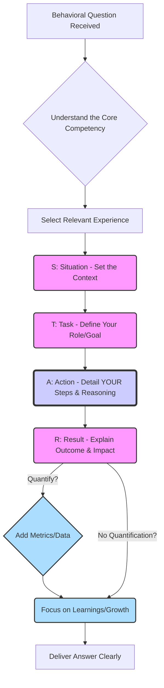

# Chapter 2: Mastering Communication and Articulation

Technical proficiency alone is insufficient to secure a senior frontend engineering role. While deep knowledge of JavaScript, CSS, frameworks, and architecture is crucial (as we'll explore in later chapters), the ability to _effectively communicate_ that knowledge, articulate design decisions, collaborate under pressure, and demonstrate leadership potential is paramount. Senior engineers are expected not just to solve problems but also to explain their solutions, influence technical direction, mentor others, and collaborate effectively across teams. Interviews are designed to assess these communication and articulation skills alongside technical depth.

This chapter focuses on the critical communication skills required to excel in senior frontend interviews. We'll delve into the art of thinking aloud, mastering visual communication through whiteboarding and diagramming, and handling various types of interview questions with clarity, depth, and confidence. Mastering these skills will allow you to showcase your expertise convincingly and differentiate yourself as a senior candidate.

## A. Thinking Aloud: The Core Interview Skill

Perhaps the single most important communication skill in a technical interview is the ability to "think aloud." Interviewers aren't just interested in the final answer; they want to understand _how_ you arrive at it. Your thought process reveals your problem-solving approach, your ability to handle ambiguity, your knowledge of trade-offs, and your systematic thinking – all critical attributes of a senior engineer. Remaining silent while coding or designing leaves the interviewer guessing and unable to assess these crucial aspects.

### 1. Verbalizing Your Thought Process During Coding Challenges

Coding challenges, whether algorithmic or practical UI tasks, are prime opportunities to showcase your thinking. Don't just start typing. Engage the interviewer by externalizing your internal monologue.

#### a. Explaining Assumptions and Constraints

No problem statement is perfectly complete. Before diving into code, explicitly state your understanding of the requirements and any assumptions you're making.

- **Clarify Inputs/Outputs:** "Okay, the function takes an array of numbers. Are these always integers? Can they be negative? What should happen if the input array is empty or null? Should I return an empty array, null, or throw an error? I'll assume for now it's non-empty arrays of integers, and I should return an empty array for empty input, but please correct me if that's wrong."
- **Identify Edge Cases:** "What are the potential edge cases here? An empty string, a string with only spaces, very large numbers, special characters? I need to consider how the solution handles these."
- **State Constraints:** "Given the potential size of the input list (say, up to 1 million items), a nested loop solution (O(n^2)) might be too slow. I should aim for something more efficient, perhaps O(n log n) or O(n)."
- **Resource Limitations:** "Are there memory constraints I should be aware of? Creating a large intermediate data structure might be problematic if memory is tight."

By explicitly stating assumptions and constraints, you demonstrate thoroughness, anticipate potential issues, and give the interviewer a chance to correct misunderstandings early on.

#### b. Discussing Potential Approaches and Trade-offs

Senior engineers rarely jump to the first solution that comes to mind. They evaluate alternatives. Verbalize this evaluation process.

- **Brainstorm Options:** "I see a couple of ways to approach this. We could use a hash map to track frequencies, which would give us O(n) time complexity but O(k) space complexity, where k is the number of unique elements. Alternatively, we could sort the array first (O(n log n) time, potentially O(1) or O(n) space depending on the sort) and then iterate through it, which might be simpler to implement but less time-efficient."
- **Analyze Pros and Cons:** "The hash map approach is faster asymptotically for large inputs, but uses extra memory. The sorting approach is slower but might be better if memory is highly constrained or if the input array is already partially sorted. Given the likely constraints, the hash map seems preferable here for its time efficiency. Let's proceed with that unless you see a reason otherwise?"
- **Consider Readability vs. Performance:** "I could write this check using a complex regular expression, which might be concise but potentially harder to read and maintain. A simpler approach using string methods might be slightly more verbose but clearer. For maintainability, I'll lean towards the clearer approach initially."

Discussing trade-offs (time vs. space complexity, readability vs. performance, simplicity vs. feature-completeness) demonstrates senior-level thinking. It shows you understand that engineering decisions involve balancing competing concerns.

#### c. Narrating Code Implementation Step-by-Step

As you write code (or pseudocode), explain _what_ you are doing and _why_. Don't just type silently.

- **Declare Intent:** "Okay, first I'll initialize an empty object to serve as our frequency map."
- **Explain Logic:** "Now, I'll iterate through the input array. For each number, I'll check if it's already a key in our map. If it is, I'll increment its count. If not, I'll add it to the map with a count of 1."
- **Describe Data Structures:** "I'm using a `Set` here because I only need to store unique values and checking for existence is efficient (O(1) on average)."
- **Justify Choices (Even Small Ones):** "I'm using `const` here because this variable's assignment won't change. Using `let` for the loop counter as it will be reassigned."
- **Handle Errors/Conditions:** "Inside the loop, I need to add a check for null or undefined values if the input constraints allow them. Let's add a guard clause here."

This running commentary keeps the interviewer engaged and allows them to follow your logic in real-time. It also helps _you_ structure your thoughts and catch potential errors as you articulate them.

#### d. [Practical Example: Thinking aloud through a complex algorithm problem]

**Problem:** Given an array of stock prices where `prices[i]` is the price on day `i`, find the maximum profit you can achieve. You can complete at most two transactions. (Note: You must sell before you can buy again).

**Thinking Aloud Process:**

1.  **Clarify/Assumptions:** "Okay, maximum profit with at most two transactions. Input is an array of numbers (prices). Prices are non-negative? Yes. Empty array? Return 0 profit. Array with one element? Return 0. 'At most two' means I can do zero, one, or two transactions. I must sell before buying again. Goal is to maximize total profit."
2.  **Initial Thoughts/Brute Force (and why it's bad):** "A naive approach might be to try all possible pairs of buy/sell points for the first transaction, and for each, try all possible pairs for the second transaction in the remaining days. This sounds like O(n^4) or O(n^3), which is definitely too slow for large inputs. We need something more efficient."
3.  **Considering One Transaction:** "If it were just one transaction, the classic approach is to iterate through, keeping track of the minimum price seen so far and the maximum profit achievable if selling on the current day. That's O(n) time and O(1) space."
4.  **Extending to Two Transactions:** "How can we extend this? Maybe divide the array at some point `i`. Find the max profit from one transaction in `prices[0...i]` and the max profit from one transaction in `prices[i+1...n-1]`. Then iterate `i` from 0 to n-1 and find the maximum sum of these two profits. Calculating max profit for a subarray repeatedly seems inefficient, maybe O(n^2)."
5.  **Optimization Idea (Dynamic Programming / Precomputation):** "What if we precompute? We can calculate the maximum profit achievable using _one_ transaction ending on or before day `i` for all `i`. Let's call this `maxProfitEndingAt[i]`. This can be done in a single forward pass (O(n) time, O(n) space), similar to the one-transaction problem.
    - `minPrice = prices[0]`
    - `maxProfitEndingAt[0] = 0`
    - `for i = 1 to n-1:`
      - `maxProfitEndingAt[i] = max(maxProfitEndingAt[i-1], prices[i] - minPrice)`
      - `minPrice = min(minPrice, prices[i])`
6.  **Completing the Second Transaction:** "Now, we also need the maximum profit from one transaction starting on or _after_ day `i`. We can calculate this with a _backward_ pass. Let's call this `maxProfitStartingAt[i]`.
    - `maxPrice = prices[n-1]`
    - `maxProfitStartingAt[n-1] = 0`
    - `for i = n-2 down to 0:`
      - `maxProfitStartingAt[i] = max(maxProfitStartingAt[i+1], maxPrice - prices[i])`
      - `maxPrice = max(maxPrice, prices[i])`
7.  **Combining Results:** "Now we have two arrays. The maximum profit with at most two transactions is the maximum value of `maxProfitEndingAt[i] + maxProfitStartingAt[i+1]` for all possible split points `i`. We also need to consider the case of just one transaction, which is covered by `maxProfitEndingAt[n-1]`. So, the final answer is `max(maxProfitEndingAt[n-1], max(maxProfitEndingAt[i] + maxProfitStartingAt[i+1] for i from 0 to n-2))`.
8.  **Complexity Analysis:** "This approach involves two forward passes and one backward pass, each taking O(n) time. We use two arrays of size n for storage, so O(n) space. This seems much better - O(n) time and O(n) space."
9.  **Implementation Narration:** "Okay, let's implement this. First, handle edge cases like empty or single-element arrays. Then, create the `maxProfitEndingAt` array and populate it with the forward pass. Then, create `maxProfitStartingAt` and populate it with the backward pass. Finally, iterate through to find the maximum sum, keeping track of the overall maximum profit found. Remember the edge case for the split point calculation (index `i+1` needs to be valid)."

This detailed narration shows a structured approach, consideration of complexity, exploration of alternatives, and a clear plan for implementation.

### 2. Articulating Design Decisions in System Design Interviews

System design interviews heavily rely on your ability to articulate complex ideas, justify choices, and discuss trade-offs at a higher level. Thinking aloud here involves explaining your reasoning behind architectural patterns, technology selections, and API designs.

#### a. Justifying Choices (Technology, Patterns, Architecture)

Don't just state _what_ you would use; explain _why_.

- **Framework Choice:** "For the frontend, I'd propose using React. Its component-based architecture fits well with building a reusable UI library, which seems beneficial for this system. Its large ecosystem and community support mean faster development and easier hiring. Alternatively, Vue could be considered for its potentially gentler learning curve, but given the scale and potential need for complex state management, React with Redux or Zustand might offer more robust solutions."
- **State Management:** "Given the complexity of shared state across multiple components (user authentication, notifications, shopping cart), a dedicated state management library is warranted. I'd lean towards Zustand for its simplicity and minimal boilerplate compared to Redux, while still providing centralized state. If the state logic becomes extremely complex with many side effects, Redux Toolkit with Redux Saga/Thunk might offer more powerful middleware options, but let's start simpler."
- **API Layer:** "To decouple the frontend from direct backend calls and handle aggregation or data transformation, I'd introduce a Backend-for-Frontend (BFF) layer using Node.js and Express/NestJS. This allows us to tailor API responses specifically for the frontend's needs, improving performance by reducing payload sizes and the number of requests the client makes. It also provides a buffer if backend microservices change."
- **Architectural Pattern:** "For the overall frontend architecture, considering the potential for multiple teams working on different features, a micro-frontend approach could be beneficial down the line. However, starting with a well-structured modular monolith is likely faster initially. We can design modules with clear boundaries (e.g., using domain-driven design principles) to facilitate a potential future migration to micro-frontends if needed."

Justifications should reference requirements (scalability, performance, maintainability, team structure, deadlines) and demonstrate awareness of alternatives.

#### b. Clearly Defining APIs and Data Contracts

When designing interactions between components or systems (e.g., frontend to BFF, BFF to backend microservices), clearly define the communication contracts.

- **Specify Endpoints:** "The BFF will expose a `/api/v1/products` endpoint. A GET request will fetch a list of products, supporting pagination via `?page=N&limit=M` query parameters. A POST request to `/api/v1/cart` with a body like `{ productId: '...', quantity: 1 }` will add an item to the cart."
- **Define Payloads:** "The response for `GET /api/v1/products` will look like this: `{ data: [{ id: '...', name: '...', price: ..., imageUrl: '...' }], pagination: { currentPage: N, totalPages: T, totalItems: I } }`. Error responses will follow a standard format, like `{ error: { code: '...', message: '...' } }`."
- **Mention Protocols:** "Communication between the browser and BFF will be over HTTPS using REST principles. We could consider GraphQL if the frontend needs highly flexible data fetching, but for now, REST seems sufficient and simpler to implement."
- **Versioning:** "API endpoints should be versioned (e.g., `/api/v1/`) to allow for future non-breaking changes."

Clarity here prevents ambiguity and shows you think about system integration details.

#### c. Discussing Scalability, Performance, and Reliability Considerations

Senior candidates must think beyond basic functionality. How will the system handle load? How will it perform? How can we make it resilient?

- **Scalability:** "The BFF layer can be scaled horizontally by running multiple instances behind a load balancer. Since it should be largely stateless (relying on backend services for state), this is straightforward. For the frontend, using a CDN for static assets is crucial for global scalability and reducing load on the origin server."
- **Performance:** "To optimize frontend performance, we'll implement code splitting by route and potentially by component using dynamic imports. We'll leverage browser caching heavily for assets and potentially API responses using cache headers (`Cache-Control`). Image optimization (correct formats like WebP, responsive images) is critical. We should also consider server-side rendering (SSR) or static site generation (SSG) for the main landing pages to improve perceived load time and SEO."
- **Reliability/Availability:** "We need robust error handling on the frontend and BFF. The BFF should implement retries with exponential backoff when calling backend services. Circuit breakers could be used to prevent cascading failures if a backend service is down. Monitoring (logging, metrics, tracing) is essential to detect and diagnose issues quickly. Health checks should be implemented for the BFF instances."

Discussing these "-ilities" demonstrates a holistic understanding of building production-ready systems.

#### d. [Production Note: How to discuss trade-offs without appearing indecisive]

A common trap is presenting trade-offs without making a recommendation. While acknowledging alternatives is good, senior engineers are expected to have opinions and make reasoned decisions.

- **Acknowledge, Justify, Recommend:** "Option A offers better raw performance but is more complex to implement and maintain. Option B is slightly slower but significantly simpler and faster to build. Given our tight deadline and the current performance requirements being met by Option B, I recommend starting with Option B. We can always optimize later if performance becomes a bottleneck, and we've identified Option A as a potential path."
- **State Assumptions:** "Assuming scalability is a higher priority than minimizing initial development time, I'd choose Technology X, despite its steeper learning curve."
- **Defer Non-Critical Decisions:** "Choosing between state management library Y or Z is something we can refine. Both are viable. Let's tentatively choose Y because the team has some familiarity, but mark this as a decision to revisit after the initial scaffolding is up."
- **Use Data (Even Hypothetical):** "If we anticipate >100,000 concurrent users, the scalability benefits of Architecture P outweigh the simplicity of Architecture Q. If the load is expected to be much lower, Q might be sufficient."

The key is to show you've _weighed_ the options and are making a _conscious, justified choice_ based on the (stated or assumed) priorities and constraints, rather than simply listing possibilities. Confidence in your recommendations, backed by solid reasoning, is crucial.

## B. Whiteboarding and Diagramming Techniques

Whether on a physical whiteboard or a digital equivalent, visual communication is a powerful tool in interviews. It helps clarify complex ideas, structure thoughts, and facilitate collaboration with the interviewer.

### 1. Effective Whiteboarding for Coding Problems

While less common for complex algorithms than system design, whiteboarding can still be useful for planning code structure, visualizing data structures, or working through examples.

#### a. Structuring Code Logically on the Board

Don't just scribble code randomly. Organize it.

- **Function Signatures First:** Write down the main function signature(s) clearly.
- **Sections:** Divide the board logically (e.g., main function, helper functions, data structure visualization, example walkthrough).
- **Indentation and Spacing:** Use clear indentation (even if approximate) and spacing to mimic code structure and improve readability.
- **Focus on Logic:** Prioritize getting the core logic and structure down. Don't worry excessively about perfect syntax unless specifically asked.

#### b. Using Pseudocode Effectively

Pseudocode is often more efficient on a whiteboard than writing syntactically perfect code.

- **Clarity over Syntax:** Use clear, English-like statements for complex operations (`find element in array`, `sort list`, `iterate through map entries`).
- **Standard Constructs:** Use common programming constructs like `if/else`, `for`, `while`, function calls.
- **Define Variables:** Briefly note the purpose of key variables (`// count = number of vowels found`).
- **Transition to Code:** Be prepared to translate pseudocode into actual code if requested. You can say, "Here's the pseudocode outlining the logic. Shall I write this out in JavaScript now?"

Pseudocode allows you to convey the algorithm or structure quickly without getting bogged down in minor syntax details, keeping the focus on the problem-solving approach.

#### c. Handling Corrections and Refinements Gracefully

You _will_ make mistakes or want to refine your approach. How you handle this is important.

- **Acknowledge Clearly:** "Ah, I see an issue here. This approach doesn't handle the edge case where the input array is empty. Let me correct that." or "Actually, a `Set` would be more efficient here than an array for checking duplicates. Let me update that part."
- **Explain the Fix:** Briefly explain _why_ the change is needed and _how_ you're fixing it.
- **Neat Corrections:** If using a physical whiteboard, erase cleanly or strike through neatly. On digital tools, use the editing features. Avoid creating a messy, unreadable board.
- **Involve the Interviewer:** "Does this revised approach make sense?" or "Is this handling of the edge case sufficient?"

Mistakes are normal. Handling them calmly, explaining your reasoning, and correcting them effectively demonstrates maturity and a good debugging mindset.

### 2. Visual Communication in System Design

Whiteboarding and diagramming are _essential_ for system design interviews. They allow you to represent complex architectures, data flows, and user interactions visually, making them much easier to understand and discuss.

#### a. Standard Diagramming Conventions (Component Diagrams, Flowcharts)

Using recognizable conventions makes your diagrams easier for the interviewer to interpret.

- **Component Diagrams:** Use boxes for components (UI, BFF, API, Database, Service), lines/arrows for interactions. Label components clearly. Indicate key technologies if relevant (e.g., "React SPA", "Node.js BFF", "PostgreSQL DB").
- **Flowcharts:** Use standard flowchart symbols (rectangles for processes, diamonds for decisions, parallelograms for input/output) to illustrate user flows or data processing sequences.
- **Sequence Diagrams (Optional but useful):** Can be used to show the order of interactions between components over time, especially for complex API call sequences.
- **Consistency:** Be consistent with your chosen shapes and line styles throughout the diagram. Provide a simple key if using non-standard notation.

#### b. Representing User Flows, Data Flows, and System Interactions

Diagrams should illustrate key aspects of the system:

- **High-Level Architecture:** Start with a broad overview showing the main system components (e.g., Client Browser, CDN, Load Balancer, Web Servers/Frontend Host, BFF, Backend APIs, Databases, Caches, Message Queues).
- **User Interaction Flow:** Diagram a specific user journey (e.g., "User logs in", "User searches for product", "User adds item to cart"). Show how the request flows through the different components.

  ```mermaid
  sequenceDiagram
      participant User
      participant Browser (React SPA)
      participant CDN
      participant BFF (Node.js)
      participant AuthService
      participant ProductService

      User->>Browser (React SPA): Enters credentials, clicks Login
      Browser (React SPA)->>BFF (Node.js): POST /api/v1/login {email, password}
      BFF (Node.js)->>AuthService: ValidateCredentials(email, password)
      AuthService-->>BFF (Node.js): {userId, token} / Error
      BFF (Node.js)-->>Browser (React SPA): Set HttpOnly Cookie (token), return {userProfile} / Error
      Browser (React SPA)->>User: Display logged-in state / Error message
  ```

  _Diagram Explanation:_ This sequence diagram illustrates the steps involved when a user logs in via the React Single Page Application (SPA). It shows the flow of requests from the browser to the Backend-for-Frontend (BFF), then to the Authentication Service, and the subsequent responses back to the user.

- **Data Flow:** Show how data moves through the system. Where is data stored? How is it cached? How does it get from the database to the UI?

  ```mermaid
  graph LR
      subgraph Browser
          direction LR
          UI(React Component) -- Renders --> DOM
          Store(State Mgmt e.g., Zustand) -- Updates --> UI
      end
      subgraph Network
          direction LR
          CDN -- Serves Static Assets --> Browser
          LB(Load Balancer)
      end
      subgraph Server Infrastructure
          direction LR
          BFF(Node.js BFF) -- Fetches/Transforms --> APIs
          APIs(Backend Microservices) -- CRUD --> DB[(Database)]
          Cache[(Redis Cache)] -- Caches --> BFF
          BFF -- Serves Data --> Browser
      end

      Browser -- API Calls --> LB
      LB -- Distributes Traffic --> BFF
      BFF -- Reads/Writes --> Cache
      UI -- Reads --> Store
      Store -- Populated by --> BFF
  ```

  _Diagram Explanation:_ This graph illustrates the high-level data flow in a typical frontend system. It shows static assets served by a CDN, API calls going through a load balancer to the BFF, the BFF interacting with backend APIs, a cache, and a database, and finally, data flowing into the frontend state management store which updates the UI.

- **API Interactions:** Zoom in on specific interactions, showing request/response formats or protocols used between key components (like the frontend and BFF).

#### c. Iterating on Designs Visually

Your first diagram shouldn't be your last. Use the whiteboard as a dynamic tool.

- **Start Simple:** Begin with a high-level overview.
- **Add Detail Incrementally:** As you discuss specific aspects (e.g., caching, authentication, a specific feature), add more detail or draw focused sub-diagrams.
- **Refine and Correct:** Don't be afraid to erase or modify parts of the diagram as the discussion evolves or you identify improvements. "Initially, I had the cache here, but thinking about the data access patterns, it makes more sense to put it closer to the BFF like this..."
- **Use Color/Highlighting (If available):** Use different colors or highlighting to emphasize certain flows, components, or potential bottlenecks.

The process of building and refining the diagram collaboratively with the interviewer is often as important as the final picture.

#### d. [Configuration Guide: Setting up a digital whiteboarding tool for practice]

Many interviews now use digital whiteboarding tools (e.g., Miro, Excalidraw, FigJam, or built-in tools in platforms like CoderPad). Familiarity is key.

1.  **Choose a Tool:** Select one or two popular free options (like Excalidraw - free, open-source, simple; or Miro/FigJam - free tiers available).
2.  **Practice Basic Shapes:** Get comfortable drawing boxes, circles, diamonds, and connectors/arrows quickly. Learn keyboard shortcuts if available.
3.  **Text and Labels:** Practice adding text labels to shapes and connectors efficiently. Ensure text is readable.
4.  **Connectors:** Understand how to draw arrows indicating direction (request, data flow). Learn how to make connections "stick" to shapes so they move together.
5.  **Grouping and Alignment:** Learn how to group elements and use alignment tools to keep diagrams tidy.
6.  **Saving/Exporting (Optional):** Understand how to save your work or export it if needed (though usually not required during the interview itself).
7.  **Practice Scenarios:** Redraw architectures from system design examples (e.g., design Twitter, design a TinyURL service) using the tool. Practice drawing component diagrams, user flows, and data flows. Time yourself to simulate interview pressure.
8.  **Test Screen Sharing:** If possible, practice using the tool while screen sharing in a mock call to ensure there are no technical glitches.

Spending even an hour or two familiarizing yourself with a digital tool can significantly reduce friction and anxiety during the actual interview.

## C. Handling Questions Effectively

Beyond thinking aloud and diagramming, directly answering questions posed by the interviewer is a core part of the process. This includes clarifying ambiguous requirements, structuring behavioral answers, responding to deep technical probes, and asking insightful questions yourself.

### 1. Clarifying Ambiguity: Asking the Right Questions

Never assume. If a requirement, constraint, or question is unclear, ask for clarification. This is not a sign of weakness; it's a sign of a careful, thorough engineer.

- **Problem Scope:** "You mentioned building a notification system. Should this support real-time updates (e.g., WebSockets), or is polling sufficient? What types of notifications are we talking about (in-app, email, push)? What's the expected scale (users, notification frequency)?"
- **Technical Constraints:** "Are there any existing technologies or infrastructure components I should be aware of or leverage?" "Is there a preference for a particular JavaScript framework or library?"
- **Coding Challenge Inputs/Outputs:** "What should the function return if the input array contains duplicates?" "Are negative numbers possible inputs?" "What is the expected format for the output?"
- **Behavioral Question Context:** "Could you clarify what you mean by 'a challenging project'? Are you interested in technical challenges, team dynamic challenges, or something else?"

**Good clarifying questions are:**

- **Specific:** Target a particular point of ambiguity.
- **Open-ended (often):** Encourage more than a yes/no answer (e.g., "Could you tell me more about the performance requirements?" instead of "Is performance important?").
- **Timely:** Ask them early before you go too far down a wrong path.

Asking clarifying questions saves time, prevents misunderstandings, and demonstrates proactive communication.

### 2. Answering Behavioral Questions with Depth (STAR Method Mastery)

Behavioral questions ("Tell me about a time when...") assess your past experiences as predictors of future behavior, focusing on soft skills like collaboration, conflict resolution, leadership, and handling failure. The STAR method (Situation, Task, Action, Result) provides a structured way to answer these questions effectively.

- **Situation:** Briefly describe the context. Set the scene. What was the project, team, and general environment? (Keep this concise).
- **Task:** What was your specific responsibility or the challenge you faced? What goal were you trying to achieve?
- **Action:** Describe the specific steps _you_ took to address the task or challenge. This is the most crucial part. Use "I" statements and focus on your individual contributions, thought processes, and behaviors. Detail _how_ you did something, not just _what_ you did.
- **Result:** What was the outcome of your actions? Quantify the results whenever possible. What did you learn? How did the situation resolve?

#### a. Selecting Relevant and Impactful Examples

Choose stories that genuinely showcase the competency the interviewer is asking about (e.g., leadership, conflict resolution, technical challenge).

- **Recency:** Prefer more recent examples (last 1-3 years) as they better reflect your current skill level.
- **Relevance:** Ensure the example directly addresses the question. If asked about conflict, don't primarily talk about a technical challenge.
- **Impact:** Choose situations where your actions had a clear, positive (or instructive, in case of failures) outcome.
- **Complexity:** Select examples appropriate for a senior role – situations involving ambiguity, difficult trade-offs, influencing others, or significant technical depth. Avoid overly simple scenarios.

Prepare 5-7 strong STAR stories covering common themes: challenging projects, failures/mistakes, disagreements/conflicts, leadership/mentorship, tight deadlines, initiative, dealing with ambiguity.

#### b. Quantifying Achievements and Contributions

Numbers add weight and credibility to your stories.

- **Instead of:** "I improved the performance of the page."
- **Try:** "I identified a bottleneck in the rendering process caused by excessive re-renders. By implementing memoization with `React.memo` and optimizing our selectors, I reduced the page load time by 35% (from 2.1s to 1.35s based on our RUM data) and decreased the main thread blocking time during interaction by 50%."
- **Instead of:** "I helped mentor a junior engineer."
- **Try:** "I mentored a junior engineer over three months through weekly 1:1s and pair programming sessions, helping them successfully deliver their first major feature (a new settings panel) independently and contributing to a 15% reduction in their onboarding time compared to previous hires."

Look for metrics related to performance (load time, bundle size, Lighthouse scores), business impact (conversion rates, user engagement, revenue), efficiency (development time saved, bugs reduced), or team improvements (onboarding time, code review turnaround). Even estimates ("roughly doubled the throughput," "saved dozens of developer hours per month") are better than nothing.

#### c. Focusing on Learnings and Growth

Especially when discussing failures or challenges, end your STAR answer by highlighting what you learned and how you grew from the experience.

- "The key takeaway for me was the importance of proactive communication with stakeholders. Since then, I've made it a point to establish clearer expectations and provide more regular updates, even when there isn't major progress to report."
- "This experience taught me the value of thorough automated testing, especially for critical user flows. We subsequently increased our test coverage by 40% and implemented end-to-end tests, which caught several regressions before they reached production."
- "I learned that my initial technical approach was too complex. In retrospect, a simpler solution would have sufficed. This reinforced the importance of YAGNI (You Ain't Gonna Need It) and prioritizing simplicity, especially under deadlines."

This demonstrates self-awareness, a growth mindset, and the ability to learn from experience – all highly valued senior traits.

#### d. [Case Study: Analyzing a poorly vs. well-structured STAR answer]

**Question:** "Tell me about a time you had a disagreement with a colleague about a technical approach."

**Poor Answer:**
"Yeah, one time my co-worker wanted to use library X for state management, but I thought library Y was better. We kind of argued about it for a bit in Slack. Eventually, the tech lead stepped in and decided we should use library Y, so I was right. It worked out fine."

- **Critique:** Too brief, lacks detail. Doesn't explain _why_ the disagreement occurred (the technical merits). Focuses on "winning" rather than collaboration or resolution process. Doesn't detail the _Actions_ taken to resolve it beyond "argued." No clear _Result_ beyond "it worked out fine." Doesn't show senior-level communication or influence.

**Well-Structured STAR Answer:**

- **(Situation):** "On a recent project building a new customer dashboard, we needed to choose a state management library. Our team was small – just myself, another senior engineer, and a mid-level engineer."
- **(Task):** "My colleague, the other senior engineer, strongly advocated for using Redux, citing its established patterns and robust middleware ecosystem. My task was to evaluate this proposal and present my own assessment, as I had concerns about its complexity for our specific needs and team experience."
- **(Action):** "First, I acknowledged the valid points my colleague raised about Redux's power. Then, I did some research comparing Redux (with Toolkit) to alternatives like Zustand and Jotai, focusing on criteria relevant to our project: bundle size impact, learning curve for the mid-level engineer, boilerplate code required for common tasks (fetching data, managing simple UI state), and ease of testing. I put together a short document outlining the pros and cons of each, including small code snippets demonstrating typical usage patterns. I specifically highlighted that Zustand offered sufficient capabilities for our anticipated state complexity (centralized store, async actions, selectors) with significantly less boilerplate and a gentler learning curve, potentially speeding up development. I scheduled a meeting with my colleague and the tech lead. In the meeting, I presented my findings calmly, focusing on the data and project requirements rather than personal preference. I actively listened to my colleague's counter-arguments regarding Redux's long-term scalability and middleware benefits. We discussed the trade-offs openly."
- **(Result):** "After the discussion, weighing the immediate need for development velocity and ease of onboarding against potential future complexity, we collectively agreed (including my colleague) to start with Zustand. We documented the decision and the reasoning. The mid-level engineer was able to become productive with Zustand within a couple of days. The project was delivered on time, and the state management code remained clean and manageable. We also agreed to revisit the decision if our state management needs grew significantly more complex in the future. The disagreement was resolved constructively, strengthening our team's decision-making process."

- **Critique:** Follows STAR clearly. Provides context. Details the specific actions taken (research, documentation, presentation, active listening, focusing on data). Explains the _reasoning_ behind the disagreement and the resolution. Quantifies the result where possible (onboarding speed, on-time delivery). Shows collaboration, research, and influencing skills. Ends on a positive note about team process.



_Diagram Explanation:_ This flowchart visualizes the steps involved in constructing a strong answer using the STAR method. It emphasizes understanding the question, selecting the right story, detailing each component (Situation, Task, Action, Result), quantifying the impact, and highlighting learnings. The "Action" step is highlighted as particularly crucial.

### 3. Responding to Technical Deep Dive Questions

These questions probe your understanding of specific technologies, concepts, or principles (e.g., "Explain the browser's critical rendering path," "How does prototypal inheritance work in JavaScript?", "Compare SSR and SSG," "How would you debug a memory leak in a Node.js application?").

#### a. Demonstrating Depth Without Rambling

Show you know the topic well, but be concise and structured.

- **Start High-Level:** Begin with a concise definition or overview of the concept.
- **Elaborate with Key Details:** Provide important specifics, mechanisms, or components. Use correct terminology.
- **Provide Examples:** Illustrate the concept with a brief, concrete code snippet or analogy if appropriate.
- **Discuss Trade-offs/Implications:** Mention why this concept is important, its benefits, drawbacks, or common use cases.
- **Check Understanding:** Pause occasionally ("Does that make sense?", "Should I go into more detail on any part of that?") to ensure the interviewer is following and to gauge their desired level of depth. Avoid long, uninterrupted monologues.

#### b. Admitting Knowledge Gaps Gracefully (and How to Follow Up)

It's impossible to know everything. Pretending you do is worse than admitting a gap.

- **Be Honest:** "That's a specific API/library I haven't had direct experience with." or "I understand the general concept of [related topic], but I'm not familiar with the specific internals of [the exact thing asked]."
- **Offer Related Knowledge:** "While I haven't used [Specific Library X], I've worked extensively with [Similar Library Y], which aims to solve a similar problem. My understanding is that X differs primarily in [mention known difference, e.g., its rendering strategy or state management approach]." This shows you can relate concepts.
- **Show Problem-Solving:** "If I encountered this problem on the job, my first step would be to consult the official documentation for X. I'd look for examples related to [the problem context] and perhaps search for blog posts or articles comparing it to Y, which I know." This demonstrates how you learn and solve problems.
- **Express Curiosity (Optional but good):** "That sounds interesting. Could you briefly explain the key advantage of using X in that scenario?" or "I'll definitely make a note to read up on that after the interview."

Honesty, combined with demonstrating related knowledge and a proactive approach to learning, is far better received than bluffing.

#### c. Connecting Theoretical Knowledge to Practical Experience

Whenever possible, link theoretical concepts to real-world applications or experiences you've had.

- **Instead of:** "Closures allow inner functions to access outer function scope."
- **Try:** "Closures are fundamental in JavaScript. For example, they are what make techniques like the module pattern or event handlers in loops work correctly. I've often used them to create private state within components or to manage callbacks in asynchronous operations, ensuring the callback has access to the necessary context when it executes."
- **Instead of:** "SSR renders the page on the server."
- **Try:** "We implemented Server-Side Rendering using Next.js on our e-commerce site's product pages. This significantly improved our First Contentful Paint (FCP) times and helped with SEO indexing, as search engine crawlers received fully rendered HTML. The trade-off was increased server load and complexity compared to a pure client-side rendered app, which we mitigated with caching."

Connecting theory to practice demonstrates that you don't just understand concepts abstractly but know how and why they are applied in real projects.

### 4. Asking Insightful Questions to the Interviewer

The end of the interview, when the interviewer asks, "Do you have any questions for me?", is not just a formality. It's your final opportunity to demonstrate your engagement, curiosity, and what matters to you in a role and company. Poor or generic questions can leave a weak final impression, while insightful questions can significantly boost your candidacy.

#### a. Questions Demonstrating Technical Curiosity

These show your passion for the craft and interest in their specific technical environment.

- "Could you tell me more about the team's approach to frontend testing? What's the balance between unit, integration, and end-to-end tests? What tools are you using?"
- "What's the biggest technical challenge the frontend team is currently facing or anticipates in the next 6-12 months?"
- "How does the team handle dependency updates and manage technical debt in the frontend codebase?"
- "I saw the company uses [Specific Technology X] on the backend. How does the frontend team typically interact with those APIs? Is there a BFF layer, or do you use something like GraphQL?"
- "What opportunities are there for learning and adopting new frontend technologies or patterns within the team?"

#### b. Questions About Team, Culture, and Engineering Practices

These help you assess if the team and company are a good fit for you and show you care about the working environment.

- "What does the typical development workflow look like? (e.g., Agile sprints, Kanban, code review process, deployment frequency)"
- "How does the team handle collaboration and knowledge sharing? Are there regular tech talks, pair programming sessions, or documentation practices?"
- "Can you describe the team's culture? What are the team's values?"
- "How is performance evaluated for engineers? What does career growth look like within the engineering team?"
- "What is the balance between feature development and addressing technical debt or infrastructure improvements?"
- "How does the company support work-life balance for its engineers?"

#### c. Questions Revealing Strategic Thinking

These questions show you're thinking beyond just code and considering the bigger picture, relevant for senior roles.

- "How does the frontend team collaborate with product management and design? How are technical feasibility and trade-offs discussed during the planning phase?"
- "What are the company's or product's major strategic goals for the next year, and how does the frontend team's work align with those goals?"
- "How does the company measure the success of new features or frontend improvements? What metrics are tracked?"
- "Are there initiatives around frontend platform development, design systems, or shared infrastructure to support multiple product teams?"

**Tips for Asking Questions:**

- **Prepare Ahead:** Have 3-5 thoughtful questions ready, but listen during the interview – new questions might arise.
- **Tailor:** Reference something specific you discussed or learned about the company/role if possible.
- **Prioritize:** Ask your most important questions first, as time may be limited.
- **Listen Actively:** Pay attention to the answers; they contain valuable information for your decision.
- **Avoid Generic Questions:** Don't ask questions easily answered by a quick look at their website (e.g., "What does your company do?").
- **Salary/Benefits:** Generally, save detailed compensation questions for discussions with the recruiter or HR, not the technical interviewers, unless they bring it up.

Asking insightful questions demonstrates your engagement, intelligence, and genuine interest in the role and company, leaving a strong positive final impression.

---

Mastering communication is not just about passing the interview; it's about being an effective senior engineer. The ability to clearly articulate technical concepts, justify decisions, collaborate visually, and handle questions with poise is fundamental to success in the role. By practicing thinking aloud, refining your whiteboarding skills, mastering the STAR method, and preparing insightful questions, you equip yourself to demonstrate your full potential and stand out in the competitive senior frontend interview process.
