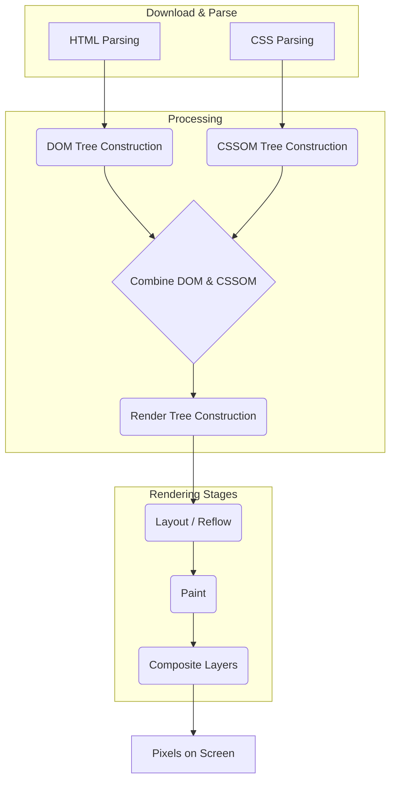

# Chapter 4: Advanced CSS and Layout Architectures

Mastering CSS and understanding how browsers render web pages are non-negotiable skills for a senior frontend engineer. While frameworks and JavaScript often dominate discussions, a deep understanding of CSS, layout principles, architecture, and performance implications remains fundamental. Senior interviews will probe beyond basic syntax, testing your ability to build complex, responsive, maintainable, and performant user interfaces using modern CSS techniques and scalable architectural patterns.

This chapter dives deep into the advanced CSS concepts and architectural strategies you'll need to demonstrate seniority. We'll explore modern CSS features, compare different layout systems and architectural methodologies, and dissect the browser rendering pipeline to understand and optimize CSS performance.

## A. Modern CSS Features and Techniques

The CSS landscape has evolved significantly. Modern features provide powerful tools for creating dynamic, responsive, and maintainable styles without relying solely on JavaScript or preprocessors.

### 1. CSS Variables (Custom Properties): Dynamic Theming, Scoping

CSS Custom Properties, often called CSS Variables, allow you to define reusable values directly within your CSS, unlocking powerful capabilities like dynamic theming and improved code organization.

- **Declaration:** Variables are declared using a double-hyphen prefix (e.g., `--primary-color: #007bff;`) and are typically defined within a selector, often `:root` for global scope or a component selector for local scope.
- **Usage:** They are accessed using the `var()` function (e.g., `color: var(--primary-color);`).
- **Dynamic Theming:** Variables can be updated dynamically using JavaScript (`element.style.setProperty('--primary-color', '#ff0000');`) or by changing class names on parent elements where different variable values are defined. This makes implementing light/dark modes or user-customizable themes significantly easier than traditional methods.
- **Scoping:** Variables follow standard CSS cascade and inheritance rules. Defining a variable on a specific element creates a local scope, overriding global values for that element and its descendants. This is useful for component-specific variations.
- **Fallback Values:** The `var()` function accepts an optional second parameter as a fallback value if the custom property is not defined (e.g., `color: var(--button-text-color, black);`).

> **Interview Insight:** Be prepared to discuss the advantages of CSS Variables over preprocessor variables (like Sass variables). Key differences include runtime access/manipulation via JavaScript and standard CSS inheritance/cascade behavior for CSS Variables, whereas preprocessor variables are compiled away.

**Practical Example: Simple Theme Switcher**

```css
/* styles.css */
:root {
  --bg-color: #ffffff;
  --text-color: #333333;
  --primary-color: #007bff;
  --border-radius: 4px;
}

[data-theme="dark"] {
  --bg-color: #222222;
  --text-color: #eeeeee;
  --primary-color: #1a8cff;
}

body {
  background-color: var(--bg-color);
  color: var(--text-color);
  transition: background-color 0.3s ease, color 0.3s ease;
}

.button {
  background-color: var(--primary-color);
  color: white;
  padding: 10px 15px;
  border: none;
  border-radius: var(--border-radius);
  cursor: pointer;
  transition: background-color 0.3s ease;
}

.button:hover {
  filter: brightness(1.1);
}
```

```javascript
// theme-switcher.js
const themeToggle = document.getElementById("theme-toggle");

themeToggle.addEventListener("click", () => {
  const currentTheme = document.documentElement.getAttribute("data-theme");
  const newTheme = currentTheme === "dark" ? "light" : "dark";
  document.documentElement.setAttribute("data-theme", newTheme);
  // Optionally save preference to localStorage
});

// Set initial theme based on preference or system setting
// (Example: prefers-color-scheme media query or localStorage)
const prefersDark = window.matchMedia("(prefers-color-scheme: dark)").matches;
document.documentElement.setAttribute(
  "data-theme",
  prefersDark ? "dark" : "light"
);
```

This example demonstrates how changing a single attribute (`data-theme`) on the root element dynamically alters the appearance of multiple elements by leveraging inherited CSS Variables.

### 2. Advanced Selectors and Combinators (`:is()`, `:where()`, `:has()`)

Modern CSS offers powerful selectors that simplify complex selections and help manage specificity.

- **:is() Pseudo-class:** Takes a list of selectors as an argument and matches any element that can be selected by one of the selectors in the list. Its specificity is that of the _most specific_ selector in its argument list. This helps group selectors without repeating complex parent selectors.

  ```css
  /* Before :is() */
  header nav a:hover,
  header ul a:hover,
  footer nav a:hover,
  footer ul a:hover {
    text-decoration: underline;
  }

  /* After :is() */
  :is(header, footer) :is(nav, ul) a:hover {
    text-decoration: underline;
  }
  ```

- **:where() Pseudo-class:** Similar to `:is()`, but it _always_ has zero specificity. This is incredibly useful for creating low-specificity base styles or overrides that shouldn't accidentally increase the overall specificity of a rule.

  ```css
  /* Use :where() for default link styling to make overrides easier */
  :where(a) {
    color: blue; /* Zero specificity */
    text-decoration: none;
  }

  /* This rule easily overrides the default, even with a simple selector */
  .special-link {
    color: green; /* Specificity (0,1,0) overrides :where(a) */
  }
  ```

- **:has() Pseudo-class (The "Parent Selector"):** Selects an element if any of the relative selectors passed as an argument match _at least one element_ when anchored against the initial element. This allows styling an element based on its descendants or subsequent siblings.

  ```css
  /* Style a form field's container if the input inside is invalid */
  .form-field:has(input:invalid) {
    border-left: 3px solid red;
    background-color: #fff0f0;
  }

  /* Style a card if it contains an image */
  .card:has(img) {
    padding: 0; /* Remove padding if an image fills the card */
  }

  /* Style heading that is immediately followed by a paragraph */
  h2:has(+ p) {
    margin-bottom: 0.5em;
  }
  ```

  > **Caution:** While powerful, `:has()` can have performance implications if used excessively with complex descendant checks, though browser vendors are optimizing its implementation. Use it judiciously.

Understanding and utilizing these selectors demonstrates a sophisticated grasp of CSS capabilities, enabling cleaner, more maintainable, and often more powerful styling logic directly within CSS.

### 3. Layout Systems Mastery

Flexbox and Grid are the cornerstones of modern web layout. Senior engineers must demonstrate deep understanding and know when and how to use each effectively, often in combination.

#### a. Flexbox: Deep Dive into Alignment, Justification, and Wrapping Scenarios

Flexbox excels at distributing space and aligning items along a single axis (row or column).

- **Main Axis vs. Cross Axis:** Understand the `flex-direction` property (`row`, `row-reverse`, `column`, `column-reverse`) determines the main axis. `justify-content` aligns items along the main axis, while `align-items` aligns items along the cross axis. `align-content` aligns flex lines when `flex-wrap: wrap` is used and there's extra space in the cross axis.
- **Alignment Properties:**
  - `justify-content`: `flex-start`, `flex-end`, `center`, `space-between`, `space-around`, `space-evenly`.
  - `align-items`: `stretch` (default), `flex-start`, `flex-end`, `center`, `baseline`.
  - `align-self`: Overrides `align-items` for individual flex items.
- **Flexibility (`flex` shorthand):** Controls how flex items grow and shrink.
  - `flex-grow`: Proportion to distribute extra space.
  - `flex-shrink`: Proportion to shrink when space is insufficient.
  - `flex-basis`: Initial size before distributing space (`auto` or a length/percentage). The `flex` shorthand (`flex: <grow> <shrink> <basis>`) is preferred (e.g., `flex: 1 1 auto;`).
- **Wrapping (`flex-wrap`):** `nowrap` (default), `wrap`, `wrap-reverse`. Essential for responsive design where items should flow onto multiple lines. Use `align-content` to control the spacing _between_ these lines.
- **Common Scenarios & Gotchas:**
  - Centering an item perfectly: `display: flex; justify-content: center; align-items: center;` on the container.
  - Equal height columns: Default behavior with `align-items: stretch;`.
  - Pushing an item to the end: Use `margin-left: auto;` (in a row direction) or `margin-top: auto;` (in a column direction) on the specific flex item.
  - Interaction with `min-width`/`min-height`: Flex items won't shrink below their minimum content size by default. Use `min-width: 0;` or `overflow: hidden;` on the flex item if you need it to shrink further (e.g., for text truncation).

#### b. Grid: Complex Grid Structures, `grid-template-areas`, `subgrid`

CSS Grid excels at two-dimensional layout, allowing precise control over both rows and columns simultaneously.

- **Defining the Grid:**
  - `display: grid;` or `display: inline-grid;` on the container.
  - `grid-template-columns` / `grid-template-rows`: Define track sizes using lengths, percentages, `fr` units (fraction of available space), `minmax()`, `auto`.
  - `grid-gap` (or `row-gap`, `column-gap`): Defines spacing between tracks.
- **Placing Items:**
  - Line-based placement: `grid-column-start`, `grid-column-end`, `grid-row-start`, `grid-row-end` (shorthands: `grid-column`, `grid-row`).
  - `grid-area`: Shorthand for all four line numbers or assigns an item to a named area.
- **`grid-template-areas`:** A powerful, visual way to define grid structure and place items. Assign names to grid cells and then assign grid items to those named areas using `grid-area`.

  ```css
  .container {
    display: grid;
    grid-template-columns: 1fr 3fr;
    grid-template-rows: auto 1fr auto;
    grid-template-areas:
      "header header"
      "sidebar main"
      "footer footer";
    min-height: 100vh;
    gap: 10px;
  }

  .header {
    grid-area: header;
  }
  .sidebar {
    grid-area: sidebar;
  }
  .main {
    grid-area: main;
  }
  .footer {
    grid-area: footer;
  }
  ```

- **Alignment:** Similar properties to Flexbox, but applied to the grid container (`justify-items`, `align-items`, `justify-content`, `align-content`) and individual grid items (`justify-self`, `align-self`).
- **`subgrid`:** Allows a nested grid container to inherit the track definition (rows or columns, or both) of its parent grid. This is extremely useful for aligning items across nested structures without manually calculating track sizes.

  ```css
  .parent-grid {
    display: grid;
    grid-template-columns: 1fr 1fr 1fr;
    gap: 10px;
  }

  .nested-item {
    /* Inherit the parent's column tracks */
    grid-column: span 3; /* Span across all parent columns */
    display: grid;
    grid-template-columns: subgrid; /* Use parent's column definition */
    gap: 5px; /* Can have its own gap */
  }

  .nested-item > div {
    /* These divs will align perfectly with the parent grid's columns */
    background-color: lightblue;
    padding: 10px;
  }
  ```

  > **Note:** Browser support for `subgrid` is good but check compatibility if supporting older browsers is critical.

#### c. Intrinsic Web Design Concepts (min-content, max-content, fit-content)

These keyword values for sizing grid tracks (and other elements) allow layouts to adapt based on the content itself, leading to more robust and flexible designs.

- `min-content`: The intrinsic minimum width (or height) of the content. For text, this is often the width of the longest word. Useful for preventing content overflow in constrained spaces.
- `max-content`: The intrinsic preferred width (or height). For text, this is the width the content would take if laid out on a single, infinitely long line. Useful when you want a container to be exactly as wide as its content needs.
- `fit-content(<length-percentage>)`: Represents `max(min-content, min(max-content, <length-percentage>))`. It makes the track/element act like `max-content` but clamps it at the provided argument size, while ensuring it's never smaller than `min-content`. Great for columns that should be content-sized but not exceed a certain limit.

Using these alongside `fr` units and `minmax()` allows for highly adaptive layouts. For example, `grid-template-columns: auto minmax(min-content, 500px) 1fr;` creates three columns: the first sized intrinsically, the second sized intrinsically but capped at 500px, and the third taking the remaining space.

#### d. [Practical Example: Building a complex, responsive layout using Grid and Flexbox]

Let's design a common page layout: Header, Footer, Sidebar (collapsible on mobile), and Main Content area.

```html
<body class="page-layout">
  <header class="page-header">Header Content</header>
  <aside class="page-sidebar">Sidebar Navigation</aside>
  <main class="page-content">
    <h1>Main Content Area</h1>
    <p>...</p>
    <div class="card-container">
      <div class="card">Card 1</div>
      <div class="card">Card 2</div>
      <div class="card">Card 3</div>
    </div>
  </main>
  <footer class="page-footer">Footer Content</footer>
</body>
```

```css
/* Basic Reset/Setup */
body {
  margin: 0;
  font-family: sans-serif;
}
.page-header,
.page-footer {
  background-color: #f0f0f0;
  padding: 1rem;
}
.page-sidebar {
  background-color: #e0e0e0;
  padding: 1rem;
}
.page-content {
  padding: 1rem;
}

/* Grid Layout for larger screens */
.page-layout {
  display: grid;
  grid-template-columns: 250px 1fr; /* Sidebar fixed width, main content flexible */
  grid-template-rows: auto 1fr auto; /* Header/Footer auto height, main content takes rest */
  grid-template-areas:
    "header header"
    "sidebar main"
    "footer footer";
  min-height: 100vh;
}

.page-header {
  grid-area: header;
}
.page-sidebar {
  grid-area: sidebar;
}
.page-content {
  grid-area: main;
}
.page-footer {
  grid-area: footer;
}

/* Flexbox for the card container within the main content */
.card-container {
  display: flex;
  flex-wrap: wrap; /* Allow cards to wrap */
  gap: 1rem; /* Spacing between cards */
  margin-top: 1rem;
}

.card {
  flex: 1 1 200px; /* Grow, shrink, basis of 200px */
  background-color: #fff;
  border: 1px solid #ccc;
  padding: 1rem;
  border-radius: 4px;
  min-height: 100px; /* Example fixed height */
  display: flex; /* Use flex for internal card alignment */
  justify-content: center;
  align-items: center;
}

/* Responsive adjustments for smaller screens */
@media (max-width: 768px) {
  .page-layout {
    grid-template-columns: 1fr; /* Single column layout */
    grid-template-rows: auto auto 1fr auto; /* Header, Sidebar, Main, Footer */
    grid-template-areas:
      "header"
      "sidebar" /* Sidebar now stacks above main */
      "main"
      "footer";
  }

  .page-sidebar {
    /* Optional: Add styles for a toggle button if sidebar is collapsible */
  }

  .card {
    flex-basis: 100%; /* Make cards full width on small screens */
  }
}
```

This example demonstrates:

1.  **CSS Grid:** Used for the overall page structure, defining distinct areas and controlling their relationship in 2D space.
2.  **Responsiveness:** Media queries adjust the `grid-template-areas` and `grid-template-columns` to stack elements vertically on smaller screens.
3.  **Flexbox:** Used _within_ the main content area (`.card-container`) to arrange child elements (`.card`) in a flexible, wrapping row. The `flex` property on `.card` allows them to grow and shrink appropriately.
4.  **Combining Systems:** Grid handles the macro layout, while Flexbox handles the micro layout within a grid area. This is a common and effective pattern.

### 4. CSS Functions (`calc()`, `min()`, `max()`, `clamp()`)

These functions allow you to perform calculations and comparisons directly within CSS property values.

- **`calc()`:** Performs mathematical calculations (+, -, \*, /) using different units. Essential for mixing relative units (like `%` or `vw`) with fixed units (like `px` or `rem`).
  ```css
  .element {
    width: calc(100% - 80px); /* Full width minus fixed padding/margins */
    height: calc(
      100vh - var(--header-height)
    ); /* Full viewport height minus header */
    font-size: calc(1rem + 0.5vw); /* Base size plus viewport scaling */
  }
  ```
  > **Note:** Ensure spaces around `+` and `-` operators within `calc()`. Multiplication (`*`) and division (`/`) don't strictly require spaces but are recommended for readability. Division by zero results in an invalid value.
- **`min()`:** Takes one or more comma-separated values and returns the smallest. Useful for setting a maximum size based on dynamic conditions.
  ```css
  .container {
    width: min(90%, 1200px); /* Be 90% wide, but no wider than 1200px */
  }
  ```
- **`max()`:** Takes one or more comma-separated values and returns the largest. Useful for setting a minimum size.
  ```css
  .element {
    padding: max(
      1rem,
      5%
    ); /* Padding is at least 1rem, or 5% if that's larger */
  }
  ```
- **`clamp(<min>, <preferred>, <max>)`:** Clamps a value between an upper and lower bound. It takes three arguments: a minimum value, a preferred value, and a maximum value. The function returns the preferred value, but ensures it's never less than the minimum or greater than the maximum. Ideal for fluid typography or spacing.

  ```css
  h1 {
    /* Font size scales with viewport width (2vw)
       Minimum size: 1.5rem
       Maximum size: 3rem */
    font-size: clamp(1.5rem, 1rem + 2vw, 3rem);

    /* Fluid padding */
    padding: clamp(10px, 5%, 30px);
  }
  ```

These functions provide sophisticated control over sizing and spacing, enabling more fluid and responsive designs with less reliance on JavaScript or complex media queries.

### 5. Transforms and Animations: Performance Considerations

CSS transforms (`translate`, `scale`, `rotate`, `skew`) and animations (`transition`, `@keyframes`) are powerful tools for creating engaging user interfaces. However, animating the wrong properties can severely impact performance.

#### a. `transform` vs. Geometric Properties (Layout Thrashing)

- **Geometric Properties:** Animating properties that affect layout (e.g., `width`, `height`, `margin`, `padding`, `top`, `left`) forces the browser to recalculate layout (reflow/layout) for the element and potentially many others on the page. This is computationally expensive.
- **`transform` and `opacity`:** Animating `transform` and `opacity` is significantly cheaper. These properties typically only affect the _compositing_ stage of the rendering pipeline (or sometimes paint, but rarely layout). The browser can often move the element's layer on the GPU without recalculating layout or repainting large areas.
- **Layout Thrashing:** This occurs when JavaScript rapidly alternates between writing properties that affect layout (like setting `element.style.width`) and reading properties that require layout information (like `element.offsetWidth`). This forces synchronous, repeated layout calculations, leading to jerky animations and unresponsive pages. While often discussed in a JS context, choosing performant CSS properties for animation avoids triggering unnecessary layouts in the first place.

> **Rule of Thumb:** For smooth animations, prioritize animating `transform` and `opacity`. Avoid animating layout-triggering properties whenever possible.

#### b. Hardware Acceleration (`will-change`, `translateZ(0)`)

Browsers try to optimize animations by promoting animated elements to their own _compositor layer_. This allows the element to be moved and transformed by the GPU independently, without requiring repainting of other elements.

- **How it Works:** Certain CSS properties, notably `transform: translateZ(0)` or `transform: translate3d(0,0,0)`, were historically used as hacks to force layer promotion. Using 3D transforms signals to the browser that the element might change in 3D space, often triggering promotion. `opacity < 1` and elements with specific `position` values (like `fixed`) can also trigger layer promotion.
- **`will-change` Property:** The modern, explicit way to hint to the browser about expected changes. `will-change: transform;` or `will-change: opacity;` tells the browser "I plan to animate this property, you might want to optimize for it (e.g., by creating a compositor layer)."
  > **`will-change` Caveats:**
  >
  > - **Use Sparingly:** Don't apply `will-change` to too many elements. Creating excessive layers consumes GPU memory and can paradoxically _hurt_ performance.
  > - **Apply Just Before & Remove After:** Ideally, apply `will-change` shortly before an animation starts (e.g., on hover/focus) and remove it once the animation completes. Leaving it on permanently can keep optimizations active longer than necessary.
  > - **Not a Magic Bullet:** It's a hint, not a command. The browser decides whether to act on it. Prioritize animating performant properties first.

#### c. Web Animations API vs. CSS Transitions/Animations

- **CSS Transitions:** Simple, declarative way to animate property changes between two states (e.g., on hover or class change). Easy to use for basic effects. `transition: property duration timing-function delay;`
- **CSS Animations (`@keyframes`):** Define multi-step animations using `@keyframes` rules. More control than transitions, allowing complex sequences, but still declarative. `animation: name duration timing-function delay iteration-count direction fill-mode play-state;`
- **Web Animations API (WAAPI):** A JavaScript API providing imperative control over animations.
  - **Pros:** Granular control (play, pause, reverse, seek, change playback rate), dynamic creation of animations, better synchronization with application logic, potentially better performance for complex, synchronized sequences as it can bypass some main thread work compared to frequent style updates via JS.
  - **Cons:** More verbose than CSS animations, requires JavaScript, slightly steeper learning curve.
  - **Use Cases:** Complex timeline animations, user-controlled animations (like scrubbing), synchronizing animations with network events or user input, dynamic animation effects based on data.

> **Senior Perspective:** Know when each approach is appropriate. For simple UI state transitions, CSS Transitions/Animations are often sufficient and easier to maintain. For complex, interactive, or dynamically generated animations, WAAPI offers more power and control.

#### d. [Code Snippet: Optimizing a CSS animation for smoothness]

**Scenario:** Animate an element sliding in from the left.

**Less Performant (using `left`):**

```css
.slide-in-bad {
  position: absolute;
  left: -100%;
  width: 200px;
  height: 100px;
  background-color: lightcoral;
  transition: left 0.5s ease-out; /* Animating 'left' triggers layout */
}

.slide-in-bad.active {
  left: 20px;
}
```

**More Performant (using `transform: translateX`):**

```css
.slide-in-good {
  position: absolute;
  left: 20px; /* Set final position using layout property */
  width: 200px;
  height: 100px;
  background-color: lightseagreen;
  transform: translateX(-100% - 20px); /* Initial offset using transform */
  transition: transform 0.5s ease-out; /* Animate 'transform' */

  /* Hint for optimization (apply ideally on interaction/before animation) */
  /* will-change: transform; */
}

.slide-in-good.active {
  transform: translateX(0); /* Target state using transform */
}

/* Example of applying will-change dynamically (pseudo-code) */
/*
element.addEventListener('mouseenter', () => {
  element.style.willChange = 'transform';
});
element.addEventListener('transitionend', () => {
  element.style.willChange = 'auto'; // Remove hint after animation
});
*/
```

In the "good" example, we set the element's static position using `left` once, then use `transform: translateX()` to handle the visual movement. The animation only affects the compositing stage, resulting in a much smoother experience, especially on complex pages or less powerful devices. Adding `will-change: transform` (ideally dynamically) can further enhance performance by prompting layer promotion.

## B. CSS Architecture and Methodologies at Scale

Writing CSS for small projects is straightforward. Writing maintainable, scalable, and performant CSS for large applications with multiple developers requires robust architectural patterns and methodologies. Senior engineers are expected to understand the trade-offs of different approaches and make informed decisions based on project needs.

### 1. BEM (Block, Element, Modifier): Rationale and Scalability

BEM is a popular naming convention designed to create independent, reusable UI components with clear, predictable CSS class names, minimizing specificity conflicts and improving maintainability in large codebases.

- **Core Concepts:**
  - **Block:** A standalone entity that is meaningful on its own (e.g., `.menu`, `.button`, `.card`). Represents the top-level component.
  - **Element:** A part of a block that has no semantic meaning outside of it (e.g., `.menu__item`, `.button__icon`, `.card__title`). Denoted by double underscores (`__`). Elements are always tied to their block.
  - **Modifier:** A flag on a block or element used to change its appearance, behavior, or state (e.g., `.menu--theme-dark`, `.button--disabled`, `.card__title--large`). Denoted by double hyphens (`--`).
- **Rationale:**
  - **Modularity:** Blocks are independent, making them reusable across the project.
  - **Specificity Management:** By relying on single, specific class names for styling, BEM avoids complex selector chains and keeps specificity low and flat, reducing unexpected overrides.
  - **Clarity:** The naming convention makes the relationship between HTML and CSS explicit and easy to understand. You can often infer the structure and purpose of an element just by looking at its class name.
  - **Scalability:** Provides a shared vocabulary and structure that helps teams collaborate effectively on large projects.
- **Scalability Considerations:**
  - **Pros:** Excellent for large teams and projects requiring strict consistency and long-term maintainability. Reduces CSS conflicts significantly.
  - **Cons:** Can lead to verbose class names. Requires discipline from the team to adhere to the convention. Might feel overly prescriptive for smaller projects. Doesn't inherently solve issues like unused CSS or dynamic styling as effectively as some other methods.

> **Interview Angle:** Discuss scenarios where BEM shines (large teams, design systems, long-lived applications) and where its rigidity might be overkill. Compare its approach to specificity and scoping with other methodologies.

### 2. CSS-in-JS Solutions (Styled Components, Emotion)

CSS-in-JS libraries allow you to write CSS styles directly within your JavaScript or TypeScript component files. Popular examples include Styled Components and Emotion.

- **Core Idea:** Component styles are colocated with the component logic, often using tagged template literals or object styles. The library generates unique class names, injects styles into the DOM (typically via `<style>` tags), and handles scoping automatically.

#### a. Pros and Cons: Performance, DX, SSR

- **Pros:**
  - **Scoped Styles:** Styles are automatically scoped to the component, eliminating global namespace collisions (similar benefit to CSS Modules or Shadow DOM).
  - **Colocation:** Styles live next to the component logic/markup, improving developer experience (DX) and maintainability for component-centric architectures.
  - **Dynamic Styling:** Easy to adapt styles based on component props or application state using standard JavaScript logic.
  - **Dead Code Elimination:** Since styles are tied to components, bundlers can more easily remove unused CSS when components are tree-shaken.
  - **JavaScript Ecosystem:** Leverage variables, functions, and tooling from the JavaScript ecosystem for styling.
- **Cons:**
  - **Runtime Overhead:** Styles are often processed and injected at runtime (though build-time extraction is possible with some setups), which can add a small performance cost compared to static CSS files.
  - **Bundle Size:** The library itself adds to the JavaScript bundle size. Generated CSS might also be larger than handwritten CSS if not carefully managed.
  - **SSR Complexity:** Server-Side Rendering requires specific setup to extract and inject the critical CSS for the initial page load, avoiding a Flash of Unstyled Content (FOUC). Libraries provide utilities for this, but it adds complexity.
  - **Learning Curve:** Requires understanding the specific library's API and patterns.
  - **Separation of Concerns Debate:** Challenges the traditional separation of HTML, CSS, and JS, which some developers prefer.

#### b. Dynamic Styling and Theming

CSS-in-JS excels here. Styles can directly reference component props or theme context.

```javascript
// Example using Emotion (React)
import styled from "@emotion/styled";
import { useTheme } from "@emotion/react"; // Assuming a ThemeProvider setup

const Button = styled.button`
  padding: 10px 15px;
  border-radius: 4px;
  border: 1px solid ${(props) =>
      props.variant === "outline" ? props.theme.colors.primary : "transparent"};
  background-color: ${(props) => {
    if (props.disabled) return props.theme.colors.disabledBg;
    if (props.variant === "outline") return "transparent";
    return props.theme.colors.primary;
  }};
  color: ${(props) =>
    props.variant === "outline"
      ? props.theme.colors.primary
      : props.theme.colors.buttonText};
  cursor: ${(props) => (props.disabled ? "not-allowed" : "pointer")};
  opacity: ${(props) => (props.disabled ? 0.6 : 1)};

  &:hover {
    background-color: ${(props) =>
      !props.disabled && props.variant !== "outline"
        ? props.theme.colors.primaryHover
        : null};
    border-color: ${(props) =>
      !props.disabled && props.variant === "outline"
        ? props.theme.colors.primaryHover
        : null};
    color: ${(props) =>
      !props.disabled && props.variant === "outline"
        ? props.theme.colors.primaryHover
        : null};
  }
`;

// Usage within a component
function MyComponent() {
  const theme = useTheme(); // Access theme context
  return (
    <>
      <Button>Primary</Button>
      <Button variant="outline" theme={theme}>
        Outline
      </Button>
      <Button disabled theme={theme}>
        Disabled
      </Button>
    </>
  );
}
```

#### c. Critical CSS Extraction

For SSR, CSS-in-JS libraries need a mechanism to determine which styles are used by the components rendered on the server. They provide utilities (like Emotion's `@emotion/server` or Styled Components' `ServerStyleSheet`) to collect these styles during server rendering and inject them as `<style>` tags or static CSS files in the initial HTML response. This ensures the page is styled correctly before client-side JavaScript hydrates the application.

#### d. [Code Snippet: Implementing a themed component using Emotion/Styled Components]

(See the dynamic styling example above for a themed button using Emotion.)

### 3. Utility-First CSS (Tailwind CSS)

Utility-first frameworks, with Tailwind CSS being the most prominent example, provide a large set of low-level, single-purpose utility classes (e.g., `pt-4` for `padding-top: 1rem;`, `flex` for `display: flex;`, `text-red-500` for a specific red color). You compose complex styles directly in your HTML by applying these utility classes.

#### a. Philosophy and Benefits

- **Rapid Prototyping:** Quickly build UIs without switching contexts between HTML and CSS files or inventing class names.
- **Constraint-Based Design:** Encourages using predefined design tokens (spacing, colors, typography scales) from the configuration, leading to more consistent UIs.
- **No Naming Conventions Needed:** Avoids the cognitive load of naming things (like in BEM).
- **Performance:** When combined with purging tools (like PurgeCSS, or Tailwind's built-in JIT engine), the final CSS bundle contains only the utility classes actually used in the project, often resulting in very small CSS files.
- **Maintainability:** Styles are colocated with the markup they affect, making it easy to see how an element is styled without searching through CSS files. Changes are often localized to the HTML.

#### b. Customization and Configuration

Tailwind is highly customizable via its `tailwind.config.js` file. You can extend or override the default theme (colors, spacing, fonts, breakpoints), add custom utilities, and integrate plugins.

#### c. Managing Bundle Size

- **Purging/JIT:** This is crucial. Without purging, the default Tailwind CSS file is very large. Tailwind's Just-in-Time (JIT) engine (now default in v3+) generates styles on demand as you use classes in your templates, ensuring the final build only includes necessary CSS. Older setups used PurgeCSS to scan template files and remove unused classes post-build.
- **Avoiding Premature Abstraction:** Resist the urge to immediately abstract common utility combinations into component classes (`@apply`). Use utilities directly first. Abstract only when a pattern becomes genuinely reusable and complex. Over-abstraction can negate some of Tailwind's benefits.

#### d. [Practical Example: Rapidly prototyping a UI component with Tailwind]

**Scenario:** Build a simple notification component.

```html
<div
  class="max-w-sm mx-auto my-4 p-4 rounded-md shadow-md bg-blue-100 border-l-4 border-blue-500 flex items-center space-x-3"
>
  <!-- Icon -->
  <svg
    class="h-6 w-6 text-blue-500 flex-shrink-0"
    xmlns="http://www.w3.org/2000/svg"
    fill="none"
    viewBox="0 0 24 24"
    stroke="currentColor"
  >
    <path
      stroke-linecap="round"
      stroke-linejoin="round"
      stroke-width="2"
      d="M13 16h-1v-4h-1m1-4h.01M21 12a9 9 0 11-18 0 9 9 0 0118 0z"
    />
  </svg>
  <!-- Text Content -->
  <div>
    <h4 class="font-semibold text-blue-800">Information</h4>
    <p class="text-sm text-blue-700">
      This is an informational message using Tailwind CSS utilities.
    </p>
  </div>
</div>
```

This example builds a styled notification entirely by composing utility classes directly in the HTML:

- `max-w-sm mx-auto my-4`: Sizing and centering.
- `p-4 rounded-md shadow-md`: Padding, border-radius, shadow.
- `bg-blue-100 border-l-4 border-blue-500`: Background and border colors/styles.
- `flex items-center space-x-3`: Flexbox layout for icon and text.
- `h-6 w-6 text-blue-500 flex-shrink-0`: Icon sizing, color, and flex behavior.
- `font-semibold text-blue-800`, `text-sm text-blue-700`: Text styling.

This demonstrates the speed and directness of the utility-first approach for UI construction.

### 4. Scoping Strategies (CSS Modules, Shadow DOM)

Besides CSS-in-JS, other techniques provide style scoping to prevent conflicts.

- **CSS Modules:**

  - **How it works:** You write standard CSS in `.module.css` files. During the build process, class names are transformed into unique identifiers (e.g., `.button` becomes `.MyComponent_button__aB3xY`). You import the generated class names into your JavaScript component and apply them.
  - **Pros:** Local scope by default, uses standard CSS syntax, build-time process (no runtime overhead like some CSS-in-JS), allows composition (`composes`).
  - **Cons:** Requires build tool integration, managing global styles or overrides needs specific syntax (`:global(...)`), less dynamic than CSS-in-JS.

  ```css
  /* Button.module.css */
  .button {
    background-color: blue;
    color: white;
    padding: 10px;
  }
  .primary {
    composes: button; /* Inherit styles from .button */
    background-color: green;
  }
  ```

  ```javascript
  // Button.jsx (React example)
  import styles from "./Button.module.css";

  function Button({ isPrimary, children }) {
    const className = isPrimary ? styles.primary : styles.button;
    return <button className={className}>{children}</button>;
  }
  ```

- **Shadow DOM:**
  - **How it works:** Part of the Web Components standard. Allows creating a hidden, encapsulated DOM tree (`shadow root`) attached to an element. Styles defined within the shadow root (`<style>...</style>` or linked stylesheets) only apply to elements inside that shadow root and are shielded from external styles (unless explicitly exposed via CSS Custom Properties or ::part/::theme).
  - **Pros:** True encapsulation (both CSS and DOM), native browser feature, great for creating standalone, reusable widgets or components.
  - **Cons:** Can be more complex to set up than other methods, styling from the outside requires specific techniques (`::part`, CSS Custom Properties), potentially trickier server-side rendering story (though declarative shadow DOM is improving this).

### 5. Managing Specificity and Inheritance in Large Codebases

Regardless of the chosen methodology, managing the CSS cascade, specificity, and inheritance remains crucial.

- **Low Specificity:** Aim for low-specificity selectors (e.g., single class names) as your default. Avoid overly complex selectors (`#sidebar .nav > ul li a.active`) and overuse of `!important`.
- **Consistent Structure:** Adopt a clear structure for your CSS (e.g., base styles, layout rules, component styles, utility classes).
- **Layering (`@layer`):** The CSS Cascade Layers specification (`@layer`) provides explicit control over the cascade order, independent of specificity or source order. You define layers (e.g., `base`, `layout`, `components`, `utilities`), and rules within later layers override rules in earlier layers, even if they have lower specificity. This is a powerful tool for managing large stylesheets predictably.

  ```css
  @layer base, components, utilities;

  @layer base {
    a {
      text-decoration: none;
      color: blue;
    } /* Low specificity */
  }

  @layer components {
    .button {
      /* Higher specificity than 'a' */
      padding: 0.5em 1em;
      border-radius: 4px;
    }
    .button-link {
      /* Specific component style */
      background: none;
      border: none;
      color: red; /* Overrides base 'a' color due to layer order */
    }
  }

  @layer utilities {
    .padding-large {
      padding: 2em !important;
    } /* Utilities might need !important */
  }
  ```

- **Avoid `!important`:** Use it only as a last resort, often for utility classes designed to override everything else or for temporary debugging. Overuse makes debugging specificity issues extremely difficult.
- **Understand Inheritance:** Be mindful of which properties are inherited (e.g., `color`, `font-family`) and which are not (e.g., `background-color`, `padding`, `border`). Use `inherit`, `initial`, `unset`, and `revert` keywords consciously.

### 6. [Production Note: Strategies for CSS code splitting and loading]

For optimal performance, especially on large applications, avoid loading all CSS upfront.

- **Route-Based Splitting:** Split CSS based on application routes or pages. Only load the CSS needed for the current view. Frameworks and bundlers often have built-in support for this.
- **Component-Based Splitting:** Load CSS only when a specific component (especially large, infrequently used ones like modals or complex widgets) is actually rendered or imported dynamically.
- **Critical CSS Inlining:** Identify the minimal CSS required to style the "above-the-fold" content for the initial view. Inline this critical CSS directly in the `<head>` of the HTML document. Load the rest of the CSS asynchronously (e.g., using `<link rel="stylesheet" ... media="print" onload="this.media='all'">` or JavaScript). This significantly improves the First Contentful Paint (FCP) time. Tools exist to automate critical CSS extraction.
- **HTTP/2 and HTTP/3:** These protocols reduce the overhead of multiple requests, making splitting CSS into smaller files less detrimental (and potentially beneficial for caching) than it was with HTTP/1.1.

Choosing the right CSS architecture involves trade-offs between developer experience, performance, scalability, and team conventions. Senior engineers should be able to articulate these trade-offs and justify their choices based on project context.

## C. Browser Rendering Pipeline and CSS Performance

Understanding how browsers translate HTML and CSS into pixels on the screen is vital for diagnosing performance bottlenecks and writing efficient CSS. Optimizing CSS isn't just about file size; it's also about how CSS rules affect the different stages of rendering.

### 1. Critical Rendering Path Explained

The Critical Rendering Path (CRP) refers to the sequence of steps the browser takes to render the initial view of a web page. Optimizing the CRP is crucial for perceived performance (how quickly the user sees content).



**Diagram Explanation:** This flowchart illustrates the key stages of the Critical Rendering Path. It starts with parsing HTML and CSS to build the DOM and CSSOM trees. These are combined into the Render Tree, which then undergoes Layout (calculating geometry), Paint (filling in pixels), and Composition (drawing layers to the screen). Optimizing involves speeding up each of these steps, especially those blocking initial rendering.

- **DOM Construction:** Parsing HTML into the Document Object Model. Blocked by synchronous JavaScript.
- **CSSOM Construction:** Parsing CSS into the CSS Object Model. Blocked by CSS files being downloaded and parsed. CSS is render-blocking by default.
- **Render Tree:** Combining DOM and CSSOM to determine which nodes are visible and their computed styles. Nodes like `<head>` or elements with `display: none;` are omitted.
- **Layout (Reflow):** Calculating the exact size and position of each element in the Render Tree. This is often the most expensive step, as changing one element's geometry can affect many others.
- **Paint:** Filling in the pixels for each element based on its computed styles (color, background, borders, text, etc.) onto distinct layers.
- **Composite:** Drawing the various layers onto the screen in the correct order, applying transforms and opacity. This step is often handled efficiently by the GPU.

### 2. Style Calculation, Layout (Reflow), Paint, and Composition

Understanding which CSS properties affect which stage is key to performance optimization:

- **Style Calculation:** The browser determines the final computed styles for each element based on selector matching, cascade rules, and inheritance. Complex selectors _can_ slightly increase this time, but it's rarely the main bottleneck compared to Layout or Paint.
- **Layout (Reflow):** Triggered by changes to geometric properties (e.g., `width`, `height`, `padding`, `margin`, `border`, `top`, `left`, `font-size`, `text-align`, `flex-basis`). Also triggered by reading certain DOM properties like `offsetWidth` or `getComputedStyle()` after a style change. This is expensive as it requires recalculating positions and dimensions, potentially for large parts of the document.
- **Paint:** Triggered by changes to visual properties that don't affect layout (e.g., `color`, `background-color`, `box-shadow`, `outline`, `visibility`). The browser needs to redraw the affected areas. Less expensive than Layout, but can still be costly if large or complex areas need repainting.
- **Composition:** Triggered _ideally_ only by changes to `transform` and `opacity`. The browser can often just move existing painted layers around or change their transparency without recalculating layout or repainting pixels. This is the cheapest operation.

> **Performance Goal:** Structure your CSS and interactions to primarily trigger Composition, avoid Layout changes whenever possible, and minimize the area and complexity of Paints.

### 3. Identifying and Mitigating Layout Thrashing

Layout thrashing (or Forced Synchronous Layout) occurs when JavaScript forces the browser to perform layout calculations repeatedly and synchronously within a single frame.

- **Cause:** Alternating between writing to the DOM (changing styles that affect geometry) and reading from the DOM (accessing properties like `offsetHeight`, `offsetWidth`, `offsetTop`, `offsetLeft`, `scrollTop`, `scrollWidth`, `getComputedStyle()`). Reading these properties forces the browser to ensure the layout is up-to-date _right now_ to provide an accurate value, potentially recalculating layout if changes were just made.
- **Example (Causes Thrashing):**

  ```javascript
  function resizeElements(elements) {
    for (let i = 0; i < elements.length; i++) {
      // READ: Forces layout calculation if styles were pending
      const currentWidth = elements[i].offsetWidth;

      // WRITE: Invalidates layout
      elements[i].style.width = currentWidth / 2 + "px";
    }
  }
  ```

  Inside the loop, we read `offsetWidth` (forcing layout if needed) and then immediately write `style.width` (invalidating layout again). This happens for every element.

- **Mitigation (Batching Reads/Writes):** Group DOM reads together and DOM writes together.

  ```javascript
  function resizeElementsOptimized(elements) {
    // Batch READS
    const widths = [];
    for (let i = 0; i < elements.length; i++) {
      widths.push(elements[i].offsetWidth); // Read all widths first
    }

    // Batch WRITES
    for (let i = 0; i < elements.length; i++) {
      elements[i].style.width = widths[i] / 2 + "px"; // Apply all changes
    }
  }
  ```

  This approach forces layout calculation only once (during the read phase) and then applies all changes, allowing the browser to potentially perform a single layout calculation afterwards. Using `requestAnimationFrame` can also help batch operations to occur just before the browser renders the next frame.

### 4. Optimizing CSS Selector Performance (Though often negligible)

While micro-optimizing selectors rarely yields significant gains compared to fixing layout thrashing or optimizing assets, understanding the principles is good practice:

- **How Browsers Match Selectors:** Browsers typically match selectors from right to left. For `nav ul li a`, the browser first finds all `<a>` elements, then checks if their parent is an `<li>`, then if that parent is a `<ul>`, and finally if that is inside a `<nav>`.
- **Efficiency:**
  - Class (`.my-class`) and ID (`#my-id`) selectors are very fast.
  - Tag selectors (`div`) are fast.
  - Universal selector (`*`), attribute selectors (`[type="text"]`), and pseudo-classes/elements (`:hover`, `::before`) can be less efficient, especially if not qualified by a tag, class, or ID on the rightmost side.
  - Descendant combinator (` `) can be less efficient than child (`>`) or adjacent sibling (`+`) combinators, especially in deep or complex DOM trees.
- **Practical Advice:**
  1.  **Prioritize Maintainability:** Write clear, understandable selectors first. BEM or similar conventions naturally lead to efficient class-based selectors.
  2.  **Avoid Overly Qualified Selectors:** `nav ul li.item a.link` is usually unnecessary; `.nav-link` or `.menu-item-link` is often sufficient and more performant (though marginally).
  3.  **Scope Selectors:** Use techniques like CSS Modules, CSS-in-JS, or Shadow DOM to limit the scope where selectors need to be evaluated.
  4.  **Profile, Don't Guess:** If you suspect selector performance is an issue (unlikely), use browser DevTools to measure Style Calculation time before spending time on micro-optimizations.

### 5. Using Browser DevTools for Rendering Performance Analysis

Browser developer tools (Chrome DevTools, Firefox Developer Tools) are essential for diagnosing CSS-related performance issues.

- **Performance Tab:**
  - **Record Runtime Performance:** Record interactions or page loads that feel slow.
  - **Frames View:** Shows frame rate (FPS). Look for red bars (long frames) indicating jank.
  - **Main Thread Activity (Bottom-Up/Call Tree/Event Log):** Analyze the breakdown of tasks within a frame. Look for long-running "Layout", "Paint", "Update Layer Tree", or "Composite Layers" events. Purple "Rendering" blocks indicate layout/style calculation, green "Painting" blocks indicate paint/composite. Long yellow "Scripting" blocks might indicate layout thrashing caused by JavaScript.
  - **Identify Forced Layouts:** Look for warnings about "Forced reflow" or "Layout thrashing" often highlighted in the details of JavaScript execution blocks.
- **Rendering Tab (Chrome) / Paint Flashing (Firefox):**
  - **Paint Flashing:** Highlights areas of the screen being repainted in green. Useful for identifying unexpected or overly large paint areas during interactions or animations.
  - **Layout Shift Regions:** Highlights elements that shifted layout unexpectedly (contributing to Cumulative Layout Shift - CLS).
  - **Layer Borders:** Draws borders around compositor layers. Helps visualize which elements are promoted and debug layer count issues.
- **Layers Panel (Chrome):** Provides a detailed view of compositor layers, their memory usage, and the reason for their creation (e.g., "Has a 3D transform"). Useful for debugging excessive layer creation caused by `will-change` or transform hacks.

### 6. [Troubleshooting Section: Debugging common CSS layout and rendering issues]

Senior engineers frequently encounter and debug tricky CSS problems. Here are common issues and approaches:

- **`z-index` Not Working:**
  - **Cause:** `z-index` only applies to _positioned_ elements ( `position` other than `static`). Elements also need to be within the same _stacking context_. A new stacking context is created by elements with `position: absolute/relative` and `z-index` other than `auto`, `position: fixed/sticky`, `opacity < 1`, `transform` other than `none`, `filter` other than `none`, etc.
  - **Debug:** Use DevTools to inspect the element and its ancestors. Check `position` and `z-index` values. Identify the stacking contexts involved using the Layers panel or by inspecting parent properties that create new contexts. Adjust `z-index` values _within the same stacking context_ or restructure the HTML/CSS to place elements in the desired context.
- **Unexpected Overflow/Scrollbars:**
  - **Cause:** Content exceeding the dimensions of its container, often combined with `overflow: auto` or `overflow: scroll`. Can be caused by fixed widths/heights, large padding/borders within fixed containers (`box-sizing: border-box` helps!), absolutely positioned elements extending beyond bounds, or long unbroken words/strings.
  - **Debug:** Inspect the overflowing element and its container in DevTools. Check computed dimensions, padding, borders, and margins. Use `outline: 1px solid red;` temporarily on suspected elements to visualize their boundaries. Check for `white-space: nowrap` or long words. Use `overflow: hidden` temporarily on containers to identify which one is the source. Solutions might involve `overflow-wrap: break-word;`, `min-width: 0;` on flex/grid items, adjusting dimensions, or setting `overflow` appropriately.
- **Flexbox/Grid Alignment Issues:**
  - **Cause:** Misunderstanding main/cross axis, incorrect `justify-content`/`align-items`/`align-content` values, `align-self`/`justify-self` overrides, implicit vs explicit grid tracks, `margin: auto` interactions in Flexbox.
  - **Debug:** Use DevTools' dedicated Flexbox and Grid inspectors. These overlays visualize lines, gaps, and alignment properties directly on the page. Double-check property values and ensure they apply to the correct axis/context (container vs item). Simplify the layout temporarily to isolate the problematic element or property.
- **Mysterious Spacing:**
  - **Cause:** Default browser margins (use a CSS reset), collapsing margins between adjacent elements or parent/child elements, `inline-block` elements respecting whitespace in HTML, line-height adding space.
  - **Debug:** Inspect elements in DevTools, paying close attention to the Box Model view showing margin, border, padding, and content size. Check for collapsing margins (margins between adjacent siblings combine; margin between parent and first/last child can combine if there's no border/padding). For `inline-block` spacing, set `font-size: 0` on the parent or remove whitespace in HTML. Check `line-height`.
- **Performance Jank/Slow Animations:**
  - **Cause:** Animating layout properties, layout thrashing, excessive paint areas, too many compositor layers, complex `box-shadow` or `filter` effects during animation.
  - **Debug:** Use the Performance tab in DevTools to record the animation/interaction. Look for long frames, identify expensive Layout or Paint operations. Use Paint Flashing to see what's being repainted. Use Layer Borders/Layers Panel to check layer promotion. Refactor animations to use `transform` and `opacity`. Optimize expensive effects (e.g., simplify shadows during animation). Mitigate layout thrashing by batching reads/writes.

Mastering advanced CSS, understanding layout systems deeply, choosing appropriate architectures, and knowing how to debug rendering performance are hallmarks of a senior frontend engineer. Being able to articulate the "why" behind your CSS choices and demonstrate proficiency in these areas is critical for success in senior interviews.
