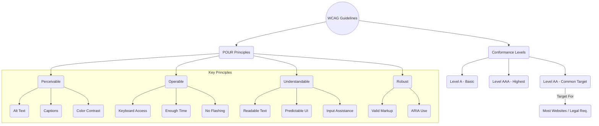
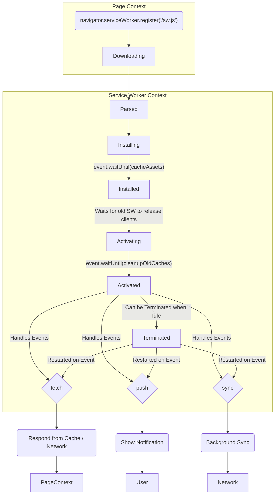

# Chapter 5: HTML Semantics, Accessibility (A11y), and APIs

While JavaScript frameworks and complex state management often dominate frontend discussions, a senior engineer understands that the foundation of any robust web application lies in well-structured HTML, universal accessibility, and the effective use of browser APIs. Interviews for senior roles will probe beyond surface-level knowledge, expecting you to demonstrate a deep understanding of how these core technologies impact user experience, maintainability, performance, and SEO. This chapter delves into the nuances of semantic HTML, the critical importance and practical implementation of web accessibility (A11y), and the powerful capabilities offered by modern browser APIs.

## A. Semantic HTML for Structure and Meaning

Semantic HTML isn't just about using different tags; it's about conveying the _meaning_ and _structure_ of your content to browsers, assistive technologies, search engines, and fellow developers. Moving beyond the crutch of `<div>` and `<span>` for everything is a hallmark of experienced development.

### 1. Choosing the Right Element for the Job (Beyond `<div>` and `<span>`)

The overuse of generic `<div>` (block-level) and `<span>` (inline-level) elements, often termed "divitis," leads to markup that lacks inherent meaning. While sometimes necessary for styling hooks or specific layout structures (especially with frameworks), relying solely on them obscures the document's outline and purpose.

**Why it Matters:**

- **Accessibility:** Screen readers and other assistive technologies rely on semantic elements to understand the page structure and allow users to navigate efficiently (e.g., jumping between headings, landmarks, or lists).
- **SEO:** Search engines use semantic markup to better understand the content's hierarchy and relevance, potentially improving rankings.
- **Maintainability:** Code becomes more self-documenting. A `<nav>` element clearly indicates navigation, an `<article>` denotes self-contained content, and a `<button>` signifies an interactive control, making the codebase easier to understand and modify.
- **Browser Functionality:** Some semantic elements have built-in browser behaviors or styling (though often reset), like `<button>` elements being focusable and activatable via keyboard by default.

**Decision Process:**

Before reaching for a `<div>`, ask:

1.  **What is the _purpose_ of this content block?**
    - Is it navigation? Use `<nav>`.
    - Is it the main content of the page? Use `<main>`.
    - Is it self-contained, distributable content (like a blog post or product card)? Use `<article>`.
    - Is it a thematic grouping of content, often with a heading? Use `<section>`.
    - Is it tangentially related content (like a sidebar)? Use `<aside>`.
    - Is it introductory content or navigational aids for a section/page? Use `<header>`.
    - Is it footer content for a section/page? Use `<footer>`.
    - Is it a heading? Use `<h1>` - `<h6>` appropriately, reflecting the document outline, not just for styling text size.
    - Is it a list? Use `<ul>`, `<ol>`, or `<dl>`.
    - Is it a quotation? Use `<blockquote>` or `<q>`.
    - Is it emphasizing text? Use `<em>` (stress emphasis) or `<strong>` (strong importance).
    - Is it representing user input or code? Use `<kbd>`, `<code>`, `<samp>`, or `<var>`.
    - Is it defining a term? Use `<dfn>`.
    - Is it an interactive control? Use `<button>`, `<input>`, `<select>`, `<textarea>`, or `<a>` (for navigation).
2.  **Does a more specific HTML element exist that accurately describes this content?** If yes, use it.
3.  **If no specific element fits perfectly, is the element purely for styling or layout grouping?** Only then should `<div>` or `<span>` be the primary choice.

> **Senior Insight:** In interviews, be prepared to justify your element choices. Explaining _why_ you chose `<article>` over `<section>` or `<button>` over a styled `<div>` demonstrates a deeper understanding than simply knowing the tags exist.

### 2. HTML5 Structural Elements (`<article>`, `<aside>`, `<nav>`, `<section>`, etc.)

HTML5 introduced several elements specifically designed to give structure to web pages. Understanding their intended use is crucial.

- **`<main>`:** Represents the dominant content of the `<body>`. There should only be one visible `<main>` element per page. It helps assistive technologies quickly locate the primary content.
- **`<article>`:** Represents a complete, self-contained composition that is independently distributable or reusable (e.g., a forum post, blog entry, news story, product card). Articles can be nested (e.g., comments within a blog post article).
- **`<section>`:** Represents a thematic grouping of content, typically with a heading (`<h1>`-`<h6>`). It's a generic sectioning element used when no more specific element applies. Don't use it just as a wrapper for styling; it should define a distinct part of the document outline.
- **`<nav>`:** Represents a section containing navigation links, either to other pages or to different parts of the same page. Not all groups of links need to be in a `<nav>` (e.g., links in a `<footer>`). Use it for primary navigation blocks.
- **`<aside>`:** Represents content tangentially related to the content around it. Often used for sidebars, pull quotes, or advertising. If removed, the main content should still make sense.
- **`<header>`:** Represents introductory content, typically a group of introductory or navigational aids. Can be used inside various elements (`<body>`, `<article>`, `<section>`) but usually contains headings, logos, search forms, author names, etc.
- **`<footer>`:** Represents a footer for its nearest sectioning content or sectioning root element (e.g., `<body>`, `<article>`, `<section>`). Typically contains information about the author, copyright data, or links to related documents.
- **`<hgroup>` (Use with caution):** Originally intended to group multiple headings (`<h1>`-`<h6>`), its semantics were redefined, and browser support/understanding is inconsistent. It's generally safer to use a single appropriate heading level within a `<header>` or directly within the sectioning element.
- **`<address>`:** Represents contact information for its nearest `<article>` or `<body>` ancestor.

**Example: Structuring a Blog Post**

```html
<body>
  <header>
    <h1>My Awesome Blog</h1>
    <nav>
      <ul>
        <li><a href="/">Home</a></li>
        <li><a href="/about">About</a></li>
      </ul>
    </nav>
  </header>

  <main>
    <article>
      <header>
        <h2>Understanding Semantic HTML</h2>
        <p>
          Published on <time datetime="2023-10-27">October 27, 2023</time> by
          Jane Doe
        </p>
      </header>
      <p>Semantic HTML is crucial for...</p>
      <section>
        <h3>Why Use Semantic Elements?</h3>
        <p>Accessibility, SEO, and maintainability are key benefits...</p>
      </section>
      <section>
        <h3>Common Pitfalls</h3>
        <p>Overusing divs, incorrect heading structures...</p>
      </section>
      <footer>
        <p>Tags: html, semantics, web development</p>
      </footer>
    </article>

    <aside>
      <h3>Related Posts</h3>
      <ul>
        <li><a href="/css-tricks">CSS Tricks</a></li>
        <li><a href="/js-patterns">JS Patterns</a></li>
      </ul>
    </aside>
  </main>

  <footer>
    <p>&copy; 2023 My Awesome Blog</p>
    <address>Contact: <a href="mailto:jane@example.com">Jane Doe</a></address>
  </footer>
</body>
```

### 3. Forms and Input Elements: Best Practices for Usability and A11y

Forms are critical interaction points. Semantic HTML is paramount here for usability and accessibility.

- **`<form>` Element:** Wraps the entire form. Attributes like `action` and `method` are fundamental, but also consider `novalidate` for client-side validation control and `autocomplete` for user convenience and security.
- **`<label>` Element:** **Crucial.** Every form control (`<input>`, `<textarea>`, `<select>`) needs an associated `<label>`. Use the `for` attribute on the label, matching the `id` of the form control. This links them semantically, benefiting screen reader users (who hear the label when the input is focused) and mouse users (clicking the label focuses/activates the control). Wrapping the control within the label is an alternative but explicit association with `for`/`id` is generally more robust.
- **`<input>` Types:** Use the appropriate `type` attribute (e.g., `email`, `tel`, `url`, `number`, `date`, `password`, `search`). This provides browser-level validation, custom UI (like date pickers), and mobile-optimized keyboards.
- **`<fieldset>` and `<legend>`:** Group related form controls within a `<fieldset>`. The `<legend>` acts as a caption for the group, announced by screen readers when focusing on the first element within the set. Essential for radio button groups or checkbox groups.
- **Placeholders vs. Labels:** Placeholders (`placeholder` attribute) are _not_ substitutes for labels. They disappear on input, aren't consistently read by all screen readers, and can cause usability issues (users forget the expected input format). Use labels for instructions and placeholders for _hints_ or examples, if at all.
- **Required Fields:** Use the `required` attribute for client-side validation. Clearly indicate required fields visually (e.g., with an asterisk) and potentially programmatically using `aria-required="true"`.
- **Buttons:** Use `<button type="submit">` for submitting forms, `<button type="reset">` for resetting (use sparingly, can frustrate users), and `<button type="button">` for custom JavaScript actions. Avoid using `<input type="button">` (less flexible) or `<div>`s styled as buttons for form submission.

**Example: Accessible Login Form**

```html
<form action="/login" method="post">
  <fieldset>
    <legend>User Login</legend>
    <div>
      <label for="username">Username:</label>
      <input
        type="text"
        id="username"
        name="username"
        required
        autocomplete="username"
      />
    </div>
    <div>
      <label for="password">Password:</label>
      <input
        type="password"
        id="password"
        name="password"
        required
        autocomplete="current-password"
      />
    </div>
  </fieldset>
  <button type="submit">Log In</button>
</form>
```

### 4. Microdata and Schema.org for SEO

While primarily impacting SEO, understanding structured data via microdata (or other formats like JSON-LD) demonstrates a comprehensive grasp of how HTML is consumed.

- **Microdata:** A specification using HTML attributes (`itemscope`, `itemtype`, `itemprop`) to add semantic meaning to content.
- **Schema.org:** A collaborative vocabulary used with microdata (and other formats) to describe entities (like Products, Events, Organizations, People) and their properties. Search engines like Google, Bing, and Yandex use this data to understand content better and enable rich snippets in search results.

**Example: Marking up a Product**

```html
<div itemscope itemtype="http://schema.org/Product">
  <h2 itemprop="name">Super Widget Pro</h2>
  
  <p itemprop="description">The best widget for all your pro needs.</p>
  <div itemprop="offers" itemscope itemtype="http://schema.org/Offer">
    <span itemprop="priceCurrency" content="USD">$</span>
    <span itemprop="price" content="99.99">99.99</span>
    <link itemprop="availability" href="http://schema.org/InStock" /> In Stock
  </div>
  <div
    itemprop="aggregateRating"
    itemscope
    itemtype="http://schema.org/AggregateRating"
  >
    Rated <span itemprop="ratingValue">4.5</span>/5 based on
    <span itemprop="reviewCount">120</span> reviews.
  </div>
</div>
```

While frontend engineers aren't typically _solely_ responsible for SEO strategy, knowing how to implement structured data correctly using HTML attributes is a valuable skill, especially in e-commerce or content-heavy applications.

### 5. [Production Note: The long-term maintainability benefits of semantic HTML]

Investing time in writing semantic HTML pays significant dividends in the long run.

- **Reduced CSS Complexity:** Semantic elements often require less specific CSS selectors. Styling `nav a` is more meaningful and potentially less fragile than `.header-navigation-link-item a`. This leads to smaller, more manageable stylesheets.
- **Easier Refactoring:** When the structure is clear from the HTML, refactoring components or layouts becomes less daunting. Developers can more easily understand the purpose and scope of different sections.
- **Improved Developer Onboarding:** New team members can grasp the application's structure faster when the HTML is semantic and self-explanatory.
- **Future-Proofing:** Browsers and assistive technologies continually improve their understanding and utilization of semantic elements. Using them correctly ensures your application benefits from these advancements.
- **Foundation for Accessibility:** Semantic HTML provides the essential foundation upon which ARIA attributes and other accessibility techniques are built. Getting the semantics right simplifies accessibility efforts significantly.

In essence, semantic HTML acts as a form of documentation embedded directly within the code, benefiting machines and humans alike. Resisting the urge to default to `<div>` and `<span>` is a discipline that enhances code quality and reduces technical debt.

## B. Web Accessibility (A11y) Standards and Implementation

Web Accessibility (A11y - "a" followed by 11 letters followed by "y") is the practice of ensuring that websites and web applications are usable by everyone, regardless of disability. This includes people with visual, auditory, motor, cognitive, or other impairments. For senior roles, demonstrating a commitment to and practical knowledge of A11y is often non-negotiable. It's not an afterthought; it's a fundamental aspect of quality engineering.

### 1. WCAG Guidelines (AA Compliance Focus)

The Web Content Accessibility Guidelines (WCAG) are the internationally recognized standard for web accessibility. Developed by the W3C's Web Accessibility Initiative (WAI), WCAG provides a set of testable success criteria.

- **Versions:** WCAG 2.0, 2.1, and 2.2 (latest) build upon each other. 2.1 added criteria mainly for mobile, low vision, and cognitive disabilities. 2.2 further refines and adds criteria.
- **Principles (POUR):** WCAG is organized around four core principles:
  1.  **Perceivable:** Information and UI components must be presentable to users in ways they can perceive (e.g., text alternatives for images, captions for videos, sufficient color contrast).
  2.  **Operable:** UI components and navigation must be operable (e.g., keyboard accessibility, enough time to read/use content, no seizure-inducing flashes).
  3.  **Understandable:** Information and the operation of the UI must be understandable (e.g., readable text, predictable functionality, input assistance).
  4.  **Robust:** Content must be robust enough that it can be interpreted reliably by a wide variety of user agents, including assistive technologies (e.g., valid markup, correct use of roles/states/properties).
- **Conformance Levels:**
  - **A (Lowest):** Essential accessibility requirements. Failing these creates significant barriers.
  - **AA (Mid-range):** Addresses common barriers for people with disabilities. **This is the most common target level for websites and legal requirements globally.** Senior engineers should be proficient in meeting AA standards.
  - **AAA (Highest):** Strictest level, often difficult to achieve fully for all content but provides important guidance for specific contexts.

**Interview Focus:** Expect questions about specific WCAG AA criteria, such as color contrast ratios (4.5:1 for normal text, 3:1 for large text), keyboard accessibility, focus management, non-text content alternatives, and form labeling. Be ready to explain _how_ you ensure compliance in your development process.



_Diagram Explanation:_ This diagram shows the relationship between the WCAG Guidelines, the four POUR principles, and the three conformance levels (A, AA, AAA), highlighting AA as the common target. It also lists examples under each POUR principle.

### 2. WAI-ARIA Roles, States, and Properties

WAI-ARIA (Accessible Rich Internet Applications) is a specification that provides attributes to make web content and applications more accessible, especially dynamic content and custom UI widgets developed with JavaScript. ARIA bridges the gap where semantic HTML alone isn't sufficient.

**Key Concepts:**

- **Roles:** Define the type of UI element (e.g., `role="button"`, `role="dialog"`, `role="tablist"`). They tell assistive technologies what a component _is_. Use native HTML elements with built-in semantics first; use ARIA roles only when necessary (e.g., for custom components built with `<div>`s).
- **Properties:** Define characteristics or relationships of an element (e.g., `aria-labelledby`, `aria-describedby`, `aria-required`, `aria-controls`). They provide additional information about the element.
- **States:** Define the current condition of an element (e.g., `aria-expanded="true"`, `aria-selected="false"`, `aria-disabled="true"`, `aria-hidden="true"`). They communicate dynamic changes to assistive technologies.

**The First Rule of ARIA:** If you can use a native HTML element (`<button>`, `<input type="checkbox">`, `<select>`) that provides the semantics and behavior you need, **do that first**. Native elements have built-in accessibility features that are often hard to replicate perfectly with ARIA and custom scripting. Use ARIA primarily for:

1.  Custom widgets that have no native HTML equivalent (e.g., tabs, carousels, custom dropdowns).
2.  Communicating dynamic state changes (e.g., expanding/collapsing sections, error messages appearing).
3.  Improving landmark navigation.
4.  Providing accessible names or descriptions when standard methods (`<label>`) aren't sufficient.

#### a. Landmark Roles

Landmark roles are a subset of ARIA roles used to identify major regions of a page, enabling screen reader users to quickly understand the layout and navigate between sections.

- `role="banner"`: Typically the site header (often redundant if using `<header>` directly under `<body>`).
- `role="navigation"`: For navigation blocks (redundant if using `<nav>`).
- `role="main"`: The main content area (redundant if using `<main>`).
- `role="complementary"`: For supporting content, like sidebars (redundant if using `<aside>`).
- `role="contentinfo"`: For footer information (redundant if using `<footer>` directly under `<body>`).
- `role="search"`: For search forms/functionality.
- `role="form"`: Can be used on `<form>` elements if they have an accessible name (via `aria-label` or `aria-labelledby`).
- `role="region"`: A generic landmark for significant sections that don't fit other roles; requires an accessible name (`aria-label` or `aria-labelledby`).

**Best Practice:** Use the corresponding HTML5 structural elements (`<header>`, `<nav>`, `<main>`, `<aside>`, `<footer>`) whenever possible, as they have implicit landmark roles. Only add explicit ARIA landmark roles if you _cannot_ use the native HTML elements (e.g., due to legacy code or framework constraints) or for `role="search"` and `role="region"`. Avoid redundant roles (e.g., `<nav role="navigation">`).

#### b. Live Regions (`aria-live`)

Live regions are essential for announcing dynamic content changes to screen reader users without interrupting their current focus. Examples include status messages, chat notifications, validation errors appearing, or dynamically updated search results.

- **`aria-live` Attribute:** Applied to the container element whose content will change.
  - `aria-live="polite"`: (Most common) Announces changes when the user is idle, without interrupting their current task.
  - `aria-live="assertive"`: Interrupts the user immediately to announce the change. Use sparingly for critical updates (e.g., severe errors, session timeouts).
  - `aria-live="off"`: (Default) Changes are not announced.
- **`aria-atomic="true|false"`:** Indicates whether the entire region should be announced as a whole (`true`) even if only part changes, or if only the changed nodes should be announced (`false`, default). Often set to `true` for simple messages.
- **`aria-relevant="additions | removals | text | all"`:** Specifies what types of changes should be announced (default is `additions text`).

**Example: Polite Status Message**

```html
<div id="status-message" aria-live="polite" aria-atomic="true">
  <!-- Content updated via JavaScript -->
</div>

<script>
  function updateStatus(message) {
    document.getElementById("status-message").textContent = message;
  }
  // Example usage:
  // updateStatus("Your settings have been saved successfully.");
</script>
```

#### c. Implementing Accessible Custom Widgets (Modals, Tabs, Carousels)

This is where ARIA becomes crucial, as native HTML doesn't provide direct equivalents. Building accessible custom widgets requires careful management of:

- **Roles:** Assigning the correct ARIA roles (e.g., `dialog`, `tablist`, `tab`, `tabpanel`).
- **States/Properties:** Managing ARIA states like `aria-expanded`, `aria-selected`, `aria-hidden`, `aria-modal`.
- **Keyboard Interaction:** Ensuring standard keyboard patterns are supported (e.g., arrow keys for tabs, Escape key for modals).
- **Focus Management:** Controlling where focus goes when the widget opens, closes, or interacts.

**Common Patterns (Refer to ARIA Authoring Practices Guide - APG for detailed patterns):**

- **Modal Dialog:**
  - `role="dialog"` on the modal container.
  - `aria-modal="true"` to indicate it's modal.
  - `aria-labelledby` pointing to the modal title ID.
  - `aria-describedby` pointing to the modal description ID (optional).
  - Focus trapping (see section B.3.b).
  - Close on Escape key.
  - Return focus to the trigger element on close.
- **Tabs:**
  - `role="tablist"` on the container for the tabs.
  - `role="tab"` on each tab element.
  - `role="tabpanel"` on each panel associated with a tab.
  - `aria-controls` on each tab pointing to its panel's ID.
  - `aria-selected="true"` on the active tab, `false` otherwise.
  - `tabindex="0"` on the active tab, `tabindex="-1"` on inactive tabs.
  - Hidden state (`hidden` attribute or `display: none`) for inactive tab panels.
  - Keyboard navigation (Left/Right arrows move focus and optionally activate tabs; Home/End keys).
- **Carousel:**
  - Can be complex. Often involves `role="region"` or `role="group"` with `aria-roledescription="carousel"`.
  - Slides might be `role="group"` with `aria-roledescription="slide"`.
  - Live regions (`aria-live`) to announce slide changes.
  - Accessible controls (`<button>`) for previous/next/pause.
  - Consider `aria-atomic` and `aria-busy`.

#### d. [Code Snippet: Making a custom dropdown component fully accessible]

Let's create a basic accessible custom dropdown (select-only) using ARIA.

```html
<div class="custom-dropdown">
  <label id="dropdown-label" for="dropdown-button">Select an Option:</label>
  <button
    id="dropdown-button"
    type="button"
    aria-haspopup="listbox"
    aria-expanded="false"
    aria-labelledby="dropdown-label dropdown-button"
  >
    Choose...
  </button>
  <ul
    id="dropdown-listbox"
    role="listbox"
    aria-labelledby="dropdown-label"
    tabindex="-1"
    style="display: none;"
  >
    <li id="option-1" role="option" tabindex="-1">Option 1</li>
    <li id="option-2" role="option" tabindex="-1">Option 2</li>
    <li id="option-3" role="option" tabindex="-1">Option 3</li>
    <!-- Add more options as needed -->
  </ul>
</div>
```

```css
/* Basic Styling - Add focus styles! */
.custom-dropdown {
  position: relative;
  display: inline-block;
}

#dropdown-listbox {
  position: absolute;
  border: 1px solid #ccc;
  background-color: white;
  list-style: none;
  padding: 0;
  margin: 0;
  max-height: 150px;
  overflow-y: auto;
  z-index: 10;
}

#dropdown-listbox li[role="option"] {
  padding: 5px 10px;
  cursor: pointer;
}

#dropdown-listbox li[role="option"]:hover,
#dropdown-listbox li[role="option"]:focus {
  background-color: #eee;
  outline: none; /* Ensure focus indicator is visible */
}

/* CRITICAL: Add visible focus styles for the button and options */
#dropdown-button:focus,
#dropdown-listbox li[role="option"]:focus {
  outline: 2px solid blue;
  outline-offset: 1px;
}
/* Consider :focus-visible for button */
#dropdown-button:focus-visible {
  outline: 2px solid blue;
  outline-offset: 1px;
}
```

```javascript
const dropdown = document.querySelector(".custom-dropdown");
const button = dropdown.querySelector("#dropdown-button");
const listbox = dropdown.querySelector("#dropdown-listbox");
const options = Array.from(listbox.querySelectorAll('[role="option"]'));
let currentOptionIndex = -1; // Track focused option index

function toggleDropdown(show) {
  const expanded = show ? "true" : "false";
  button.setAttribute("aria-expanded", expanded);
  listbox.style.display = show ? "block" : "none";
  if (show) {
    // Focus first option or selected option if available
    const selectedOption = listbox.querySelector('[aria-selected="true"]');
    currentOptionIndex = selectedOption ? options.indexOf(selectedOption) : 0;
    if (currentOptionIndex >= 0) {
      options[currentOptionIndex].focus();
      options[currentOptionIndex].setAttribute("tabindex", "0"); // Make focusable
    } else {
      listbox.focus(); // Focus listbox if no options? Or first option?
    }
  } else {
    // Reset tabindex for all options when closed
    options.forEach((opt) => opt.setAttribute("tabindex", "-1"));
  }
}

function selectOption(option) {
  button.textContent = option.textContent;
  // Visually mark selected (optional) & update aria-selected
  options.forEach((opt) => opt.removeAttribute("aria-selected"));
  option.setAttribute("aria-selected", "true");
  toggleDropdown(false);
  button.focus(); // Return focus to the button
}

function handleKeyDown(event) {
  const isOpen = button.getAttribute("aria-expanded") === "true";

  if (event.key === "Escape" && isOpen) {
    event.preventDefault();
    toggleDropdown(false);
    button.focus();
  }

  if (
    event.key === "Enter" ||
    event.key === " " ||
    event.key === "ArrowDown" ||
    event.key === "ArrowUp"
  ) {
    if (document.activeElement === button) {
      event.preventDefault();
      if (!isOpen) {
        toggleDropdown(true);
      } else if (
        isOpen &&
        (event.key === "ArrowDown" || event.key === "ArrowUp")
      ) {
        // Move focus into listbox
        if (options.length > 0) {
          currentOptionIndex =
            event.key === "ArrowDown" ? 0 : options.length - 1;
          options[currentOptionIndex].focus();
        }
      }
    }
  }

  if (
    isOpen &&
    (event.key === "ArrowDown" ||
      event.key === "ArrowUp" ||
      event.key === "Home" ||
      event.key === "End")
  ) {
    if (options.length === 0) return;

    event.preventDefault();
    const currentFocus = document.activeElement;
    let nextIndex = options.findIndex((opt) => opt === currentFocus);
    if (nextIndex === -1) nextIndex = currentOptionIndex; // Fallback if focus somehow lost

    if (event.key === "ArrowDown") {
      nextIndex = (nextIndex + 1) % options.length;
    } else if (event.key === "ArrowUp") {
      nextIndex = (nextIndex - 1 + options.length) % options.length;
    } else if (event.key === "Home") {
      nextIndex = 0;
    } else if (event.key === "End") {
      nextIndex = options.length - 1;
    }

    // Reset old option's tabindex, set new one
    if (currentOptionIndex >= 0 && currentOptionIndex < options.length) {
      options[currentOptionIndex].setAttribute("tabindex", "-1");
    }
    options[nextIndex].setAttribute("tabindex", "0");
    options[nextIndex].focus();
    currentOptionIndex = nextIndex;

    // Optional: Scroll into view
    options[nextIndex].scrollIntoView({ block: "nearest" });
  }

  if (isOpen && (event.key === "Enter" || event.key === " ")) {
    const focusedOption = document.activeElement.closest('[role="option"]');
    if (focusedOption) {
      event.preventDefault();
      selectOption(focusedOption);
    }
  }

  // Type-ahead (basic example)
  if (/^[a-zA-Z0-9]$/.test(event.key) && isOpen) {
    const char = event.key.toLowerCase();
    const startIndex = (currentOptionIndex + 1) % options.length;
    // Search from next item onwards, wrapping around
    for (let i = 0; i < options.length; i++) {
      const checkIndex = (startIndex + i) % options.length;
      if (options[checkIndex].textContent.toLowerCase().startsWith(char)) {
        if (currentOptionIndex >= 0)
          options[currentOptionIndex].setAttribute("tabindex", "-1");
        options[checkIndex].setAttribute("tabindex", "0");
        options[checkIndex].focus();
        currentOptionIndex = checkIndex;
        break;
      }
    }
  }
}

button.addEventListener("click", () =>
  toggleDropdown(button.getAttribute("aria-expanded") !== "true")
);
listbox.addEventListener("click", (event) => {
  const option = event.target.closest('[role="option"]');
  if (option) {
    selectOption(option);
  }
});

// Close dropdown if clicking outside
document.addEventListener("click", (event) => {
  if (
    !dropdown.contains(event.target) &&
    button.getAttribute("aria-expanded") === "true"
  ) {
    toggleDropdown(false);
  }
});

// Keyboard listeners
dropdown.addEventListener("keydown", handleKeyDown);

// Initial setup: ensure only selected or first option is potentially focusable if list is open
options.forEach((opt, index) => {
  opt.setAttribute("tabindex", "-1"); // Initially not tabbable
});
```

_Code Snippet Explanation:_ This example demonstrates building a custom dropdown using a `<button>` and a `<ul>`. It applies ARIA roles (`listbox`, `option`), states (`aria-expanded`, `aria-selected`), and properties (`aria-haspopup`, `aria-labelledby`). The JavaScript handles toggling visibility, managing `aria-expanded`, keyboard navigation (arrows, Home, End, Escape, Enter, type-ahead), focus management (moving focus between button and options, returning focus on close), and option selection. **Crucially, visible focus styles (`:focus` or `:focus-visible`) must be added via CSS.** This level of detail is expected when discussing custom accessible components in senior interviews.

### 3. Keyboard Navigation and Focus Management

Ensuring users can navigate and interact with a web application using only a keyboard is a fundamental accessibility requirement.

#### a. Logical Focus Order (`tabindex`)

The order in which interactive elements receive focus when pressing the `Tab` key (forward) or `Shift+Tab` (backward) must be logical and predictable, typically following the visual reading order.

- **Natural Order:** By default, focus moves through interactive elements (links, buttons, form controls) in their DOM order. Writing logical, semantic HTML often results in a natural, logical focus order.
- **`tabindex="0"`:** Allows an element that is not normally focusable (like a `<div>` acting as a custom widget container) to be included in the natural tab order and become focusable via script (`element.focus()`).
- **`tabindex="-1"`:** Makes an element focusable via script (`element.focus()`) but _removes_ it from the natural tab order. Useful for managing focus within complex widgets (like modal dialogs or list items in a custom dropdown) where you want to control focus programmatically but not have every single item reachable via the main `Tab` sequence.
- **`tabindex="1"` (or higher - AVOID):** **Using positive `tabindex` values is strongly discouraged.** It creates a separate tab sequence that overrides the natural DOM order, leading to confusing and unpredictable navigation for keyboard users. If you feel the need for a positive `tabindex`, it usually indicates an issue with your DOM structure that should be fixed instead.

#### b. Focus Trapping in Modals

When a modal dialog (`role="dialog"` with `aria-modal="true"`) is open, keyboard focus must be _trapped_ within the modal. Users should only be able to `Tab` between the interactive elements inside the modal; focus should not escape to the underlying page content.

**Implementation:**

1.  **Identify Focusable Elements:** When the modal opens, find all focusable elements _within_ the modal container (links, buttons, inputs with `tabindex >= 0`, etc.).
2.  **Store Trigger Element:** Remember which element opened the modal.
3.  **Set Initial Focus:** Move focus to the first focusable element inside the modal (or a logical starting point like the close button or first input).
4.  **Trap Focus:** Add `keydown` event listeners (usually on the modal container or `document`).
    - If `Tab` is pressed on the _last_ focusable element, `preventDefault()` and manually move focus to the _first_ focusable element.
    - If `Shift+Tab` is pressed on the _first_ focusable element, `preventDefault()` and manually move focus to the _last_ focusable element.
5.  **Return Focus on Close:** When the modal is closed, return focus to the element that originally opened it.

Libraries often handle this, but understanding the mechanism is key for senior roles.

#### c. Styling Focus States (`:focus-visible`)

It's crucial to provide a clear visual indicator when an element receives keyboard focus. Browsers have default focus outlines (often a blue ring), but these are frequently removed by designers using `*:focus { outline: none; }`, which is a major accessibility failure.

- **Never Remove Outlines Without Replacement:** If you remove the default outline, you _must_ provide an alternative, highly visible focus style (e.g., a different outline, background color change, box-shadow).
- **`:focus` vs. `:focus-visible`:**
  - `:focus`: Applies styles whenever an element has focus, including after being clicked by a mouse. This sometimes leads to persistent focus rings on clicked buttons, which designers may dislike.
  - `:focus-visible`: A pseudo-class specifically designed to style keyboard focus _without_ necessarily styling mouse-click focus. Browsers use heuristics to determine when to apply `:focus-visible` styles (generally, after keyboard navigation or script `.focus()` calls, but not after a mouse click on non-input elements like buttons). This provides the best of both worlds: clear keyboard focus indicators without persistent rings on mouse clicks for elements where it's not expected.

**Recommendation:** Use `:focus-visible` for your primary focus styling. Provide a fallback `:focus` style for older browsers if necessary, but prioritize `:focus-visible`. Ensure the focus style has sufficient contrast against the background and the component itself.

```css
/* Good Practice: Use :focus-visible */
a:focus-visible,
button:focus-visible,
input:focus-visible,
select:focus-visible,
textarea:focus-visible,
[tabindex]:not([tabindex="-1"]):focus-visible {
  outline: 3px solid darkblue; /* Or other highly visible style */
  outline-offset: 2px;
  box-shadow: 0 0 0 2px white, 0 0 0 4px darkblue; /* Example complex style */
  /* background-color: lightblue; */ /* Another option */
}

/* Fallback for older browsers (optional, test impact) */
/* Be mindful this will also apply on mouse clicks */
/*
a:focus,
button:focus,
input:focus,
select:focus,
textarea:focus,
[tabindex]:not([tabindex="-1"]):focus {
   outline: 3px solid darkblue;
   outline-offset: 2px;
}
*/

/* NEVER DO THIS without a replacement: */
/* *:focus { outline: none; } */
```

### 4. Screen Reader Compatibility and Testing

Screen readers (like JAWS, NVDA, VoiceOver, TalkBack) are essential assistive technologies for blind and visually impaired users. Testing with screen readers is crucial to ensure your application is truly usable.

**Key Considerations:**

- **Semantic HTML:** The foundation. Correct use of headings, landmarks, lists, tables, forms, etc., provides the structure screen readers rely on.
- **Alternative Text:** All meaningful images (``) need descriptive `alt` text. Decorative images should have `alt=""`. Complex images (charts, graphs) may need longer descriptions provided nearby or via `aria-describedby`.
- **ARIA for Custom Widgets:** Ensure custom controls have appropriate roles, states, and properties, and that state changes are announced (e.g., via `aria-live`).
- **Accessible Names:** Ensure all interactive elements (buttons, links, inputs) have clear, descriptive accessible names (from content, `aria-label`, `aria-labelledby`, or `<label>`). Avoid vague link text like "Click Here".
- **Keyboard Navigation:** Verify the logical focus order and that all interactive elements are reachable and operable via keyboard.
- **Dynamic Content:** Test that live regions announce updates appropriately.
- **Forms:** Check that labels are correctly associated and announced, validation errors are clearly communicated, and required fields are indicated.

**Testing Process:**

1.  **Learn Basics:** Familiarize yourself with the basic commands of at least one major screen reader (e.g., NVDA on Windows - free, VoiceOver on macOS/iOS - built-in). Learn how to navigate by headings, landmarks, links, forms, read content, etc.
2.  **Keyboard-Only Test:** First, navigate your entire application using only the keyboard (`Tab`, `Shift+Tab`, `Enter`, `Space`, arrow keys). Fix any issues found here.
3.  **Screen Reader Test:**
    - Listen to the page load. Does it announce the title and main landmarks correctly?
    - Navigate by landmarks and headings. Is the structure logical?
    - Navigate through interactive elements. Are their names and roles announced correctly?
    - Interact with forms and custom widgets. Is the state announced? Are instructions clear? Are errors handled accessibly?
    - Trigger dynamic updates. Are they announced via live regions?
4.  **Involve Users:** Ideally, involve users with disabilities who regularly use screen readers in your testing process for the most valuable feedback.

### 5. Color Contrast and Visual Design Considerations

Accessibility isn't just for screen reader users. Visual aspects are critical for users with low vision, color blindness, or cognitive impairments.

- **Color Contrast:** This is a major WCAG AA requirement. Text (and images of text) must have a contrast ratio of at least **4.5:1** against its background. Large text (18pt normal weight or 14pt bold) requires **3:1**. UI components and graphical objects (like icons or input borders) also need a contrast ratio of at least **3:1** against adjacent colors.
  - **Tools:** Use browser developer tools (color pickers often show contrast ratios) or online contrast checkers (e.g., WebAIM Contrast Checker, Coolors Contrast Checker) to verify compliance.
- **Don't Rely Solely on Color:** Don't use color alone to convey information, indicate an action, prompt a response, or distinguish a visual element. Provide additional visual cues (icons, text labels, underlines for links) or programmatic indicators (ARIA states). This helps users who are colorblind or have low vision.
- **Text Readability:** Use legible font sizes, adequate line spacing, and avoid long lines of text. Ensure text can be resized up to 200% without loss of content or functionality (WCAG AA).
- **Clear Layout:** Maintain a clean, consistent, and predictable layout.

### 6. [Practical Example: Performing an accessibility audit on a sample component]

Let's audit a hypothetical "Subscribe" button component for common A11y issues.

**Initial (Potentially Problematic) Code:**

```html
<!-- Version 1: Simple Div Button -->
<div class="subscribe-button" onclick="subscribe()">Subscribe Now</div>
```

```css
/* Version 1 CSS */
.subscribe-button {
  display: inline-block;
  padding: 10px 15px;
  background-color: #007bff; /* Blue */
  color: white;
  cursor: pointer;
  border-radius: 4px;
  /* Missing focus style! */
}
```

**Audit Checklist & Findings:**

1.  **Semantic HTML:**
    - **Issue:** Using a `<div>` instead of a `<button>`. Divs are not inherently interactive or focusable.
    - **Fix:** Use `<button type="button">`.
2.  **Keyboard Accessibility:**
    - **Issue:** The `<div>` is not focusable via keyboard (`Tab` key). The `onclick` handler won't trigger via `Enter` or `Space` key presses as expected for a button.
    - **Fix:** Using `<button>` inherently makes it focusable and activatable via keyboard. If sticking with `div` (not recommended), would need `tabindex="0"` and a `keydown` listener for Enter/Space.
3.  **Focus Indication:**
    - **Issue:** No `:focus` or `:focus-visible` styles defined. Keyboard users won't know when the button has focus.
    - **Fix:** Add a clear `:focus-visible` style (e.g., `outline: 2px solid blue; outline-offset: 1px;`).
4.  **Accessible Name:**
    - **Issue:** The text "Subscribe Now" provides an accessible name, which is good.
    - **Fix:** No fix needed here, but ensure the text is descriptive. If it were just an icon, `aria-label` would be required.
5.  **Color Contrast:**
    - **Issue:** Need to check the contrast between `white` (#FFFFFF) text and the blue background (`#007bff`). Using a contrast checker, this combination yields a ratio of 4.01:1.
    - **Fix:** This fails the WCAG AA requirement of 4.5:1 for normal text. Darken the blue (e.g., `#0056b3` gives 5.68:1) or lighten the text (not applicable here). Also check contrast of button border/background if applicable.
6.  **Screen Reader Output:**
    - **Issue:** A screen reader might announce the `<div>` as "group" or just read the text "Subscribe Now", not indicating it's an interactive button.
    - **Fix:** Using `<button>` makes screen readers announce "Subscribe Now, button". If forced to use `div`, adding `role="button"` is necessary (`<div role="button" tabindex="0" ...>`).

**Improved Code:**

```html
<!-- Version 2: Accessible Button -->
<button type="button" class="subscribe-button-fixed" onclick="subscribe()">
  Subscribe Now
</button>
```

```css
/* Version 2 CSS */
.subscribe-button-fixed {
  display: inline-block;
  padding: 10px 15px;
  background-color: #0056b3; /* Darker blue for sufficient contrast */
  color: white;
  cursor: pointer;
  border: none; /* Assuming no border needed, else check its contrast */
  border-radius: 4px;
  font-size: 1rem; /* Ensure text size is reasonable */
}

/* Add clear focus indication */
.subscribe-button-fixed:focus-visible {
  outline: 3px solid #00bfff; /* A distinct focus color */
  outline-offset: 2px;
}
```

This iterative audit process, checking against core A11y principles, is essential for building robust components.

### 7. [Production Note: Integrating A11y testing into the development workflow]

Accessibility shouldn't be a final checklist item; it needs to be integrated throughout the development lifecycle.

- **Design Phase:** Consider A11y from the start. Choose accessible color palettes, ensure logical layouts, design clear focus indicators, and plan for keyboard navigation. Specify accessible names for interactive elements in design specs.
- **Development Phase:**
  - Use semantic HTML as the default.
  - Build custom components with ARIA and keyboard support from the beginning (referencing APG patterns).
  - Use linters (like `eslint-plugin-jsx-a11y` for React) to catch common issues automatically.
  - Perform basic keyboard and screen reader checks during component development.
- **Code Reviews:** Make A11y a standard part of code reviews. Check for semantic HTML, ARIA usage, focus management, and accessible names.
- **Automated Testing:** Use tools like Axe (e.g., `@axe-core/react`, `jest-axe`, Axe DevTools browser extension) to automatically scan for a significant portion of WCAG violations. These tools are fast and catch many common problems (color contrast, missing alt text, form labeling issues, basic ARIA misuse).
- **Manual Testing:** Automated tools cannot catch everything (e.g., logical focus order, usability with a screen reader, clarity of link text). Regular manual testing with keyboards and screen readers is essential.
- **User Testing:** Include users with disabilities in usability testing for the most comprehensive feedback.
- **Documentation:** Document accessibility features, keyboard shortcuts, and any known limitations.

Integrating A11y requires a team effort and commitment, but it leads to higher-quality products usable by a wider audience. Senior engineers are expected to champion and implement these practices.

## C. Browser APIs and Capabilities

Beyond the core trio of HTML, CSS, and JavaScript, modern web development heavily relies on a vast array of Application Programming Interfaces (APIs) provided by browsers. These APIs unlock powerful capabilities, from manipulating the page structure and making network requests to handling client-side storage, background processing, and real-time communication. Senior interviews will assess your understanding of _which_ APIs to use for specific problems, their nuances, limitations, and performance implications.

### 1. DOM Manipulation APIs (Advanced Techniques)

While frameworks often abstract direct DOM manipulation, understanding the underlying APIs is crucial for performance optimization, debugging, writing framework-agnostic code, or working with legacy systems.

- **Selectors:** Beyond `getElementById`, `getElementsByClassName`, `getElementsByTagName`, master `querySelector` and `querySelectorAll`. Understand CSS selector performance implications (ID > Class > Tag > Universal/Attribute).
- **Traversal:** Efficiently navigate the DOM tree using properties like `parentElement`, `children`, `firstElementChild`, `lastElementChild`, `nextElementSibling`, `previousElementSibling`. Avoid older, less performant properties like `childNodes` or `nextSibling` if only element nodes are needed.
- **Manipulation:**
  - Creating Elements: `document.createElement()`.
  - Adding Elements: `appendChild()`, `insertBefore()`. Modern methods like `prepend()`, `append()`, `before()`, `after()` offer more flexibility (can append multiple nodes, text).
  - Removing Elements: `removeChild()`, `element.remove()` (simpler).
  - Modifying Content: `textContent` (better performance, security for text) vs. `innerHTML` (parses HTML, potential XSS risk if using untrusted content).
  - Attributes/Properties: `getAttribute()`, `setAttribute()`, `removeAttribute()`, `hasAttribute()`. Direct property access (e.g., `element.id`, `element.className`) is often faster for standard HTML attributes. Use `dataset` property (`element.dataset.yourName`) for custom `data-*` attributes.
  - Classes: `element.classList` API (`add`, `remove`, `toggle`, `contains`) is more convenient and performant than manipulating `element.className` string directly.
- **Performance:**
  - **Batching DOM Updates:** Frequent, individual DOM manipulations trigger reflows and repaints, which are expensive. Minimize them by:
    - Using `DocumentFragment`: Create a fragment, append all new elements to it, then append the fragment to the live DOM once.
    - Modifying Off-DOM Elements: If updating an existing element heavily, remove it from the DOM, make changes, then re-insert it (use cautiously).
    - Changing CSS classes instead of multiple inline styles.
  - **`requestAnimationFrame`:** Schedule DOM updates that need to synchronize with the browser's rendering cycle (e.g., animations) using `requestAnimationFrame` for smoother results and better performance compared to `setTimeout` or `setInterval`.
- **Event Delegation:** Instead of attaching event listeners to numerous child elements, attach a single listener to a common ancestor. Check `event.target` within the listener to determine which child element triggered the event. This improves performance and simplifies code, especially for dynamic lists.

> **Senior Insight:** Be prepared to discuss the performance trade-offs between different DOM manipulation techniques and when direct manipulation is appropriate versus relying on a framework's virtual DOM.

### 2. Fetch API and `XMLHttpRequest` (Legacy vs. Modern)

Making HTTP requests is fundamental. `Fetch` is the modern standard, while `XMLHttpRequest` (XHR) is the older, more verbose predecessor.

- **`XMLHttpRequest` (XHR):**
  - Event-based (`onreadystatechange`, `onload`, `onerror`).
  - More complex setup involving `open()` and `send()`.
  - Handles various response types but requires manual parsing (e.g., `JSON.parse(xhr.responseText)`).
  - Historically significant, still present in older codebases or specific polyfills.
- **Fetch API:**
  - Promise-based, integrating cleanly with `async/await`.
  - Simpler request initiation: `fetch(url, options)`.
  - Separates request/response objects (`Request`, `Response`).
  - Built-in helpers for parsing response bodies (`response.json()`, `response.text()`, `response.blob()`, etc.), which also return Promises.
  - More flexible and powerful options object.
  - **Key Difference:** `fetch()` only rejects its Promise on _network errors_ (e.g., DNS failure, CORS issue). HTTP error statuses (like 404 Not Found, 500 Server Error) are considered _successful_ fetches technically (the server responded). You **must** check `response.ok` (boolean, true for statuses 200-299) or `response.status` manually.

#### a. Advanced Fetch Options (Caching, Credentials, AbortController)

The `options` object in `fetch(url, options)` provides fine-grained control:

- **`method`:** `GET`, `POST`, `PUT`, `DELETE`, etc. (Default: `GET`).
- **`headers`:** An object or `Headers` instance for setting request headers (e.g., `Content-Type`, `Authorization`).
- **`body`:** The request payload (e.g., `JSON.stringify(data)`, `FormData`, `Blob`). Must match `Content-Type` header.
- **`mode`:** Controls CORS behavior (`cors` (default), `no-cors`, `same-origin`).
- **`credentials`:** Controls cookie handling (`include` (send cookies even cross-origin), `same-origin` (default), `omit`). Crucial for authentication.
- **`cache`:** Controls browser HTTP caching (`default`, `no-store`, `reload`, `no-cache`, `force-cache`, `only-if-cached`). Allows bypassing or forcing cache usage.
- **`signal`:** Takes an `AbortSignal` from an `AbortController` instance to allow cancelling fetch requests. Essential for preventing unnecessary operations or race conditions when users navigate away or trigger new requests.

**Example: Fetch with AbortController and Options**

```javascript
const controller = new AbortController();
const signal = controller.signal;

// Set a timeout to abort the request after 5 seconds
const timeoutId = setTimeout(() => controller.abort(), 5000);

fetch("/api/data", {
  method: "POST",
  headers: {
    "Content-Type": "application/json",
    Authorization: "Bearer YOUR_TOKEN_HERE",
  },
  body: JSON.stringify({ userId: 123 }),
  credentials: "omit", // Don't send cookies
  cache: "no-store", // Always fetch fresh data
  signal: signal, // Pass the signal here
})
  .then((response) => {
    clearTimeout(timeoutId); // Clear the timeout if fetch completes/errors quickly
    if (!response.ok) {
      // Handle HTTP errors (4xx, 5xx)
      throw new Error(`HTTP error! Status: ${response.status}`);
    }
    return response.json(); // Parse JSON body
  })
  .then((data) => {
    console.log("Data received:", data);
  })
  .catch((error) => {
    if (error.name === "AbortError") {
      console.log("Fetch aborted.");
    } else {
      console.error("Fetch error:", error);
      // Handle other network or parsing errors
    }
  });

// To abort programmatically (e.g., user clicks cancel button):
// controller.abort();
```

#### b. Handling Different Response Types

The `Response` object provides methods to handle various body types:

- `response.json()`: Parses the body as JSON.
- `response.text()`: Returns the body as a string.
- `response.blob()`: Returns the body as a `Blob` (binary data). Useful for images, files.
- `response.arrayBuffer()`: Returns the body as an `ArrayBuffer` (raw binary data).
- `response.formData()`: Returns the body as `FormData` (useful for form submissions).

Remember these methods return Promises.

### 3. Storage APIs: `localStorage`, `sessionStorage`, IndexedDB, Cookies

Browsers offer several ways to store data client-side, each with different characteristics, limits, and use cases.

| Feature           | `localStorage`                                         | `sessionStorage`                                 | `IndexedDB`                                             | Cookies                                       |
| :---------------- | :----------------------------------------------------- | :----------------------------------------------- | :------------------------------------------------------ | :-------------------------------------------- |
| **Persistence**   | Until cleared by user/code                             | Per session (until tab/browser closed)           | Until cleared by user/code                              | Per session or expiration date set by server  |
| **Capacity**      | ~5-10MB (string key/value pairs)                       | ~5-10MB (string key/value pairs)                 | Large (often 50MB+ or % disk space)                     | ~4KB per cookie, ~20-50 cookies per domain    |
| **Data Types**    | Strings only                                           | Strings only                                     | Complex JS objects, Blobs, Files                        | Strings only                                  |
| **API Type**      | Synchronous                                            | Synchronous                                      | Asynchronous (event/Promise-based)                      | Synchronous (`document.cookie`), HTTP Headers |
| **Scope**         | Origin (protocol+domain+port)                          | Origin (in current tab/window)                   | Origin                                                  | Domain and Path                               |
| **Accessibility** | Main thread only                                       | Main thread only                                 | Main thread & Web Workers                               | Main thread & HTTP requests                   |
| **Use Cases**     | User preferences, offline data (simple), feature flags | Temp UI state, sensitive data (cleared on close) | Complex offline data, caching large assets, PWA storage | Authentication tokens, session IDs, tracking  |
| **Security**      | Vulnerable to XSS                                      | Vulnerable to XSS                                | Vulnerable to XSS (data access)                         | Vulnerable to XSS, CSRF (mitigated by flags)  |

#### a. Use Cases, Limits, and Security Implications

- **`localStorage` / `sessionStorage` (Web Storage API):**
  - **Pros:** Simple key/value API, easy to use.
  - **Cons:** Synchronous (can block the main thread if used heavily), limited storage (~5-10MB), strings only (requires `JSON.stringify`/`parse`), vulnerable to Cross-Site Scripting (XSS) attacks (malicious scripts can read/write).
  - **Use Cases:** User preferences (theme), remembering form field values (session), simple caching, feature flags. Avoid storing sensitive data like tokens here due to XSS risk.
- **`IndexedDB`:**
  - **Pros:** Asynchronous (non-blocking), large storage capacity, supports complex data types and indexing for efficient querying, transactional operations, usable in Web Workers.
  - **Cons:** More complex API (though libraries like `idb` simplify it), setup requires versioning and schema definition.
  - **Use Cases:** Storing large amounts of structured data offline (PWAs), caching application state or API responses, handling user-generated content before uploading.
- **Cookies:**
  - **Pros:** Automatically sent with HTTP requests to the server (useful for session management/auth), configurable expiration and scope (domain/path).
  - **Cons:** Very small capacity (~4KB), sent with _every_ relevant request (can increase overhead), synchronous access via `document.cookie` is cumbersome, vulnerable to Cross-Site Request Forgery (CSRF) unless flags like `SameSite` are used, also vulnerable to XSS.
  - **Security Flags:** `HttpOnly` (prevents JavaScript access, mitigating XSS risk for the cookie value), `Secure` (only sent over HTTPS), `SameSite=Strict|Lax|None` (mitigates CSRF attacks).
  - **Use Cases:** Primarily for server-side session management and authentication tokens (ideally with `HttpOnly` and `Secure` flags).

> **Security Note:** Never store sensitive information (like JWT tokens, PII) in `localStorage` or `sessionStorage` if XSS is a potential risk. `HttpOnly` cookies are generally preferred for session tokens. IndexedDB data is sandboxed per origin but still accessible via JavaScript on that origin, so XSS remains a threat to the data itself.

#### b. [Deep Dive: IndexedDB for complex client-side storage]

IndexedDB (IDB) is a transactional, asynchronous NoSQL database in the browser.

**Core Concepts:**

1.  **Database:** An origin has one or more named databases.
2.  **Object Store:** Similar to tables in SQL or collections in MongoDB. Stores data records (JavaScript objects). Each store typically has a `keyPath` (a property within the object to use as the unique key) or uses a key generator.
3.  **Index:** Allows efficient querying based on properties _other_ than the primary key. Can be unique or allow duplicates.
4.  **Transaction:** All data operations (read/write) happen within transactions. Transactions ensure data integrity (atomicity). Types: `readonly` (multiple allowed concurrently), `readwrite` (exclusive).
5.  **Request:** Asynchronous operations (opening DB, adding data, querying) return request objects that emit `success` or `error` events. Modern usage often wraps these in Promises (e.g., using the `idb` library by Jake Archibald).
6.  **Versioning:** Schema changes (adding/removing object stores or indexes) require incrementing the database version number during the `indexedDB.open()` call and performing migrations in the `onupgradeneeded` event handler.

**Simplified Example using the `idb` library:**

```javascript
import { openDB } from "idb";

const DB_NAME = "myAppData";
const DB_VERSION = 1;
const STORE_NAME = "articles";

// Function to initialize the database
async function initDB() {
  const db = await openDB(DB_NAME, DB_VERSION, {
    upgrade(db, oldVersion, newVersion, transaction) {
      console.log(`Upgrading DB from version ${oldVersion} to ${newVersion}`);
      // Runs if DB doesn't exist or version increases
      if (!db.objectStoreNames.contains(STORE_NAME)) {
        const store = db.createObjectStore(STORE_NAME, {
          keyPath: "id", // Use 'id' property as the primary key
          autoIncrement: true, // Or use your own unique IDs
        });
        // Create an index on the 'date' property
        store.createIndex("dateIndex", "date");
        // Create an index on 'tags' (assuming tags is an array)
        store.createIndex("tagsIndex", "tags", { multiEntry: true });
      }
      // Handle other version upgrades here if needed
      // if (oldVersion < 2) { /* upgrade to v2 */ }
    },
  });
  return db;
}

// Function to add an article
async function addArticle(articleData) {
  const db = await initDB();
  // Start a readwrite transaction on the 'articles' store
  const tx = db.transaction(STORE_NAME, "readwrite");
  const store = tx.objectStore(STORE_NAME);
  const id = await store.add(articleData); // articleData should be an object
  await tx.done; // Wait for transaction to complete
  console.log(`Article added with id: ${id}`);
  return id;
}

// Function to get an article by ID
async function getArticle(id) {
  const db = await initDB();
  // Readonly transaction is sufficient
  const article = await db.get(STORE_NAME, id);
  console.log("Retrieved article:", article);
  return article;
}

// Function to get all articles sorted by date (using index)
async function getAllArticlesSortedByDate() {
  const db = await initDB();
  const tx = db.transaction(STORE_NAME, "readonly");
  const store = tx.objectStore(STORE_NAME);
  const index = store.index("dateIndex");
  // getAll() retrieves all entries from the index (sorted by index key)
  const articles = await index.getAll();
  // await tx.done; // Not strictly needed for readonly if just reading
  console.log("All articles by date:", articles);
  return articles;
}

// Example Usage:
/*
addArticle({ title: 'Intro to IDB', content: '...', date: new Date(), tags: ['db', 'web'] });
addArticle({ title: 'Fetch API Guide', content: '...', date: new Date(Date.now() - 86400000), tags: ['api', 'web'] });

setTimeout(() => {
    getArticle(1);
    getAllArticlesSortedByDate();
}, 1000);
*/
```

Understanding IDB is crucial for building sophisticated offline-first applications or managing large client-side datasets efficiently.

### 4. History API for Single Page Applications (SPA) Routing

SPAs provide smoother user experiences by updating the page content dynamically without full page reloads. The History API is essential for enabling SPA routing that updates the browser's URL and history stack, allowing bookmarking and back/forward button functionality.

- **`history.pushState(state, title, url)`:** Adds a new entry to the browser's session history stack.
  - `state`: A JavaScript object associated with the new history entry (can be retrieved later via `event.state` in `popstate`). Max size ~640k characters.
  - `title`: Historically intended for the document title, but browsers currently ignore this parameter. Pass an empty string or short title.
  - `url`: The new URL to display in the address bar. Must be same-origin. Does _not_ trigger a page load or hash change event.
- **`history.replaceState(state, title, url)`:** Modifies the _current_ history entry instead of adding a new one. Useful for updating the URL without creating a new back-button step (e.g., applying filters).
- **`popstate` Event:** Fired on the `window` object when the active history entry changes due to a browser action (back/forward buttons) or calls to `history.back()`, `history.forward()`, `history.go()`. **Crucially, it is _not_ fired by `pushState` or `replaceState` calls.**
  - The event object has a `state` property containing the state object associated with the new history entry.

**Typical SPA Routing Flow:**

1.  **Initial Load:** Server serves the main HTML shell. JavaScript framework/router initializes.
2.  **Link Interception:** Router intercepts clicks on internal navigation links (`<a>` tags). Prevents the default navigation behavior (`event.preventDefault()`).
3.  **Update URL:** Calls `history.pushState()` with the new URL and potentially some state representing the new view.
4.  **Fetch/Render Content:** Router fetches data (if needed) for the new view and renders the corresponding components into the DOM (replacing or updating existing content).
5.  **Handle Back/Forward:** Listen for the `popstate` event. When it fires:
    - Get the `event.state` object (if any).
    - Determine the target URL from `location.pathname`.
    - Fetch/render the content corresponding to that state/URL.

Frameworks like React Router, Vue Router, and Angular Router abstract this, but understanding `pushState`, `replaceState`, and `popstate` is vital for debugging or implementing custom routing logic.

### 5. Web Workers for Background Processing

JavaScript is single-threaded. Long-running or CPU-intensive tasks on the main thread can block rendering and make the UI unresponsive. Web Workers allow you to run scripts in background threads, keeping the main thread free.

- **Creating a Worker:** `const myWorker = new Worker('worker.js');`
- **Worker Script (`worker.js`):** Runs in a separate global context (`DedicatedWorkerGlobalScope`). Cannot directly access the DOM or `window` object. Limited access to browser APIs (can use `fetch`, `IndexedDB`, `Cache API`, `console`, `setTimeout`/`setInterval`, `postMessage`, `importScripts`).
- **Communication (`postMessage`):** The main thread and worker thread communicate by sending messages using `postMessage()` and receiving them via the `onmessage` event handler. Data is copied (structured clone algorithm), not shared directly (except for specific objects like `ArrayBuffer` which can be transferred).

#### a. Use Cases (CPU-intensive tasks)

- Complex calculations (data analysis, simulations).
- Image processing (filtering, resizing).
- Parsing large datasets (JSON, text).
- Background data synchronization or pre-fetching.
- Real-time data processing from WebSockets without blocking UI updates.

#### b. Communication (`postMessage`)

- **Main Thread to Worker:** `myWorker.postMessage({ command: 'processData', data: largeArray });`
- **Worker Script (`worker.js`):**

  ```javascript
  self.onmessage = function (event) {
    console.log("Message received from main script:", event.data);
    const { command, data } = event.data;

    if (command === "processData") {
      const result = performHeavyCalculation(data);
      // Send result back to main thread
      self.postMessage({ status: "complete", result: result });
    }
  };

  function performHeavyCalculation(data) {
    // Simulate intensive work
    console.log("Worker processing data...");
    let sum = 0;
    for (let i = 0; i < data.length * 1000; i++) {
      // Example heavy loop
      sum += Math.sqrt(i) * Math.random();
    }
    console.log("Worker finished processing.");
    return { processedLength: data.length, calculationSum: sum };
  }
  ```

- **Main Thread Receiving:**

  ```javascript
  myWorker.onmessage = function (event) {
    console.log("Message received from worker:", event.data);
    const { status, result } = event.data;
    if (status === "complete") {
      updateUI(result);
    }
  };

  myWorker.onerror = function (error) {
    console.error(
      "Error in worker:",
      error.message,
      error.filename,
      error.lineno
    );
  };

  // Don't forget to terminate workers when no longer needed
  // myWorker.terminate();
  ```

#### c. [Code Snippet: Offloading a heavy computation to a Web Worker]

**`main.js` (Main Thread):**

```javascript
const worker = new Worker("calculator.worker.js");
const dataInput = document.getElementById("data-input");
const startButton = document.getElementById("start-button");
const resultDiv = document.getElementById("result");
const statusDiv = document.getElementById("status");

startButton.addEventListener("click", () => {
  const inputSize = parseInt(dataInput.value, 10);
  if (isNaN(inputSize) || inputSize <= 0) {
    resultDiv.textContent = "Please enter a valid positive number.";
    return;
  }

  // Generate some dummy data (in a real app, this might be fetched)
  const dataArray = Array.from(
    { length: inputSize },
    (_, i) => i + Math.random()
  );

  statusDiv.textContent = "Processing started in worker...";
  resultDiv.textContent = "";
  startButton.disabled = true;

  // Send data to the worker
  worker.postMessage({ command: "calculateSumOfSquares", data: dataArray });
});

// Receive result from worker
worker.onmessage = (event) => {
  const { status, result, error } = event.data;

  if (status === "complete") {
    resultDiv.textContent = `Sum of Squares: ${result.toFixed(2)}`;
    statusDiv.textContent = "Processing complete.";
  } else if (status === "error") {
    resultDiv.textContent = `Error: ${error}`;
    statusDiv.textContent = "Processing failed.";
  }
  startButton.disabled = false;
};

// Handle errors from the worker itself
worker.onerror = (error) => {
  console.error("Worker error:", error);
  resultDiv.textContent = `Worker error: ${error.message}`;
  statusDiv.textContent = "Processing failed.";
  startButton.disabled = false;
};
```

**`calculator.worker.js` (Worker Thread):**

```javascript
// Worker script: calculator.worker.js

self.onmessage = function (event) {
  const { command, data } = event.data;

  if (command === "calculateSumOfSquares") {
    try {
      console.log(
        `Worker received command: ${command} with data length: ${data.length}`
      );
      // Simulate a potentially long calculation
      let sumOfSquares = 0;
      for (let i = 0; i < data.length; i++) {
        sumOfSquares += data[i] * data[i];
        // Optional: Simulate delay or complex step
        // if (i % 10000 === 0) { /* maybe yield? not directly possible */ }
      }
      console.log(`Worker finished calculation. Result: ${sumOfSquares}`);

      // Send result back
      self.postMessage({ status: "complete", result: sumOfSquares });
    } catch (e) {
      console.error("Error during worker calculation:", e);
      self.postMessage({ status: "error", error: e.message });
    }
  } else {
    console.warn(`Worker received unknown command: ${command}`);
    self.postMessage({ status: "error", error: `Unknown command: ${command}` });
  }
};

console.log("Calculator worker started."); // Log when worker script is loaded
```

_Code Snippet Explanation:_ This example shows how the main thread sends an array of data to a Web Worker (`calculator.worker.js`) when a button is clicked. The worker performs a potentially heavy calculation (sum of squares) without blocking the main UI thread. Once done, it sends the result back to the main thread using `postMessage`, which then updates the UI. Error handling is included on both sides.

### 6. Service Workers for Offline Capabilities and Caching

Service Workers (SW) are a powerful type of Web Worker acting as a proxy server between the browser and the network (and cache). They enable features like offline experiences, background sync, push notifications, and sophisticated caching strategies, forming the core of Progressive Web Apps (PWAs).

- **Proxy:** Intercept network requests (`fetch` events) originating from their controlled pages.
- **Event-Driven:** Respond to events like `install`, `activate`, `fetch`, `push`, `sync`.
- **Run Independently:** Operate on a separate thread and can run even when the corresponding web page is closed (for events like `push` or `sync`).
- **HTTPS Required:** Service Workers can only be registered on pages served over HTTPS (or `localhost` for development) for security reasons.
- **No DOM Access:** Like Web Workers, they cannot directly access the DOM. Communication with pages happens via `postMessage`.

#### a. Lifecycle and Registration

1.  **Registration:** A page registers a SW using `navigator.serviceWorker.register('/sw.js')`. The browser downloads, parses, and prepares the SW script.
2.  **Installation:** The `install` event fires in the SW script. This is the ideal time to cache static assets (app shell: HTML, CSS, JS, images) using the Cache API. The SW waits for the caching operations within `event.waitUntil()` to complete before moving to the installed state.
3.  **Activation:** The `activate` event fires once the old SW (if any) is gone and the new SW is ready to take control of its clients (pages). This is the place to clean up old caches or perform migrations. The SW waits for promises passed to `event.waitUntil()` before handling `fetch` events.
4.  **Idle/Running:** The SW is now active and can handle events like `fetch` (intercepting network requests) and `push` (receiving push messages). The browser may terminate an idle SW to save resources and restart it when needed (e.g., for a `fetch` or `push` event).



_Diagram Explanation:_ This flowchart illustrates the Service Worker lifecycle, starting from registration on the page, moving through installation (caching assets) and activation (cleanup), to the active state where it handles events like `fetch` and `push`. It also shows the possibility of termination when idle and subsequent restart upon receiving an event.

#### b. Caching Strategies (Cache First, Network First, Stale-While-Revalidate)

Within the `fetch` event handler in the SW, you decide how to respond to requests. Common strategies using the Cache API (`caches` object):

1.  **Cache Only:** Respond directly from the cache. Only suitable for assets guaranteed to be in the cache (e.g., app shell cached during `install`).
2.  **Network Only:** Forward the request to the network. Don't use the cache.
3.  **Cache First, Falling Back to Network:** (Good for offline-first static assets)
    - Try to find the response in the cache.
    - If found, return it.
    - If not found, fetch from the network, return the network response, and optionally cache it for next time.
4.  **Network First, Falling Back to Cache:** (Good for resources that update frequently, but offline fallback is desired)
    - Try to fetch from the network.
    - If successful, return the response and update the cache.
    - If network fails (offline), return the response from the cache (if available).
5.  **Stale-While-Revalidate:** (Good balance for performance and freshness)
    - Respond immediately with the cached version (stale is okay initially).
    - _Simultaneously_, fetch the resource from the network.
    - If the network fetch is successful, update the cache with the fresh version for the _next_ request.
    - This provides a fast initial response from the cache while ensuring the cache is updated in the background.

**Example: Cache First Strategy in `fetch` handler:**

```javascript
// sw.js
const CACHE_NAME = "my-app-cache-v1";

self.addEventListener("fetch", (event) => {
  // Example: Cache first for CSS and JS files
  if (event.request.url.match(/\.(css|js)$/)) {
    event.respondWith(
      caches.match(event.request).then((cachedResponse) => {
        // Return cached response if found
        if (cachedResponse) {
          return cachedResponse;
        }
        // Otherwise, fetch from network
        return fetch(event.request).then((networkResponse) => {
          // Optional: Cache the new response (clone it first!)
          // let responseToCache = networkResponse.clone();
          // caches.open(CACHE_NAME).then(cache => {
          //   cache.put(event.request, responseToCache);
          // });
          return networkResponse;
        });
      })
    );
  }
  // Let other requests pass through (or apply different strategies)
});
```

#### c. Push Notifications

Service Workers enable receiving push messages from a server (via a Push Service like Firebase Cloud Messaging) even when the app/tab is closed.

1.  **Permission:** The web app must request permission from the user (`Notification.requestPermission()`).
2.  **Subscription:** If permission granted, use the Push API (`registration.pushManager.subscribe()`) to get a `PushSubscription` object containing an endpoint URL unique to that user/browser/SW combination. Send this subscription object to your backend server.
3.  **Server Push:** Your backend stores the subscription and uses it (along with authentication) to send a push message via the appropriate Push Service protocol (e.g., Web Push Protocol).
4.  **SW Receives:** The Push Service delivers the message to the browser, which wakes up the corresponding Service Worker and fires a `push` event.
5.  **Display Notification:** Inside the `push` event handler, the SW uses the Notifications API (`registration.showNotification()`) to display a system notification to the user.

#### d. [Configuration Guide: Setting up a basic Service Worker]

**1. Create `sw.js` (in your project root):**

```javascript
// sw.js
const CACHE_NAME = "my-static-assets-v1";
// List of files (app shell) to cache during installation
const urlsToCache = [
  "/", // Often index.html
  "/styles/main.css",
  "/scripts/main.js",
  "/images/logo.png",
  // Add other essential static assets
];

// Install event: Cache the app shell
self.addEventListener("install", (event) => {
  console.log("SW: Install event");
  // Perform install steps
  event.waitUntil(
    caches
      .open(CACHE_NAME)
      .then((cache) => {
        console.log("SW: Caching app shell");
        return cache.addAll(urlsToCache);
      })
      .then(() => {
        // Force the waiting service worker to become the active service worker.
        // Use cautiously, might disrupt clients using older SW versions.
        // Often better to let activation happen naturally on next navigation.
        // return self.skipWaiting();
      })
  );
});

// Activate event: Clean up old caches
self.addEventListener("activate", (event) => {
  console.log("SW: Activate event");
  const cacheWhitelist = [CACHE_NAME]; // Only keep the current cache

  event.waitUntil(
    caches.keys().then((cacheNames) => {
      return Promise.all(
        cacheNames.map((cacheName) => {
          if (cacheWhitelist.indexOf(cacheName) === -1) {
            console.log(`SW: Deleting old cache: ${cacheName}`);
            return caches.delete(cacheName);
          }
        })
      );
    })
    // Ensure the new SW takes control immediately (use with skipWaiting)
    // .then(() => self.clients.claim())
  );
});

// Fetch event: Implement a caching strategy (e.g., Cache First)
self.addEventListener("fetch", (event) => {
  console.log(`SW: Fetching ${event.request.url}`);
  event.respondWith(
    caches.match(event.request).then((response) => {
      // Cache hit - return response
      if (response) {
        console.log(`SW: Responding from cache: ${event.request.url}`);
        return response;
      }

      // Not in cache - fetch from network
      console.log(`SW: Fetching from network: ${event.request.url}`);
      return fetch(event.request)
        .then((networkResponse) => {
          // Check if we received a valid response
          if (
            !networkResponse ||
            networkResponse.status !== 200 ||
            networkResponse.type !== "basic"
          ) {
            return networkResponse; // Don't cache errors or opaque responses
          }

          // IMPORTANT: Clone the response. A response is a stream
          // and because we want the browser to consume the response
          // as well as the cache consuming the response, we need
          // to clone it so we have two streams.
          const responseToCache = networkResponse.clone();

          caches.open(CACHE_NAME).then((cache) => {
            console.log(`SW: Caching new resource: ${event.request.url}`);
            cache.put(event.request, responseToCache);
          });

          return networkResponse;
        })
        .catch((error) => {
          console.error(`SW: Fetch failed for ${event.request.url}`, error);
          // Optional: Return a fallback offline page/resource
          // if (event.request.mode === 'navigate') { // Only for page navigations
          //   return caches.match('/offline.html');
          // }
        });
    })
  );
});

console.log("Service Worker script loaded.");
```

**2. Register the Service Worker in your main JavaScript file (`main.js` or similar):**

```javascript
// main.js (or your app's entry point)
if ("serviceWorker" in navigator) {
  window.addEventListener("load", () => {
    navigator.serviceWorker
      .register("/sw.js")
      .then((registration) => {
        console.log(
          "Service Worker registered successfully with scope: ",
          registration.scope
        );
      })
      .catch((error) => {
        console.error("Service Worker registration failed: ", error);
      });
  });
} else {
  console.log("Service Workers not supported in this browser.");
}
```

**3. Test:**

- Serve your site over HTTPS or use `localhost`.
- Open DevTools -> Application -> Service Workers. Check the status.
- Go offline (DevTools -> Network -> Offline checkbox) and reload. If caching worked, the app shell should still load.
- Check DevTools -> Application -> Cache Storage to inspect cached assets.

This basic setup provides an offline fallback for your core static assets using a Cache First strategy. More complex apps will use varied strategies and potentially libraries like Workbox to simplify SW management.

### 7. Other Relevant APIs (Geolocation, WebSockets, WebRTC Basics)

While perhaps less frequently core to _every_ senior interview, familiarity with these APIs demonstrates breadth:

- **Geolocation API:** (`navigator.geolocation`)
  - Provides access to the user's geographical location (with their permission).
  - `getCurrentPosition()`: One-time location request.
  - `watchPosition()`: Get continuous updates as the user moves.
  - Requires user consent (privacy-sensitive). Often requires HTTPS.
  - Accuracy varies based on device capabilities (GPS, Wi-Fi, IP lookup).
  - Use cases: Mapping, location-aware features, local search.
- **WebSockets API:**
  - Enables full-duplex (two-way) communication channels over a single TCP connection between a client and server.
  - Lower latency and overhead compared to traditional HTTP polling or long-polling for real-time updates.
  - API: `new WebSocket('wss://your.server.com')`, `socket.onopen`, `socket.onmessage`, `socket.onclose`, `socket.onerror`, `socket.send()`.
  - Requires server-side support for the WebSocket protocol.
  - Use cases: Real-time chat, live notifications, collaborative editing, multiplayer games, live data feeds.
- **WebRTC (Web Real-Time Communication) Basics:**
  - A framework enabling peer-to-peer (P2P) real-time communication directly between browsers (audio, video, arbitrary data) without requiring intermediary servers for the data transfer itself (though signaling servers are needed for connection setup).
  - Core APIs: `RTCPeerConnection` (manages the P2P connection), `getUserMedia` (access camera/microphone), `RTCDataChannel` (arbitrary data transfer).
  - Complex: Involves signaling (using WebSockets or other methods to exchange connection info like SDP and ICE candidates), NAT traversal (STUN/TURN servers).
  - Use cases: Video/audio conferencing, P2P file sharing, screen sharing.
  - **Interview Focus:** For most frontend roles, a high-level understanding of what WebRTC _is_ and its primary use cases is usually sufficient, unless the role specifically involves building real-time communication features.

Mastering HTML semantics, accessibility, and the diverse landscape of browser APIs is fundamental to senior frontend engineering. It's about building applications that are not only functional and performant but also robust, maintainable, inclusive, and capable of leveraging the full power of the modern web platform. Demonstrating deep knowledge in these areas during an interview signals maturity and a commitment to quality that extends beyond just writing framework code.
