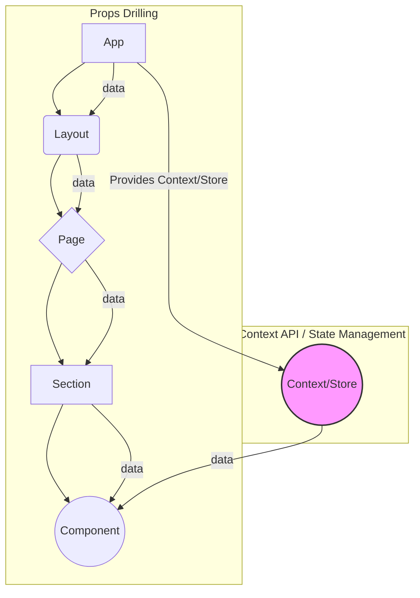
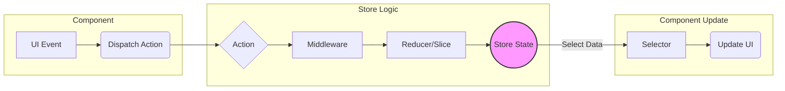

# Chapter 6: Component Architecture and Design Patterns

Component-based architecture is the bedrock of modern frontend development. For senior engineers, simply _using_ components isn't enough. Interviews will probe your ability to _design_, _architect_, and _scale_ component systems effectively. This involves understanding fundamental design principles, making informed decisions about state management, leveraging framework-specific features optimally, and contributing to or consuming design systems. Mastery in this area demonstrates your ability to build maintainable, scalable, and performant user interfaces.

This chapter delves into the critical aspects of component architecture and design patterns expected of senior candidates. We'll explore principles for creating robust components, navigate the complex landscape of state management, examine advanced framework-specific techniques, and understand the role of design systems in large-scale development.

#### A. Principles of Component Design

Well-designed components are the building blocks of a healthy application. They are easier to understand, test, reuse, and maintain. Interviews often assess your understanding of these core principles through code reviews, design discussions, or direct questioning.

##### 1. Single Responsibility Principle (SRP) in Components

The Single Responsibility Principle, adapted from object-oriented design, states that a component should have **one, and only one, reason to change**. In the context of UI components, this means a component should ideally encapsulate a single piece of functionality or concern.

- **Benefits:**

  - **Improved Reusability:** Components focused on one task are easier to reuse in different contexts.
  - **Enhanced Testability:** Smaller, focused components are simpler to unit test in isolation.
  - **Increased Maintainability:** Changes related to a specific feature are localized to fewer components, reducing the risk of unintended side effects.
  - **Better Collaboration:** Clear responsibilities make it easier for multiple developers to work on different parts of the UI concurrently.

- **Violation Example:** A single `UserProfileCard` component that fetches user data, displays user information, allows editing the profile, _and_ handles the API calls for saving changes violates SRP. It has multiple reasons to change: data fetching logic changes, display requirements change, editing form logic changes, or API endpoints change.

- **Adherence Example:** Decompose the `UserProfileCard`:
  - `UserProfileContainer`: Fetches data, manages editing state.
  - `UserProfileDisplay`: Purely displays user data (receives data via props).
  - `UserProfileEditForm`: Handles the form inputs and validation (receives initial data and callbacks via props).
  - `useUserProfileAPI` (Custom Hook): Encapsulates the API logic for fetching and saving.

By separating these concerns, each part has a single responsibility. Changes to the API only affect the hook, changes to the display only affect `UserProfileDisplay`, etc.

##### 2. Separation of Concerns (Container vs. Presentational Components)

Popularized by Dan Abramov, this pattern distinguishes between:

- **Presentational Components:** (Also called "Dumb" or "UI" components) Focus on _how things look_. They receive data and callbacks via props, render UI elements, and have minimal internal state directly related to presentation (e.g., toggle state for a dropdown). They are often stateless functional components or pure components.
- **Container Components:** (Also called "Smart" or "Logic" components) Focus on _how things work_. They fetch data, manage application state, handle logic, and pass data and behavior down to presentational components. They often contain state and lifecycle methods (or Hooks like `useState`, `useEffect`, `useContext`).

```jsx
// Presentational Component (Focus: UI)
function UserAvatar({ imageUrl, altText, size = "medium" }) {
  const className = `avatar avatar--${size}`;
  return ;
}

// Container Component (Focus: Logic/Data)
function UserProfileHeader({ userId }) {
  const [user, setUser] = useState(null);
  const [isLoading, setIsLoading] = useState(true);
  const [error, setError] = useState(null);

  useEffect(() => {
    setIsLoading(true);
    fetchUserData(userId)
      .then((data) => {
        setUser(data);
        setIsLoading(false);
      })
      .catch((err) => {
        setError(err);
        setIsLoading(false);
      });
  }, [userId]);

  if (isLoading) return <Spinner />;
  if (error) return <ErrorMessage message={error.message} />;
  if (!user) return null;

  return (
    <div className="profile-header">
      <UserAvatar imageUrl={user.avatarUrl} altText={`${user.name}'s avatar`} />
      <h1>{user.name}</h1>
      <p>{user.bio}</p>
    </div>
  );
}
```

**Modern Context (Hooks):** While React Hooks (`useState`, `useEffect`, custom hooks) allow functional components to manage state and side effects, blurring the strict visual distinction, the _principle_ of separating data fetching/logic concerns from pure presentation concerns remains highly valuable for maintainability and testability. Custom hooks often become the modern equivalent of container logic, extractable and reusable across components.

##### 3. Component Composition vs. Inheritance

Frontend frameworks, particularly React, heavily favor **composition over inheritance** for code reuse between components.

- **Inheritance (Less Common/Discouraged):** In traditional OOP, you might inherit from a base component class. This creates tight coupling, can lead to fragile base classes, and makes prop/state management complex ("what props does this inherited component _really_ accept?"). Most modern UI libraries avoid class inheritance for component extension.
- **Composition (Preferred):** Building complex UI by assembling smaller, independent components. This promotes loose coupling and flexibility. Common composition techniques include:
  - **`children` Prop (React) / Slots (Vue/Angular):** Allows passing arbitrary content (including other components) into a component, enabling flexible layouts and wrappers (e.g., `Card`, `Modal`, `Layout`).
  - **Props:** Passing data _and_ behavior (functions/callbacks) down the tree.
  - **Render Props:** A prop whose value is a function that returns JSX/elements. Allows a component to delegate _what_ to render to its parent (e.g., a `MouseTracker` component providing coordinates via a render prop). Less common now due to Hooks.
  - **Higher-Order Components (HOCs):** Functions that take a component and return a new component, wrapping it with additional props or behavior. Also less common now due to Hooks, which provide a more direct way to share non-visual logic.
  - **Custom Hooks (React):** The modern standard for sharing stateful, non-visual logic between components without altering the component hierarchy.

**Why Composition Wins:** It leads to more flexible, decoupled, and understandable component relationships compared to the rigid hierarchies imposed by inheritance.

##### 4. Props Drilling vs. State Management vs. Context API

Passing data through multiple layers of nested components via props is known as **props drilling**.

- **Props Drilling:** Simple for shallow trees, but becomes cumbersome and error-prone in deep hierarchies. Components in the middle may receive props they don't use, just to pass them down. Refactoring becomes difficult.
- **Context API (React/Vue Provide/Inject):** Designed to share data considered "global" for a subtree of components without explicit prop passing. Ideal for themes, user authentication status, locale preferences.
  - **Pros:** Avoids props drilling for specific global concerns.
  - **Cons:** Can make component reuse harder (component implicitly depends on context). Performance issues can arise if the context value changes frequently, causing all consumers to re-render (mitigation needed). Not typically recommended for high-frequency application state updates.
- **State Management Libraries (Redux, Zustand, Pinia, etc.):** Provide centralized stores to manage application state that needs to be accessed or modified by many components across different parts of the application tree.
  - **Pros:** Decouples state from components, simplifies state logic, enables powerful dev tools, better for complex/frequently changing state.
  - **Cons:** Adds boilerplate/complexity, learning curve, potential performance overhead if not used carefully.



_Diagram Explanation:_ This diagram contrasts props drilling, where data flows sequentially through intermediate components, with Context API/State Management, where a component can access data directly from a central provider/store, bypassing intermediate layers.

**Choosing:** Use local state for component-specific data, Context for low-frequency global data (theme, auth), and state management libraries for complex, high-frequency, or widely shared application state. Server state management libraries (covered next) handle server data specifically.

##### 5. API Design for Reusable Components (Props, Events, Slots)

The "API" of a component is defined by its props, the events it emits, and how it handles children/slots. A well-designed API makes a component intuitive, flexible, and reusable.

- **Props:**
  - **Clarity:** Use clear, descriptive names.
  - **Typing:** Use TypeScript/PropTypes for documentation and safety.
  - **Required vs. Optional:** Define sensible defaults for optional props.
  - **Avoid Boolean Traps:** Instead of `showIcon`, `showText`, `showBoth`, prefer a single prop like `displayMode: 'icon' | 'text' | 'both'`.
  - **Data vs. Configuration:** Separate props for data (`items: Product[]`) from props for configuration (`showFilters: boolean`).
  - **Pass Primitive Types When Possible:** Passing complex objects can hinder memoization optimizations.
- **Events/Callbacks:**
  - **Naming:** Use consistent naming like `on<EventName>` (e.g., `onClick`, `onSubmit`, `onValueChange`).
  - **Payload:** Pass relevant data back in the event payload (e.g., `onValueChange(newValue, event)`). Ensure the payload structure is stable.
- **Slots/Children:**
  - **Flexibility:** Use `children` (React) or named slots (Vue/Angular `ng-content select`) to allow consumers to inject custom content or structure. This is key for layout components (`Card`, `Modal`) or components needing customizable sections (e.g., a `List` component allowing custom item rendering).

##### 6. [Practical Example: Designing a flexible and reusable Data Table component]

Let's outline the API design for a hypothetical `<DataTable>` component in React.

**Requirements:** Display tabular data, support custom column definitions, sorting, basic filtering (client-side), pagination, and allow custom rendering for specific cells or rows.

**API Design Choices:**

```typescript
// Type Definitions (Illustrative)
type ColumnDefinition<T> = {
  key: keyof T | string; // Accessor key for data
  header: React.ReactNode; // Content for table header
  renderCell?: (item: T, rowIndex: number) => React.ReactNode; // Custom cell render function
  sortable?: boolean;
  filterable?: boolean;
};

type SortState = {
  columnKey: string | null;
  direction: "asc" | "desc";
};

// Component Props Interface
interface DataTableProps<T> {
  // --- Core Data & Configuration ---
  data: T[]; // Array of data objects
  columns: ColumnDefinition<T>[]; // Column configuration
  rowKey: keyof T | ((item: T) => string); // Unique key for each row

  // --- Features ---
  initialSort?: SortState;
  onSortChange?: (sortState: SortState) => void; // Callback for sorting changes

  filterQuery?: string; // External filter query
  filterFn?: (item: T, query: string) => boolean; // Custom filter logic

  itemsPerPage?: number;
  currentPage?: number;
  onPageChange?: (newPage: number) => void; // Callback for pagination

  // --- Customization ---
  renderRow?: (
    item: T,
    rowIndex: number,
    children: React.ReactNode
  ) => React.ReactNode; // Custom row wrapper
  emptyState?: React.ReactNode; // Content when data is empty
  loadingState?: React.ReactNode; // Content when loading

  // --- Styling & ARIA ---
  className?: string;
  ariaLabel?: string;
}

// Usage Example (Simplified)
function ProductTable() {
  const [products, setProducts] = useState([]);
  const [sort, setSort] = useState({ columnKey: "name", direction: "asc" });
  // ... fetch products, handle state ...

  const columns: ColumnDefinition<Product>[] = [
    { key: "name", header: "Product Name", sortable: true },
    {
      key: "price",
      header: "Price",
      sortable: true,
      renderCell: (p) => `$${p.price.toFixed(2)}`,
    },
    { key: "stock", header: "Stock" },
    {
      key: "actions",
      header: "Actions",
      renderCell: (p) => (
        <Button onClick={() => handleAddToCart(p.id)}>Add to Cart</Button>
      ),
    },
  ];

  return (
    <DataTable
      data={products}
      columns={columns}
      rowKey="id"
      initialSort={sort}
      onSortChange={setSort}
      // ... other props
    />
  );
}
```

**Design Rationale:**

- **Generic Type `<T>`:** Makes the component reusable for any data type.
- **`columns` Prop:** Centralizes column configuration, including custom rendering (`renderCell`).
- **`rowKey` Prop:** Essential for performance and stability in lists.
- **Controlled vs. Uncontrolled State:** Features like sorting and pagination can be controlled externally (via `initialSort`/`currentPage` and `onSortChange`/`onPageChange` callbacks) or potentially handled internally if callbacks aren't provided (though controlled is often preferred for flexibility).
- **Customization Hooks:** `renderCell`, `renderRow`, `emptyState`, `loadingState` provide escape hatches for advanced customization without modifying the core component logic.
- **Callbacks (`on*`):** Allow parent components to react to events within the table.

This API balances providing core functionality with flexibility for consumers to adapt it to their specific needs, a hallmark of good reusable component design.

#### B. State Management Strategies at Scale

Managing state effectively is crucial for application stability and maintainability, especially as applications grow in complexity. Senior interviews will probe your understanding of different state management approaches and your ability to choose the right tool for the job.

##### 1. Local Component State (`useState`, `this.state`)

- **Role:** Manages state that is specific to a single component instance and doesn't need to be shared. Examples include form input values, toggle states (e.g., modal open/closed), UI element states (e.g., hover effects).
- **Framework Primitives:** React's `useState` and `useReducer` hooks, Vue's `ref` and `reactive`, Angular's component class properties.
- **When Appropriate:** Ideal for ephemeral UI state, simple components, or state that naturally belongs to a specific component's lifecycle.
- **Limitations:** Becomes problematic when state needs to be shared across multiple components, especially those far apart in the component tree (leads to props drilling or complex callback chains).

##### 2. Context API: Use Cases and Performance Considerations

- **Use Cases:** As mentioned, best suited for low-frequency, "global-ish" data like:
  - Theming (dark/light mode)
  - User Authentication Status (logged in/out, user roles)
  - Locale/Internationalization settings
  - Dependency Injection (passing down service instances)
- **Performance Considerations:**
  - **Re-renders:** By default, any component consuming a Context will re-render whenever the _entire_ context value changes, even if the component only cares about a small part of that value.
  - **Mitigation:**
    - **Split Contexts:** Break down large contexts into smaller, more focused ones (e.g., `ThemeContext`, `AuthContext`).
    - **Memoization:** Use `React.useMemo` to memoize parts of the context value if possible, preventing unnecessary updates.
    - **Selectors (Manual):** Pass down the entire context value but use `useMemo` within the consuming component to select and memoize only the needed piece of state. Libraries like `use-context-selector` automate this.
    - **Avoid placing rapidly changing application state in Context.**

##### 3. Global State Management Libraries (Redux, Zustand, Jotai, etc.)

These libraries provide centralized stores and patterns for managing state that is shared across many parts of an application, especially state that changes frequently or involves complex logic.

###### a. Core Concepts (Store, Actions, Reducers/Slices, Selectors)

While implementations differ, many libraries (especially those inspired by Flux/Redux) share core concepts:

- **Store:** A single, centralized object holding the entire application state. It's typically immutable or managed immutably.
- **Actions:** Plain objects describing _what happened_ (e.g., `{ type: 'todos/addTodo', payload: { id: 1, text: 'Learn Redux' } }`). They are dispatched to the store.
- **Reducers (or Slices in RTK):** Pure functions that take the current state and an action, and return the _new_ state (`(currentState, action) => newState`). They specify _how_ the state changes in response to actions. Redux Toolkit (RTK) simplifies this with `createSlice`, which auto-generates action creators and handles immutable updates using Immer.
- **Selectors:** Functions that extract specific pieces of data from the store state. They help decouple components from the state shape and can be memoized for performance.



_Diagram Explanation:_ This diagram illustrates the unidirectional data flow typical in Flux/Redux architectures. UI events trigger actions, which (potentially via middleware) are processed by reducers to update the central store state. Selectors then read data from the store to update the UI.

###### b. Middleware (Thunks, Sagas, Observables)

Middleware provides an extension point between dispatching an action and the moment it reaches the reducer. It's primarily used for handling side effects, particularly asynchronous operations like API calls.

- **Thunks (`redux-thunk`):** The simplest form. Allows action creators to return functions instead of action objects. These functions receive `dispatch` and `getState` as arguments, allowing them to dispatch multiple actions (e.g., `FETCH_START`, `FETCH_SUCCESS`, `FETCH_FAILURE`) and perform async logic. RTK includes Thunk middleware by default.
- **Sagas (`redux-saga`):** Uses ES6 Generators to manage complex async flows. Sagas run separately from the action dispatch cycle, listening for specific actions and triggering "effects" (like API calls, dispatching other actions). Powerful for managing concurrency, cancellations, and complex sequences, but has a steeper learning curve.
- **Observables (`redux-observable`):** Uses RxJS observables to handle async operations. Well-suited for complex event streams, debouncing, throttling, and reactive patterns. Requires familiarity with RxJS.

###### c. Normalization and Data Structures for Store Efficiency

Storing nested data structures (like API responses) directly in the store can lead to issues:

- **Data Duplication:** The same entity (e.g., a user) might appear in multiple places.
- **Update Complexity:** Updating a deeply nested entity requires complex immutable update logic.
- **Selector Performance:** Retrieving related data might involve complex traversals.

**Normalization** solves this by structuring state like a relational database:

- Each entity type gets its own table (e.g., `users`, `posts`, `comments`).
- Entities store IDs of related entities, not the nested objects themselves.
- A central `entities` object holds these tables.

**Example:**

- **Nested:** `{ posts: [{ id: 1, title: '...', author: { id: 10, name: '...' } }] }`
- **Normalized:**
  ```json
  {
    "entities": {
      "posts": {
        "1": { "id": 1, "title": "...", "authorId": 10 }
      },
      "users": {
        "10": { "id": 10, "name": "..." }
      }
    },
    "result": [1] // Array of post IDs for ordering/filtering
  }
  ```

Libraries like `normalizr` can automate this process. RTK's `createEntityAdapter` provides utilities for managing normalized state within slices.

###### d. Performance Optimization (Selectors, Memoization)

- **Selectors:** As mentioned, selectors decouple components from the state shape.
- **Memoization:** If calculating derived data within a selector is expensive, or if passing new object/array references from selectors causes unnecessary re-renders in consuming components (even if the underlying data hasn't changed), memoization is crucial.
  - **`reselect` (Redux):** Creates memoized selectors. They only recalculate if their specific input state slices have changed.
  - **Built-in:** Many modern state libraries (Zustand, Jotai) have memoization built-in or encourage patterns that minimize unnecessary updates. React Query/SWR heavily rely on internal caching and memoization.

###### e. [Code Snippet: Implementing a complex async flow with Redux Toolkit and Thunks]

This example shows fetching user data and their associated permissions using RTK's `createAsyncThunk`.

```typescript
import { createSlice, createAsyncThunk, PayloadAction } from "@reduxjs/toolkit";
import { userApi, permissionsApi } from "./api"; // Assume these exist

interface User {
  id: string;
  name: string;
}
interface Permissions {
  [key: string]: boolean;
}

interface UserState {
  data: User | null;
  permissions: Permissions | null;
  status: "idle" | "loading" | "succeeded" | "failed";
  error: string | null;
}

const initialState: UserState = {
  data: null,
  permissions: null,
  status: "idle",
  error: null,
};

// Async thunk definition
export const fetchUserAndPermissions = createAsyncThunk(
  "user/fetchUserAndPermissions",
  async (userId: string, { rejectWithValue }) => {
    try {
      // Perform calls potentially in parallel
      const [userData, permissionsData] = await Promise.all([
        userApi.fetchById(userId),
        permissionsApi.fetchForUser(userId),
      ]);
      // The return value becomes the `fulfilled` action payload
      return { user: userData, permissions: permissionsData };
    } catch (error: any) {
      // Use rejectWithValue to provide a standardized error payload
      return rejectWithValue(error.message || "Failed to fetch user data");
    }
  }
);

const userSlice = createSlice({
  name: "user",
  initialState,
  reducers: {
    // Standard reducers can go here if needed
    resetUserState: () => initialState,
  },
  // Handle actions defined outside the slice, like our thunk
  extraReducers: (builder) => {
    builder
      .addCase(fetchUserAndPermissions.pending, (state) => {
        state.status = "loading";
        state.error = null;
      })
      .addCase(fetchUserAndPermissions.fulfilled, (state, action) => {
        state.status = "succeeded";
        state.data = action.payload.user;
        state.permissions = action.payload.permissions;
      })
      .addCase(fetchUserAndPermissions.rejected, (state, action) => {
        state.status = "failed";
        state.error = action.payload as string; // Payload from rejectWithValue
      });
  },
});

export const { resetUserState } = userSlice.actions;

// Selectors
export const selectUser = (state: { user: UserState }) => state.user.data;
export const selectPermissions = (state: { user: UserState }) =>
  state.user.permissions;
export const selectUserStatus = (state: { user: UserState }) =>
  state.user.status;

export default userSlice.reducer;

// --- In a component ---
// import { useDispatch, useSelector } from 'react-redux';
// import { fetchUserAndPermissions, selectUser, selectUserStatus } from './userSlice';
//
// function UserProfile() {
//   const dispatch = useDispatch();
//   const user = useSelector(selectUser);
//   const status = useSelector(selectUserStatus);
//
//   useEffect(() => {
//     // Assuming userId is available
//     if (status === 'idle') {
//        dispatch(fetchUserAndPermissions('user-123'));
//     }
//   }, [status, dispatch]);
//
//   // ... render based on status and user data ...
// }
```

This demonstrates handling loading/success/error states automatically via the thunk's lifecycle actions (`pending`, `fulfilled`, `rejected`) and updating the state immutably (thanks to Immer within `createSlice`).

###### f. [Deep Dive: Comparing different state management paradigms (Flux, Atomic State)]

- **Flux/Redux Paradigm:**
  - **Concept:** Single, centralized store; unidirectional data flow; state updated via pure reducers responding to dispatched actions.
  - **Pros:** Predictable state changes, excellent dev tools (time-travel debugging), well-established patterns, good for complex state interactions.
  - **Cons:** Can involve boilerplate (though RTK reduces this significantly), indirection (actions, reducers), potential performance bottlenecks if selectors aren't optimized, managing module dependencies can be tricky.
  - **Examples:** Redux, NgRx (Angular), Vuex (Vue).
- **Atomic State Paradigm:**
  - **Concept:** State is broken down into small, independent units called "atoms" or "signals". Components subscribe directly to the atoms they need. Derived state can be computed from other atoms. Updates to one atom only trigger re-renders in components subscribed to _that specific atom_ (or derived atoms).
  - **Pros:** Less boilerplate, more granular subscriptions leading to potentially better performance out-of-the-box, feels more "React-like" (or framework-idiomatic) to some, simplifies dependency management.
  - **Cons:** Dev tooling might be less mature than Redux's, managing complex state transitions involving multiple atoms might require careful orchestration, less established patterns for large-scale applications compared to Redux.
  - **Examples:** Jotai, Recoil (React), Signals (@preact/signals, Angular Signals, SolidJS). Zustand sits somewhere in between, offering a single store but with more direct subscription/update mechanisms than classic Redux.

The choice often depends on team familiarity, application complexity, and specific performance requirements. Atomic state is gaining popularity for its simplicity and performance characteristics in many scenarios.

##### 4. Server State Management / Data Fetching Libraries (React Query, SWR)

These libraries recognize that **server state** (data fetched from APIs) has different characteristics than **client state** (UI state):

- It's persisted remotely and not owned by the client.
- It can become stale and needs re-fetching/synchronization.
- It involves asynchronous operations (fetching, caching, updating).

Libraries like React Query (now TanStack Query) and SWR (stale-while-revalidate) provide hooks and utilities specifically for managing server state.

###### a. Caching, Synchronization, Background Updates

- **Caching:** Automatically cache fetched data in memory. Subsequent requests for the same data return the cached version instantly.
- **Stale-While-Revalidate:** Immediately return cached (potentially stale) data while automatically re-fetching fresh data in the background. The UI updates once the fresh data arrives. This provides a fast perceived performance.
- **Background Updates:** Automatically re-fetch data when the window is refocused, the network reconnects, or based on configurable intervals, keeping data fresh.
- **Deduping:** Automatically deduplicate identical requests made close together.

###### b. Mutations and Optimistic Updates

- **Mutations:** Provide hooks (`useMutation`) to handle data modification (POST, PUT, DELETE requests). They manage loading/error states for the mutation itself.
- **Automatic Cache Invalidation/Updates:** After a successful mutation, you can configure the library to automatically invalidate related query caches (triggering re-fetches) or directly update the cache with the mutation result.
- **Optimistic Updates:** For a snappier UI, you can update the local cache _immediately_ with the expected result of the mutation _before_ the server confirms it. If the mutation succeeds, the cache is confirmed. If it fails, the library helps you roll back the optimistic update to the previous state. This requires careful implementation to handle potential rollbacks correctly.

###### c. [Practical Example: Integrating React Query for efficient data fetching and caching]

```jsx
import { useQuery, useMutation, useQueryClient } from "@tanstack/react-query";
import { fetchTodos, addTodo } from "./api"; // Assume API functions exist

function TodoList() {
  const queryClient = useQueryClient();

  // Fetching todos - managed by React Query
  const {
    data: todos,
    isLoading,
    isError,
    error,
  } = useQuery({
    queryKey: ["todos"], // Unique key for this query
    queryFn: fetchTodos, // Function to fetch data
    staleTime: 5 * 60 * 1000, // Cache considered fresh for 5 minutes
    // Other options: refetchOnWindowFocus: true (default), etc.
  });

  // Mutation for adding a todo
  const { mutate: addTodoMutate, isLoading: isAdding } = useMutation({
    mutationFn: addTodo, // Function that performs the POST request
    onSuccess: (newTodo) => {
      // Option 1: Invalidate the 'todos' query cache to trigger a refetch
      // queryClient.invalidateQueries({ queryKey: ['todos'] });

      // Option 2: Manually update the cache for instant UI update
      queryClient.setQueryData(["todos"], (oldTodos) => [...oldTodos, newTodo]);
    },
    onError: (err) => {
      // Handle mutation error (e.g., show notification)
      console.error("Failed to add todo:", err);
    },
  });

  const handleAddTodo = (text) => {
    if (!text.trim()) return;
    // Call the mutate function provided by useMutation
    addTodoMutate({ text, completed: false });
    // Clear input field, etc.
  };

  if (isLoading) return <span>Loading...</span>;
  if (isError) return <span>Error: {error.message}</span>;

  return (
    <div>
      {/* Input field to add todo, calling handleAddTodo */}
      {/* ... */}
      <ul>
        {todos?.map((todo) => (
          <li key={todo.id}>{todo.text}</li>
        ))}
      </ul>
      {isAdding && <span>Adding todo...</span>}
    </div>
  );
}

// --- Need to wrap the app in QueryClientProvider ---
// import { QueryClient, QueryClientProvider } from '@tanstack/react-query';
// const queryClient = new QueryClient();
// ReactDOM.render(
//   <QueryClientProvider client={queryClient}>
//     <App />
//   </QueryClientProvider>,
//   document.getElementById('root')
// );
```

This example shows `useQuery` handling fetching, caching, and background updates for the todo list, and `useMutation` handling the addition of new todos with automatic cache management (`setQueryData` for an optimistic-like immediate update in this case, or `invalidateQueries` for a refetch).

##### 5. Choosing the Right State Management Strategy

There's no single "best" strategy; the optimal choice depends on the specific needs of the application and team.

###### a. Factors to Consider (Application Size, Team Size, Complexity)

| Factor               | Recommendation / Considerations                                                                                                                                                                                              |
| :------------------- | :--------------------------------------------------------------------------------------------------------------------------------------------------------------------------------------------------------------------------- |
| **State Scope**      | **Local:** Use component state (`useState`). **Tree-wide (low freq):** Use Context API. **App-wide / Complex / High Freq:** Use Global State Lib (Redux, Zustand). **Server Data:** Use Server State Lib (React Query, SWR). |
| **App Complexity**   | **Simple:** Local state + Context might suffice. **Moderate:** Context + Server State Lib. **Complex:** Global State Lib + Server State Lib.                                                                                 |
| **App Size**         | **Small:** Keep it simple. **Large:** Structured global state (Redux, Zustand) + Server State Lib becomes more beneficial for maintainability.                                                                               |
| **Team Size**        | **Small:** Simpler solutions (Context, Zustand, React Query) might be faster. **Large:** Structured patterns (Redux) can enforce consistency. Team familiarity is key.                                                       |
| **State Nature**     | **UI State:** Local state, Context, sometimes global. **Server Cache:** React Query/SWR. **Shared Business Logic State:** Global State Lib.                                                                                  |
| **Async Complexity** | **Simple:** Thunks (RTK), basic `useEffect`. **Complex:** Sagas, Observables, React Query/SWR mutations.                                                                                                                     |
| **Performance**      | Be mindful of Context re-renders. Optimize selectors in global state. Atomic state/React Query often have good default performance via granular updates/caching.                                                             |

###### b. [Production Note: Avoiding common pitfalls in state management]

- **Overusing Global State:** Don't put everything in the global store. Keep ephemeral UI state local to components. Ask: "Does this state _really_ need to be accessed by distant parts of the app?"
- **Treating Server Cache as Client State:** Don't duplicate server data fetched via React Query/SWR into your Redux/Zustand store unless absolutely necessary for complex offline logic or specific cross-domain state needs. Let the server state library manage its cache.
- **Ignoring Normalization:** Large, nested structures in global state lead to update complexity and performance issues. Normalize when appropriate.
- **Prop Drilling Complex Objects/Functions:** Even without global state, excessively drilling complex objects or non-memoized functions can cause performance problems. Consider component composition or context/state solutions.
- **Large Context Re-renders:** Be aware of the performance cost of frequently changing context values consumed by many components. Split contexts or use selectors.
- **Not Cleaning Up State:** In global stores, ensure state related to specific features or user sessions is cleaned up (e.g., on logout, route change) to prevent memory leaks or stale data issues.

#### C. Framework-Specific Architecture (React, Vue, Angular - Senior Level)

While core principles apply across frameworks, senior candidates are expected to have deep knowledge of their primary framework's specific architectural patterns, performance optimizations, and advanced features. Awareness of patterns in other major frameworks is also beneficial.

##### 1. React:

###### a. Hooks Deep Dive (`useEffect` dependencies, `useCallback`, `useMemo`, Custom Hooks)

- **`useEffect` Dependencies:** Understand the `deps` array is crucial for correctness.
  - **Empty Array `[]`:** Runs only once after the initial render (like `componentDidMount`).
  - **No Array:** Runs after _every_ render (use with caution!).
  - **With Values `[a, b]`:** Runs after initial render and whenever `a` or `b` changes (referential equality check for objects/arrays/functions).
  - **Pitfalls:** Missing dependencies (can lead to stale closures or infinite loops), including non-primitive dependencies that change on every render (objects, arrays, functions defined inside the component). The `eslint-plugin-react-hooks` `exhaustive-deps` rule is essential.
- **`useCallback` & `useMemo`:** Performance optimizations.
  - **`useMemo`:** Memoizes the _result_ of an expensive calculation. Recalculates only if dependencies change. Use for complex computations or creating memoized objects/arrays to pass as props.
  - **`useCallback`:** Memoizes the _function instance_ itself. Useful when passing callbacks down to optimized child components (`React.memo`) that rely on referential equality to avoid re-renders. Ensure dependencies are correctly specified.
  - **Overuse:** Don't wrap everything in `useMemo`/`useCallback`. Profile first. Often unnecessary for simple calculations or functions not passed to memoized children.
- **Custom Hooks:** The primary mechanism for reusing stateful, non-visual logic. Encapsulate state (`useState`), side effects (`useEffect`), context (`useContext`), etc., into reusable functions (e.g., `useFetch`, `useFormInput`, `useWindowSize`). Promotes clean components and logic reuse.

###### b. Concurrent Mode/Features (Suspense, Transitions) - Conceptual Understanding

React's concurrent features aim to improve perceived performance and responsiveness by allowing React to work on multiple state updates concurrently and interrupt rendering work.

- **Concept:** Make UIs non-blocking. Long renders don't freeze the browser. Prioritize important updates (e.g., user input) over less important ones (e.g., background data fetching).
- **`Suspense`:** Lets components "wait" for something before rendering (data fetching, lazy-loaded code). Provides a declarative way to specify loading states (`fallback` prop). Crucial for data fetching integrations (like Relay, or potentially React Query in the future) and code splitting (`React.lazy`).
- **Transitions (`startTransition`, `useTransition`):** Mark certain state updates as lower priority ("transitions"). React can interrupt the rendering of a transition if a more urgent update (like typing in an input) comes in. `useTransition` provides a `isPending` state to show loading indicators specifically for transitions. Useful for keeping the UI responsive during potentially slow re-renders (e.g., filtering a large list).
- **Interview Focus:** Understand the _goals_ and _concepts_ of concurrency, Suspense, and Transitions, and their potential benefits. Deep implementation details might be less critical unless the role specifically requires it, as the APIs and patterns are still evolving.

###### c. Advanced Rendering Patterns (Memoization, `React.lazy`)

- **Memoization:**
  - `React.memo()`: A Higher-Order Component for functional components. Prevents re-rendering if props haven't changed (shallow comparison). Similar to `PureComponent` for classes. Combine with `useCallback` for passed functions.
  - `useMemo`/`useCallback`: As discussed, used _within_ components to prevent expensive recalculations or unnecessary prop changes.
- **`React.lazy()`:** Enables code splitting at the component level. Allows you to render a dynamically imported component as a regular component. Must be used with `Suspense` to provide a fallback UI while the component code is loading. Essential for reducing initial bundle size and improving load times.

```jsx
import React, { useState, Suspense, lazy } from "react";

// Dynamically import the component
const HeavyComponent = lazy(() => import("./HeavyComponent"));

function App() {
  const [showHeavy, setShowHeavy] = useState(false);

  return (
    <div>
      <button onClick={() => setShowHeavy(true)}>Load Heavy Component</button>
      {/* Suspense provides fallback while HeavyComponent code loads */}
      <Suspense fallback={<div>Loading component...</div>}>
        {showHeavy && <HeavyComponent />}
      </Suspense>
    </div>
  );
}
```

###### d. Error Boundaries

- **Purpose:** Catch JavaScript errors anywhere in their child component tree, log those errors, and display a fallback UI instead of crashing the whole application.
- **Implementation:** Must be a class component defining `componentDidCatch(error, info)` and/or `static getDerivedStateFromError(error)`. They only catch errors during rendering, in lifecycle methods, and in constructors of the whole tree below them. They do _not_ catch errors in event handlers, async code (e.g., `setTimeout`, promises), or server-side rendering.
- **Usage:** Wrap logical sections of your application (like routes, sidebars, widgets) in Error Boundaries.

###### e. [Deep Dive: React Fiber architecture overview]

- **What:** A complete rewrite of React's core reconciliation algorithm (introduced in React 16).
- **Why:** The old "Stack" reconciler was synchronous and blocking. Fiber enables **incremental rendering** and **concurrency**.
- **Core Ideas:**
  - **Work Units (Fibers):** Represents a node in the component tree and a unit of work. Each fiber has links to its child, sibling, and parent.
  - **Two Phases:**
    1.  **Render/Reconciliation Phase (Interruptible):** React builds a "work-in-progress" tree of fibers, determining what changes need to be made to the DOM. This phase can be paused, aborted, or resumed. It doesn't produce side effects visible to the user.
    2.  **Commit Phase (Synchronous):** Once the work-in-progress tree is complete, React commits the changes to the DOM in a single, synchronous sequence. This phase runs lifecycle methods (`componentDidMount/Update`, `useEffect` cleanup/run) and performs DOM mutations.
  - **Prioritization:** Allows React to assign different priorities to different updates (e.g., user input is high priority, data fetching is lower).
  - **Scheduling:** React maintains a scheduler to manage pending work, priorities, and time slicing (yielding back to the browser).
- **Benefit:** Enables concurrent features, smoother animations, better responsiveness, and features like Suspense. As a developer, you don't interact with Fiber directly, but understanding its existence explains _how_ concurrent features are possible.

##### 2. Vue:

###### a. Composition API vs. Options API at Scale

- **Options API (Vue 2 style):** Organizes component logic by options (`data`, `methods`, `computed`, `watch`, lifecycle hooks). Simple for small components, but logic related to a single feature can become fragmented across different options in large components, making it harder to understand and extract.
- **Composition API (Vue 3+):** Organizes logic by logical concern using composable functions (`setup` function or `<script setup>`). Allows grouping reactive state (`ref`, `reactive`), computed properties (`computed`), watchers (`watch`), and lifecycle hooks related to a specific feature together.
  - **Benefits at Scale:** Better logic organization, improved TypeScript support, much easier to extract and reuse stateful logic between components (similar to React custom hooks). Recommended for medium-to-large components and applications.

###### b. Reactivity System Internals (Proxy-based)

- **Vue 2:** Used `Object.defineProperty` to intercept property access and assignment on data objects. Had limitations: couldn't detect property addition/deletion or changes to array indices/length directly (required `$set`/`$delete`).
- **Vue 3:** Uses ES6 `Proxy` objects. A proxy wraps the original object, allowing interception of _all_ operations (get, set, deleteProperty, has, etc.).
  - **Benefits:** More robust and performant reactivity. Detects property addition/deletion and array changes natively. Eliminates caveats of Vue 2's system.
  - **How it works (Simplified):** When you access a property on a reactive object (`ref` or `reactive`), its `get` trap registers the current effect (e.g., a component render function or computed property) as a dependency. When you modify a property, its `set` trap triggers all dependent effects to re-run.

###### c. Advanced Component Patterns (Scoped Slots, Provide/Inject)

- **Scoped Slots:** Allow a child component to pass data back up to the parent when rendering a slot's content. This enables powerful patterns like reusable list components that let the parent define how each item is rendered, using data specific to that item.

  ```vue
  <!-- Child Component (e.g., MyList.vue) -->
  <template>
    <ul>
      <li v-for="(item, index) in items" :key="item.id">
        <!-- Pass item data back up to the slot -->
        <slot name="item" :item="item" :index="index"></slot>
      </li>
    </ul>
  </template>
  <script setup>
  defineProps(["items"]);
  </script>

  <!-- Parent Component -->
  <template>
    <MyList :items="products">
      <!-- Use v-slot to receive the scoped data -->
      <template #item="{ item, index }">
        <div>
          {{ index + 1 }}. {{ item.name }} - ${{ item.price }}
          <button @click="addToCart(item)">Add</button>
        </div>
      </template>
    </MyList>
  </template>
  ```

- **Provide/Inject:** Similar to React Context. Allows an ancestor component to "provide" data or methods that can be "injected" by any descendant component, regardless of depth. Useful for dependency injection, theming, or avoiding props drilling for global-like concerns. Use with caution, as it creates coupling between distant components.

###### d. State Management with Pinia/Vuex

- **Vuex (Classic):** The original Flux-inspired state management library for Vue. Features a single store, state, mutations (synchronous state changes), actions (asynchronous operations, commit mutations), and getters (computed state). Can be verbose.
- **Pinia (Current Recommendation):** The official successor to Vuex. Offers a simpler, more modular API.
  - **Key Features:** Intuitive API (feels more like Composition API), define multiple stores (modular), no mutations (actions directly modify state), better TypeScript support, extensible via plugins, devtools integration. Generally preferred for new Vue 3 projects.

###### e. [Deep Dive: Vue Compiler optimizations]

The Vue template compiler performs significant optimizations at build time to improve runtime performance:

- **Static Tree Hoisting:** Parts of the template that never change are hoisted out of the render function, created once, and reused on subsequent renders, reducing VNode creation overhead.
- **Patch Flags:** The compiler analyzes bindings in the template (`{{ msg }}`, `:id`, `v-if`) and attaches "patch flags" to the generated VNodes. During patching (updating the DOM), Vue uses these flags to skip unnecessary checks. For example, if a VNode only has dynamic text content, Vue knows it only needs to update the text and can skip checking attributes or children.
- **Cache Handlers:** Event handlers defined inline in the template (`@click="handler"`) can be cached by the compiler, preventing the creation of new function instances on every render (improving performance, especially with child components).
- **Block Tree Optimization (SSR Hydration):** Optimizes how Vue hydrates server-rendered HTML by dividing the template into "blocks" based on structural directives (`v-if`, `v-for`), allowing more efficient hydration patching.

These optimizations mean that Vue templates often perform better out-of-the-box compared to manual render functions, as the compiler can apply static analysis.

##### 3. Angular:

###### a. Modules (`NgModule`) vs. Standalone Components

- **`NgModule` (Classic):** Historically, Angular applications were organized using modules (`@NgModule`). Modules declare components, directives, pipes, and providers, and manage compilation context and dependency injection scopes. Led to complex module structures (feature modules, shared modules, core module).
- **Standalone Components (Modern):** Introduced to simplify the architecture. Components, directives, and pipes can be marked as `standalone: true`. They directly declare their dependencies (other standalone components, directives, pipes, or `NgModule`s) via an `imports` array.
  - **Benefits:** Reduces boilerplate, simplifies understanding component dependencies, enables more granular lazy loading, aligns better with component-based mental models from other frameworks. Standalone APIs are the recommended approach for new Angular applications.

###### b. RxJS Mastery for State Management and Async Operations

RxJS (Reactive Extensions for JavaScript) is deeply integrated into Angular (e.g., `HttpClient`, Router events, reactive forms) and is the idiomatic way to handle complex asynchronous operations and manage state streams.

- **Core Concepts:** Observables (streams of values over time), Operators (pure functions to transform, combine, filter streams - `map`, `filter`, `switchMap`, `mergeMap`, `debounceTime`, `takeUntil`), Subjects (multicast observables, useful for state management), Schedulers (control timing).
- **Usage:** Managing complex async flows (e.g., type-ahead searches, dependent API calls), handling real-time data, managing component state reactively (e.g., using `BehaviorSubject` + `async` pipe), implementing state management patterns (e.g., NgRx relies heavily on RxJS).
- **Senior Expectation:** Proficiency with common operators, understanding hot vs. cold observables, managing subscriptions (avoiding memory leaks, often using `takeUntil` or the `async` pipe), and applying RxJS patterns effectively.

###### c. Dependency Injection Deep Dive (Hierarchical Injectors, Tokens)

Angular has a sophisticated hierarchical dependency injection (DI) system.

- **Injectors:** Responsible for creating and providing dependency instances. They are hierarchical, mirroring the component tree (plus module/environment injectors). When a component requests a dependency, Angular looks for a provider first in its own injector, then walks up the injector tree until it finds one or reaches the root.
- **Providers:** Configure how a dependency is created (e.g., `useClass`, `useValue`, `useFactory`, `useExisting`).
- **Resolution Modifiers:** Decorators like `@Self()`, `@SkipSelf()`, `@Host()`, `@Optional()` control _where_ Angular looks for the dependency in the injector hierarchy.
- **`InjectionToken`:** Used to provide non-class dependencies (like configuration objects or primitive values) using a unique token, avoiding potential naming collisions.

Understanding hierarchical DI is key to managing service instances, configuring dependencies at different levels, and avoiding common pitfalls.

###### d. Change Detection Strategies (`OnPush`)

- **Default Strategy:** Angular checks _every_ component in the tree from top to bottom whenever _any_ async event occurs (user input, `setTimeout`, XHR response) that might have caused state to change (managed via `zone.js`). Can be inefficient in large applications.
- **`OnPush` Strategy (`changeDetection: ChangeDetectionStrategy.OnPush`):** Optimizes change detection. A component marked with `OnPush` will only be checked if:
  1.  One of its `@Input()` properties changes (new reference).
  2.  An event originates from the component or one of its children (e.g., a button click).
  3.  The `async` pipe receives a new value from an observable.
  4.  Change detection is explicitly triggered (`detectChanges()` or `markForCheck()`).
- **Benefits:** Significantly improves performance by reducing the number of components checked during each cycle.
- **Requirements:** Relies heavily on using immutable data structures for inputs and leveraging observables with the `async` pipe.

###### e. Ivy Engine Concepts

Ivy is Angular's modern compiler and runtime engine.

- **Benefits:**
  - **Smaller Bundles:** Improved tree-shaking removes unused Angular code more effectively. Generated code is more optimized.
  - **Faster Compilation:** Incremental compilation is faster.
  - **Improved Debugging:** Easier to debug templates, better error messages.
  - **Locality:** Components are compiled more independently, relying less on metadata from `NgModule`. This principle enables Standalone Components.
  - **Potential for Future Features:** Enables dynamic component loading without `entryComponents`, potential for meta-programming.

Understanding Ivy's benefits helps explain _why_ modern Angular features (like Standalone Components) are possible and why bundle sizes have decreased.

###### f. [Deep Dive: Angular Zones and their implications]

- **`zone.js`:** A library that monkey-patches browser async APIs (`setTimeout`, `Promise`, event listeners, XHR). It creates execution contexts ("zones").
- **`NgZone`:** Angular runs application code within a specific zone (`NgZone`). When an async operation patched by `zone.js` starts and finishes _within_ the Angular zone, `NgZone` emits events (`onMicrotaskEmpty`, `onStable`).
- **Automatic Change Detection:** Angular subscribes to these `NgZone` events. When an event indicates that async work might have completed (e.g., `onMicrotaskEmpty`), Angular triggers change detection for the entire application (unless components use `OnPush`).
- **Implications:**
  - **Convenience:** Change detection often "just works" without manual triggers.
  - **Performance:** Frequent async events can trigger excessive change detection cycles.
  - **Third-Party Libraries:** If a third-party library frequently triggers async operations that Angular doesn't need to know about, it can hurt performance. Solution: Run that specific code _outside_ the Angular zone using `NgZone.runOutsideAngular()`.
  - **Explicit Triggers:** If you run code outside the zone but need to update the UI afterwards, you must manually re-enter the zone and trigger change detection using `NgZone.run()` or `ApplicationRef.tick()`.

Understanding zones is crucial for diagnosing performance issues related to change detection and for integrating non-Angular libraries smoothly.

##### 4. [Note: Focus deeply on the candidate's primary framework, but awareness of others is beneficial]

While deep expertise in your primary framework (React, Vue, or Angular) is paramount for a senior role, demonstrating a conceptual understanding of the architectural patterns, state management solutions, and core philosophies of the _other_ major frameworks is a significant advantage. It shows broader perspective, adaptability, and an understanding of industry trends. Be prepared to discuss trade-offs and compare approaches at a high level.

#### D. Building and Consuming Design Systems

Design systems are essential for scaling frontend development in larger organizations. They provide a shared language and toolkit for designers and engineers, ensuring consistency, efficiency, and quality across multiple products and teams. Senior engineers are often expected to contribute to, consume, or even lead the development of design systems.

##### 1. Principles of Design Systems (Consistency, Reusability, Scalability)

- **Definition:** More than just a UI component library. A design system is a collection of reusable components, guided by clear standards (design principles, visual style, tone of voice), documentation, and processes, that allows teams to build products coherently and efficiently.
- **Core Principles:**
  - **Consistency:** Ensures users have a familiar and predictable experience across different parts of a product or suite of products. Reduces cognitive load.
  - **Reusability:** Developers and designers don't reinvent the wheel. Components and patterns are built once and reused, saving time and effort.
  - **Scalability:** Enables teams to build more features faster and maintain quality as the product and organization grow.
  - **Collaboration:** Provides a shared language and source of truth for designers and engineers.
  - **Maintainability:** Centralized updates to components or styles propagate across consuming applications.

##### 2. Component Library Development & Versioning Strategies (SemVer)

- **Technical Aspects:** Building the library involves choosing a framework (or being framework-agnostic via web components or compiled outputs), setting up build tooling (Rollup, Vite, Webpack), managing styles (CSS-in-JS, CSS Modules, Tailwind, plain CSS), and testing.
- **Versioning (SemVer):** Crucial for managing changes and dependencies. Semantic Versioning (SemVer - `MAJOR.MINOR.PATCH`) is the standard:
  - **MAJOR:** Increment for incompatible API changes (breaking changes). Consumers must adapt.
  - **MINOR:** Increment for adding functionality in a backward-compatible manner.
  - **PATCH:** Increment for backward-compatible bug fixes.
  - **Importance:** Allows consumers to update dependencies safely (e.g., `^1.2.3` allows updates up to `<2.0.0`) and understand the impact of new releases. Clear release notes and migration guides are essential for major versions.

##### 3. Documentation and Tooling (Storybook, Styleguidist)

- **Critical Role:** Documentation is arguably the most important part of a design system. Without it, components are hard to discover and use correctly.
- **Key Elements:** Component examples (interactive playgrounds), API documentation (props, events, slots), usage guidelines (do's and don'ts), design principles, accessibility notes.
- **Tooling:**
  - **Storybook:** The industry standard for building, testing, and documenting UI components in isolation. Provides an interactive workshop environment.
  - **Styleguidist:** Another popular tool, often focused on generating documentation from code comments (e.g., JSDoc, PropTypes).
  - **Other Tools:** Zeroheight, Specify, Backlight – platforms that often integrate design tools (Figma) with code documentation.

##### 4. Theming and Customization Capabilities

A good design system needs to be adaptable to different contexts or brands.

- **Strategies:**
  - **CSS Custom Properties (Variables):** The modern standard. Define theme values (colors, spacing, fonts) as CSS variables. Consumers can override these variables at different levels to apply themes.
  - **Theme Providers (React Context / Vue Provide/Inject):** Wrap applications or sections in a provider component that makes theme configuration available via context. Components consume the theme from context.
  - **Configuration Props:** Allow basic customization via component props (e.g., `variant`, `colorScheme`), but avoid excessive prop complexity.
  - **CSS-in-JS Theming:** Libraries like Emotion or Styled Components have built-in theming capabilities, often using context providers.
  - **Design Tokens:** Centralizing theme values as design tokens (see next point) facilitates theming.

##### 5. Collaboration between Design and Engineering (Tokens, Handoff)

- **Bridging the Gap:** Design systems thrive on close collaboration.
- **Design Tokens:** The single source of truth for foundational design attributes (color palettes, typography scales, spacing units, border radii, etc.). Defined abstractly (e.g., `color-primary-500`, `space-m`) and transformed into platform-specific formats (CSS variables, JS constants, iOS/Android resources). Tools like Figma Tokens or Specify help manage this.
- **Handoff Process:** Design tools (Figma, Sketch, Adobe XD) have features or plugins for inspecting design properties (dimensions, colors, fonts) and exporting assets. A well-defined handoff process, often centered around the design system components and tokens, ensures engineers build UIs that match the design intent. Regular communication and shared understanding are key.

##### 6. [Production Note: Governance models and adoption strategies for Design Systems]

- **Governance:** Who owns the design system? Who decides on changes? How are contributions handled?
  - **Centralized:** A dedicated team builds and maintains the system. Fast, consistent, but can become a bottleneck.
  - **Distributed/Federated:** Multiple teams contribute to the system under shared guidelines. More scalable, fosters ownership, but requires strong coordination and standards.
  - **Hybrid:** A mix of the above.
- **Adoption Strategies:** Getting teams to _use_ the system can be challenging.
  - **Mandate:** Top-down requirement (can cause friction).
  - **Evangelism & Support:** Showcase benefits, provide excellent documentation and support, make it easy to adopt.
  - **Incremental Adoption:** Allow teams to adopt parts of the system gradually.
  - **Internal Open Source:** Treat the system like an internal open source project, encouraging contributions.
  - **Measure Success:** Track adoption rates, team satisfaction, consistency metrics.

##### 7. [Case Study: Implementing or contributing to a Design System in a large organization]

**Scenario:** A large e-commerce company ("MegaCorp") has multiple product teams (Web, Mobile Web, Internal Tools) building UIs independently. This leads to inconsistent user experiences, duplicated effort, and slow development cycles.

**Problem:** Inconsistent branding, varying interaction patterns, accessibility issues, redundant component development across teams, slow time-to-market for new features.

**Solution:** Initiate a Design System project ("MegaDS").

**Implementation Steps:**

1.  **Team Formation:** Form a core, cross-functional team (Design, Frontend Engineering, Product, Accessibility).
2.  **Audit & Inventory:** Audit existing UIs across products. Identify common patterns, inconsistencies, and components ripe for standardization.
3.  **Define Foundations:** Establish core design principles, visual language (color, typography, spacing via design tokens), accessibility standards, and voice/tone guidelines.
4.  **Component Prioritization:** Identify and prioritize the most commonly needed UI components (Button, Input, Card, Modal, etc.).
5.  **Technology Choices:** Decide on framework(s) for the component library (e.g., React), documentation tool (Storybook), token management (Figma Tokens + Style Dictionary).
6.  **Build & Document:** Develop initial components with a focus on flexibility, accessibility, and thorough documentation in Storybook. Implement the design tokens.
7.  **Pilot Program:** Work closely with one or two product teams to integrate MegaDS components, gather feedback, and refine the system.
8.  **Launch & Evangelize:** Officially launch MegaDS v1. Provide training, documentation, and ongoing support. Promote adoption across all teams.
9.  **Governance & Contribution Model:** Establish a clear process for requesting new components, reporting bugs, and contributing back to the system (e.g., using a federated model with core team review).
10. **Versioning & Releases:** Implement strict SemVer versioning and communicate releases clearly.

**Challenges:**

- **Securing Buy-in:** Convincing management and individual teams of the long-term value.
- **Resource Allocation:** Getting dedicated time/people for the core team and contributors.
- **Technical Complexity:** Building flexible, accessible, and themeable components. Managing dependencies and build processes.
- **Adoption Resistance:** Teams may prefer their existing solutions or perceive the design system as restrictive.
- **Maintenance & Evolution:** Keeping the system up-to-date, handling breaking changes, and adapting to new requirements.

**Results (Ideal):**

- Improved UI/UX consistency across products.
- Faster development cycles (teams assemble UIs instead of building from scratch).
- Higher code quality and better accessibility compliance.
- Stronger collaboration between design and engineering.
- Easier onboarding for new developers/designers.

**Lessons Learned:** Treat the design system as a product, not just a project. Prioritize documentation and support. Foster a collaborative culture. Start small and iterate. Measure impact.

---

Mastering component architecture, state management, and design systems is fundamental to operating effectively as a senior frontend engineer. Interviews will test not just your knowledge of specific tools or patterns, but your ability to reason about trade-offs, make sound architectural decisions, and build systems that are robust, maintainable, and scalable. By understanding the principles and techniques discussed in this chapter, you'll be well-prepared to demonstrate your expertise in these critical areas.
