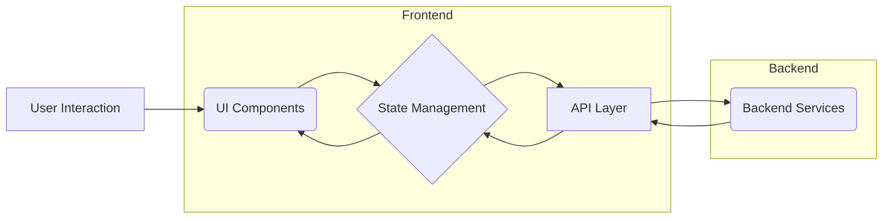
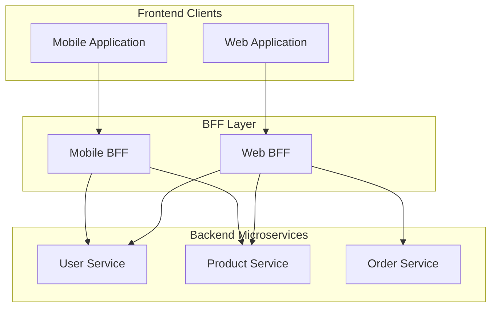

# Chapter 7: Frontend System Design Interviews

Frontend system design interviews have become increasingly common, especially for senior and staff-level roles. Unlike traditional algorithm or coding challenges, these interviews assess your ability to architect complex, scalable, and maintainable frontend applications. They probe your understanding of high-level architecture, component design, performance optimization, API interactions, trade-offs, and your ability to communicate complex technical decisions clearly.

This chapter provides a comprehensive guide to navigating these challenging interviews. We'll cover a structured framework for tackling design questions, explore common archetypes you might encounter, and delve into the key technical considerations interviewers expect you to discuss. Mastering this interview format is crucial for demonstrating the breadth and depth of your frontend expertise required for senior positions.

## A. Framework for Approaching System Design Questions

Walking into a system design interview without a plan is like navigating a maze blindfolded. A structured approach helps manage ambiguity, ensures you cover critical aspects, and allows you to showcase your thought process effectively. The goal isn't always to arrive at the "perfect" solution (often, there isn't one), but to demonstrate strong problem-solving skills, architectural thinking, and the ability to articulate trade-offs.

### 1. Understanding the Requirements and Constraints (Clarification is Key)

This is arguably the **most critical step**. Never assume anything. Start by asking clarifying questions to fully scope the problem. Misunderstanding requirements leads to designing the wrong system.

- **Functional Requirements:** What should the system _do_?
  - _Example Questions:_ "What are the core features? (e.g., For a Twitter feed: display tweets, like, retweet, reply, post new tweet?)" "Who are the target users? (e.g., Public users, internal employees?)" "Are there different user roles with different permissions?" "What level of fidelity is expected? (e.g., High-fidelity prototype, basic functionality?)"
- **Non-Functional Requirements (NFRs):** How should the system _perform_? These often drive architectural decisions.
  - _Scalability:_ "How many users are expected? (e.g., 100? 1 million? 100 million?)" "What is the expected load? (e.g., Requests per second? Concurrent users?)"
  - _Performance:_ "What are the latency requirements? (e.g., Time to interactive? Feed load time?)" "Are there specific Core Web Vitals targets?"
  - _Availability:_ "Does the system need to be highly available? (e.g., 99.9% uptime?)"
  - _Consistency:_ "How critical is data consistency? (e.g., Is eventual consistency acceptable for likes/counts?)"
  - _Accessibility (A11y):_ "What level of accessibility compliance is required? (e.g., WCAG AA?)"
  - _Security:_ "Are there specific security concerns or compliance requirements?"
  - _Maintainability:_ "How important is long-term maintainability and extensibility?"
- **Constraints:** What limitations exist?
  - _Technology Stack:_ "Are there preferred frameworks/libraries? (React, Vue, Angular?)" "Are we constrained by existing backend systems or APIs?"
  - _Team Size/Expertise:_ "What is the size and experience level of the hypothetical team building this?"
  - _Timeframe:_ "Is this an MVP, or a long-term project?" (In an interview, the constraint is the interview time itself).
  - _Device Support:_ "Which browsers and devices must be supported? (Desktop, mobile, specific versions?)"

> **Interview Tip:** Actively listen to the interviewer's responses. Summarize your understanding of the requirements and constraints before moving on. This ensures alignment and shows you're methodical. Use a whiteboard or virtual equivalent to jot down key requirements.

### 2. High-Level Design (Components, APIs, Data Flow)

Once requirements are clear, sketch out the high-level architecture. Focus on the main building blocks and how they interact.

- **Identify Core Components:** Break down the UI into logical, reusable components. Think about container vs. presentational components. (e.g., For a Twitter feed: `FeedContainer`, `TweetCard`, `TweetInput`, `UserProfileSidebar`).
- **Define Key APIs:** What data is needed? How will the frontend fetch/update it? Identify the necessary API endpoints and the kind of data they'll handle. Consider REST, GraphQL, WebSockets. (e.g., `GET /api/feed`, `POST /api/tweets`, `POST /api/likes`, `WS /api/realtime-updates`).
- **Map Data Flow:** How does data move through the system? Where does state live? How do components communicate? (e.g., User scrolls -> `FeedContainer` requests more data -> API returns tweets -> State updates -> `TweetCard` components render).

> **Diagram Explanation:** This simple diagram shows the high-level flow in a typical frontend application: User interaction triggers changes in UI components, which interact with state management. The state management layer coordinates with the API layer to fetch or send data to backend services, eventually updating the UI components again.

### 3. Deep Dive into Specific Components/Features

Choose one or two core components or complex features identified in the high-level design and elaborate on their internal structure and logic.

- **Component Internals:** Discuss the state, props, and responsibilities of the chosen component(s). (e.g., "The `TweetCard` component will receive tweet data as props. It will manage internal state for 'show replies' toggle. It will dispatch actions for 'like' or 'retweet' clicks.").
- **Feature Logic:** Explain how a specific feature works end-to-end from a frontend perspective. (e.g., "Posting a new tweet: The `TweetInput` component captures text, validates length. On submit, it calls the API layer's `postTweet` function. Optimistically, it adds the tweet to the local state/feed immediately with a 'pending' status. On API success, it updates the status. On failure, it shows an error and allows retry.").
- **State Management:** How is state managed within this feature? Local component state? Shared state management library (Redux, Zustand, Vuex)? Context API?

### 4. Data Modeling (Client-side)

How will you structure the data received from APIs within your frontend application? Effective client-side data modeling impacts performance, state management complexity, and ease of rendering.

- **Normalization vs. Denormalization:** Will you store data in a normalized way (like a database, reducing redundancy but potentially requiring more complex lookups) or denormalized (closer to the UI structure, easier to render but potentially redundant)? Often, a mix is used. Libraries like `normalizr` can help.
- **Data Structures:** Choose appropriate data structures (objects, arrays, maps) for efficient access and updates. (e.g., Using an object keyed by ID for quick lookups: `tweets: { 't1': {...}, 't2': {...} }`).
- **Caching:** How will fetched data be cached to avoid redundant requests? Consider in-memory caches, state management stores, or even `localStorage`/`sessionStorage` for certain types of data.

### 5. API Contract Design (Interaction with Backend)

While you might not design the backend, you need to define how the frontend _expects_ to interact with it.

- **Endpoint Design:** Propose specific endpoints, HTTP methods (GET, POST, PUT, DELETE), request payloads, and expected response structures.
- **Data Shape:** What data should each endpoint return? Avoid over-fetching (requesting more data than needed) and under-fetching (requiring multiple requests for data needed for a single view). This is where patterns like Backend for Frontend (BFF) or GraphQL shine.
- **Error Handling:** How should the API signal errors (status codes, error messages)? How will the frontend handle different types of errors (network errors, server errors, validation errors)?
- **Authentication/Authorization:** How will requests be authenticated? (e.g., JWT tokens in headers).

> **Production Example (BFF):** "For the mobile view of the product page, we need less data than the desktop view. Instead of having the mobile client filter a large payload or making multiple small requests, we could propose a BFF endpoint `/api/mobile/products/:id` that aggregates data from underlying microservices (product details, reviews, recommendations) and returns only the fields necessary for the mobile UI, optimizing payload size."

### 6. Discussing Trade-offs (Scalability, Performance, Maintainability, Cost, DX)

This is where senior candidates differentiate themselves. No design is perfect; every choice involves trade-offs. Explicitly discuss the pros and cons of your decisions.

- **Technology Choices:** Why React vs. Vue? Why Redux vs. Context API? Why REST vs. GraphQL? (e.g., "Using GraphQL allows the frontend to request exactly the data it needs, reducing over-fetching, but introduces complexity with schema management and potential performance issues if queries aren't optimized. REST is simpler to implement initially but can lead to multiple round trips or large, inflexible payloads.").
- **Architectural Patterns:** Monolith vs. Micro-frontends? Client-side rendering (CSR) vs. Server-side rendering (SSR) vs. Static Site Generation (SSG)? (e.g., "SSR improves initial load performance (FCP/LCP) and SEO compared to CSR, but increases server load and complexity. CSR is simpler for SPAs but can have slower initial loads and SEO challenges.").
- **Implementation Details:** Optimistic updates vs. waiting for API confirmation? Normalization vs. denormalization? (e.g., "Optimistic updates provide a snappier UX but require careful handling of potential API failures and state rollback. Waiting for confirmation is simpler but feels slower.").
- **Consider Dimensions:** Always frame trade-offs across multiple dimensions:
  - **Performance:** Load time, responsiveness, resource usage.
  - **Scalability:** Ability to handle increased load/data/users.
  - **Maintainability:** Ease of understanding, modifying, and debugging the code.
  - **Development Experience (DX):** How easy/fast is it for developers to build and iterate?
  - **Cost:** Infrastructure costs, development time.
  - **Complexity:** How intricate is the solution? Does it require specialized knowledge?
  - **Reliability:** How prone is it to errors? How easy is recovery?

### 7. Identifying Bottlenecks and Edge Cases

Demonstrate foresight by anticipating potential problems and edge cases.

- **Performance Bottlenecks:** Where might the system slow down? (e.g., Large list rendering, complex calculations on the main thread, excessive network requests, large bundle sizes). Propose solutions (virtualization, web workers, code splitting, caching).
- **Scalability Issues:** What happens if usage spikes? (e.g., API rate limiting, WebSocket connection limits, state management performance under heavy load).
- **Edge Cases:** What unusual scenarios need handling? (e.g., Offline users, users with slow connections, race conditions, concurrent edits, empty states, error states, accessibility for unusual inputs).
- **Failure Modes:** What happens if an API fails? If a third-party script fails to load? If the WebSocket disconnects? Implement graceful degradation and robust error handling.

### 8. [Practical Example: Applying the framework to a common design question like "Design Twitter Feed"]

Let's walk through the framework for designing a simplified Twitter-like feed.

1.  **Requirements & Constraints (Clarification):**

    - _Functional:_ Display chronological feed of tweets from followed users, show tweet text/author/timestamp, allow liking a tweet, allow posting a new tweet (text only). Real-time updates for new tweets desirable.
    - _Non-Functional:_ Target: 1M users. Performance: Feed should load under 2s, scrolling should be smooth. High availability. Eventual consistency for likes is acceptable. Basic accessibility.
    - _Constraints:_ Use React. Assume standard REST APIs are available initially. Desktop focus first. Interview time: 45 mins.

2.  **High-Level Design:**

    - _Components:_ `FeedPage`, `TweetList`, `TweetCard`, `LikeButton`, `NewTweetForm`.
    - _APIs:_
      - `GET /api/feed?cursor=<timestamp>` (Pagination)
      - `POST /api/tweets { text: "..." }`
      - `POST /api/likes { tweetId: "..." }`
      - `DELETE /api/likes { tweetId: "..." }` (or `POST /api/unlikes`)
      - (Optional) `WS /api/feed/updates` for real-time.
    - _Data Flow:_ `FeedPage` mounts -> Fetches initial feed (`GET /api/feed`) -> Stores tweets in state -> Renders `TweetList` -> `TweetList` renders `TweetCard`s. User scrolls -> `TweetList` detects near bottom -> Fetches next page (`GET /api/feed?cursor=...`) -> Appends tweets to state. User clicks Like -> `LikeButton` calls API (`POST /api/likes`) -> Optimistically updates UI -> Updates state on success/reverts on failure. User submits `NewTweetForm` -> Calls API (`POST /api/tweets`) -> Optimistically adds to top of feed -> Updates state.

3.  **Deep Dive (TweetList & Infinite Scroll):**

    - `TweetList` component receives the array of tweet IDs/data.
    - Manages pagination state (e.g., `nextCursor`, `isLoading`, `hasMore`).
    - Uses `IntersectionObserver` to detect when the user scrolls near the bottom.
    - When triggered and `hasMore` is true and not already `isLoading`, calls a prop function (`fetchMoreTweets`) passed down from `FeedPage`.
    - **Performance:** To handle potentially thousands of tweets, implement **virtualization** (e.g., using `react-window` or `react-virtualized`). Only render the DOM nodes for tweets currently visible (plus a small buffer), significantly improving rendering performance and memory usage.

4.  **Data Modeling (Client-side):**

    - Normalize tweet data: Store tweets in an object keyed by ID (`tweetsById: { 't1': {...}, 't2': {...} }`).
    - Store the feed order as an array of IDs (`feedOrder: ['t2', 't1', ...]`).
    - This makes updating a specific tweet (e.g., like count) easy without searching the array, and keeps the feed order separate.

5.  **API Contract Design:**

    - `GET /api/feed`: Use cursor-based pagination (e.g., based on timestamp or a unique cursor string) instead of offset/limit. This is more performant and stable in feeds with frequent insertions. Response: `{ tweets: [...], nextCursor: "..." }`.
    - `POST /api/likes`: Request: `{ tweetId: "t123" }`. Response could be minimal (200 OK) or return the updated like count/status.
    - Error Handling: Use standard HTTP status codes (400 for bad request, 401 for auth, 500 for server error). Provide meaningful error messages in the response body.

6.  **Trade-offs:**

    - _Real-time (WebSockets vs. Polling):_ WebSockets provide true real-time but add server complexity and connection management overhead. Short polling is simpler but less efficient and not truly real-time. Long polling is a middle ground. _Decision:_ Start with polling (`setInterval` to fetch new tweets since last fetch) for simplicity/MVP, consider WebSockets for v2 if real-time is critical.
    - _Virtualization:_ Adds complexity to implementation and accessibility can be trickier, but essential for performance with large lists. _Decision:_ Implement virtualization due to the potential scale.
    - _Optimistic Updates:_ Improves perceived performance but requires careful state management and error handling (rollback). _Decision:_ Implement for likes and new tweets as these are core interactions.

7.  **Bottlenecks & Edge Cases:**
    - _Bottleneck:_ Rendering thousands of DOM nodes (solved by virtualization). Network latency on scroll (prefetch next page slightly before user hits bottom). Bundle size (use code splitting).
    - _Edge Cases:_ Offline mode (show stale data, disable actions). Rate limiting by the API. Handling duplicate tweets if API/real-time logic overlaps. Empty feed state. Error state for failed tweet posts/likes. Network interruptions during infinite scroll.

This structured walkthrough allows the interviewer to follow your thought process, see how you handle complexity, and evaluate your understanding of key frontend concepts and trade-offs.

## B. Common Frontend System Design Archetypes

While every system design question is unique, many fall into recognizable patterns or archetypes. Understanding these common patterns, their specific challenges, and typical solutions will equip you to handle a wide range of interview questions.

### 1. Infinite Scrolling Feed (e.g., Social Media Feed)

This is a classic. The core challenge is displaying a potentially massive, dynamically loading list of items efficiently and smoothly.

###### a. API Design (Pagination, Cursor-based)

- **Problem:** Fetching thousands of items at once is infeasible (network bandwidth, client memory/performance). Need a way to load data in chunks.
- **Offset/Limit Pagination:** `GET /items?offset=20&limit=10`. Simple but problematic for feeds with frequent insertions/deletions, as items can be skipped or repeated if the dataset changes between requests. Performance can degrade on the backend as `OFFSET` increases.
- **Cursor-based Pagination:** `GET /items?limit=10&cursor=<value>`. The `cursor` is an opaque pointer (often timestamp + unique ID, or just a unique ID) to the last item seen. The backend returns items _after_ that cursor. More resilient to dataset changes and generally more performant on the backend. This is preferred for infinite feeds.
- **API Response:** Should include the list of items and the `nextCursor` value for the subsequent request. Also useful: a flag indicating if more items are available (`hasMore: true/false`).

###### b. Client-side Caching and Rendering Strategy

- **Caching:** Store fetched items in client-side state (e.g., Redux store, component state). Normalize data (store items by ID) for efficient updates (e.g., updating like counts).
- **Appending vs. Replacing:** When new data is fetched, append it to the existing list in the state.
- **Rendering:** Map the ordered list of item IDs/data to UI components.

###### c. Performance Optimization (Virtualization, Debouncing)

- **Virtualization (Windowing):** The most crucial optimization. Only render the DOM elements for items currently visible in the viewport (plus a buffer). Libraries like `react-window`, `react-virtualized` (React), or `vue-virtual-scroller` (Vue) help implement this. Avoids rendering thousands of DOM nodes, drastically improving performance.
  - _Challenge:_ Requires fixed or accurately measurable item heights for calculation. Dynamic heights can be tricky. Accessibility needs careful handling (ensuring scroll position and focus management work correctly).
- **Debouncing/Throttling Scroll Events:** Attaching fetch logic directly to the `scroll` event can trigger excessive checks/requests. Use techniques like:
  - `IntersectionObserver`: Modern and performant API to detect when an element (e.g., a "load more" sentinel element near the bottom) enters the viewport. Preferred method.
  - Debouncing/Throttling: If using scroll events, wrap the check/fetch logic in `debounce` (waits for a pause in scrolling) or `throttle` (limits execution rate) to prevent overwhelming the browser or API.
- **Image Loading:** Use lazy loading for images within the feed items. Only load images as they approach the viewport.

###### d. [Case Study: Designing a performant infinite scroll]

- **Scenario:** Design the feed for a photo-sharing app. High-resolution images, comments, likes.
- **Key Decisions:**
  1.  **API:** Cursor-based pagination (`GET /feed?limit=10&cursor=...`). Cursor combines timestamp and photo ID.
  2.  **State:** Use Zustand (lightweight state manager). Normalize photos (`photosById`) and maintain feed order (`feedPhotoIds`).
  3.  **Rendering:** Use `react-window`'s `VariableSizeList` because photo heights might vary slightly based on aspect ratio/caption length. Provide an `itemSize` estimation function.
  4.  **Triggering Load:** Use `IntersectionObserver` on a sentinel `div` placed after the last rendered item. Set `rootMargin` to trigger loading slightly before the sentinel becomes visible (e.g., `200px`).
  5.  **Image Loading:** Use `loading="lazy"` attribute on `` tags (native browser lazy loading). Provide `width` and `height` attributes or use CSS `aspect-ratio` to prevent layout shifts. Use responsive images (`srcset`) to load appropriate sizes.
  6.  **Optimistic Updates:** For likes, update the UI immediately and revert on API failure.
  7.  **Placeholders:** Show skeleton loaders while the initial feed or subsequent pages are loading.

### 2. Real-time Collaboration Tool (e.g., Google Docs Lite)

These systems involve multiple users interacting with shared state simultaneously. The core challenge is synchronizing state efficiently and resolving conflicts.

###### a. State Synchronization (WebSockets, CRDTs - Conceptual)

- **WebSockets:** The standard for real-time, bidirectional communication. The server pushes updates to connected clients instantly. Clients send their changes (e.g., text insertions/deletions) to the server via the WebSocket.
  - _Challenge:_ Managing connection lifecycle (opening, closing, errors, reconnections). Scalability on the backend (handling potentially millions of persistent connections).
- **Server-Sent Events (SSE):** Simpler alternative for _server-to-client_ communication only. Good if clients only need to receive updates, not send frequent changes over the same channel.
- **Conflict-Free Replicated Data Types (CRDTs):** Advanced data structures designed for distributed systems where concurrent updates can occur. They have mathematical properties ensuring that even if updates arrive out of order or are applied multiple times, all replicas eventually converge to the same state without requiring complex locking or central coordination for conflict resolution.
  - _Interview Context:_ You likely won't implement CRDTs live, but _understanding the concept_ (eventual consistency, convergence, handling concurrent edits mathematically) demonstrates senior-level knowledge. Mentioning them as a potential solution for robust conflict resolution is valuable. Examples: Logoot, Treedoc, Yjs (library).
- **Operational Transformation (OT):** An older alternative to CRDTs, often used in earlier collaborative editors (like the original Google Docs). Involves transforming operations based on previously applied operations to ensure consistency. Generally considered more complex to implement correctly than CRDTs.

###### b. Handling Concurrent Edits and Conflicts

- **Challenge:** If User A and User B edit the same piece of text simultaneously, how do you merge their changes correctly on all clients?
- **Last Write Wins (LWW):** Simplest approach, but often leads to lost data. Whichever update reaches the server last overwrites previous ones. Generally unsuitable for collaborative text editing.
- **Server-Side Conflict Resolution:** The server receives changes, detects conflicts, and applies a resolution strategy (e.g., using OT or CRDT logic) before broadcasting the reconciled state.
- **CRDT Approach:** Each change is structured so it can be applied independently, and the merging properties of the CRDT ensure convergence. The server might still act as a relay, but complex resolution logic can reside within the data type itself.

###### c. Presence Indication

- **Requirement:** Show who else is currently viewing/editing the document.
- **Implementation:** When a user connects (via WebSocket), they register their presence with the server (associated with the document ID). The server broadcasts presence updates (user joins/leaves) to other clients connected to the same document. Display avatars or names in the UI. Requires managing presence state on the server. Heartbeat messages over the WebSocket might be needed to detect disconnected clients who didn't explicitly leave.

###### d. [Deep Dive: Challenges of real-time frontend systems]

- **State Management Complexity:** Managing shared, rapidly changing state is hard. Need efficient ways to apply updates without re-rendering the entire document. Immutable state patterns help.
- **Performance:** Applying frequent updates (e.g., character-by-character changes) needs to be highly performant. Avoid expensive computations or excessive DOM manipulation on every update. Techniques like debouncing input or batching updates can help, but introduce latency trade-offs. Virtual DOM diffing helps minimize direct DOM updates.
- **Network Reliability:** Handle WebSocket disconnections gracefully. Implement automatic reconnection logic with exponential backoff. Need a way to fetch the latest state or missed operations upon reconnection.
- **Scalability:** Backend needs to handle many persistent WebSocket connections. Frontend needs to handle potentially frequent updates from many collaborators without degrading performance.
- **Undo/Redo:** Implementing undo/redo in a collaborative environment is non-trivial, especially with concurrent edits. OT/CRDTs often provide mechanisms to handle this.

### 3. E-commerce Product Page

A common scenario involving complex UI composition, state management for user selections, performance optimization (especially images), and potentially A/B testing.

###### a. Component Breakdown (Image Gallery, Reviews, Cart)

- **Structure:** Break the page into logical, potentially independent components:
  - `ProductDetailsContainer`: Fetches product data, manages overall state.
  - `ImageGallery`: Displays product images, handles thumbnail selection, zooming. State: current image index.
  - `ProductInfo`: Displays title, price, description, variants (size/color selectors). State: selected variant, quantity.
  - `VariantSelector`: Handles selection of product options (e.g., size, color). Updates shared state.
  - `AddToCartForm`: Contains quantity selector, "Add to Cart" button. Handles adding items to the cart state/API.
  - `ReviewsSection`: Fetches and displays product reviews (potentially lazy-loaded).
  - `Recommendations`: Displays related products (potentially lazy-loaded).
- **Reusability:** Components like `ImageGallery` or `ReviewsSection` might be reusable across the site.

###### b. State Management for Cart and User Options

- **Product Options (Size, Color, Quantity):** Often managed within the `ProductDetailsContainer` or a dedicated state slice/hook. Changes in `VariantSelector` or quantity input update this shared state. The `AddToCartForm` reads this state when the user clicks "Add to Cart".
- **Cart State:** Typically managed globally (e.g., Redux, Zustand, Context API) as it needs to be accessible from multiple pages (product page, header cart icon, checkout page).
  - Actions: `ADD_ITEM`, `REMOVE_ITEM`, `UPDATE_QUANTITY`.
  - State Shape: Could be an array of items or an object keyed by product/variant ID. `{ items: { 'prod1_sizeL': { productId: 'prod1', variantId: 'sizeL', quantity: 2, ...details } } }`.
  - Persistence: Cart state often needs to persist across sessions (using `localStorage` or server-side storage).
- **API Interaction:** Adding to cart involves sending the selected product ID, variant ID, and quantity to a cart API (`POST /api/cart`). The global cart state might be updated optimistically, then reconciled with the API response.

###### c. Performance Optimization (Image Loading, Critical Path CSS/JS)

- **Images:** Product images are critical but often large.
  - _Responsive Images:_ Use `srcset` and `sizes` attributes to deliver appropriately sized images for different viewports/resolutions.
  - _Modern Formats:_ Use formats like WebP or AVIF for better compression. Provide fallbacks (`<picture>` element).
  - _Lazy Loading:_ Load below-the-fold images (e.g., in reviews, recommendations) lazily (`loading="lazy"`). The main product images in the gallery should usually load eagerly unless they are complex carousels.
  - _Thumbnails:_ Use small, optimized thumbnails for gallery navigation.
  - _Image CDN:_ Use a Content Delivery Network (CDN) for fast global delivery and potentially on-the-fly image optimization/resizing.
- **Critical Path Rendering:**
  - _CSS:_ Inline critical CSS (styles needed for above-the-fold content) in the `<head>` to ensure the initial view renders quickly without waiting for external stylesheets. Load non-critical CSS asynchronously.
  - _JavaScript:_ Minimize blocking JS. Use `async` or `defer` for script tags. Code-split JS bundles, loading non-essential features (like review submission forms, complex recommendation logic) asynchronously. Prioritize loading JS needed for interactivity (image gallery, add to cart). Server-Side Rendering (SSR) or Static Site Generation (SSG) can significantly improve FCP/LCP for product pages.

###### d. A/B Testing Considerations

- **Requirement:** Often need to test different layouts, button colors, pricing displays, etc.
- **Implementation:**
  - _Feature Flags/Experimentation Platform:_ Use a library or service (e.g., LaunchDarkly, Optimizely) to control which variation a user sees. The frontend fetches the experiment configuration and renders the appropriate UI variation.
  - _Component Swapping:_ Design components to be easily swappable based on the experiment configuration.
  - _Tracking:_ Implement analytics tracking to measure the impact of each variation on key metrics (e.g., add-to-cart rate, conversion rate). Ensure tracking is consistent across variations.
  - _Performance Impact:_ Be mindful of the performance cost of A/B testing tools (extra JS, potential layout shifts if not implemented carefully).

### 4. Video Streaming Player Interface

Focuses on building the UI controls around a video element, managing player state, interacting with streaming protocols, and ensuring accessibility.

###### a. Player Controls and State Management

- **Core Controls:** Play/Pause button, seek bar (progress bar), volume control (slider/mute button), fullscreen button, time display (current time / duration).
- **State:** The player UI needs to synchronize with the underlying `<video>` element's state. Key state variables: `isPlaying`, `currentTime`, `duration`, `volume`, `isMuted`, `isBuffering`, `isFullscreen`, `playbackRate`.
- **Event Listeners:** Attach listeners to the `<video>` element events (`play`, `pause`, `timeupdate`, `volumechange`, `seeking`, `seeked`, `waiting`, `playing`, `ended`, `durationchange`, `error`, etc.) to update the UI state.
- **UI Interaction:** Clicking UI controls should update the `<video>` element's properties/methods (e.g., `video.play()`, `video.pause()`, `video.currentTime = newValue`, `video.volume = newValue`, `video.requestFullscreen()`).
- **Customization:** Consider allowing themes or configurable UI elements.

###### b. Handling Different Streaming Formats (HLS, DASH)

- **Native Support:** Basic formats like MP4 are supported natively by `<video>`.
- **Adaptive Streaming (HLS/DASH):** For efficient streaming over varying network conditions, adaptive bitrate streaming protocols like HLS (HTTP Live Streaming) and MPEG-DASH (Dynamic Adaptive Streaming over HTTP) are used. These break the video into small chunks and provide manifests describing available quality levels.
- **JavaScript Libraries:** The browser's native `<video>` element doesn't directly support HLS/DASH playback everywhere (though support is improving, especially for HLS in Safari). You typically need JavaScript libraries like:
  - `hls.js`: Client-side HLS playback.
  - `dash.js`: Client-side DASH playback.
  - Video.js, Shaka Player, Plyr: Comprehensive player libraries that often integrate hls.js/dash.js and provide a unified API and UI controls.
- **How they work (Conceptual):** These libraries fetch the manifest file, parse available quality levels, monitor network bandwidth, select the appropriate quality chunk, fetch it, and feed it into the `<video>` element using Media Source Extensions (MSE).

###### c. Adaptive Bitrate Logic (Conceptual)

- **Goal:** Provide the best possible video quality without buffering, adapting to changing network conditions.
- **Process (Simplified):**
  1.  The player library (e.g., hls.js) downloads the manifest file listing available video streams (different bitrates/resolutions) and segment URLs.
  2.  It monitors network bandwidth (e.g., by measuring download times of previous segments).
  3.  Based on available bandwidth and potentially other factors (buffer health, screen size), it selects the most appropriate quality level for the _next_ segment.
  4.  It downloads the segment for the chosen quality level.
  5.  It appends the segment data to the `<video>` element's buffer via Media Source Extensions.
  6.  Repeat for subsequent segments, potentially switching quality levels up or down between segments.
- **Frontend Role:** While the core ABR logic is usually inside the player library, the frontend developer integrates the library, configures it (e.g., setting initial bitrate, restrictions), handles its events (e.g., showing errors, quality level switches), and builds the UI controls around it.

###### d. Accessibility Considerations

- **Keyboard Navigation:** All controls (play/pause, seek bar, volume, fullscreen) must be focusable and operable using the keyboard (Enter/Space for buttons, arrow keys for sliders).
- **Screen Reader Support:** Use appropriate ARIA attributes:
  - `aria-label` for icon buttons (e.g., `aria-label="Play"`, `aria-label="Mute"`).
  - `aria-valuenow`, `aria-valuemin`, `aria-valuemax`, `aria-valuetext` for sliders (seek bar, volume).
  - Live regions (`aria-live`) to announce important changes (e.g., "Video paused").
- **Captions/Subtitles:** Support rendering WebVTT (`<track>` element) or other caption formats. Provide UI controls to toggle captions and select languages.
- **Focus Management:** Ensure focus is managed correctly, especially when entering/exiting fullscreen mode or when custom controls overlay the video.

### 5. Complex Form / Multi-Step Wizard

Designing forms, especially long or multi-step ones (wizards), involves careful state management, validation, user experience considerations, and potentially handling sub-steps or conditional logic.

###### a. State Management for Form Data

- **Challenge:** Need to manage the state of potentially many input fields across multiple steps.
- **Approaches:**
  - **Local Component State:** Suitable for simple forms within a single component. Use `useState` for each field or a single state object.
  - **Form Libraries:** Libraries like `Formik`, `React Hook Form` (React), `VeeValidate` (Vue), or `Angular Reactive Forms` abstract away much of the boilerplate for handling form state, validation, and submission. Highly recommended for complex forms. They often provide hooks or components to register inputs and manage their values, touched status, and errors.
  - **Global State Manager:** For wizards where state needs to persist across steps (which might be different components/routes), store the form data in a global store (Redux, Zustand, Context API). Each step reads the relevant part of the state and dispatches actions to update it.
- **Data Structure:** Typically an object where keys are field names and values are the field values. For wizards, you might nest state by step: `{ step1: { fieldA: '...' }, step2: { fieldB: '...' } }`.

###### b. Validation Logic (Client-side and Server-side)

- **Client-Side Validation:** Provide immediate feedback to users as they type or when they blur fields. Improves UX by catching errors early.
  - _Types:_ Required fields, data formats (email, URL), length constraints, number ranges, pattern matching (regex).
  - _Implementation:_ Can be done manually with conditional rendering of error messages, but form libraries provide built-in validation rules or integration with schema validation libraries (like `Yup` or `Zod`).
  - _UX:_ Display errors clearly near the relevant field. Disable submit button until core requirements are met.
- **Server-Side Validation:** **Absolutely essential.** Never trust client-side validation alone, as it can be bypassed. The backend must re-validate all submitted data before processing or storing it.
  - _Purpose:_ Security (prevent malicious data), data integrity (enforce business rules not known to the client), consistency.
  - _Error Handling:_ The API should return structured error messages indicating which fields failed validation and why. The frontend needs to parse these errors and display them to the user, typically associated with the correct form fields. Form libraries often have utilities to help map server errors back to fields.

###### c. Handling Sub-steps and Conditional Logic

- **Wizards (Multi-Step):**
  - _Routing:_ Each step might be a separate route (e.g., `/wizard/step1`, `/wizard/step2`) or conditionally rendered components within a parent container.
  - _State Persistence:_ Ensure form state is preserved when navigating between steps (using global state or passing state via route parameters/location state if appropriate).
  - _Navigation:_ Provide clear "Next" and "Previous" buttons. Indicate progress (e.g., "Step 2 of 5"). Allow users to jump back to previous steps (if allowed by the logic).
- **Conditional Fields/Sections:** Show or hide certain fields or entire sections based on the values of other fields (e.g., show "Shipping Address" section only if "Ship to different address" checkbox is checked).
  - _Implementation:_ Use conditional rendering (`if/else`, ternary operators, `&&`) based on the form state. Reset the state of hidden fields when they become hidden if their values are no longer relevant.

###### d. Saving Drafts / Resuming Progress

- **Requirement:** For long forms, allow users to save their progress and return later.
- **Implementation:**
  - _Automatic Saving:_ Periodically save the current form state to `localStorage` or `sessionStorage`. Debounce the save operation to avoid excessive writes.
  - _Manual Save Button:_ Provide an explicit "Save Draft" button that sends the current form state to a backend API.
  - _Resuming:_ When the user returns to the form, check `localStorage` or fetch the saved draft from the API and pre-fill the form state. Clear the saved draft upon successful submission.
  - _Considerations:_ Handle potential conflicts if the form structure changes between saves. Decide how long drafts should persist. Inform the user that their progress is being saved/has been restored.

## C. Key Considerations in Frontend System Design

Beyond specific archetypes, several cross-cutting concerns are crucial in _any_ frontend system design interview. Discussing these demonstrates a holistic understanding of building robust, production-ready applications.

### 1. Performance and Scalability

Frontend performance directly impacts user experience, engagement, and conversion rates. Scalability ensures the application handles growth gracefully.

###### a. Caching Strategies (Browser, CDN, Service Worker)

- **Browser Cache (HTTP Caching):** Leverage standard HTTP cache headers (`Cache-Control`, `ETag`, `Last-Modified`) for static assets (JS, CSS, images, fonts). Reduces redundant downloads for repeat visitors.
- **Content Delivery Network (CDN):** Serve static assets from geographically distributed servers closer to users. Reduces latency and server load. Essential for global applications. CDNs also provide caching layers.
- **Service Worker Caching:** Enables fine-grained programmatic caching beyond the browser's default HTTP cache. Allows for offline support (serving cached assets/data when offline), faster repeat visits (serving from cache first), and strategies like cache-first, network-first, stale-while-revalidate. Crucial for Progressive Web Apps (PWAs).
- **Application Data Caching:** Cache API responses in memory (e.g., in state management store) or using libraries like React Query or SWR to avoid re-fetching data unnecessarily. Implement cache invalidation strategies (time-based, event-based).

###### b. Code Splitting and Lazy Loading

- **Problem:** Large monolithic JavaScript bundles increase initial load times.
- **Code Splitting:** Break down the JS bundle into smaller chunks using bundler features (Webpack, Vite, Parcel).
  - _Route-based Splitting:_ Load JS code only for the current route/page.
  - _Component-based Splitting:_ Load code for specific heavy components (e.g., a complex chart library, a rich text editor) only when they are needed/rendered. Use dynamic `import()`.
- **Lazy Loading:** The technique of deferring the loading of non-critical resources (JS chunks, images, components) until they are actually required.

###### c. Asset Optimization (Images, Fonts, JS, CSS)

- **Images:** Use appropriate formats (WebP/AVIF), responsive images (`srcset`), compression, and lazy loading.
- **Fonts:** Use modern formats (WOFF2). Limit the number of custom fonts/weights. Use `font-display: swap` or `optional` to avoid blocking rendering. Consider self-hosting fonts vs. using third-party services (privacy/performance trade-offs).
- **JavaScript:** Minification, compression (Gzip/Brotli - typically handled by the server/CDN), code splitting, tree shaking (removing unused code), analyzing bundle size (e.g., `webpack-bundle-analyzer`).
- **CSS:** Minification, compression, critical CSS inlining, removing unused CSS (e.g., PurgeCSS), optimizing CSS selectors.

###### d. Network Request Optimization

- **Reduce Requests:** Combine multiple small API calls if possible (BFF pattern, GraphQL). Use CSS sprites or SVG icons instead of many small images.
- **Reduce Payload Size:** Request only necessary data (GraphQL helps). Use compression (Gzip/Brotli) for API responses.
- **Prioritization:** Use `preload` or `prefetch` resource hints to load critical resources earlier. Defer loading non-critical third-party scripts.
- **HTTP/2 or HTTP/3:** Leverage multiplexing to load multiple resources over a single connection more efficiently.

###### e. [Production Note: Measuring and monitoring frontend performance (Core Web Vitals)]

- **Importance:** You can't optimize what you don't measure. Discussing _how_ you'd measure performance is key.
- **Core Web Vitals (CWV):** Google's metrics focusing on user experience:
  - _Largest Contentful Paint (LCP):_ Loading performance (perceived load speed). Aim for < 2.5s.
  - _First Input Delay (FID) / Interaction to Next Paint (INP):_ Interactivity. FID aims for < 100ms. INP (newer, more comprehensive) aims for < 200ms.
  - _Cumulative Layout Shift (CLS):_ Visual stability. Aim for < 0.1.
- **Measurement Tools:**
  - _Lab Data (Synthetic):_ Lighthouse (in Chrome DevTools or CLI), WebPageTest. Good for controlled testing during development.
  - _Field Data (Real User Monitoring - RUM):_ Google's Chrome User Experience Report (CrUX), `web-vitals` JavaScript library, commercial RUM providers (Datadog, New Relic, Sentry). Captures actual user experience across different devices/networks. Essential for understanding real-world performance.
- **Other Metrics:** Time to First Byte (TTFB), First Contentful Paint (FCP), Time to Interactive (TTI), total bundle size.
- **Monitoring:** Set up dashboards and alerts based on RUM data to track performance over time and detect regressions.

### 2. Maintainability and Code Quality

Building systems that are easy to understand, modify, and debug over time is crucial for team velocity and long-term success.

###### a. Modularity and Reusability

- **Component-Based Architecture:** Break down the UI into small, focused, reusable components with well-defined responsibilities and APIs (props/events).
- **Design Systems:** Use a design system or component library for consistent UI elements and patterns.
- **Utility Functions/Hooks:** Encapsulate common logic (e.g., data fetching, formatting, validation) into reusable functions or custom hooks.
- **Separation of Concerns:** Keep UI logic, business logic, and state management concerns separate where possible.

###### b. Testability

- **Unit Tests:** Test individual components, functions, or modules in isolation. Use libraries like Jest, Vitest, React Testing Library, Vue Testing Library. Focus on testing behavior from the user's perspective rather than implementation details.
- **Integration Tests:** Test the interaction between multiple components or modules (e.g., does clicking a button in one component correctly update state used by another?).
- **End-to-End (E2E) Tests:** Test complete user flows through the application using tools like Cypress or Playwright. Simulate real user interactions in a browser. More brittle and slower, but valuable for critical paths.
- **Designing for Testability:** Write pure functions, use dependency injection, avoid side effects in rendering logic, make components testable via their props and interactions.

###### c. Documentation and Architectural Diagrams

- **Code Comments:** Explain _why_ something is done, not just _what_ it does, especially for complex or non-obvious logic.
- **Component Documentation:** Use tools like Storybook or Docz to document components, their props, and usage examples interactively.
- **READMEs:** Provide clear setup instructions, project overview, and contribution guidelines.
- **Architectural Diagrams:** High-level diagrams (like those generated with MermaidJS or dedicated tools) illustrating component structure, data flow, or system interactions are invaluable for onboarding and understanding.
- **ADRs (Architecture Decision Records):** Document significant architectural choices, their context, and the trade-offs considered.

### 3. Security Considerations

Frontend code runs in an untrusted environment (the user's browser). Security must be a primary concern.

###### a. Cross-Site Scripting (XSS) Prevention

- **Threat:** Injecting malicious scripts into a website, often via user-generated content, to steal data or perform actions on behalf of the user.
- **Prevention:**
  - **Output Encoding/Escaping:** _Never_ insert untrusted data directly into the DOM using methods like `innerHTML`. Frameworks like React/Vue automatically escape data binding. If you _must_ use `dangerouslySetInnerHTML` (React) or `v-html` (Vue), sanitize the HTML first using libraries like `DOMPurify`.
  - **Context-Aware Encoding:** Encode data appropriately depending on where it's used (HTML body, HTML attributes, JavaScript, CSS).
  - **Content Security Policy (CSP):** See below.

###### b. Cross-Site Request Forgery (CSRF) Prevention

- **Threat:** Tricking a logged-in user's browser into making an unwanted request to your application (e.g., transferring money, changing email).
- **Prevention:**
  - **Synchronizer Token Pattern (CSRF Tokens):** The standard defense. The server generates a unique, unpredictable token for the user's session. This token must be included in subsequent state-changing requests (e.g., POST, PUT, DELETE) typically via a hidden form field or custom HTTP header. The server validates the token before processing the request. Frameworks often have built-in support.
  - **SameSite Cookies:** Use `SameSite=Lax` or `SameSite=Strict` attribute on session cookies to prevent the browser from sending them with cross-site requests. `Lax` is a good default (allows cookies with top-level navigation GET requests), `Strict` is more secure but can break some linking scenarios.
  - **Check Origin/Referer Headers:** Can provide supplementary checks, but less reliable than tokens.

###### c. Content Security Policy (CSP)

- **Mechanism:** An HTTP header (`Content-Security-Policy`) that tells the browser which sources are allowed to load resources (scripts, styles, images, fonts, etc.).
- **Benefit:** Mitigates XSS by preventing the browser from executing scripts from untrusted domains. Can also restrict inline scripts/styles and `eval`.
- **Implementation:** Define directives specifying allowed sources (e.g., `script-src 'self' https://apis.google.com; img-src 'self' data:; default-src 'none'`). Requires careful configuration and testing. Can be implemented in report-only mode initially.

###### d. Handling Sensitive Data on the Client

- **Rule:** Minimize the storage and exposure of sensitive data (API keys, tokens, personal information) on the client-side.
- **Tokens (JWT):** Store JWTs securely. `localStorage` is vulnerable to XSS. Storing tokens in memory (e.g., JavaScript variable) is safer but doesn't persist across page loads. HttpOnly cookies are often preferred for session tokens as they are inaccessible to JavaScript, mitigating XSS impact on token theft (though still vulnerable to CSRF if not protected). Balance security with UX needs (e.g., "remember me" functionality).
- **API Keys:** Avoid embedding sensitive API keys directly in frontend code. Use backend proxies or serverless functions to handle requests requiring secret keys. If a key _must_ be client-side (e.g., public key for a mapping service), ensure it has minimal permissions and potentially origin restrictions.
- **PII (Personally Identifiable Information):** Avoid storing unnecessary PII on the client. Fetch it only when needed and clear it from memory/state as soon as possible.

### 4. Accessibility (Integrating A11y into Design)

Accessibility is not an afterthought; it should be integrated throughout the design and development process. Senior engineers are expected to champion and implement accessible practices.

- **Semantic HTML:** Use HTML elements for their intended purpose (`<button>`, `<nav>`, `<main>`, `<input>`, `<label>`). This provides inherent accessibility features. Avoid `div`-soup.
- **Keyboard Navigation:** Ensure all interactive elements are focusable and operable via keyboard. Maintain a logical focus order. Manage focus explicitly in dynamic UIs (modals, menus).
- **ARIA (Accessible Rich Internet Applications):** Use ARIA attributes (`role`, `aria-*`) _only when necessary_ to bridge gaps where native HTML semantics are insufficient (e.g., for complex custom widgets like tabs, carousels, tree views). Use sparingly and correctly – incorrect ARIA can harm accessibility.
- **Color Contrast:** Ensure sufficient contrast between text and background colors (WCAG AA requires 4.5:1 for normal text, 3:1 for large text).
- **Forms:** Associate labels explicitly with inputs (`<label for="...">`). Use `fieldset` and `legend` for groups of related controls. Provide clear error messages and associate them with inputs (`aria-describedby`).
- **Testing:** Use automated tools (Axe, Lighthouse), manual keyboard testing, and screen reader testing (VoiceOver, NVDA, JAWS) throughout development.

### 5. Offline Support (Progressive Web Apps - PWA)

PWAs leverage modern web capabilities to deliver app-like experiences. Offline support is a key feature.

- **Service Workers:** The core technology. Act as proxy servers between the browser and the network. Can intercept network requests and serve responses from cache even when offline.
- **Caching Strategies:** Implement strategies within the service worker (e.g., Cache First for static assets, Network First or Stale-While-Revalidate for dynamic data).
- **Manifest File (`manifest.json`):** Provides metadata about the app (name, icons, start URL, display mode) enabling "Add to Home Screen" functionality.
- **Offline UX:** Design specific UI states to inform the user when they are offline and what functionality is available/unavailable. Allow queuing of actions (e.g., saving a form submission) to be synced when connectivity returns (using Background Sync API).
- **Storage:** Use IndexedDB for storing larger amounts of structured data needed offline.

### 6. Internationalization (i18n) and Localization (l10n)

Designing applications for a global audience requires planning for different languages, regions, and cultural conventions.

- **i18n (Internationalization):** Designing the application so it _can_ be adapted.
  - **Text Externalization:** Store all user-facing strings in locale files (e.g., JSON) instead of hardcoding them in components. Use keys to reference strings.
  - **Libraries:** Use i18n libraries (e.g., `react-i18next`, `vue-i18n`, `FormatJS`) to handle loading locale files, string interpolation, pluralization, and formatting.
  - **Layout:** Design layouts that can accommodate varying text lengths (e.g., German words are often longer than English). Avoid fixed-width containers for text. Consider Right-to-Left (RTL) language support (CSS logical properties help).
- **l10n (Localization):** Adapting the application for a _specific_ locale.
  - **Translation:** Translating the externalized strings.
  - **Formatting:** Handling date, time, number, and currency formats according to locale conventions (libraries often provide this).
  - **Cultural Considerations:** Images, icons, colors might need adaptation.
- **Implementation:** Detect user locale (browser settings, user profile, explicit selection). Load the appropriate locale file. Use the i18n library's functions to render translated text and formatted data.

### 7. API Design/Consumption Patterns (REST Best Practices, GraphQL Client Usage)

How the frontend interacts with APIs significantly impacts development and performance.

###### a. Designing Frontend-Friendly APIs (BFF Pattern - Backend for Frontend)

- **Problem:** General-purpose backend APIs might not provide data in the exact shape or granularity needed by specific frontend clients (web, mobile, etc.), leading to over/under-fetching.
- **BFF Pattern:** Create a dedicated backend service (or API Gateway layer) for each frontend experience. This BFF acts as an intermediary, aggregating data from downstream microservices or legacy APIs and tailoring responses specifically for its frontend client.
  - _Benefits:_ Simplifies frontend logic, optimizes payloads, decouples frontend from backend microservice changes, allows independent evolution.
  - _Trade-offs:_ Adds another layer of infrastructure/latency, requires maintaining the BFF itself.

> **Diagram Explanation:** This diagram illustrates the Backend for Frontend (BFF) pattern. Separate BFF services cater specifically to the needs of the Web and Mobile applications, interacting with common backend microservices but potentially shaping the data differently for each client.

###### b. Handling API Errors Gracefully

- **Network Errors:** Detect failed `fetch` or `XMLHttpRequest` calls (e.g., DNS errors, timeouts, CORS issues). Provide generic error messages and potentially retry mechanisms (with exponential backoff).
- **HTTP Errors (4xx, 5xx):** Check the response status code.
  - _4xx (Client Errors):_ Bad Request (400), Unauthorized (401), Forbidden (403), Not Found (404), Validation Errors (often 422). Display specific error messages to the user based on the response body. Log potentially sensitive details internally.
  - _5xx (Server Errors):_ Internal Server Error (500), Bad Gateway (502), Service Unavailable (503). Usually indicate backend problems. Display a generic error message ("Something went wrong, please try again later") and log detailed error information for debugging.
- **Structured Errors:** Encourage backend teams to provide consistent, structured error responses (e.g., JSON with `errorCode`, `message`, `details` fields) to make frontend handling easier.
- **UI Feedback:** Use toasts, inline messages, or dedicated error components to inform the user. Avoid cryptic error codes. Provide actionable feedback where possible.

###### c. GraphQL Query Optimization from the Client

- **Challenge:** While GraphQL allows clients to request specific data, poorly constructed or overly complex queries can still cause performance issues on the client or server.
- **Techniques:**
  - **Query Batching:** Combine multiple GraphQL queries into a single HTTP request (supported by libraries like Apollo Client). Reduces network overhead.
  - **Persisted Queries:** Store approved GraphQL queries on the server and have the client send only a query identifier instead of the full query string. Improves security (prevents arbitrary queries) and performance (smaller request size, server-side caching).
  - **Use Fragments:** Define reusable pieces of queries for common data structures (e.g., user fields) to improve maintainability and consistency.
  - **Avoid Deeply Nested/Circular Queries:** Be mindful of query complexity that could strain the backend resolver logic.
  - **Caching:** Utilize GraphQL client libraries' caching mechanisms (e.g., Apollo Client's normalized cache) to avoid re-fetching data already available on the client. Configure cache policies appropriately.
  - **Selective Fetching:** Ensure components only query for the data they actually need.

By demonstrating a strong grasp of these key considerations and articulating the associated trade-offs, you signal to the interviewer that you possess the comprehensive understanding required to design and lead the development of complex, robust, and performant frontend systems – the hallmark of a senior frontend engineer.
