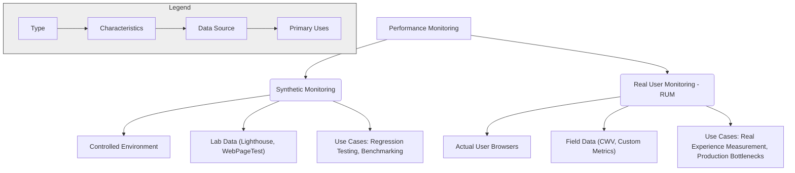
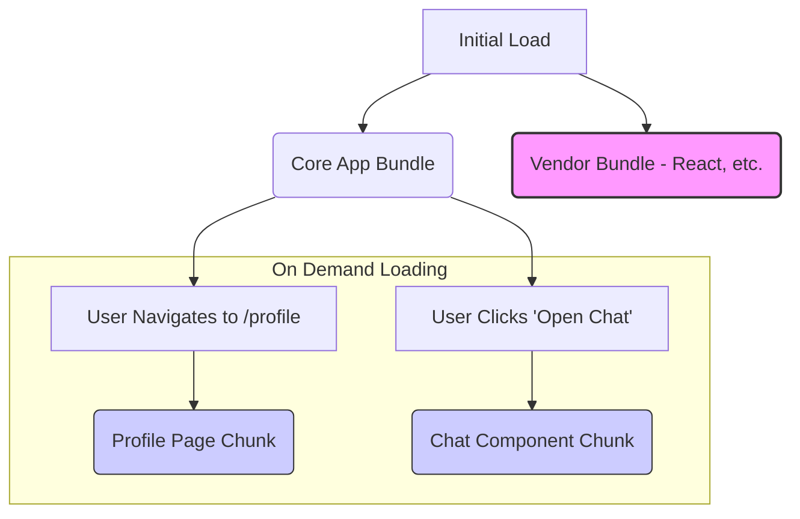
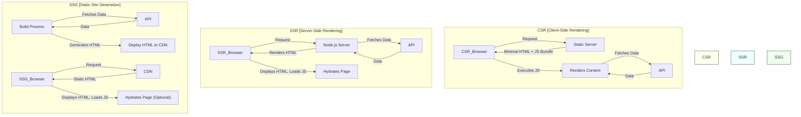

# Chapter 9: Frontend Performance Optimization In-Depth

Frontend performance is no longer a "nice-to-have"; it's a critical aspect of user experience, conversion rates, SEO rankings, and overall application success. For senior frontend engineers, demonstrating a deep understanding of performance bottlenecks, measurement techniques, and optimization strategies is paramount during interviews. This chapter dives deep into the multifaceted world of frontend performance, equipping you with the knowledge and techniques expected at a senior level.

We'll move beyond superficial fixes and explore the underlying principles, trade-offs, and advanced methodologies required to build truly high-performing web applications. Expect to discuss these topics not just theoretically, but also how you've applied them in real-world scenarios, diagnosed complex issues, and made informed decisions balancing performance gains with development effort and complexity.

## A. Measuring Performance: Metrics and Tools

You can't optimize what you can't measure. Understanding _what_ to measure and _how_ to measure it is the foundation of performance optimization. Senior candidates are expected to be fluent in key performance metrics and proficient with the tools used to gather and analyze them.

### 1. Core Web Vitals (LCP, FID/INP, CLS) Explained

Google's Core Web Vitals (CWV) initiative focuses on metrics that reflect real-world user experience. Mastering these is non-negotiable.

- **Largest Contentful Paint (LCP):** Measures _loading performance_. It marks the point in the page load timeline when the largest image or text block visible within the viewport is rendered.

  - **Goal:** Below 2.5 seconds.
  - **Common Causes of Poor LCP:** Slow server response times (TTFB), render-blocking JavaScript and CSS, slow resource loading (large images, fonts), client-side rendering delays.
  - **Optimization Focus:** Optimizing the critical rendering path, server response time, resource loading (CDNs, image formats, preloading), and minimizing client-side rendering work before the largest element is displayed.

- **First Input Delay (FID) / Interaction to Next Paint (INP):** Measures _interactivity_.

  - **FID:** Measures the time from when a user first interacts with a page (e.g., clicks a button) to the time when the browser is actually able to begin processing event handlers in response to that interaction. It focuses _only_ on the delay of the _first_ input.
    - **Goal:** Below 100 milliseconds.
  - **INP:** A more comprehensive metric replacing FID (as of March 2024) that assesses _overall responsiveness_. It measures the latency of _all_ user interactions throughout the page's lifecycle, reporting the longest duration (excluding outliers). It captures the time from the start of the interaction until the next frame is painted, showing visual feedback.
    - **Goal:** Below 200 milliseconds.
  - **Common Causes of Poor FID/INP:** Long-running JavaScript tasks blocking the main thread, complex script execution during load, large JS bundles delaying event handler registration, inefficient event handlers.
  - **Optimization Focus:** Breaking up long tasks, reducing JavaScript execution time (code splitting, tree shaking, efficient algorithms), optimizing event handlers, using web workers, minimizing main thread work.

- **Cumulative Layout Shift (CLS):** Measures _visual stability_. It quantifies how much visible content shifts unexpectedly during the page load. Unexpected layout shifts are frustrating and can cause users to click on the wrong thing.
  - **Goal:** Below 0.1.
  - **Common Causes of Poor CLS:** Images or ads without dimensions, dynamically injected content above existing content, web fonts causing FOIT/FOUT without proper space reservation, animations triggering layout changes.
  - **Optimization Focus:** Specifying `width` and `height` attributes on images/videos, reserving space for ads/embeds, using `font-display: optional` or reserving space for fonts, using CSS `transform` animations instead of properties that trigger layout (like `top`, `left`).

> **Interview Insight:** Be prepared to explain _why_ each CWV matters from a user perspective and discuss specific techniques you've used to improve each one on past projects. Mentioning INP shows you're up-to-date.

### 2. Other Key Metrics (TTFB, FCP, TTI, Speed Index)

While CWV are crucial, a broader set of metrics provides a more complete performance picture.

- **Time to First Byte (TTFB):** Measures the responsiveness of the web server. It's the time between the browser requesting a page and receiving the _first byte_ of the response.

  - **Significance:** A high TTFB indicates server-side issues (slow database queries, inefficient server logic, network latency, lack of server caching) or network latency. It directly impacts LCP and FCP.
  - **Optimization:** Server-side caching, database optimization, CDN usage, upgrading server hardware, optimizing backend code.

- **First Contentful Paint (FCP):** Measures the time from when the page starts loading to when _any_ part of the page's content (text, image, canvas) is rendered on the screen.

  - **Significance:** Indicates the point when the user first sees _something_ happening, providing initial feedback. It's a precursor to LCP.
  - **Optimization:** Reducing render-blocking resources (CSS/JS), optimizing TTFB, using `preload` hints for critical assets.

- **Time to Interactive (TTI):** Measures the time from when the page starts loading until it's visually rendered, its initial scripts have loaded, and it's reliably capable of responding quickly to user input. Specifically, it's measured as the point after FCP when the main thread has been free of long tasks (over 50ms) for at least 5 seconds.

  - **Significance:** Represents when the page _feels_ fully usable and responsive. Often correlates with FID/INP issues if high.
  - **Optimization:** Code splitting, reducing JS payload size, deferring non-critical JS execution, optimizing third-party scripts.

- **Speed Index:** Measures how quickly the content _visually_ populates during page load (based on video analysis in synthetic tests). A lower score is better.
  - **Significance:** Captures the perceived loading experience better than single-point metrics like FCP or LCP alone. A page might have a good LCP but still feel slow if content above the fold loads in chunks slowly.
  - **Optimization:** Optimizing the critical rendering path, prioritizing above-the-fold content, reducing render-blocking resources.

### 3. Browser DevTools Performance Profiling

Browser Developer Tools are your primary weapon for diagnosing frontend performance issues. Proficiency here is essential.

#### a. Performance Tab (Flame Charts, Timings, Main Thread Analysis)

The Performance tab provides a detailed timeline of browser activity during page load or user interaction.

- **Recording:** Capture profiles during page load or specific interactions (e.g., clicking a button that feels slow).
- **Flame Charts:** Visualize main thread activity over time.
  - **X-axis:** Time.
  - **Y-axis:** Call stack (top-level functions call functions below them).
  - **Width:** Duration of a function call.
  - **Color:** Often indicates activity type (Scripting, Rendering, Painting, System, Idle).
  - **Identifying Bottlenecks:** Look for wide, solid blocks representing long-running tasks (especially in yellow/scripting). Red triangles indicate potential issues like forced synchronous layouts (layout thrashing).
- **Timings:** Shows key milestones like LCP, FCP, DCL (DOMContentLoaded), Load event.
- **Main Thread Analysis:** Bottom-up/Top-down views help identify which functions consumed the most time. Event Log shows the sequence of events.
- **Key Tasks:** Analyze long tasks (>50ms) that block the main thread, identify expensive event handlers, diagnose layout thrashing, understand script parsing/compilation/execution costs.

#### b. Network Tab (Waterfall Analysis, Request Prioritization, Headers)

The Network tab reveals how resources are loaded over the network.

- **Waterfall Chart:** Visualizes the timing of each network request.
  - **Analyze:** Request start time, DNS lookup, initial connection, SSL negotiation, TTFB, content download time.
  - **Identify:** Slow requests, render-blocking resources (CSS/JS loaded synchronously in `<head>`), incorrect caching headers, unnecessary redirects, large unoptimized assets, request chaining issues.
- **Request Prioritization:** Browsers assign priorities (Lowest, Low, Medium, High, Highest) to resources. Understand how factors like resource type (CSS vs. image), location (`<head>` vs. `<body>`), and attributes (`async`, `defer`, `preload`) affect this. Ensure critical resources have high priority.
- **Headers:** Inspect request and response headers.
  - **Check:** `Cache-Control`, `ETag`, `Expires` for caching effectiveness. `Content-Encoding` (e.g., `gzip`, `br`) for compression. `Content-Type` for correctness. `Server-Timing` for backend performance insights.

#### c. Lighthouse Audits (Interpreting Scores and Opportunities)

Lighthouse is an automated tool (available in DevTools, as a CLI, or Node module) for auditing performance, accessibility, SEO, PWA capabilities, and best practices.

- **Scores:** Provides scores (0-100) for different categories, based on weighted metrics (LCP, TBT (Total Blocking Time - lab equivalent of FID/INP), CLS are heavily weighted for Performance).
- **Opportunities & Diagnostics:** Offers specific, actionable recommendations for improvement (e.g., "Eliminate render-blocking resources," "Serve images in next-gen formats," "Reduce initial server response time").
- **Limitations:** Lighthouse runs _synthetic_ tests (lab data) under specific network/CPU conditions. It may not perfectly reflect real user experience (RUM data is needed for that). Use it as a diagnostic tool and guide, not the absolute truth.

> **Senior Perspective:** Don't just report Lighthouse scores. Explain _how_ you used Lighthouse to identify specific bottlenecks (e.g., "Lighthouse flagged large unused JavaScript, which led us to investigate our bundle splitting strategy") and the impact of the fixes you implemented.

### 4. Real User Monitoring (RUM) vs. Synthetic Monitoring

Understanding the difference and value of each monitoring type is crucial.

- **Synthetic Monitoring (Lab Data):**
  - **What:** Simulates user visits using automated tools (like Lighthouse, WebPageTest, Pingdom) from specific locations with predefined network conditions and devices.
  - **Pros:** Controlled environment, consistent testing, good for catching regressions in CI/CD, benchmarking against competitors, testing pre-production environments.
  - **Cons:** Doesn't capture the diversity of real user environments (devices, network speeds, locations, interactions), can miss issues specific to certain user segments.
- **Real User Monitoring (RUM) (Field Data):**
  - **What:** Collects performance data directly from the browsers of actual users visiting your site. Uses APIs like `PerformanceObserver` to gather metrics (CWV, FCP, TTFB, custom timings).
  - **Pros:** Measures actual user experience across diverse conditions, identifies real-world bottlenecks affecting specific user groups, provides data for CWV assessment by search engines.
  - **Cons:** Can be noisy (requires aggregation and filtering), only measures production traffic, requires integrating a RUM provider script (potential minor overhead).



_Diagram Explanation:_ This diagram illustrates the two main approaches to performance monitoring: Synthetic (controlled lab tests) and Real User Monitoring (data from actual users), highlighting their key characteristics and use cases.

> **Senior Takeaway:** Relying solely on synthetic data is insufficient. A mature performance strategy combines both: synthetic tests for baseline checks and regression prevention, and RUM for understanding the true user experience and prioritizing optimizations based on real-world impact.

### 5. [Configuration Guide: Setting up basic performance monitoring tools]

While specific implementations vary, here’s a conceptual guide:

1.  **Browser DevTools:** No setup needed, but learn to use the Performance and Network tabs effectively. Practice profiling page loads and interactions on various sites.
2.  **Lighthouse:**
    - **In DevTools:** Open DevTools, go to the Lighthouse tab, configure device/categories, and run the audit.
    - **CLI:** Install (`npm install -g lighthouse`), then run `lighthouse <url> --view`. Useful for automation.
3.  **Basic RUM (Conceptual):**

    - **Using `PerformanceObserver`:** Add JavaScript to your site to capture metrics.

      ```javascript
      // Example: Observing LCP
      try {
        const observer = new PerformanceObserver((list) => {
          for (const entry of list.getEntries()) {
            // entry contains LCP data (value, element, etc.)
            console.log("LCP:", entry.startTime, entry);
            // Send this data to your analytics endpoint
            // sendToAnalytics({ lcp: entry.startTime });
          }
        });
        observer.observe({ type: "largest-contentful-paint", buffered: true });
      } catch (e) {
        // Browser doesn't support LCP or PerformanceObserver
        console.error("LCP monitoring not supported:", e);
      }

      // Similar observers for FID/INP, CLS, FCP, etc.
      // Note: Capturing INP requires a more complex observer setup.
      ```

    - **Using a RUM Provider:** Integrate a third-party service (e.g., Datadog RUM, New Relic Browser, Sentry Performance, Google Analytics 4). This typically involves adding their script snippet to your HTML `<head>`. They handle data collection, aggregation, and visualization. This is the standard approach for robust RUM.

4.  **Synthetic Testing Service (e.g., WebPageTest):**
    - Go to the website (e.g., `webpagetest.org`).
    - Enter your URL, select test location, browser, connection speed.
    - Run the test and analyze the detailed results (waterfall, metrics, filmstrip view). Many services offer APIs for automated testing.

## B. Asset Optimization Strategies

Assets (images, fonts, JavaScript, CSS) often constitute the bulk of a page's weight and significantly impact load times. Optimizing them is crucial.

### 1. Image Optimization (Formats - WebP/AVIF, Compression, Responsive Images `<picture>`, `srcset`)

Images are frequently the largest assets.

- **Formats:**
  - **JPEG:** Best for complex photographs. Lossy compression.
  - **PNG:** Best for images needing transparency or sharp details (logos, icons). Lossless (or lossy). Often larger than JPEG for photos.
  - **GIF:** Only for simple animations (use video instead for complex ones). Limited color palette.
  - **SVG:** Vector format. Scales infinitely without quality loss. Ideal for logos, icons, simple illustrations. Often very small file size.
  - **WebP:** Modern format offering excellent lossy and lossless compression, plus transparency and animation. Widely supported. Typically smaller than JPEG/PNG at similar quality.
  - **AVIF:** Newest format, often providing even better compression than WebP, especially at lower quality settings. Supports transparency, animation, HDR. Support is growing rapidly.
- **Compression:**
  - **Lossy:** Reduces file size by discarding some image data (often imperceptible). Adjust quality level to balance size and visual fidelity.
  - **Lossless:** Reduces file size without discarding any data (reorganizes pixel data). Less reduction than lossy, but preserves perfect quality.
  - **Tools:** ImageOptim, Squoosh.app, various build tool plugins (imagemin).
- **Responsive Images:** Serve different image sizes/resolutions based on viewport size and device pixel density. Prevents downloading huge images on small screens.
  - **`srcset` attribute (on ``):** Provides a list of image sources and their widths (`w` descriptors) or pixel densities (`x` descriptors). The browser chooses the most appropriate one. Use with the `sizes` attribute to inform the browser about the image's rendered size at different viewport widths.
    ```html
    
    alt="Descriptive text">
    ```
  - **`<picture>` element:** Provides more control, allowing different image _formats_ or art direction (different crops/versions of an image for different layouts).
    ```html
    <picture>
      <source srcset="image.avif" type="image/avif" />
      <!-- Serve AVIF if supported -->
      <source srcset="image.webp" type="image/webp" />
      <!-- Serve WebP if supported -->
      <source srcset="image-large.jpg" media="(min-width: 800px)" />
      <!-- Different image for wide screens -->
      
      <!-- Fallback -->
    </picture>
    ```
- **Lazy Loading:** Use the `loading="lazy"` attribute on `` and `<iframe>` elements to defer loading of offscreen assets until the user scrolls near them. Native browser support is widespread.

### 2. Font Loading Strategies (`font-display`, Subsetting, Preloading, WOFF2)

Web fonts can block rendering (FOUC/FOIT) and add significant weight.

- **`font-display` CSS Property:** Controls how fonts are displayed while loading.
  - `auto`: Browser default (often behaves like `block`).
  - `block`: Short block period, then infinite swap period (shows invisible text initially - FOIT).
  - `swap`: Very small block period, then infinite swap period (shows fallback font, then swaps - FOUC). Good for ensuring text is always visible.
  - `fallback`: Extremely small block period, short swap period (compromise: shows fallback quickly, swaps if font loads fast, otherwise keeps fallback).
  - `optional`: Extremely small block period, no swap period (shows fallback if font isn't ready immediately, uses font only if downloaded quickly for subsequent loads). Best for performance if font isn't critical.
- **Subsetting:** Include only the characters (glyphs) needed in the font file. Crucial for large character sets (e.g., CJK languages) or icon fonts. Tools like `glyphhanger` or online font converters can subset fonts.
- **Preloading:** Use `<link rel="preload" href="/fonts/font.woff2" as="font" type="font/woff2" crossorigin>` in the `<head>` for critical fonts discovered late in the CSS. This tells the browser to fetch the font earlier with higher priority. Use sparingly for essential fonts only. `crossorigin` is needed even for self-hosted fonts.
- **WOFF2 (Web Open Font Format 2):** The most efficient format with the best compression. Use it primarily, potentially with WOFF as a fallback for older browsers. Avoid older formats like TTF/OTF/EOT unless absolutely necessary.
- **Self-hosting vs. Third-Party:** Self-hosting gives more control over caching and loading, avoiding an extra third-party connection. Third-party services (e.g., Google Fonts) might leverage existing cache entries if the user visited another site using the same font, but add a DNS lookup/connection cost.

### 3. JavaScript Optimization

JavaScript is often the biggest performance bottleneck due to its execution cost on the main thread.

#### a. Code Splitting (Route-based, Component-based, Vendor Chunks)

Break down large JS bundles into smaller chunks loaded on demand.

- **Route-based:** Load JS code specific to a route only when the user navigates to it. Standard feature in frameworks like Next.js, Nuxt.js, and easily implemented with React Router / Vue Router using dynamic `import()`.
- **Component-based:** Load JS for complex components (e.g., a modal, a heavy chart library) only when they are about to be rendered. Again, uses dynamic `import()`.
- **Vendor Chunks:** Separate third-party library code (e.g., React, Lodash) from your application code. Vendor code changes less frequently, allowing users to cache it long-term. Modern bundlers (Webpack, Vite) often handle this automatically or with simple configuration.



_Diagram Explanation:_ This diagram shows how code splitting works. An initial load fetches the core application logic and common vendor libraries. Specific features (like a profile page or chat component) are loaded only when needed, reducing the initial bundle size.

#### b. Tree Shaking Deep Dive (How it works, Common pitfalls)

Eliminate unused code ("dead code") from your bundles.

- **How it Works:** Relies on ES Modules (`import`/`export` syntax). Bundlers like Webpack, Rollup, and Vite statically analyze the import/export graph. They start from entry points and trace which exports are actually imported and used. Code that is exported but never imported, or imported but never used, is considered "dead" and excluded from the final bundle.
- **Requirements:**
  - Use ES Modules syntax.
  - Avoid side effects in modules if possible, or mark them explicitly if necessary (e.g., `sideEffects: false` in `package.json` for libraries, or specific files `sideEffects: ["./src/styles.css"]`). Side effects are things like global polyfills, CSS imports, or code that modifies the global scope just by being imported.
- **Common Pitfalls:**
  - **Using CommonJS:** `require()` cannot be statically analyzed reliably.
  - **Side Effects:** Importing a module solely for its side effects (e.g., `import './styles.css';`) prevents tree shaking unless configured correctly. Libraries not marking themselves as side-effect-free can hinder optimization.
  - **Dynamic Code:** Code accessed dynamically (e.g., `myObject[dynamicKey]()`) can be hard for bundlers to analyze.
  - **Transpilation Issues:** Sometimes Babel or TypeScript configurations can output code that hinders tree shaking (e.g., transpiling ES modules to CommonJS too early).

#### c. Lazy Loading Components and Libraries (Dynamic `import()`)

Load code only when it's actually needed, typically triggered by user interaction or route changes.

- **Syntax:** The `import()` function returns a Promise that resolves with the module's namespace object.

  ```javascript
  // Before: Static import (always loaded)
  // import HeavyComponent from './HeavyComponent';

  // After: Dynamic import (loaded on demand)
  button.addEventListener("click", () => {
    import("./HeavyComponent.js")
      .then((module) => {
        const HeavyComponent = module.default; // Or named export: module.HeavyComponent
        const instance = new HeavyComponent();
        instance.render();
      })
      .catch((err) => {
        console.error("Failed to load component:", err);
      });
  });
  ```

- **Framework Integration:** React (`React.lazy`, Suspense), Vue (Async Components), Angular (LoadChildren) provide abstractions over dynamic `import()` for easier component-level lazy loading.

#### d. Differential Loading (Modern vs. Legacy JS Bundles)

Serve smaller, more optimized bundles using modern JS syntax (ES2015+) to capable browsers, while providing fallback bundles (transpiled to ES5) for older browsers.

- **Mechanism:** Use `<script type="module">` for modern browsers and `<script nomodule>` for legacy browsers. Modern browsers ignore `nomodule`, and legacy browsers ignore `type="module"`.

  ```html
  <!-- Modern browsers load this -->
  <script type="module" src="app.modern.js"></script>

  <!-- Legacy browsers load this -->
  <script nomodule src="app.legacy.js"></script>
  ```

- **Benefits:** Reduces bundle size significantly for the majority of users with modern browsers, as less transpilation and fewer polyfills are needed.
- **Tooling:** Framework CLIs (Angular CLI, Create React App) and bundlers often have built-in support or plugins for generating differential bundles.

#### e. [Code Snippet: Implementing route-based code splitting with React Router / Vue Router]

**React Router v6:**

```jsx
import React, { Suspense, lazy } from "react";
import { BrowserRouter as Router, Routes, Route } from "react-router-dom";

// Lazily load components
const HomePage = lazy(() => import("./pages/HomePage"));
const AboutPage = lazy(() => import("./pages/AboutPage"));
const UserProfile = lazy(() => import("./pages/UserProfile")); // Example route needing data

function App() {
  return (
    <Router>
      {/* Display a loading message while chunks are loading */}
      <Suspense fallback={<div>Loading page...</div>}>
        <Routes>
          <Route path="/" element={<HomePage />} />
          <Route path="/about" element={<AboutPage />} />
          {/* Example with a parameter */}
          <Route path="/users/:userId" element={<UserProfile />} />
          {/* Add other routes */}
        </Routes>
      </Suspense>
    </Router>
  );
}

export default App;
```

**Vue Router 4:**

```javascript
import { createRouter, createWebHistory } from "vue-router";
// Static import for core/common components if needed
// import Layout from '../components/Layout.vue';

// Use dynamic import for route components
const Home = () => import("../views/HomeView.vue");
const About = () => import("../views/AboutView.vue");
const UserProfile = () => import("../views/UserProfile.vue");

const routes = [
  {
    path: "/",
    name: "Home",
    component: Home,
  },
  {
    path: "/about",
    name: "About",
    component: About,
    // Example of nested routes also being lazy-loaded
    // children: [ { path: 'team', component: () => import('../views/TeamView.vue') }]
  },
  {
    path: "/users/:userId",
    name: "UserProfile",
    component: UserProfile,
    props: true, // Pass route params as props
  },
];

const router = createRouter({
  history: createWebHistory(process.env.BASE_URL),
  routes,
});

export default router;
```

#### f. [Production Note: Analyzing bundle size (Webpack Bundle Analyzer, source-map-explorer)]

Understanding _what_ is contributing to your bundle size is key to optimizing it.

- **Webpack Bundle Analyzer:** Generates an interactive treemap visualization of your Webpack output bundles. Shows the size of each module and its dependencies. Helps identify large libraries, duplicated dependencies, or code that shouldn't be in a particular chunk.
  - **Usage:** Install (`npm install --save-dev webpack-bundle-analyzer`), add the plugin to your Webpack config, or run it via npx/CLI against your stats file.
- **source-map-explorer:** Analyzes bundle size based on JavaScript source maps. It maps the minified code back to your original source files, showing how much space each original file contributes to the final bundle. Useful for identifying unexpectedly large components or utilities in your own codebase.
  - **Usage:** Install (`npm install --save-dev source-map-explorer`), then run `npx source-map-explorer bundle.js bundle.js.map`.

> **Interview Tip:** Mentioning these tools and how you've used them to diagnose and reduce bundle size demonstrates practical experience (e.g., "Using Webpack Bundle Analyzer, I discovered we were accidentally including the entire Lodash library instead of just the specific functions we needed. Switching to `lodash-es` imports and ensuring tree shaking was working correctly reduced our vendor bundle by 80KB gzipped.").

### 4. CSS Optimization

While often smaller than JS, CSS can still block rendering and impact performance if not managed well.

#### a. Critical CSS Extraction (Manual vs. Automated)

Inline the CSS required to render the initial viewport ("above-the-fold" content) directly in the `<head>` of the HTML document. Load the rest of the CSS asynchronously.

- **Benefit:** Allows the browser to start rendering the visible part of the page much faster (improves FCP/LCP) without waiting for the full CSS file to download.
- **Manual:** Identify styles needed for above-the-fold elements and manually copy them into a `<style>` block. Brittle and hard to maintain.
- **Automated:** Use tools (e.g., Critical, Penthouse) that analyze the page structure and CSS to determine the critical styles. Often integrated into build processes or SSR frameworks (like Next.js).
- **Challenge:** Determining the "fold" is difficult across devices. Automated tools often require careful configuration.

#### b. Removing Unused CSS (PurgeCSS, UnCSS)

Scan your HTML/JS/template files and remove CSS rules that aren't actually being used. Especially effective when using utility-first frameworks (like Tailwind CSS) or large CSS libraries (like Bootstrap).

- **Tools:**
  - **PurgeCSS:** Integrates well with build tools (Webpack, PostCSS, Gulp). Scans specified files for selectors and removes unused styles from your CSS output. Requires careful configuration of content paths and potential safelisting for dynamically generated class names.
  - **UnCSS:** Similar goal, often used via PostCSS or Grunt/Gulp.
- **Benefit:** Significantly reduces CSS file size, leading to faster downloads and parsing.

#### c. Optimizing CSS-in-JS Bundle Size and Runtime Performance

CSS-in-JS libraries (Styled Components, Emotion) offer great developer experience but can have performance implications.

- **Bundle Size:** Ensure libraries are properly tree-shaken. Some libraries might generate more JS runtime code than others. Analyze bundle impact. Use tools like `babel-plugin-styled-components` or Emotion's Babel plugin to optimize generated code (e.g., better display names, dead code elimination).
- **Runtime Performance:**
  - **Avoid excessive dynamic styles:** Styles that change frequently based on props can cause repeated style recalculations and injections. Memoize components or style computations where appropriate.
  - **Server-Side Rendering:** Ensure styles are extracted and injected correctly during SSR to avoid runtime style injection on the client, which can block rendering or cause flashes of unstyled content (FOUC). Libraries usually provide SSR utilities.
  - **Atomic CSS-in-JS:** Libraries like Compiled or Linaria extract styles to static CSS files at build time, minimizing runtime overhead, similar to traditional CSS or utility classes.

## C. Network Performance Optimization

Optimizing how resources are delivered over the network is critical for reducing load times, especially on slower or less reliable connections.

### 1. Reducing HTTP Requests (Bundling, Sprites - less common now, HTTP/2+)

Fewer requests generally mean faster loads, although this is less critical with HTTP/2+.

- **Bundling:** Combine multiple JS or CSS files into single (or fewer) files. Standard practice handled by bundlers like Webpack/Vite. Reduces request overhead.
- **Sprites:** Combine multiple small images (like icons) into a single image file. Use CSS `background-position` to display the desired icon. Reduces image requests.
  - **Relevance:** Less common now due to HTTP/2's multiplexing and the prevalence of SVG icons and icon fonts. Still useful in specific high-latency scenarios or for legacy HTTP/1.1 support.
- **HTTP/2+ Impact:** HTTP/2 and HTTP/3 handle multiple requests more efficiently over a single connection (multiplexing), reducing the penalty of having many small files compared to HTTP/1.1. Extreme bundling can sometimes be counter-productive with HTTP/2 (e.g., one tiny change invalidates a huge cached bundle). Code splitting strikes a better balance.

### 2. HTTP/2 and HTTP/3 Benefits (Multiplexing, Header Compression, QUIC)

Understanding the underlying protocol improvements helps justify optimization choices.

- **HTTP/2:**
  - **Multiplexing:** Allows multiple requests and responses to be sent concurrently over a single TCP connection, eliminating head-of-line blocking at the HTTP layer. This makes loading many small resources much more efficient than HTTP/1.1.
  - **Header Compression (HPACK):** Reduces redundant header information sent with each request using Huffman coding and indexing.
  - **Server Push (Less Used):** Allows the server to proactively send resources it knows the client will need (e.g., CSS for an HTML page). Adoption has been limited due to complexity and caching issues.
  - **Binary Protocol:** More efficient and less error-prone to parse than text-based HTTP/1.1.
- **HTTP/3:**
  - **Runs over QUIC (Quick UDP Internet Connections):** QUIC is built on UDP instead of TCP.
  - **Solves TCP Head-of-Line Blocking:** With TCP, if a packet is lost, the entire connection stalls until it's retransmitted. QUIC handles streams independently, so packet loss in one stream doesn't block others. Crucial for lossy networks (mobile).
  - **Faster Connection Establishment:** Combines TLS handshake with connection setup (0-RTT or 1-RTT).
  - **Connection Migration:** Maintains connection even if the client's IP address or port changes (e.g., moving from Wi-Fi to cellular).
- **Requirement:** Requires HTTPS. Ensure your server and CDN support HTTP/2 and ideally HTTP/3.

### 3. Resource Hints (`preload`, `prefetch`, `preconnect`, `dns-prefetch`) - Use Cases and Timing

Provide hints to the browser about resources it will likely need soon, allowing it to optimize loading.

- **`<link rel="preload" as="...">`:**
  - **Use Case:** For critical resources needed for the _current_ navigation, discovered late (e.g., fonts in CSS, background images, JS chunks for initial render).
  - **Effect:** Fetches the resource with high priority but doesn't execute/apply it until needed. Use `as` attribute correctly (e.g., `font`, `style`, `script`, `image`).
  - **Caution:** Use sparingly; preloading too much can contend with other critical resources.
- **`<link rel="prefetch">`:**
  - **Use Case:** For resources likely needed for _future_ navigations (e.g., JS/CSS/data for the next page the user might visit).
  - **Effect:** Fetches the resource with low priority during browser idle time.
  - **Caution:** Browser support/behavior can vary. Don't prefetch large assets unnecessarily.
- **`<link rel="preconnect">`:**
  - **Use Case:** For critical third-party origins from which you'll be fetching resources soon (e.g., CDN, API endpoint, font provider).
  - **Effect:** Performs DNS lookup, TCP handshake, and TLS negotiation _in advance_. Saves time when the actual request is made.
  - **Caution:** Keep preconnected origins low (max ~4-6); each connection consumes resources.
- **`<link rel="dns-prefetch">`:**
  - **Use Case:** For non-critical third-party origins you might connect to later.
  - **Effect:** Performs only the DNS lookup in advance (very low overhead). Saves a small amount of time (~20-120ms).
  - **Benefit:** Cheap hint, useful for origins referenced less frequently or further down the page.

```html
<head>
  <!-- Speed up connection to critical API/CDN -->
  <link rel="preconnect" href="https://api.example.com" />
  <link rel="preconnect" href="https://cdn.example.com" crossorigin />

  <!-- Resolve DNS early for other domains -->
  <link rel="dns-prefetch" href="//analytics.provider.com" />

  <!-- Fetch critical font discovered in CSS -->
  <link
    rel="preload"
    href="/fonts/critical-font.woff2"
    as="font"
    type="font/woff2"
    crossorigin
  />

  <!-- Fetch JS chunk for next likely page (use JS to add this hint dynamically) -->
  <!-- <link rel="prefetch" href="/_next/static/chunks/next-page.js" as="script"> -->
</head>
```

### 4. CDN Configuration and Caching Strategies (Cache-Control, ETags, Vary Header)

Leveraging browser and CDN caching effectively is fundamental.

- **Content Delivery Network (CDN):** Distributes your static assets (images, JS, CSS) across multiple servers globally. Users fetch assets from the server geographically closest to them, reducing latency. CDNs also provide caching and often security features. Essential for performant applications.
- **`Cache-Control` Header:** The primary HTTP header for specifying caching directives.
  - `public`: Can be cached by intermediaries (CDNs) and browsers.
  - `private`: Can only be cached by the user's browser.
  - `no-store`: Disallows caching entirely.
  - `no-cache`: Requires revalidation with the origin server before using a cached version (uses `ETag` or `Last-Modified`). Useful for HTML documents where freshness is important but revalidation is acceptable.
  - `max-age=<seconds>`: Specifies the maximum time the resource is considered fresh.
  - `s-maxage=<seconds>`: Like `max-age`, but applies only to shared caches (CDNs).
  - `immutable`: Indicates the resource content will never change. Allows aggressive caching. Use with fingerprinted asset URLs (e.g., `app.[contenthash].js`).
- **`ETag` (Entity Tag) Header:** An identifier for a specific version of a resource (often a hash of the content). Used for validation. If the browser has a cached version with an `ETag`, it can send an `If-None-Match` request header. If the `ETag` still matches on the server, the server responds with `304 Not Modified` (empty body), saving bandwidth.
- **`Last-Modified` Header:** Alternative validation mechanism using a timestamp. The browser sends `If-Modified-Since`. Less reliable than `ETags` (timestamp resolution issues).
- **`Vary` Header:** Tells caches (CDN, browser) that the response varies based on certain request headers (e.g., `Vary: Accept-Encoding` means cache separate versions for `gzip`, `br`, uncompressed; `Vary: User-Agent` is generally discouraged due to cache fragmentation).
- **Strategy:**
  - **Fingerprinted Assets (JS, CSS, Images):** Use long `Cache-Control: public, max-age=31536000, immutable`. The URL changes when the content changes.
  - **HTML Documents:** Often `Cache-Control: no-cache` or a short `max-age` with revalidation (`public, max-age=0, must-revalidate`) to ensure users get updates quickly while still allowing conditional requests.
  - **API Responses:** Depends on data volatility. Use appropriate `max-age`, `private`/`public`, and validation headers (`ETag`).

### 5. [Production Note: Optimizing for high-latency or low-bandwidth connections]

Performance optimization is even more critical under adverse network conditions.

- **Prioritize Above-the-Fold:** Ensure critical content renders quickly even before all assets load. Use critical CSS.
- **Aggressive Asset Optimization:** Smaller images (WebP/AVIF), aggressive compression, font subsetting are paramount.
- **Reduce Requests:** While HTTP/2 helps, high latency still penalizes each round trip. Judicious bundling might still be beneficial. `preconnect` is very valuable.
- **Minimize JS:** Less JS means faster download, parsing, and execution on potentially slower devices. Code splitting is essential. Consider SSR/SSG.
- **Offline Support (Service Workers):** Cache assets and application shells using service workers for faster repeat visits and basic offline functionality.
- **Data Optimization:** Fetch only necessary data. Consider lighter data formats (protobufs vs. JSON). Implement client-side caching for API data.
- **Adaptive Loading:** Detect network conditions (e.g., `navigator.connection`) to potentially serve lower-quality images or defer non-essential features on slow connections (use with caution, can be complex).

## D. Rendering Performance Optimization

Once assets are downloaded, the browser needs to parse, style, layout, paint, and composite the page. Optimizing this rendering pipeline prevents jank (stuttering animations, slow responses) and improves interactivity (INP).

### 1. Minimizing Layout Thrashing (Batching DOM Reads/Writes)

Layout thrashing (or forced synchronous layout) occurs when JavaScript repeatedly writes (mutates the DOM) and then reads layout properties (like `offsetHeight`, `offsetTop`, `getComputedStyle()`) in a loop, forcing the browser to recalculate layout synchronously multiple times.

- **Problem:** Layout calculation is expensive. Doing it repeatedly and synchronously blocks the main thread, causing jank.

  ```javascript
  // BAD: Layout Thrashing
  function resizeBoxes(boxes) {
    boxes.forEach((box) => {
      // WRITE: Change width (invalidates layout)
      box.style.width = "100px";
      // READ: Get offsetTop (forces synchronous layout calculation)
      console.log(box.offsetTop);
    });
  }

  // GOOD: Batch Reads then Writes
  function resizeBoxesBatched(boxes) {
    // READ phase: Read all necessary layout properties first
    const tops = boxes.map((box) => box.offsetTop); // Read before any writes

    // WRITE phase: Perform all DOM mutations together
    boxes.forEach((box, index) => {
      box.style.width = "100px";
      console.log(tops[index]); // Use the previously read value
    });
  }
  ```

- **Solution:** Structure your code to perform all DOM reads _first_, store the values, and _then_ perform all DOM writes. Frameworks often help manage this, but direct DOM manipulation or poorly structured effects can still cause it. Use tools like `fastdom` library for explicit batching if needed. DevTools Performance tab highlights forced reflows in red.

### 2. Debouncing and Throttling Expensive Event Handlers (Scroll, Resize, Input)

Frequent events like `scroll`, `resize`, or `mousemove` can trigger event handlers hundreds of times per second. If these handlers perform expensive operations (DOM manipulation, complex calculations), they can easily block the main thread.

- **Debouncing:** Delays executing the function until a certain amount of time has passed _without_ the event being triggered again. Useful for actions that should only happen _after_ the user has stopped performing an action (e.g., triggering search after user stops typing).
- **Throttling:** Ensures the function is executed at most once per specified time interval, regardless of how many times the event fires. Useful for actions that need to happen periodically _during_ an event stream (e.g., updating scroll position, triggering animations on scroll).

```javascript
// Simple debounce implementation (using Lodash is common in production)
function debounce(func, wait) {
  let timeout;
  return function executedFunction(...args) {
    const later = () => {
      clearTimeout(timeout);
      func.apply(this, args);
    };
    clearTimeout(timeout);
    timeout = setTimeout(later, wait);
  };
}

// Simple throttle implementation (using Lodash is common)
function throttle(func, limit) {
  let inThrottle;
  return function executedFunction(...args) {
    if (!inThrottle) {
      func.apply(this, args);
      inThrottle = true;
      setTimeout(() => (inThrottle = false), limit);
    }
  };
}

// Usage
window.addEventListener(
  "resize",
  debounce(() => {
    console.log("Resize finished (debounced)");
    // Perform expensive layout calculation here
  }, 250)
);

window.addEventListener(
  "scroll",
  throttle(() => {
    console.log("Scroll event handled (throttled)");
    // Update UI based on scroll position, but not too often
  }, 100)
);
```

### 3. List Virtualization (React Window, Vue Virtual Scroller, TanStack Virtual)

Rendering extremely long lists (thousands of items) can be very slow, as the browser needs to create, style, and layout thousands of DOM nodes, consuming significant memory and CPU.

- **Concept:** Only render the list items currently visible within the viewport (plus a small buffer above/below). As the user scrolls, previously visible items are removed from the DOM, and newly visible items are added.
- **Mechanism:** Requires calculating the total list height and using absolute positioning to place the currently visible items correctly within a scrollable container.
- **Libraries:**
  - **React:** `react-window`, `react-virtualized` (older), TanStack Virtual (`@tanstack/react-virtual`)
  - **Vue:** `vue-virtual-scroller`, TanStack Virtual (`@tanstack/vue-virtual`)
  - **Svelte:** TanStack Virtual (`@tanstack/svelte-virtual`)
  - **Framework Agnostic:** TanStack Virtual (`@tanstack/virtual-core`)
- **Trade-offs:** Adds complexity, might interfere with browser find-in-page (Ctrl+F) if not implemented carefully, requires items to have predictable or measurable heights.

### 4. Memoization Techniques (React.memo, useMemo, useCallback, reselect, computed properties)

Avoid redundant computations and re-renders.

- **React:**
  - **`React.memo`:** A Higher-Order Component (HOC) that memoizes functional components. It prevents re-renders if the component's props haven't changed (shallow comparison by default).
  - **`useMemo`:** Memoizes the _result_ of an expensive calculation. Recalculates only if dependencies change. Useful for derived data or complex computations within a component.
  - **`useCallback`:** Memoizes a _function definition_. Prevents creating a new function instance on every render. Crucial when passing callbacks down to memoized child components (`React.memo`) that rely on referential equality for props.
- **Vue:**
  - **`computed` properties:** Automatically cache their result based on reactive dependencies. They only re-evaluate when a dependency changes. The primary way to memoize derived data in Vue.
- **Selectors (e.g., Reselect for Redux, similar patterns elsewhere):** Memoize derived data transformations from application state. Ensures that components only re-render if the specific data they _select_ changes, even if other parts of the state tree are updated.

> **Caution:** Over-memoization can add complexity and its own minor performance overhead (dependency checking, memory usage). Profile first, then apply memoization strategically to clear bottlenecks, not preemptively everywhere.

### 5. Offloading Work to Web Workers / Service Workers

Move computationally intensive tasks off the main thread to prevent blocking UI updates and interactions.

- **Web Workers:** Run scripts in background threads. Ideal for tasks like complex calculations, data processing, image manipulation, cryptography. Communicate with the main thread via `postMessage()` and `onmessage` event handlers. Cannot directly access the DOM.

  ```javascript
  // main.js
  const myWorker = new Worker("worker.js");
  myWorker.postMessage({ data: largeDataSet }); // Send data to worker
  myWorker.onmessage = (e) => {
    console.log("Result from worker:", e.data); // Receive result
  };

  // worker.js
  self.onmessage = (e) => {
    const result = processData(e.data.data); // Perform heavy computation
    self.postMessage({ result }); // Send result back
  };
  ```

- **Service Workers:** Act as proxy servers between the browser and the network/cache. Primarily used for offline capabilities (intercepting fetch requests, caching assets), push notifications, and background sync. Can perform some background processing but have a different lifecycle and purpose than Web Workers.

### 6. [Troubleshooting Section: Diagnosing and fixing common rendering bottlenecks using DevTools]

1.  **Identify Jank:** Use the Performance tab to record interactions that feel slow. Look for long tasks (>50ms) on the main thread flame chart, often colored yellow (Scripting) or purple (Rendering/Layout).
2.  **Analyze Long Tasks:** Select a long task. Examine the Bottom-Up or Call Tree view to see which functions are consuming the most time.
    - **JS Execution:** If scripting is high, identify slow functions. Are they complex calculations? Can they be memoized or moved to a worker? Is it excessive re-rendering in your framework? (Use framework-specific DevTools extensions).
    - **Layout/Reflow (Purple):** Look for "Layout" events. Are they preceded by DOM modifications? Check the Summary tab for "Forced reflow" warnings – this indicates layout thrashing. Identify the JS code causing the read-after-write pattern and refactor to batch reads/writes.
    - **Paint/Composite (Green):** Large or frequent "Paint" or "Composite Layers" events can indicate complex styles (e.g., heavy `box-shadow`, non-performant `filter`s) or excessive layers. Simplify styles or use `will-change` judiciously (or promote layers via `transform: translateZ(0)`) to hint to the browser about elements that will animate or change, potentially moving them to the GPU compositor thread. Be cautious, as `will-change` can consume extra memory.
3.  **Check Event Listeners:** In the Performance tab's Event Log or via `getEventListeners(element)` in the Console, check for expensive listeners attached to frequent events (scroll, resize). Apply debouncing/throttling.
4.  **Memory Leaks:** Use the Memory tab to take heap snapshots before and after interactions. Compare snapshots to identify detached DOM nodes or objects that are not being garbage collected.
5.  **Framework Tools:** Use React DevTools Profiler, Vue DevTools Performance tab, Angular DevTools Profiler to understand component render times, reasons for re-renders, and component hierarchy costs.

## E. Server-Side Rendering (SSR) and Static Site Generation (SSG)

Rendering strategies significantly impact initial load performance (FCP, LCP, TTI) and SEO. Client-Side Rendering (CSR), while simple initially, often leads to poorer perceived performance for content-heavy sites.

### 1. Concepts and Trade-offs (Performance, SEO, Complexity, Cost)

- **Client-Side Rendering (CSR):**
  - **Concept:** The browser downloads a minimal HTML file and a potentially large JS bundle. JavaScript fetches data and renders the page content in the browser. (e.g., Basic Create React App, Vue CLI app).
  - **Pros:** Simple initial setup, cheap static hosting.
  - **Cons:** Slow initial load (blank screen until JS loads/executes), poor FCP/LCP, potential SEO issues (search engines need to execute JS), high TTI.
- **Server-Side Rendering (SSR):**
  - **Concept:** The server renders the requested page to HTML _on each request_ and sends the fully formed HTML to the browser. The browser displays it quickly, then JavaScript ("hydration") loads to make the page interactive. (e.g., Next.js `getServerSideProps`, Nuxt.js `server` mode).
  - **Pros:** Fast FCP/LCP (content visible immediately), good SEO (fully rendered HTML).
  - **Cons:** Higher TTFB (server needs time to render), requires a running Node.js (or similar) server, more complex infrastructure, hydration can be costly (TTI might still be delayed).
- **Static Site Generation (SSG):**
  - **Concept:** Renders all pages to static HTML files _at build time_. These files are deployed to a CDN. (e.g., Next.js default/`getStaticProps`, Nuxt.js `generate`, Gatsby, Hugo, Jekyll, Astro).
  - **Pros:** Fastest possible FCP/LCP/TTFB (serving static files from CDN), excellent SEO, highly secure, cheap hosting.
  - **Cons:** Build times can increase significantly for large sites, content is static between builds (unless using ISR/DPR), not suitable for highly dynamic or personalized content generated per-request.



_Diagram Explanation:_ This diagram contrasts the basic flow of Client-Side Rendering (rendering in browser), Server-Side Rendering (rendering on server per request), and Static Site Generation (rendering at build time).

### 2. Frameworks (Next.js, Nuxt.js, SvelteKit, Astro, Angular Universal) - Key Features Comparison

Modern frameworks often blend these strategies.

| Feature           | Next.js (React)                                        | Nuxt.js (Vue)                       | SvelteKit (Svelte)               | Astro                                            | Angular Universal        |
| :---------------- | :----------------------------------------------------- | :---------------------------------- | :------------------------------- | :----------------------------------------------- | :----------------------- |
| **Primary Mode**  | Hybrid (SSG/SSR/ISR/CSR)                               | Hybrid (SSG/SSR/ISR/CSR)            | Hybrid (SSG/SSR/CSR)             | SSG/SSR (Islands Arch)                           | SSR/SSG Add-on           |
| **Rendering**     | Per page/route                                         | Per page/route                      | Per page/route                   | Per page/route                                   | App-level or Route       |
| **Data Fetching** | `getStaticProps`, `getServerSideProps`, Route Handlers | `asyncData`, `fetch`, Server Routes | `load` function (universal)      | `fetch` in frontmatter/components                | Resolvers, Server Logic  |
| **Key Strength**  | Large ecosystem, Vercel integration, App Router        | Vue ecosystem integration, Modules  | Svelte's performance, Simplicity | Content-sites, Minimal JS (Islands), UI Agnostic | Integration with Angular |
| **Hydration**     | Full (default), React Server Components (experimental) | Full (default), Selective options   | Full (default)                   | Partial/Islands (default)                        | Full                     |

### 3. Hydration Strategies and Challenges (Progressive Hydration, Partial Hydration, Islands Architecture)

Hydration is the process of attaching JavaScript event listeners and state to the server-rendered HTML to make it interactive. Standard ("eager") hydration can be a bottleneck, blocking the main thread and delaying TTI even if FCP/LCP were fast.

- **Challenge:** The browser receives HTML, paints it, then downloads/parses/executes JS. The JS framework often rebuilds a virtual representation of the DOM and attaches listeners. This can be CPU-intensive, especially on mobile. The entire app becomes interactive only after the main bundle hydrates everything.
- **Progressive Hydration:** Hydrate components incrementally, often based on priority (e.g., hydrate critical interactive elements first) or visibility (hydrate components as they scroll into view). Frameworks like React are exploring this.
- **Partial Hydration / Islands Architecture (Popularized by Astro, used by others):** Ship zero JavaScript by default. Server-render HTML, but only hydrate specific, isolated components ("islands") that require interactivity. The rest of the page remains static HTML. Reduces JS payload and execution time dramatically for content-heavy sites.
  ```html
  <!-- Astro Example: Only the counter component gets hydrated -->
  <header>Static Header</header>
  <main>
    <h1>Static Content</h1>
    <p>Lots of static text...</p>
    <Counter client:load />
    <!-- This component ships JS and hydrates -->
  </main>
  <footer>Static Footer</footer>
  ```
- **Resumability (Qwik):** An alternative approach that avoids hydration altogether. Serializes application state and listener locations into the HTML. JavaScript downloads incrementally and "resumes" execution from the server state without re-executing component code on the client initially.

### 4. Incremental Static Regeneration (ISR) and Distributed Persistent Rendering (DPR)

Techniques to update static content without requiring a full site rebuild.

- **ISR (Next.js, Nuxt.js):** Allows regenerating specific static pages _after_ deployment, triggered by a timer (`revalidate` option) or on-demand (webhooks). When a request comes in after the revalidation period, the user gets the stale page, and the page is regenerated in the background. Subsequent users get the fresh page. Combines SSG speed with dynamic updates.
- **DPR (Netlify variant of ISR):** Similar concept, often leveraging serverless functions at the CDN edge to regenerate content on demand or based on events, updating the cached static asset.

### 5. [Deep Dive: Understanding the performance implications of different rendering strategies]

- **CSR:** Best TTFB (static host), worst FCP/LCP/TTI (requires JS execution). Highest main thread load on the client.
- **SSR:** Worse TTFB (server render time), best FCP/LCP (HTML delivered), potentially slow TTI (hydration cost). Shifts load from client main thread (for initial render) to the server and potentially back to the client (for hydration).
- **SSG:** Best TTFB/FCP/LCP (CDN edge), potentially slow TTI (hydration cost, similar to SSR). Minimal server load (only at build time), client load depends on hydration.
- **SSG/SSR with Islands/Partial Hydration:** Best TTFB/FCP/LCP (like SSG/SSR), significantly improved TTI (minimal JS execution). Shifts load to server/build, minimizes client load.
- **ISR/DPR:** Performance characteristics similar to SSG for cached hits, similar to SSR during regeneration (but often served stale-while-revalidating).

**Choosing a Strategy:**

- **Marketing sites, blogs, docs:** SSG (or SSG with Islands via Astro) is often ideal. ISR/DPR for updates.
- **E-commerce (Product Listings):** SSG/ISR often works well.
- **Dashboards, highly interactive apps:** CSR might be acceptable if initial load isn't the top priority, or SSR/CSR hybrid where the shell is SSR'd.
- **Content requiring real-time data / personalization per user:** SSR is often necessary, though edge rendering/personalization is emerging.

### 6. [Case Study: Choosing a rendering strategy for a specific application type]

**Scenario:** Building a new E-commerce Product Detail Page (PDP).

**Requirements:**

- Fast initial load is critical for user experience and conversion.
- Content needs to be highly SEO-friendly.
- Product information (price, description, specs) changes infrequently (maybe daily/hourly updates).
- Stock levels and personalized recommendations need to be near real-time.
- Interactive elements: Image gallery/zoom, Add-to-Cart button, reviews section.

**Analysis & Strategy Choice:**

1.  **Base Rendering:** SSG is highly attractive for the core product info (description, specs, initial images) due to its speed and SEO benefits. Changes are infrequent enough for regeneration.
2.  **Updates:** ISR (e.g., `revalidate: 3600` in Next.js for hourly regeneration) handles periodic price/description updates without full rebuilds.
3.  **Dynamic Data:**
    - **Stock/Price:** Fetch client-side _after_ initial load (CSR) against an API. Show a loading state initially or use the ISR-generated price as a starting point. This avoids making the entire page SSR just for stock.
    - **Recommendations:** Fetch client-side. These are personalized and don't need to block initial render or be indexed by SEO crawlers in the same way core product info does.
4.  **Interactivity:**
    - **Image Gallery/Add-to-Cart:** These require JS. Using a framework with partial hydration/Islands (like Astro, or potentially future React features) would be ideal to _only_ ship JS for these components. If using Next.js/Nuxt.js with full hydration, ensure the JS bundles are well-optimized and code-split. The Add-to-Cart button's state management needs careful handling.
    - **Reviews:** Could be SSG'd initially (if not too many) and then lazy-loaded/fetched client-side for more recent reviews or pagination.

**Chosen Strategy:** **SSG with ISR** for the main page structure and core content. **Client-side fetching** for highly dynamic/personalized data (stock, recommendations). Implement **partial hydration (Islands)** if the framework supports it easily (e.g., Astro), otherwise focus on **aggressive code-splitting and lazy-loading** interactive components in a framework like Next.js/Nuxt.js to minimize the hydration impact.

**Justification:** This hybrid approach leverages the speed and SEO benefits of SSG for the bulk of the content while handling dynamic data and interactivity efficiently without sacrificing initial load performance. It balances performance, SEO, data freshness, and development complexity.

---

Mastering frontend performance requires a holistic view, from network protocols and asset optimization to rendering pipelines and architectural choices. In a senior interview, demonstrate not just _what_ these techniques are, but _why_ they work, _when_ to apply them, their _trade-offs_, and how you've used _measurement_ to guide your optimization efforts and validate their impact.
